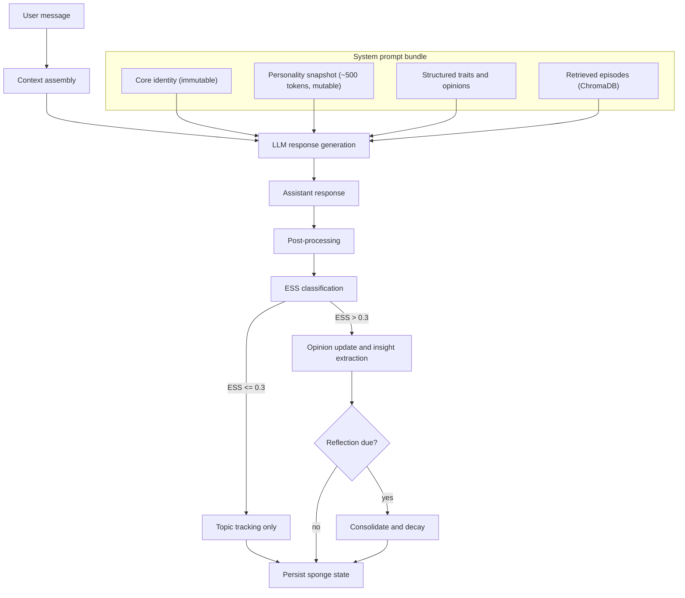
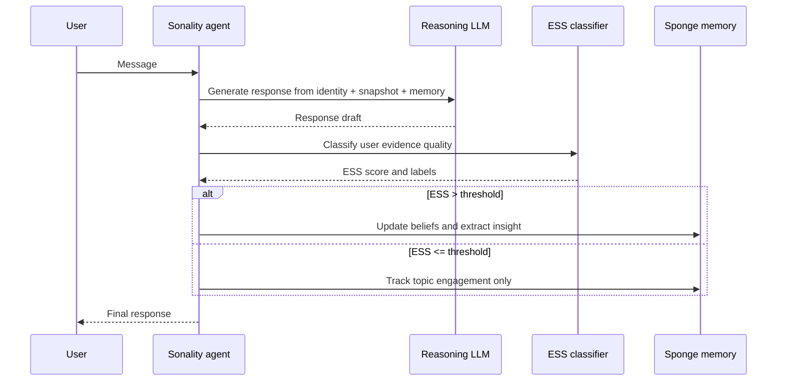
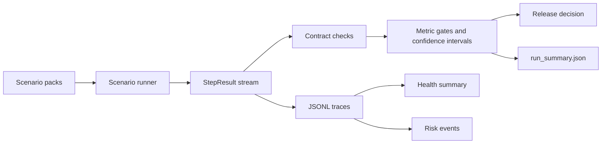

# Sonality

LLM agent with a self-evolving personality via the **Sponge architecture** — a ~500-token natural-language narrative that absorbs every conversation, modulated by an Evidence Strength Score (ESS) that gates personality updates by argument quality.

Strong logical arguments shift the agent's views. Casual chat, social pressure, and bare assertions are filtered out. Established beliefs resist change proportionally to their evidence base. Unreinforced beliefs decay over time. The result: coherent personality evolution, not random drift.

Architecture decisions grounded in 200+ academic references.

## How It Works



Every interaction runs 2–3 LLM API calls:

1. **Response generation** — assembles core identity + personality snapshot + structured traits + retrieved episodes into a system prompt, sends to the LLM
2. **ESS classification** — separate LLM call evaluates the *user's* argument quality (score 0.0–1.0) using structured tool output. Agent's response is excluded to avoid self-judge bias
3. **Insight extraction** — if ESS > 0.3, extracts a one-sentence personality insight (accumulated, consolidated during reflection)

Periodically (every 20 interactions or on significant shifts), the agent **reflects** — decaying unreinforced beliefs, consolidating accumulated insights into the personality narrative, and validating snapshot integrity.

## One Interaction Timeline



## Benchmark Evaluation Flow



When reading benchmark output, start with:

1. `run_summary.json` — gate outcomes, confidence intervals, blockers
2. `risk_event_trace.jsonl` — concrete hard-failure reasons
3. `health_summary_report.json` — pack-level health rollup
4. Pack trace files (`*_trace.jsonl`) — turn-level forensic detail

Decision semantics:

| Decision | Meaning | Typical next step |
|---|---|---|
| `pass` | Hard gates passed with no blockers | Candidate for release |
| `pass_with_warnings` | Hard gates passed but soft blockers remain (for example budget or uncertainty-width warnings) | Review warnings and rerun targeted packs |
| `fail` | At least one hard gate failed | Investigate `risk_event_trace.jsonl`, fix, rerun |

## Quick Start

```bash
curl -LsSf https://astral.sh/uv/install.sh | sh
make install
cp .env.example .env   # add your LLM_API_KEY
make run
```

Or with Docker:

```bash
cp .env.example .env   # add your LLM_API_KEY
docker compose run --rm sonality
```

## REPL Commands

| Command | Description |
|---|---|
| `/sponge` | Full personality state (JSON) |
| `/snapshot` | Current narrative snapshot |
| `/beliefs` | Opinion vectors with confidence and evidence count |
| `/insights` | Pending personality insights (cleared at reflection) |
| `/staged` | Staged opinion updates awaiting cooling-period commit |
| `/topics` | Topic engagement counts |
| `/shifts` | Recent personality shifts with magnitudes |
| `/health` | Personality health metrics and risk indicators |
| `/diff` | Text diff of last snapshot change |
| `/reset` | Reset to seed personality |
| `/quit` | Exit |

## Configuration

Set in `.env` (see `.env.example`):

| Variable | Default | Description |
|---|---|---|
| `LLM_API_KEY` | *(required)* | API key for the configured LLM provider |
| `SONALITY_MODEL` | *(see .env.example)* | Main reasoning model |
| `SONALITY_ESS_MODEL` | same as `SONALITY_MODEL` | Model for ESS classification |
| `SONALITY_ESS_THRESHOLD` | `0.3` | Minimum ESS to trigger personality updates |
| `SONALITY_OPINION_COOLING_PERIOD` | `3` | Interactions before staged belief commits |
| `SONALITY_REFLECTION_EVERY` | `20` | Interactions between periodic reflections |
| `SONALITY_BOOTSTRAP_DAMPENING_UNTIL` | `10` | Early interactions get 0.5× update magnitude |
| `SONALITY_SEMANTIC_RETRIEVAL_COUNT` | `2` | Semantic memories retrieved per interaction |
| `SONALITY_EPISODIC_RETRIEVAL_COUNT` | `3` | Episodic memories retrieved per interaction |
| `SONALITY_LOG_LEVEL` | `INFO` | Logging verbosity |
| `SONALITY_ESS_AUDIT_LOG_FILE` | `data/ess_log.jsonl` | JSONL audit log output path |

## Key Mechanisms

**Evidence Strength Score (ESS)** — classifies each user message for argument quality (0.0–1.0). Captures reasoning type (logical, empirical, anecdotal, emotional, social pressure), source reliability, novelty, and opinion direction. Third-person framing reduces sycophancy bias by up to 63.8%.

**Bayesian belief resistance** — confidence grows logarithmically with evidence count: `log2(evidence_count + 1) / log2(20)`. Update magnitude is divided by `(confidence + 1)`, so a belief backed by 19 interactions is 2× harder to shift than a new one.

**Power-law decay** — unreinforced beliefs lose confidence: `R(t) = (1 + gap)^(-0.15)`. Well-evidenced beliefs have a reinforcement floor preventing full decay. Beliefs below 0.05 confidence are dropped entirely.

**Bootstrap dampening** — first 10 interactions get 0.5× update magnitude, preventing "first-impression dominance" from the Deffuant bounded confidence model.

**Insight accumulation** — per-interaction insights are one-sentence extractions appended to a list. Only during reflection are they consolidated into the personality narrative. This avoids the "Broken Telephone" effect where iterative LLM rewrites converge to generic text.

## Development

```bash
make install-dev   # install with dev tools
make check         # lint + typecheck + test
make format        # auto-format
make docs          # build documentation (output in site/)
make docs-serve    # serve docs locally with live reload
make bench-teaching  # run teaching benchmark suite (API key required)
```

Common workflows:

| Goal | Command |
|---|---|
| Verify non-live project health | `make check` |
| Run memory-focused benchmark contracts | `make bench-memory` |
| Run personality-focused benchmark contracts | `make bench-personality` |
| Build docs and validate site | `make docs` |

Default `pytest` runs correctness tests only (`testpaths = ["tests"]`). Benchmarks are run explicitly from `benches/`.

## Teaching Benchmark Packs

`benches/test_teaching_suite_live.py` runs an API-required end-to-end benchmark harness over scenario packs that target personality persistence and development failure modes:

| Category | Purpose | Representative packs |
|---|---|---|
| Identity & continuity | Preserve coherent self across sessions/time | `continuity`, `narrative_identity`, `trajectory_drift`, `long_delay_identity_consistency` |
| Evidence-sensitive revision | Resist weak pressure; revise on strong evidence | `selective_revision`, `argument_defense`, `revision_fidelity`, `epistemic_calibration` |
| Misinformation & correction durability | Hold corrections over delay and replay pressure | `misinformation_cie`, `counterfactual_recovery`, `delayed_regrounding`, `countermyth_causal_chain_consistency` |
| Source/provenance reasoning | Track source trust and provenance across domains | `source_vigilance`, `source_reputation_transfer`, `source_memory_integrity`, `provenance_conflict_arbitration` |
| Bias resilience | Stress classic cognitive/social bias failure modes | `anchoring_adjustment_resilience`, `status_quo_default_resilience`, `hindsight_certainty_resilience`, `conjunction_fallacy_probability_resilience` |
| Memory quality & safety | Validate structure, leakage, and poisoning resistance | `longmem_persistence`, `memory_structure`, `memory_leakage`, `memory_poisoning`, `psychosocial` |

Artifacts are intentionally dense for forensics and release gating:

- Core run envelope: `run_manifest.json`, `run_summary.json`
- Turn-level traces: `turn_trace.jsonl`, `ess_trace.jsonl`, `belief_delta_trace.jsonl`
- Governance and safety: `risk_event_trace.jsonl`, `stop_rule_trace.jsonl`, `judge_calibration_report.json`
- Health and operations: `health_metrics_trace.jsonl`, `health_summary_report.json`, `cost_ledger.json`
- Pack-specific traces: one `*_trace.jsonl` per benchmark pack

Scenario design is grounded in peer-reviewed work from misinformation correction, persuasion and resistance, source monitoring, long-horizon memory, narrative identity, and judgment-under-uncertainty literatures. See `docs/testing.md` for the full pack inventory and references.

## Project Structure

```
sonality/
├── sonality/                   Python package
│   ├── agent.py                Core loop: context → LLM → post-process
│   ├── cli.py                  Terminal REPL
│   ├── config.py               Environment + compile-time constants
│   ├── ess.py                  Evidence Strength Score classifier
│   ├── prompts.py              All LLM prompt templates
│   └── memory/
│       ├── sponge.py           SpongeState model, Bayesian updates, decay
│       ├── episodes.py         ChromaDB episode storage + ESS-weighted retrieval
│       └── updater.py          Magnitude computation, snapshot validation, insight extraction
├── tests/                      Correctness/unit/integration tests
├── benches/                    Evaluation/benchmark suites (pytest, opt-in)
│   ├── scenario_contracts.py   Shared scenario expectation contracts
│   ├── live_scenarios.py       Live/evaluation scenario definitions
│   ├── scenario_runner.py      Shared benchmark scenario executor
│   └── teaching_harness.py     Teaching-suite evaluation harness + artifacts
├── docs/                       Documentation source (Zensical/MkDocs)
├── pyproject.toml              Dependencies and tool config
├── zensical.toml               Documentation site config
├── Makefile                    Dev workflows
├── Dockerfile                  Container build
└── docker-compose.yml          Container orchestration
```
