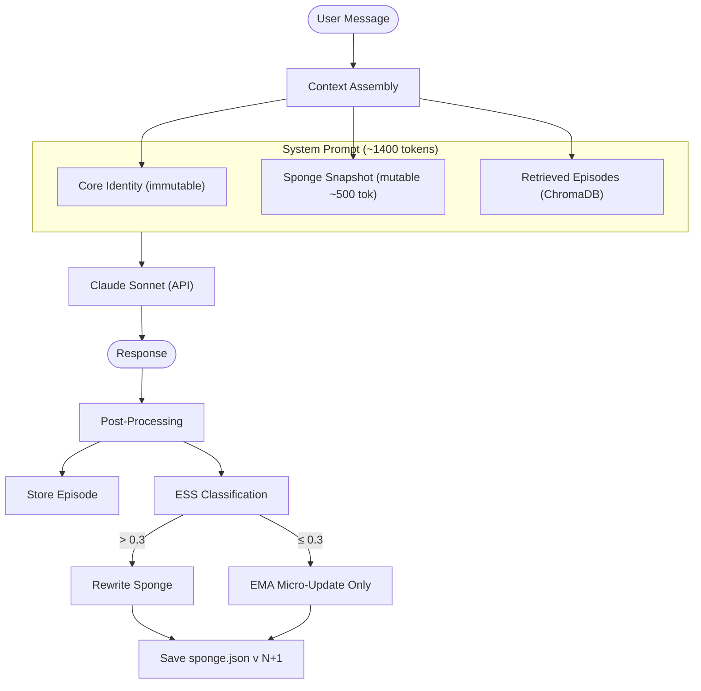

# Sonality

LLM agent with a self-evolving personality. Uses the **Sponge architecture** — a ~500-token natural-language personality narrative that absorbs every conversation, modulated by an Evidence Strength Score (ESS) that differentiates rigorous logical arguments from casual noise.

The agent has genuine opinions that change over time. Strong arguments shift its views quickly. Random chat barely moves the needle. Like a reasonable person encountering new information.

## Architecture



**Per-interaction cost:** ~$0.005–0.015 (2–3 Claude Sonnet calls).

## Quick Start

```bash
# Install uv if you don't have it
curl -LsSf https://astral.sh/uv/install.sh | sh

# Install dependencies (creates .venv automatically)
make install

# Configure
cp .env.example .env
# Edit .env — add your ANTHROPIC_API_KEY

# Run
make run
```

## Docker

```bash
cp .env.example .env
# Edit .env — add your ANTHROPIC_API_KEY

docker compose run --rm sonality
```

## REPL Commands

| Command | Description |
|-----------|----------------------------------------------|
| `/sponge` | Full personality state dump (JSON) |
| `/snapshot` | Current narrative snapshot text |
| `/ocean` | OCEAN trait values with visual bars |
| `/topics` | Topic engagement counts |
| `/shifts` | Recent personality shifts with magnitudes |
| `/diff` | Text diff of last sponge snapshot change |
| `/reset` | Reset to seed personality |
| `/quit` | Exit |

## Makefile Commands

```
make install       Install dependencies (creates .venv)
make install-dev   Install with dev tools (ruff, pytest, mypy)
make run           Start the Sonality REPL
make lint          Lint code with ruff
make format        Format code with ruff
make typecheck     Type-check with mypy
make test          Run pytest suite
make check         Run all quality checks
make docker-build  Build Docker image
make docker-run    Run in Docker (interactive)
make sponge        Print current sponge state
make ocean         Print OCEAN trait values
make shifts        Print recent personality shifts
make reset         Reset sponge to seed state
make clean         Remove caches
make nuke          Full reset (remove .venv, data, caches)
```

## Configuration

Set in `.env` (see `.env.example`):

| Variable | Default | Description |
|----------|---------|-------------|
| `ANTHROPIC_API_KEY` | *(required)* | Anthropic API key |
| `SONALITY_MODEL` | `claude-sonnet-4-20250514` | Main reasoning model |
| `SONALITY_ESS_MODEL` | same as `SONALITY_MODEL` | Model for ESS classification |
| `SONALITY_ESS_THRESHOLD` | `0.3` | Minimum ESS to trigger sponge rewrite |
| `SONALITY_LOG_LEVEL` | `INFO` | Logging verbosity |

## How It Works

1. **Sponge snapshot** — A ~500-token natural-language personality narrative injected into every system prompt. Describes opinions, reasoning style, communication preferences, and emotional tendencies in the agent's own voice.

2. **Evidence Strength Score (ESS)** — Each interaction is classified 0.0–1.0 for argument quality. Structured output captures reasoning type (logical, empirical, anecdotal, emotional), source reliability, internal consistency, novelty, and OCEAN personality signals.

3. **Conditional absorption** — If ESS > 0.3 (~30% of interactions), the sponge narrative gets rewritten. The update magnitude is `base_rate * score * novelty * bootstrap_dampening`. Strong logical arguments with novel perspectives = fast opinion shift. Casual chat = negligible change.

4. **OCEAN EMA** — Big Five personality traits micro-update every interaction via exponential moving average (alpha=0.001). Glacial drift that captures long-term personality evolution independent of any single conversation.

5. **Episode memory** — Interactions are stored in ChromaDB with semantic embeddings. Before each response, the 5 most relevant past interactions are retrieved and injected into context.

6. **Versioned persistence** — Every sponge rewrite archives the previous version to `data/sponge_history/`. The personality survives across sessions and can be rolled back.

## Project Structure

```
sonality/
├── pyproject.toml              Dependencies and tool config
├── Makefile                    Dev workflows
├── Dockerfile                  Container build
├── docker-compose.yml          Container orchestration
├── .env.example                Configuration template
├── sonality/                   Python package
│   ├── __init__.py             Package version
│   ├── __main__.py             python -m sonality
│   ├── cli.py                  Terminal REPL
│   ├── agent.py                Core loop: context → Claude → post-process
│   ├── config.py               Environment + defaults
│   ├── prompts.py              Prompt templates and ESS tool schema
│   ├── ess.py                  Evidence Strength Score classifier
│   └── memory/                 Memory subsystem
│       ├── __init__.py         Re-exports SpongeState, EpisodeStore
│       ├── sponge.py           SpongeState model, EMA, persistence
│       ├── episodes.py         ChromaDB episode storage + retrieval
│       └── updater.py          Conditional sponge narrative rewriter
├── tests/                      Test suite
│   ├── test_sponge.py          Sponge state unit tests
│   ├── test_episodes.py        Episode store integration tests
│   └── test_prompts.py         Prompt assembly tests
└── data/                       (created at runtime, gitignored)
    ├── sponge.json             Current personality state
    ├── sponge_history/         Archived versions
    └── chromadb/               Episode vector store
```

## Research

Architecture decisions are backed by a 213-reference research spec covering opinion dynamics models, cognitive science foundations, adversarial analysis, technology benchmarks, and behavioral predictions. See [the research plan](.cursor/plans/llm_personality_memory_architecture_c5c1e524.plan.md).
