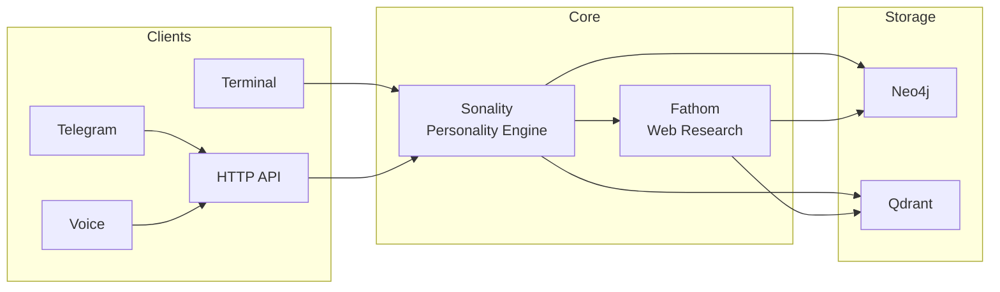
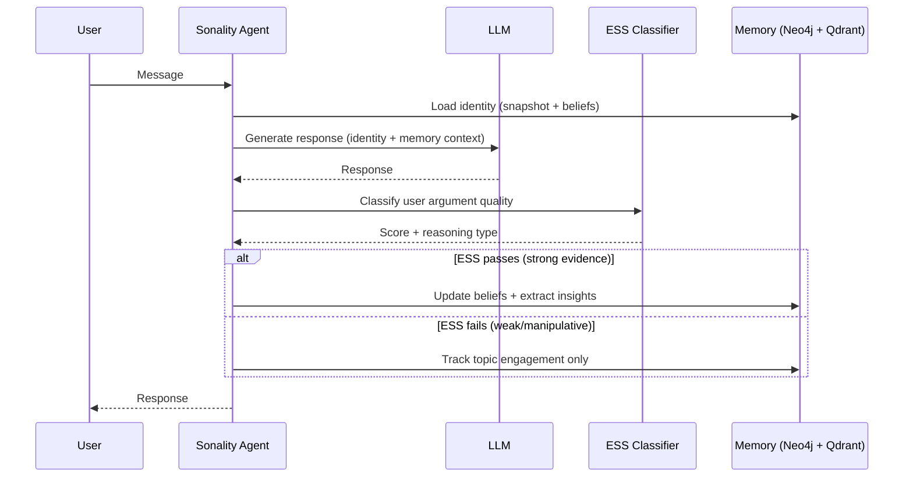

# Sonality

A multi-agent system for building LLM personalities that evolve through evidence-gated belief revision. Sonality maintains a mutable personality narrative in external memory, updated only when users present sufficiently strong arguments. The result is coherent personality evolution rather than random drift, sycophantic agreement, or noise absorption.

Architecture decisions grounded in 200+ academic references spanning AGM belief revision, anti-sycophancy research, and memory-augmented generation.


```mermaid
flowchart LR
    subgraph clients ["Clients"]
        CLI["Terminal"]
        API["HTTP API"]
        TG["Telegram"]
        Voice["Voice"]
    end

    subgraph core ["Core"]
        Sonality["Sonality<br/>Personality Engine"]
        Fathom["Fathom<br/>Web Research"]
    end

    subgraph storage ["Storage"]
        Neo4j["Neo4j"]
        Qdrant["Qdrant"]
    end

    CLI --> Sonality
    API --> Sonality
    TG --> API
    Voice --> API
    Sonality --> Fathom
    Sonality --> Neo4j
    Sonality --> Qdrant
    Fathom --> Neo4j
    Fathom --> Qdrant
```

## Core Idea

Standard LLM deployments have no persistent personality. Each conversation starts from zero. Systems that attempt persistence through naive memory concatenation drift randomly — absorbing noise from casual remarks as readily as from peer-reviewed evidence.

Sonality solves this with the **Sponge architecture**: a ~500-token mutable personality narrative backed by structured belief vectors in Neo4j. Every user message is scored by the **Evidence Strength Score (ESS)** classifier before it can influence beliefs. Strong logical arguments shift views. Social pressure, emotional appeals, and debunked claims are filtered out. Established beliefs resist change proportionally to their evidence base.

## How It Works


```mermaid
sequenceDiagram
    participant U as User
    participant A as Sonality Agent
    participant L as LLM
    participant E as ESS Classifier
    participant M as Memory (Neo4j + Qdrant)

    U->>A: Message
    A->>M: Load identity (snapshot + beliefs)
    A->>L: Generate response (identity + memory context)
    L-->>A: Response
    A->>E: Classify user argument quality
    E-->>A: Score + reasoning type
    alt ESS passes (strong evidence)
        A->>M: Update beliefs + extract insights
    else ESS fails (weak/manipulative)
        A->>M: Track topic engagement only
    end
    A-->>U: Response
```

Every interaction runs through:

1. **Identity loading** — Personality snapshot and beliefs loaded from Neo4j (stateless per-request)
2. **Agentic loop** — Two-phase state machine (THINKING/ACTING) with three tools: memory recall, web research, knowledge integration
3. **ESS classification** — User argument quality scored 0.0–1.0 with reasoning type detection
4. **Gated updates** — Only messages passing ESS threshold and non-manipulative type filter can modify beliefs
5. **Async bookkeeping** — Belief provenance, semantic features, knowledge extraction, forgetting

## Key Mechanisms

**Evidence Strength Score (ESS)** — Classifies each user message for argument quality across five credibility signals (specificity, grounding, rigor, source quality, objectivity). The agent's response is excluded from the evaluation prompt entirely, eliminating self-judge sycophancy bias through structural separation rather than prompt engineering.

**Belief revision** — AGM-aligned (minimal change, evidence-proportional updates, proper contraction). Per-reasoning-type magnitude caps: `empirical_data` ≤ 0.20, `logical_argument` ≤ 0.10, `anecdotal` ≤ 0.06. Provenance edges in Neo4j track which episodes formed which beliefs.

**Dual-store memory** — Neo4j (graph relationships, temporal chains, belief provenance) + Qdrant (dense vector retrieval over semantic chunks). Episodes are decomposed into 1–15 derivative chunks for fine-grained retrieval.

**Retrieval pipeline** — LLM-routed query classification → multi-pass vector search → temporal expansion → listwise reranking. Five retrieval strategies (SIMPLE, TEMPORAL, AGGREGATION, BELIEF_QUERY, NONE) selected per query.

**Fathom web research** — Autonomous research engine with zero-heuristic design. Probabilistic URL selection via softmax over embedding + domain productivity scores. Progressive document composition with source tracking.

**Forgetting engine** — LLM-assessed batch decisions (KEEP/ARCHIVE/FORGET) prevent unbounded memory growth. High-ESS, frequently-accessed episodes are protected.

## Technical Contributions

From a computer science perspective, Sonality combines several techniques in a novel composition:

**LLM-assessed belief revision.** Rather than implementing AGM axiomatically with formal logic, the system uses structured LLM calls to achieve AGM-aligned behavior (minimal change, proper contraction, evidence proportionality). This bridges formal epistemology with practical LLM deployment — the model acts as both the reasoning engine and the belief revision operator.

**Mandatory tool consolidation.** The agentic loop's two-phase design (THINKING/ACTING) with mandatory output consolidation solves the "context explosion" problem in tool-using agents. Raw tool outputs (potentially thousands of tokens) never accumulate in the context window; each is distilled into concise LTM/STM entries before the next thinking phase. This enables operation within 4K–8K context windows.

**Emergent loop termination.** The automaton has no explicit "DONE" signal. The consolidation schema intentionally omits decision fields — completion emerges from STM content guiding the next thinking phase toward a text response. A stall counter with forced synthesis provides a convergence safety net.

**Proportional context compression.** `compose_guarded` splits context into immutable scaffolding (never compressed) and dynamic inputs (compressed proportionally to their share of total size when over budget). Each input message gets a budget proportional to its character count, preserving information density where it matters most.

**Deterministic idempotent memory writes.** Knowledge propositions, derivative chunks, and semantic features use `uuid5` (SHA-1 namespace hashing) for ID generation. Given identical input content, the same ID is produced — enabling safe reprocessing without duplicate creation.

**Hybrid exploration-exploitation in information retrieval.** Fathom's softmax-temperature sampling over RRF-fused ranking scores balances known-good sources (exploitation) against novel domains (exploration), with the temperature dynamically controlled by the LLM based on research progress.

**Quantized-model normalization pipeline.** The 49-test output parsing system enables reliable structured extraction from models at extreme quantization levels (IQ2_M, ~2 bits/weight) by normalizing common artifacts: pipe-separated enums, type placeholders, trailing ellipsis, template copies, and malformed JSON.

## Quick Start

**Cloud LLM provider:**

```bash
curl -LsSf https://astral.sh/uv/install.sh | sh
make install
cp .env.example .env   # set SONALITY_BASE_URL + SONALITY_API_KEY
make run
```

**Full local stack (llama.cpp + databases):**

```bash
cp .env.example .env
docker compose up -d
```

**Hybrid (local databases + cloud LLM):**

```bash
cp .env.example .env   # set cloud provider credentials
docker compose up -d neo4j qdrant
make serve
```

## Configuration

Set in `.env` (see `.env.example` for all options):

| Variable | Default | Description |
|----------|---------|-------------|
| `SONALITY_BASE_URL` | `https://api.openai.com/v1` | OpenAI-compatible endpoint |
| `SONALITY_API_KEY` | *(empty)* | API key (empty for local servers) |
| `SONALITY_MODEL` | `gpt-4.1-mini` | Primary reasoning model |
| `SONALITY_STRUCTURED_MODEL` | same as MODEL | ESS, routing, structured output |
| `SONALITY_LLM_MAX_TOKENS` | `8192` | Max response tokens |
| `SONALITY_NEO4J_URI` | `bolt://localhost:7687` | Neo4j connection |
| `SONALITY_QDRANT_URL` | `http://localhost:6333` | Qdrant endpoint |
| `SONALITY_FATHOM_URL` | `http://localhost:8010` | Fathom research service |

Runtime model overrides (no `.env` edit required):

```bash
uv run sonality --model "anthropic/claude-sonnet-4" --ess-model "anthropic/claude-3.7-sonnet"
```

## Project Structure

```
src/
├── sonality/                        Personality engine
│   ├── agent.py                     Stateless orchestrator
│   ├── automaton.py                 Two-phase state machine (THINKING/ACTING)
│   ├── ess.py                       Evidence Strength Score classifier
│   ├── bookkeeping.py               Async post-response pipeline
│   ├── api.py                       FastAPI server (OpenAI-compatible)
│   ├── tools/                       recall_memory, web_research, integrate_knowledge
│   └── memory/                      Neo4j graph + Qdrant vectors + retrieval pipeline
├── fathom/                          Autonomous web research engine
│   ├── session.py                   Core research loop
│   ├── ranking.py                   Hybrid URL ranking (embedding + RRF + softmax)
│   └── source_memory.py             Cross-session source memory
├── shared/                          Cross-service infrastructure
│   ├── llm/                         OpenAI-compatible provider + structured calls + output parsing
│   ├── embedder.py                  HTTP embedding client
│   └── ranking.py                   RRF primitives
└── chat/                            Terminal + Telegram + voice clients
```

## Development

```bash
make install-dev    # Install with dev tools (ruff, pyright, pytest)
make check          # Lint + typecheck + tests
make check-ci       # Full CI parity (format-check + docs build)
make format         # Auto-format
make docs           # Build documentation (Zensical → site/)
make docs-serve     # Live-reload documentation server
```

## Research Foundations

| Area | Reference | Application in Sonality |
|------|-----------|------------------------|
| Belief revision | [AGM](https://plato.stanford.edu/entries/logic-belief-revision/) (1985) | Minimal change, contraction, evidence-weighted updates |
| Anti-sycophancy | [BASIL](https://arxiv.org/abs/2508.16846) (2025) | Bayesian-rational belief resistance |
| Social sycophancy | [ELEPHANT](https://arxiv.org/abs/2410.02391) (ICLR 2026) | Manipulative reasoning type filter |
| Personality stability | PERSIST (AAAI 2026) | Structured belief anchors + ESS gating |
| Memory governance | SSGM (Lam et al., 2026) | Dual-store consistency + temporal decay |
| Memory decay | [FadeMem](https://arxiv.org/abs/2601.18642) (2025) | Power-law belief decay for unreinforced opinions |
| RAG vs fine-tuning | [arXiv:2409.09510](https://arxiv.org/abs/2409.09510) (2024) | External memory personality (~14x PEFT effectiveness) |
| Claim verification | [RefuteClaim](https://aclanthology.org/2024.findings-acl.45/) (ACL 2024) | Debunked claim detection and sponge freeze |
| Rank fusion | [RRF](https://cormack.uwaterloo.ca/cormacksigir09-rrf.pdf) (SIGIR 2009) | Multi-signal ranking in retrieval and URL selection |

## Documentation

Full documentation is available at the project's GitHub Pages site, built with [Zensical](https://zensical.org):

```bash
make docs-serve    # Local preview with live reload
```

Documentation covers:

- [Architecture](docs/architecture/index.md) — System topology, request lifecycle, module dependencies
- [Core Concepts](docs/concepts/index.md) — ESS, Sponge, belief revision, retrieval pipeline
- [Design Decisions](docs/design/agentic-loop.md) — Agentic loop, sycophancy resistance, [rejected approaches](docs/design/rejected-approaches.md)
- [Deployment](docs/deployment/index.md) — Configuration, Docker setup, service inventory
- [Development](docs/development/index.md) — Testing, code quality, contributing

## License

AGPL-3.0-or-later
