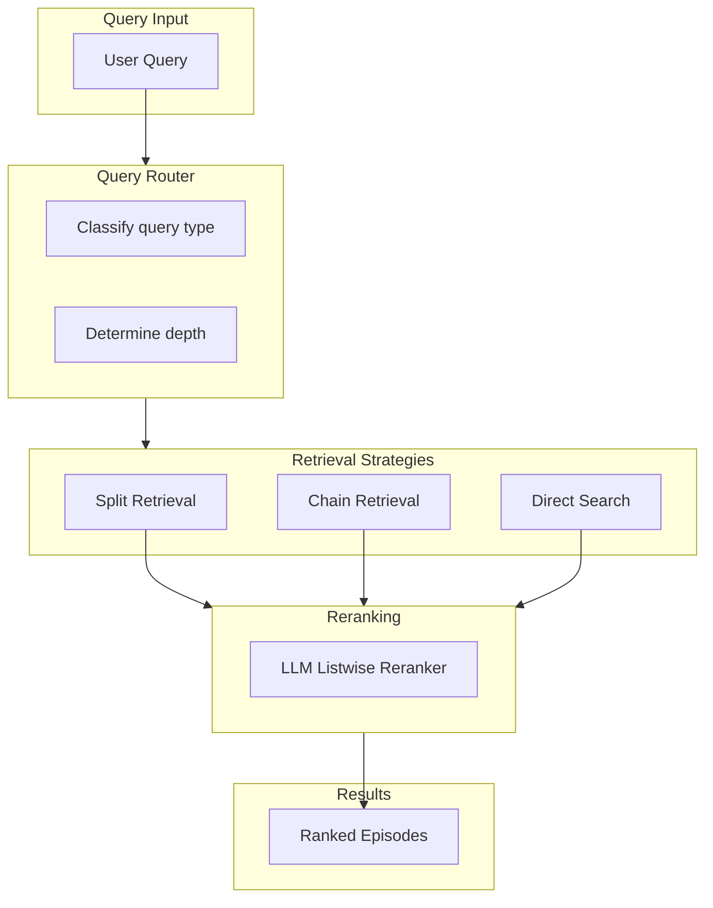
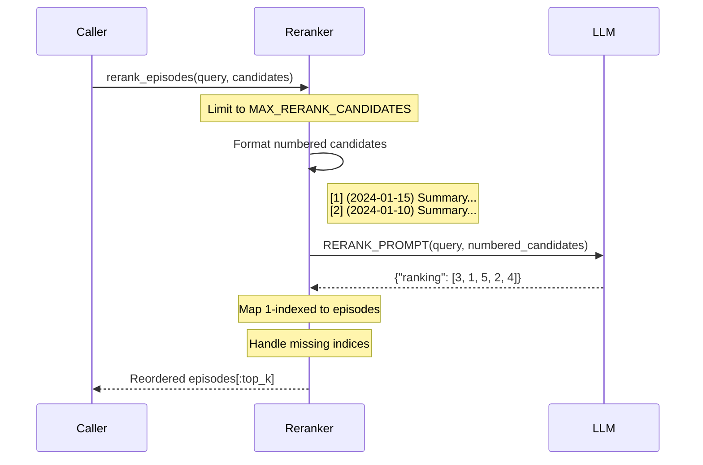
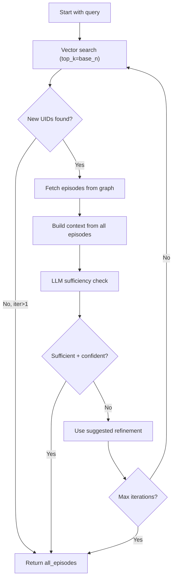
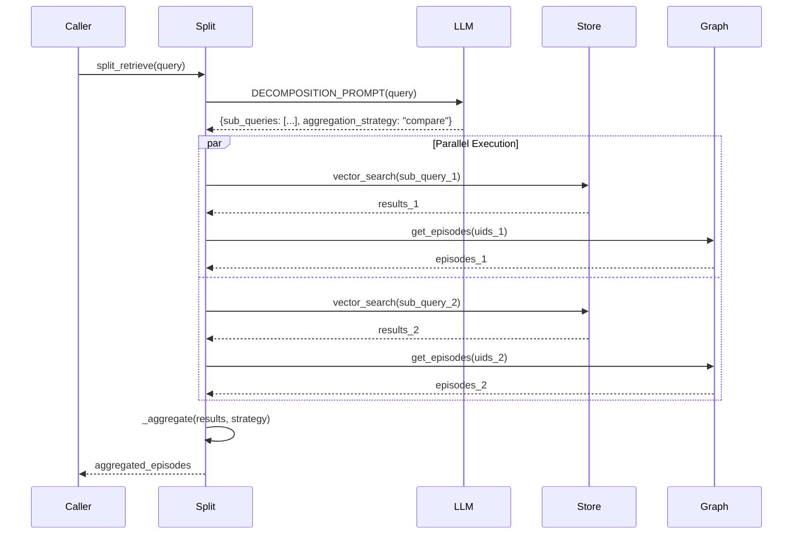
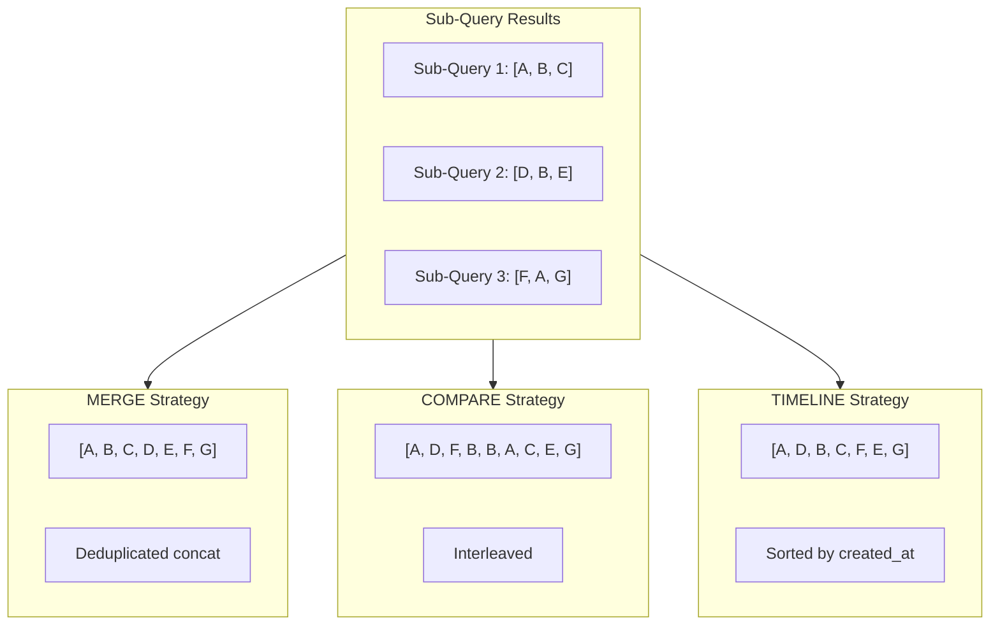
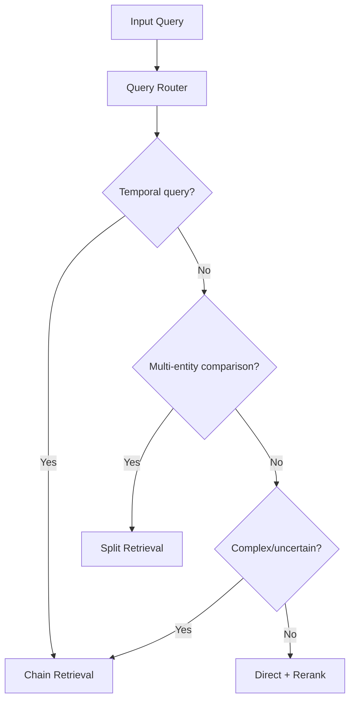
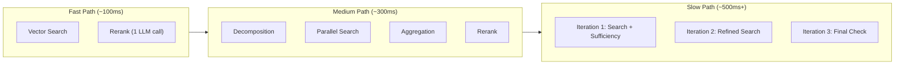

# Advanced Retrieval Pipeline

> **Deep-Dive Documentation**: LLM-powered retrieval strategies including reranking, iterative chaining, and query decomposition.

## Overview

The Sonality retrieval system uses three advanced strategies beyond basic vector search:

| Strategy | Module | Purpose |
|----------|--------|---------|
| **Reranker** | `retrieval/reranker.py` | LLM-based relevance ranking with cross-document reasoning |
| **Chain Retrieval** | `retrieval/chain.py` | Iterative search with sufficiency checking |
| **Split Retrieval** | `retrieval/split.py` | Query decomposition with parallel execution |

## System Architecture



---

## LLM Listwise Reranker

`sonality/memory/retrieval/reranker.py`

Replaces formula-based utility scoring with LLM reasoning for relevance ranking.

### Core Function

```python
def rerank_episodes(
    query: str,
    candidates: list[EpisodeNode],
    *,
    top_k: int = 0,
) -> list[EpisodeNode]:
    """Rerank candidate episodes using LLM Listwise approach.

    Parameters
    ----------
    query:
        The original search query.
    candidates:
        Episodes to rank (max ~25 for context efficiency).
    top_k:
        Number of top results to return. 0 means return all.

    Returns
    -------
    Episodes in LLM-determined relevance order.
    """
```

### Reranking Flow



### Response Model

```python
class _RerankResponse(BaseModel):
    ranking: list[int]  # 1-indexed relevance order
```

### Robustness Handling

```python
# Map 1-indexed ranking to 0-indexed episodes
reranked: list[EpisodeNode] = []
seen: set[int] = set()
for idx in ranking:
    zero_idx = idx - 1
    if 0 <= zero_idx < len(to_rank) and zero_idx not in seen:
        reranked.append(to_rank[zero_idx])
        seen.add(zero_idx)

# Add any candidates not in the ranking (LLM might skip some)
for i, ep in enumerate(to_rank):
    if i not in seen:
        reranked.append(ep)
```

### Configuration

| Parameter | Config Key | Default | Description |
|-----------|------------|---------|-------------|
| Max candidates | `MAX_RERANK_CANDIDATES` | 25 | Limit for context efficiency |
| Max tokens | `LLM_MAX_TOKENS` | 1024 | Response token limit |

---

## Chain Retrieval (Iterative Sufficiency)

`sonality/memory/retrieval/chain.py`

Iteratively searches and refines queries until sufficient results are found.

### Core Function

```python
async def chain_retrieve(
    store: DualEpisodeStore, 
    graph: MemoryGraph, 
    query: str, 
    base_n: int = 10,
) -> list[EpisodeNode]:
    """Iteratively search and refine until sufficient results found."""
```

### Iteration Flow



### Sufficiency Response Model

```python
class _SufficiencyDecision(StrEnum):
    SUFFICIENT = "SUFFICIENT"
    INSUFFICIENT = "INSUFFICIENT"


class _SufficiencyResponse(BaseModel):
    sufficiency_decision: _SufficiencyDecision = _SufficiencyDecision.INSUFFICIENT
    confidence: float = 0.0
    reasoning: str = ""
    suggested_refinement: str = ""
```

### Termination Conditions

```python
# Success: Sufficient with high confidence
if (
    sufficiency.sufficiency_decision is _SufficiencyDecision.SUFFICIENT
    and sufficiency.confidence >= threshold
):
    return all_episodes

# Failure: No new results in later iterations
if not new_uids and iteration > 1:
    break

# Failure: No suggested refinement
if not sufficiency.suggested_refinement:
    break

# Failure: Max iterations reached
if iteration >= max_iter:
    break
```

### Configuration

| Parameter | Config Key | Default | Description |
|-----------|------------|---------|-------------|
| Max iterations | `RETRIEVAL_MAX_ITERATIONS` | 3 | Iteration limit |
| Confidence threshold | `RETRIEVAL_CONFIDENCE_THRESHOLD` | 0.7 | Sufficiency confidence cutoff |

---

## Split Retrieval (Query Decomposition)

`sonality/memory/retrieval/split.py`

Decomposes multi-entity or comparison queries into parallel sub-queries.

### Core Function

```python
async def split_retrieve(
    store: DualEpisodeStore, 
    graph: MemoryGraph, 
    query: str, 
    n_per_sub: int = 10,
) -> list[EpisodeNode]:
    """Decompose query, execute sub-queries in parallel, aggregate."""
```

### Decomposition Response Model

```python
class _AggregationStrategy(StrEnum):
    MERGE = "merge"       # Combine all results, dedupe
    COMPARE = "compare"   # Interleave for side-by-side comparison
    TIMELINE = "timeline" # Sort by creation time


class _DecompositionResponse(BaseModel):
    sub_queries: list[str]
    aggregation_strategy: _AggregationStrategy = _AggregationStrategy.MERGE
```

### Decomposition Flow



### Aggregation Strategies

```python
def _aggregate(sub_results: list[list[EpisodeNode]], strategy: _AggregationStrategy) -> list[EpisodeNode]:
    if strategy is _AggregationStrategy.COMPARE:
        # Interleave for side-by-side comparison
        interleaved: list[EpisodeNode] = []
        max_len = max((len(batch) for batch in sub_results), default=0)
        for index in range(max_len):
            for batch in sub_results:
                if index < len(batch):
                    interleaved.append(batch[index])
        return _dedupe(interleaved)
    
    if strategy is _AggregationStrategy.TIMELINE:
        # Sort by creation time
        return sorted(
            _dedupe([ep for batch in sub_results for ep in batch]),
            key=lambda episode: episode.created_at
        )
    
    # MERGE: Simple concatenation with deduplication
    return _dedupe([ep for batch in sub_results for ep in batch])
```

### Aggregation Visualization



### Parallel Execution Control

```python
# Limit concurrent sub-queries
sem = asyncio.Semaphore(4)

async def search_one(sq: str) -> list[EpisodeNode]:
    async with sem:
        try:
            results = await store.vector_search(sq, top_k=n_per_sub)
            uids = list({h.episode_uid for h in results})
            return await graph.get_episodes(uids)
        except Exception:
            log.exception("Sub-query failed: %s", sq[:60])
            return []

sub_results = await asyncio.gather(*(search_one(sq) for sq in sub_queries))
```

---

## Strategy Selection

The query router (`retrieval/router.py`) determines which strategy to use:



### Strategy Characteristics

| Strategy | Best For | Latency | Token Cost |
|----------|----------|---------|------------|
| **Direct + Rerank** | Simple factual queries | Low | Medium |
| **Chain Retrieval** | Uncertain/exploratory queries | High | High |
| **Split Retrieval** | Comparison/multi-entity queries | Medium | Medium-High |

---

## Integration Example

```python
from sonality.memory.retrieval.router import route_query
from sonality.memory.retrieval.chain import chain_retrieve
from sonality.memory.retrieval.split import split_retrieve
from sonality.memory.retrieval.reranker import rerank_episodes

async def retrieve_with_strategy(
    store: DualEpisodeStore,
    graph: MemoryGraph,
    query: str,
) -> list[EpisodeNode]:
    """Execute appropriate retrieval strategy based on query classification."""
    
    decision = route_query(query)
    
    if decision.category is QueryCategory.TEMPORAL:
        episodes = await chain_retrieve(store, graph, query)
    elif len(query.split(" vs ")) > 1 or "compare" in query.lower():
        episodes = await split_retrieve(store, graph, query)
    else:
        results = await store.vector_search(query, top_k=decision.n_results)
        uids = [h.episode_uid for h in results]
        episodes = await graph.get_episodes(uids)
    
    # Always rerank for final ordering
    return rerank_episodes(query, episodes, top_k=10)
```

---

## Performance Considerations

### Latency Optimization



### Token Budget

| Component | Tokens (Input) | Tokens (Output) |
|-----------|----------------|-----------------|
| Decomposition | ~200 | ~100 |
| Sufficiency Check | ~500/iter | ~100/iter |
| Reranking | ~1000 (25 candidates) | ~50 |

---

## Related Documentation

- [Data Pipeline Trace](data-pipeline-trace.md) — End-to-end retrieval flow
- [Embedder & Consolidation](embedder-consolidation.md) — Vector embedding
- [Database Connections](database-connections.md) — Qdrant integration
- [Agent Core](agent-core.md) — Retrieval integration in respond pipeline
