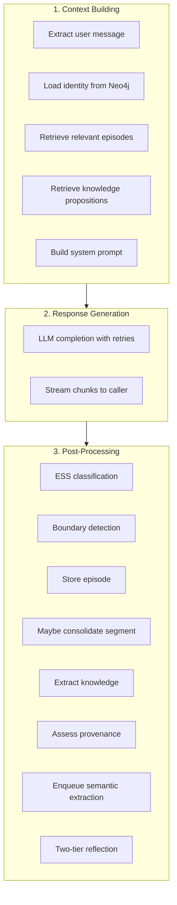
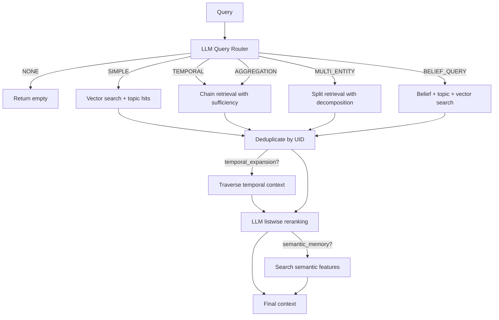
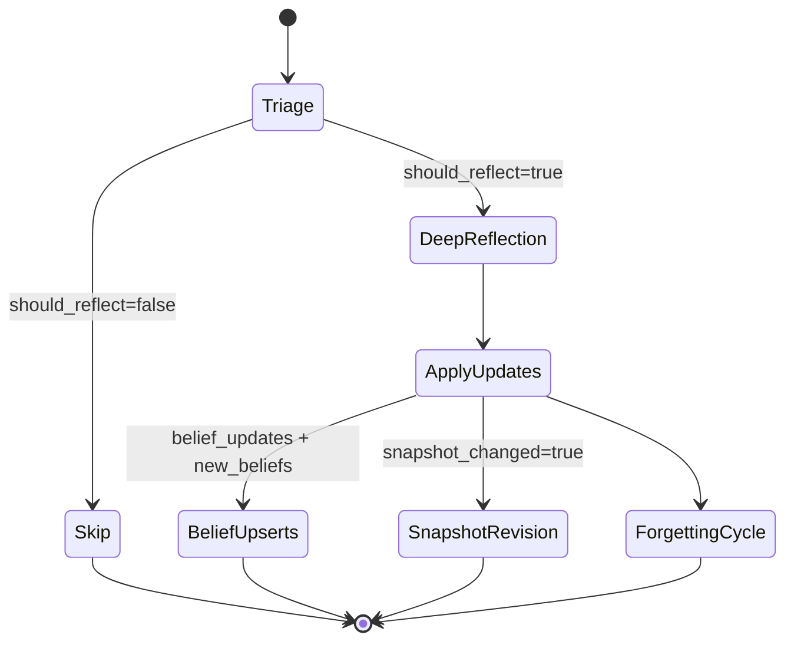
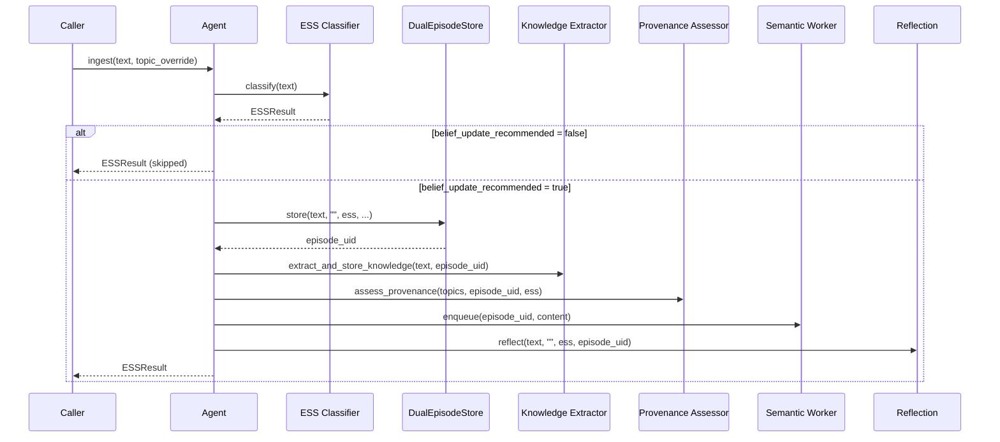
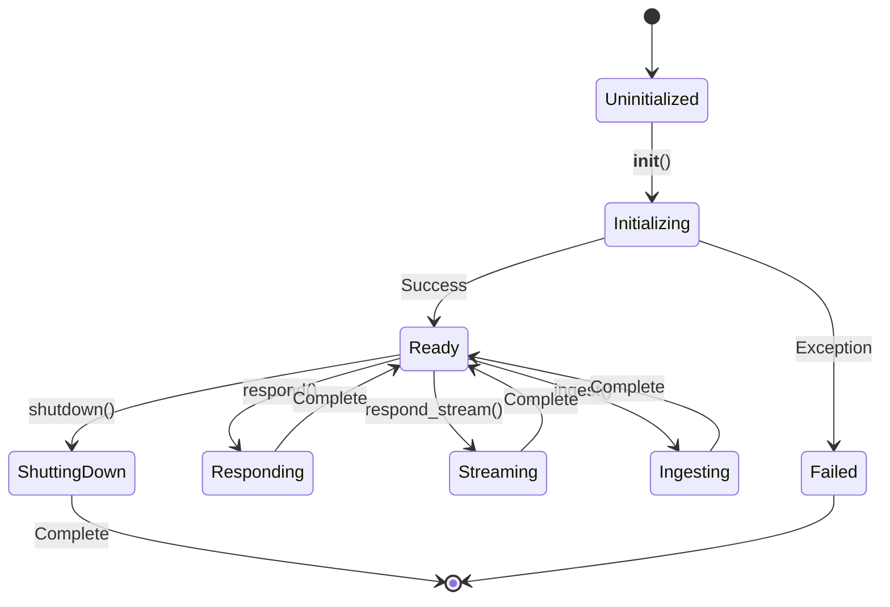

# Agent Core Deep-Dive

> **Module**: `sonality/agent.py`  
> **Purpose**: Stateless personality agent backed by Neo4j (graph) and Qdrant (vectors)

The `SonalityAgent` is the central orchestrator that coordinates all subsystems. This document provides a step-by-step code walkthrough of its internal mechanics.

## Architectural Principles

```
┌─────────────────────────────────────────────────────────────────────────┐
│                         SonalityAgent                                    │
├─────────────────────────────────────────────────────────────────────────┤
│  ┌──────────────┐  ┌──────────────┐  ┌──────────────┐                  │
│  │ Memory Graph │  │ Dual Store   │  │ Embedder     │                  │
│  │   (Neo4j)    │  │ (Neo4j+Qdrant)│ │ (FastEmbed)  │                  │
│  └──────────────┘  └──────────────┘  └──────────────┘                  │
│         │                 │                 │                           │
│         └─────────────────┼─────────────────┘                           │
│                           │                                             │
│  ┌──────────────┐  ┌──────────────┐  ┌──────────────┐                  │
│  │ Boundary     │  │ Semantic     │  │ LLM Provider │                  │
│  │ Detector     │  │ Worker       │  │              │                  │
│  └──────────────┘  └──────────────┘  └──────────────┘                  │
└─────────────────────────────────────────────────────────────────────────┘
```

**Key Design Decisions:**

1. **Stateless Per-Request**: No in-memory state carried between requests
2. **Graph-Backed Identity**: Personality and beliefs loaded from Neo4j per request
3. **Caller-Managed Context**: Conversation history provided by caller
4. **Two-Tier Reflection**: Cheap triage → deep update only when warranted

## Initialization Flow

```mermaid
sequenceDiagram
    participant Main
    participant Agent as SonalityAgent
    participant Loop as AsyncIO Loop
    participant DB as DatabaseConnections
    participant Graph as MemoryGraph
    participant Store as DualEpisodeStore
    participant Worker as SemanticWorker

    Main->>Agent: __init__(model, ess_model)
    Agent->>Agent: Validate config
    Agent->>Loop: Create event loop thread
    Loop-->>Agent: Loop running
    
    Agent->>DB: DatabaseConnections.create()
    DB->>DB: Connect Neo4j + Qdrant
    DB->>DB: Verify connectivity
    DB->>DB: Initialize schemas
    DB-->>Agent: db instance
    
    Agent->>Agent: Create Embedder
    Agent->>Graph: MemoryGraph(neo4j_driver)
    Agent->>Store: DualEpisodeStore(graph, qdrant, embedder)
    
    Agent->>Graph: get_last_episode_uid()
    Graph-->>Agent: last_uid (or "")
    
    alt last_uid exists
        Agent->>Store: restore_last_episode(last_uid)
    end
    
    Agent->>Agent: Create EventBoundaryDetector
    Agent->>Graph: get_latest_segment_counter()
    Agent->>Agent: Set segment counter
    
    Agent->>Worker: SemanticIngestionWorker(qdrant_url, embedder)
    Agent->>Worker: start()
    Worker-->>Agent: Background thread running
```

### Code Walkthrough: `__init__`

```python
def __init__(
    self,
    model: str = config.MODEL,
    ess_model: str = config.ESS_MODEL,
) -> None:
    # 1. Validate required API configuration
    missing = config.missing_live_api_config()
    if missing:
        raise ValueError(f"Missing required API config: {', '.join(missing)}")
    
    # 2. Store model configuration
    self.model = model
    self.ess_model = ess_model
    self.last_ess = classifier_exception_fallback("")
    
    # 3. Create dedicated async event loop in background thread
    self._loop = asyncio.new_event_loop()
    self._loop_thread = threading.Thread(
        target=self._loop.run_forever, name="agent-async-loop", daemon=True
    )
    self._loop_thread.start()
    
    # 4. Initialize runtime (databases, embedder, stores)
    try:
        self._run_async(self._init_runtime())
    except Exception as exc:
        raise RuntimeError("Neo4j + Qdrant required") from exc
    
    # 5. Initialize conversation boundary detector
    self._boundary_detector = EventBoundaryDetector()
    counter = self._run_async(self._graph.get_latest_segment_counter())
    self._boundary_detector.set_segment_counter(counter)
    
    # 6. Start background semantic feature extraction
    self._semantic_worker = SemanticIngestionWorker(config.QDRANT_URL, self._embedder)
    self._semantic_worker.start()
```

**Critical Implementation Detail**: The agent runs its own event loop in a daemon thread because:
- It may be instantiated from sync code (CLI, tests)
- All database operations are async
- The `_run_async` helper bridges sync/async boundaries

## Response Pipeline

The `respond()` method orchestrates a multi-stage pipeline:



### Step 1: Context Building (`_build_context`)

```python
def _build_context(self, messages: list[dict[str, str]]) -> tuple[str, str]:
    """Shared setup for respond paths. Returns (user_message, system_prompt)."""
    # Extract the last user message from conversation history
    user_message = self._last_user_message(messages)
    
    # Load identity from graph (personality snapshot + formatted beliefs)
    snapshot_text, beliefs_text = self._run_async(self._load_identity())
    
    # Retrieve relevant episodes via multi-stage retrieval pipeline
    try:
        relevant = self._run_async(self._retrieve(user_message))
    except Exception:
        relevant = []
    
    # Retrieve factual knowledge propositions
    try:
        knowledge = self._run_async(
            retrieve_relevant_knowledge(user_message, self._db.qdrant, self._embedder)
        )
    except Exception:
        knowledge = []
    
    # Assemble the system prompt with all context
    system_prompt = build_system_prompt(
        snapshot_text=snapshot_text, 
        beliefs_text=beliefs_text,
        relevant_episodes=relevant, 
        knowledge_context=knowledge,
    )
    return user_message, system_prompt
```

### Step 2: Retrieval Pipeline (`_retrieve`)

The retrieval pipeline is sophisticated, with category-specific strategies:



```python
async def _retrieve(self, user_message: str) -> list[str]:
    """Full retrieval pipeline: route → search → expand → rerank."""
    if not self._dual_store.has_episodes:
        return []
    
    # 1. LLM-based query routing
    decision = await asyncio.to_thread(route_query, user_message)
    if decision.category == QueryCategory.NONE:
        return []
    
    # 2. Category-specific retrieval strategy
    if decision.category == QueryCategory.MULTI_ENTITY:
        episodes = await split_retrieve(...)  # Parallel sub-query execution
    elif decision.category in (QueryCategory.TEMPORAL, QueryCategory.AGGREGATION):
        episodes = await chain_retrieve(...)  # Iterative with sufficiency
    elif decision.category == QueryCategory.BELIEF_QUERY:
        # Combine belief edges + topic traversal + vector search
        belief_hits = await self._graph.find_belief_related_episodes(...)
        topic_hits = await self._graph.find_topic_related_episodes(...)
        vector_hits = await self._dual_store.vector_search(...)
        episodes = belief_hits + topic_hits + await self._graph.get_episodes(vector_uids)
    else:  # SIMPLE
        results = await self._dual_store.vector_search(...)
        topic_hits = await self._graph.find_topic_related_episodes(...)
        episodes = topic_hits + await self._graph.get_episodes(episode_uids)
    
    # 3. Deduplicate by UID
    episodes = list({ep.uid: ep for ep in episodes}.values())
    
    # 4. Temporal expansion (if flagged)
    if decision.temporal_expansion is TemporalExpansionDecision.EXPAND:
        for ep in episodes[:3]:
            for n in await self._graph.traverse_temporal_context(ep.uid):
                expanded_uids.add(n.uid)
        episodes.extend(await self._graph.get_episodes(new_uids))
    
    # 5. LLM reranking
    if len(episodes) > 1:
        episodes = await asyncio.to_thread(rerank_episodes, user_message, episodes)
    
    # 6. Semantic memory search (if flagged)
    if decision.semantic_memory is SemanticMemoryDecision.SEARCH:
        semantic_context = await self._search_semantic_features(...)
    
    # 7. Format for prompt
    return [format_episode_line(...) for ep in episodes] + semantic_context
```

### Step 3: Post-Processing (`_post_process`)

After generating a response, several parallel operations occur:

```python
def _post_process(self, user_message: str, agent_response: str) -> None:
    """Classify, store episode, extract knowledge, assess provenance, reflect."""
    
    # 1. ESS Classification (LLM-based evidence strength scoring)
    ess = self._classify_ess(user_message)
    self.last_ess = ess
    
    # 2. Boundary Detection (segment management)
    previous_segment_id = self._boundary_detector.current_segment_id
    boundary = self._boundary_detector.check_boundary(user_message)
    segment_id = boundary.segment_id
    if boundary.boundary_decision is BoundaryDecision.BOUNDARY:
        closed_segment_id = previous_segment_id
    
    # 3. Store Episode (Neo4j + Qdrant atomically)
    episode_uid = self._store_episode(
        user_message, agent_response, ess, segment_id, segment_label
    )
    
    # 4. Consolidate Closed Segment (if boundary crossed)
    if closed_segment_id:
        self._run_async(maybe_consolidate_segment(self._graph, closed_segment_id))
    
    # 5. Knowledge Extraction (if density warrants)
    if episode_uid:
        self._extract_knowledge(user_message, agent_response, ess, episode_uid)
        
        # 6. Belief Provenance Assessment
        if ess.belief_update_recommended:
            self._assess_provenance(list(ess.topics), episode_uid, user_message, ess)
        
        # 7. Enqueue Semantic Feature Extraction
        self._semantic_worker.enqueue(episode_uid, content, categories)
    
    # 8. Two-Tier Reflection
    self._reflect(user_message, agent_response, ess, episode_uid)
```

## Two-Tier Reflection System

The reflection system prevents unnecessary computation while ensuring meaningful updates:



### Tier 1: Triage

```python
class _TriageResponse(BaseModel):
    should_reflect: bool = False
    reason: str = ""

# Triage prompt considers:
# - Current beliefs
# - User message content
# - Agent response
# - ESS score and reasoning type
# - Topics detected
```

### Tier 2: Deep Reflection

```python
class _BeliefPatch(BaseModel):
    topic: str = ""
    valence: float = 0.0      # -1.0 to +1.0
    confidence: float = 0.5    # 0.0 to 1.0
    belief_text: str = ""
    reasoning: str = ""

class _DeepReflectionResponse(BaseModel):
    belief_updates: list[_BeliefPatch] = []  # Modifications to existing
    new_beliefs: list[_BeliefPatch] = []     # New belief formation
    snapshot_revision: str = ""               # Updated personality narrative
    snapshot_changed: bool = False
```

### Applying Reflection

```python
def _apply_reflection(self, reflection: _DeepReflectionResponse, episode_uid: str) -> None:
    """Write belief updates and snapshot revision to graph."""
    
    # Process all belief patches (updates and new)
    all_updates = [
        *((b, f"reflection:{episode_uid[:8]}") for b in reflection.belief_updates),
        *((b, f"new_belief:{episode_uid[:8]}") for b in reflection.new_beliefs),
    ]
    
    for patch, provenance in all_updates:
        if not patch.topic:
            continue
        self._run_async(
            self._graph.upsert_belief(
                patch.topic,
                valence=patch.valence,
                confidence=patch.confidence,
                belief_text=patch.belief_text,
                provenance=provenance,
            )
        )
    
    # Update personality snapshot if changed
    if reflection.snapshot_changed and reflection.snapshot_revision:
        self._run_async(self._graph.upsert_personality_snapshot(
            reflection.snapshot_revision[:2000]
        ))
    
    # Run forgetting cycle on low-utility episodes
    candidates = self._run_async(self._graph.get_forgetting_candidates(limit=10))
    if candidates:
        self._run_async(assess_and_forget(candidates, self._graph, self._dual_store, ...))
```

## Data Ingestion Pipeline

Non-conversational ingestion (news, articles, social media) follows a simplified path:



```python
def ingest(self, text: str, *, topic_override: str = "") -> ESSResult:
    """Non-conversational data ingestion (news, articles, social media)."""
    ess = self._classify_ess(text)
    
    # Override topics if provided
    if topic_override and not ess.topics:
        ess = dataclasses.replace(ess, topics=(topic_override.strip().lower(),))
    self.last_ess = ess
    
    # Skip if not worth updating beliefs
    if not ess.belief_update_recommended:
        return ess
    
    # Full ingestion pipeline (no agent_response for non-conversational)
    episode_uid = self._store_episode(text, "", ess, "", "")
    if episode_uid:
        self._extract_knowledge(text, "", ess, episode_uid)
        self._assess_provenance(list(ess.topics), episode_uid, text, ess)
        self._semantic_worker.enqueue(episode_uid, content, categories=(SemanticCategory.KNOWLEDGE,))
        self._reflect(text, "", ess, episode_uid)
    
    return ess
```

## Thread Safety & Concurrency

The agent manages concurrency through several mechanisms:

### 1. Dedicated Event Loop

```python
self._loop = asyncio.new_event_loop()
self._loop_thread = threading.Thread(
    target=self._loop.run_forever, name="agent-async-loop", daemon=True
)

def _run_async[T](self, coro: Coroutine[object, object, T]) -> T:
    future: Future[T] = asyncio.run_coroutine_threadsafe(coro, self._loop)
    return future.result(timeout=config.ASYNC_TIMEOUT)
```

### 2. Interaction Semaphore

The `interaction_active()` context manager signals to background workers:

```python
def respond(self, messages: list[dict[str, str]]) -> str:
    with interaction_active():  # Signals foreground activity
        return self._respond_inner(messages)
```

Background workers check this before processing:

```python
if interaction_in_progress():
    # Defer work, re-enqueue
    requeue.append(item)
```

### 3. Graceful Shutdown

```python
def shutdown(self) -> None:
    """Stop background workers and close database connections."""
    self._semantic_worker.stop()  # Wait for worker thread
    self._run_async(self._db.close())  # Close DB connections
    self._loop.call_soon_threadsafe(self._loop.stop)  # Stop event loop
    self._loop_thread.join(timeout=5)
```

## Error Handling Strategy

| Component | Strategy | Fallback |
|-----------|----------|----------|
| LLM Completion | 3 retries | Empty response |
| Retrieval | Try/catch | Empty context |
| Knowledge Retrieval | Try/catch | Empty knowledge |
| ESS Classification | Timeout + exception | `classifier_exception_fallback` |
| Episode Storage | Exception propagation | Return empty UID |
| Knowledge Extraction | Try/catch | Log and continue |
| Provenance Assessment | Try/catch | Log and continue |
| Reflection | Success check | Log warning |
| Consolidation | Try/catch | Log warning |
| Forgetting | Try/catch | Log warning |

## Performance Instrumentation

The agent logs timing information at key points:

```python
def _respond_inner(self, messages: list[dict[str, str]]) -> str:
    _t0 = time.perf_counter()
    # ... processing ...
    log.info("Total: %.1fs", time.perf_counter() - _t0)

def ingest(self, text: str, ...) -> ESSResult:
    _t0 = time.perf_counter()
    # ... processing ...
    log.info("Ingest completed in %.1fs | ess=%.2f topics=%s", 
             time.perf_counter() - _t0, ess.score, list(ess.topics))
```

## State Diagram



## Related Documentation

- [Memory Subsystem](memory-subsystem.md) - Dual-store architecture
- [Retrieval Pipeline](retrieval-pipeline.md) - Query routing and retrieval strategies
- [ESS Classifier](ess-classifier.md) - Evidence strength classification
- [Belief Provenance](belief-provenance.md) - Belief tracking system
- [Prompt System](prompt-system.md) - All LLM prompts
