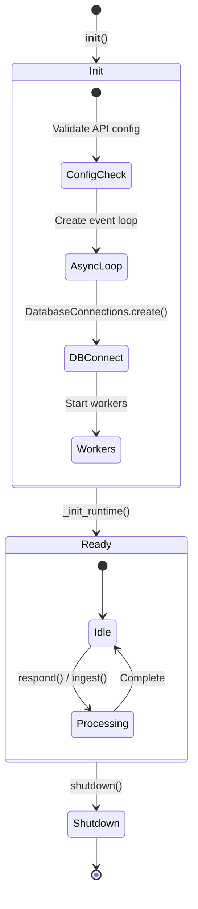
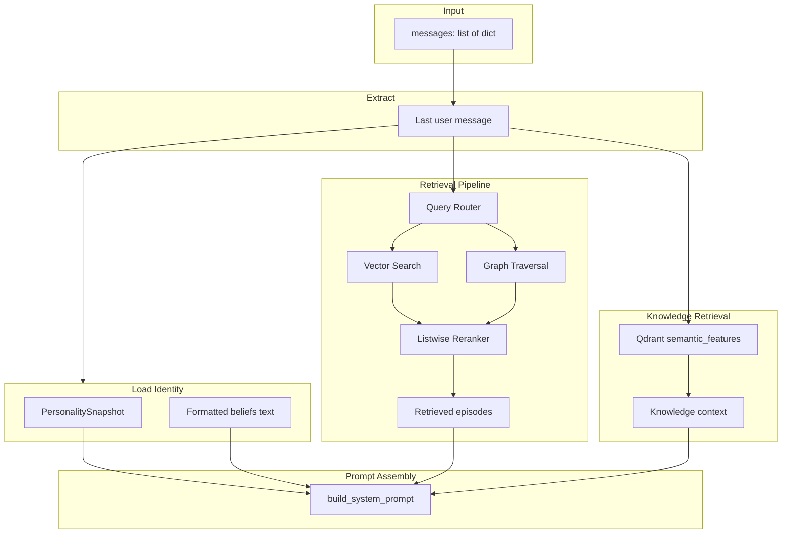
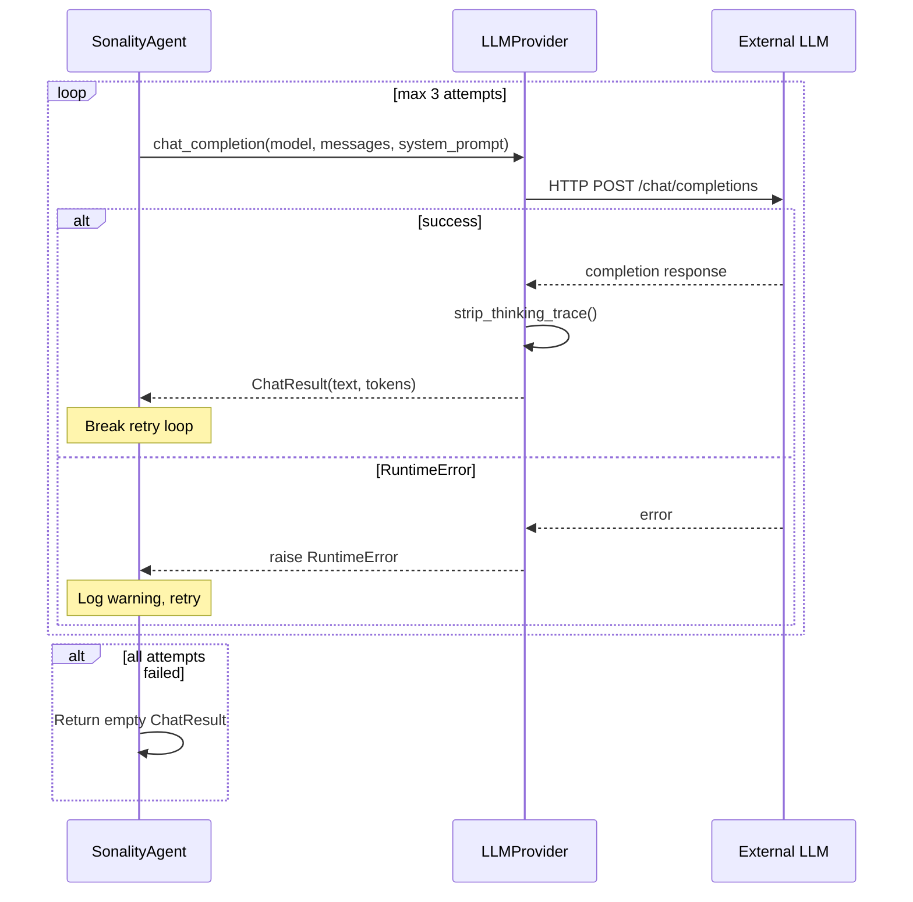
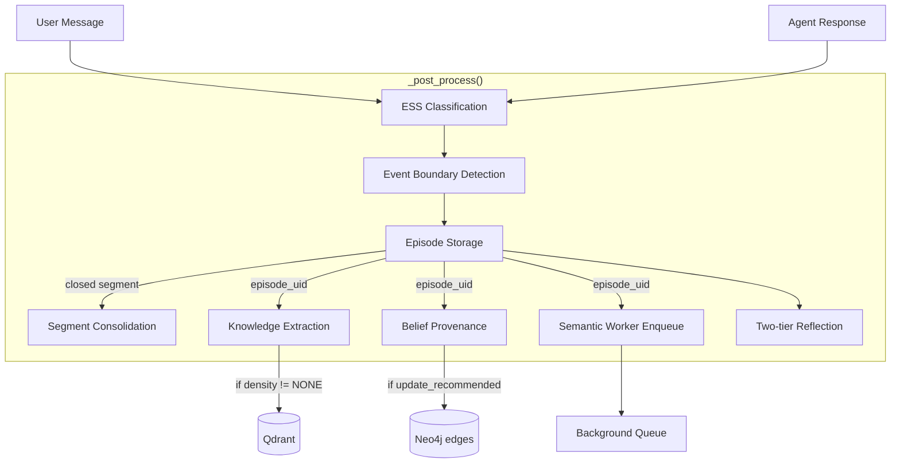
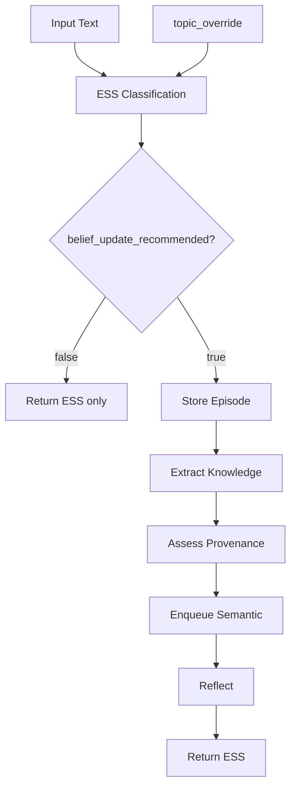
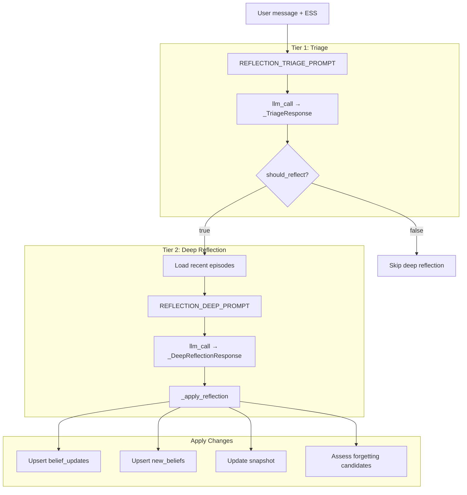
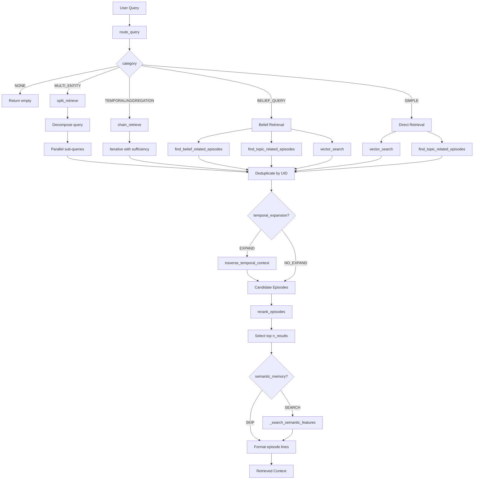
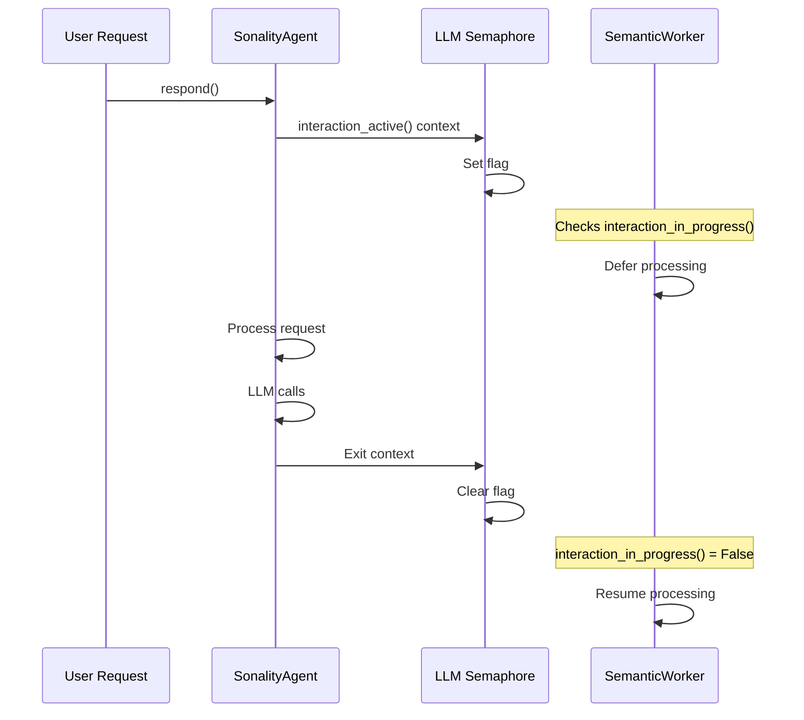

# Agent Processing Pipeline

This document provides a detailed breakdown of how `SonalityAgent` processes each interaction, from message receipt through memory persistence.

## Agent Lifecycle



## Initialization Sequence

```mermaid
sequenceDiagram
    participant Main as Main Thread
    participant Loop as Async Event Loop
    participant DB as DatabaseConnections
    participant Graph as MemoryGraph
    participant Dual as DualEpisodeStore
    participant Sem as SemanticWorker

    Main->>Loop: Create new event loop
    Main->>Main: Start loop thread (daemon)
    Main->>Loop: _init_runtime()
    
    Loop->>DB: DatabaseConnections.create()
    DB->>DB: Connect Neo4j driver
    DB->>DB: Connect Qdrant client
    DB->>DB: Apply schemas
    DB-->>Loop: connections ready
    
    Loop->>Graph: MemoryGraph(neo4j_driver)
    Loop->>Dual: DualEpisodeStore(graph, qdrant, embedder)
    Loop->>Graph: get_last_episode_uid()
    Graph-->>Loop: last_uid
    Loop->>Dual: restore_last_episode(last_uid)
    
    Loop-->>Main: runtime initialized
    
    Main->>Main: EventBoundaryDetector()
    Main->>Graph: get_latest_segment_counter()
    Main->>Sem: SemanticIngestionWorker(qdrant_url, embedder)
    Main->>Sem: start()
```

## Response Pipeline (`respond`)

The response pipeline processes conversational messages through multiple stages.

### Stage 1: Context Assembly



### Stage 2: LLM Generation



### Stage 3: Post-Processing



### Post-Processing Detail

| Step | Condition | Action |
|------|-----------|--------|
| **ESS Classification** | Always | Classify user message quality (score, reasoning_type, topics) |
| **Boundary Detection** | Always | Check if conversation segment has ended |
| **Episode Storage** | Always | Store turn in dual-store (Neo4j + Qdrant) |
| **Segment Consolidation** | If segment closed | Summarize and consolidate closed segment |
| **Knowledge Extraction** | If `knowledge_density != NONE` | Extract propositions to Qdrant |
| **Belief Provenance** | If `belief_update_recommended` | Create SUPPORTS/CONTRADICTS edges |
| **Semantic Enqueue** | Always | Queue for background feature extraction |
| **Reflection** | Always (but gated) | Two-tier: triage → optional deep update |

## Ingest Pipeline (`ingest`)

Non-conversational data ingestion (news, articles, social media) follows a simpler path.



## Two-Tier Reflection System

Reflection balances update frequency against LLM cost through a triage gate.



### Triage Response Schema

```python
class _TriageResponse(BaseModel):
    should_reflect: bool = False
    reason: str = ""
```

### Deep Reflection Response Schema

```python
class _DeepReflectionResponse(BaseModel):
    belief_updates: list[_BeliefPatch]  # Updates to existing beliefs
    new_beliefs: list[_BeliefPatch]      # New beliefs to create
    snapshot_revision: str = ""          # New personality narrative
    snapshot_changed: bool = False       # Whether to apply snapshot

class _BeliefPatch(BaseModel):
    topic: str = ""
    valence: float = 0.0        # -1.0 to +1.0
    confidence: float = 0.5     # 0.0 to 1.0
    belief_text: str = ""       # Descriptive text
    reasoning: str = ""         # Why this update
```

## Retrieval Pipeline Detail



### Query Categories and Strategies

| Category | Strategy | Use Case |
|----------|----------|----------|
| `NONE` | Skip retrieval | Greetings, meta-questions |
| `SIMPLE` | Vector + topic search | Direct factual questions |
| `TEMPORAL` | Chain-of-query iterative | "What happened after X?" |
| `MULTI_ENTITY` | Query decomposition | "Compare X and Y" |
| `AGGREGATION` | Chain with sufficiency | "Summarize all views on X" |
| `BELIEF_QUERY` | Belief edges + topics + vectors | "What do you think about X?" |

### Depth-to-Count Mapping

| Depth | n_results |
|-------|-----------|
| `MINIMAL` | 2 |
| `MODERATE` | 7 |
| `DEEP` | 15 |

## Interaction Semaphore

The agent uses a semaphore to manage LLM load and coordinate with background workers.



## Error Handling

| Component | Error | Recovery |
|-----------|-------|----------|
| LLM Generation | RuntimeError | Retry up to 3 times, return empty on failure |
| ESS Classification | Exception | Use `classifier_exception_fallback()` |
| Episode Storage | EpisodeStorageError | Log error, continue without episode |
| Knowledge Extraction | Exception | Log warning, continue |
| Provenance Assessment | Exception | Log exception, continue |
| Reflection | Exception | Log warning, skip reflection |
| Forgetting | Exception | Log warning, skip forgetting cycle |

## Performance Instrumentation

Every `respond()` call logs timing:

```python
log.info("Total: %.1fs", time.perf_counter() - _t0)
```

Key metrics tracked:
- Context assembly time
- LLM wall time
- Post-processing time
- Individual component times via debug logs
