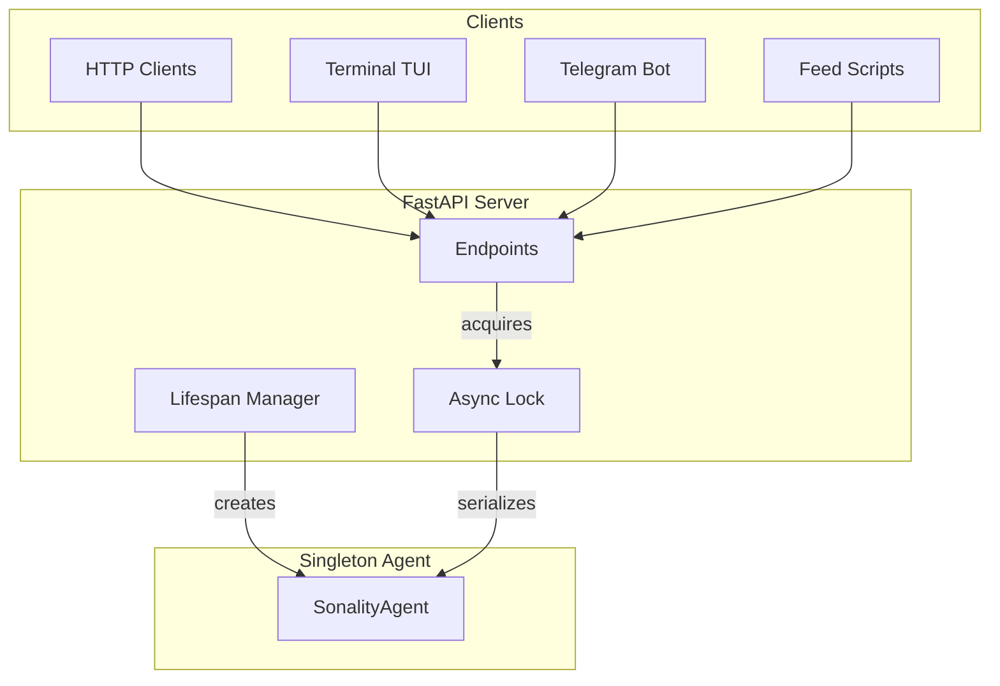
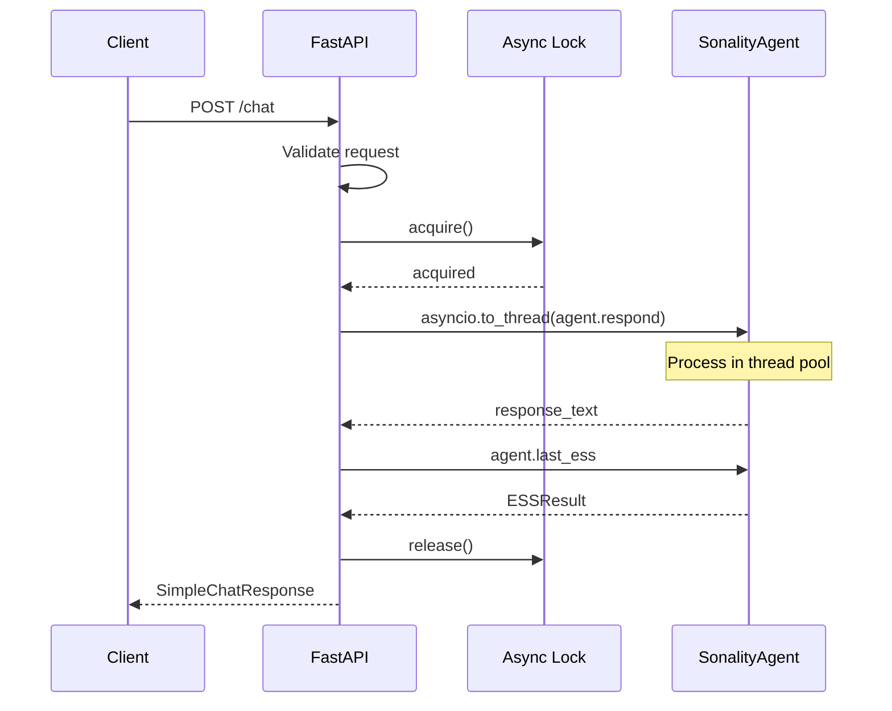

# API Layer Deep Dive

This document covers Sonality's FastAPI server, all endpoints, request/response schemas, and the singleton agent architecture.

## Architecture Overview



## Singleton Pattern

The API uses a **singleton agent** with an **async lock** to prevent concurrent mutation:

```python
_agent_store: dict[str, SonalityAgent] = {}
_agent_lock: asyncio.Lock | None = None

@asynccontextmanager
async def lifespan(_app: FastAPI) -> AsyncGenerator[None, None]:
    log.info("Initializing Sonality agent for API server")
    _agent_store["agent"] = SonalityAgent()
    yield
    log.info("Shutting down Sonality agent")
    agent = _agent_store.pop("agent", None)
    if agent is not None:
        agent.shutdown()
```

All mutating operations acquire the lock:

```python
async with _get_lock():
    response_text = await asyncio.to_thread(agent.respond, messages)
```

## Endpoint Reference

### OpenAI-Compatible Endpoints

#### POST `/v1/chat/completions`

OpenAI-compatible chat completions with streaming support.

**Request:**
```json
{
  "model": "sonality",
  "messages": [
    {"role": "user", "content": "Hello"}
  ],
  "temperature": 0.7,
  "max_tokens": 1024,
  "stream": false
}
```

**Response (non-streaming):**
```json
{
  "id": "chatcmpl-abc123...",
  "object": "chat.completion",
  "created": 1714160000,
  "model": "sonality",
  "choices": [
    {
      "index": 0,
      "message": {"role": "assistant", "content": "Hello! How can I help?"},
      "finish_reason": "stop"
    }
  ],
  "usage": {
    "prompt_tokens": 10,
    "completion_tokens": 15,
    "total_tokens": 25
  }
}
```

**Streaming Response (SSE):**
```
data: {"id":"chatcmpl-...","object":"chat.completion.chunk","created":...,"model":"sonality","choices":[{"index":0,"delta":{"content":"Hello"},"finish_reason":null}]}

data: {"id":"chatcmpl-...","object":"chat.completion.chunk","created":...,"model":"sonality","choices":[{"index":0,"delta":{},"finish_reason":"stop"}]}

data: [DONE]
```

#### GET `/v1/models`

List available models.

**Response:**
```json
{
  "object": "list",
  "data": [
    {"id": "sonality", "object": "model", "created": 1714160000, "owned_by": "sonality"}
  ]
}
```

#### GET `/v1/models/{model_id}`

Get model details.

**Response:**
```json
{"id": "sonality", "object": "model", "created": 1714160000, "owned_by": "sonality"}
```

### Simple Chat Endpoint

#### POST `/chat`

Simpler interface for single-turn or multi-turn chat.

**Request:**
```json
{
  "message": "What do you think about climate change?",
  "context": [
    {"role": "user", "content": "Previous message"},
    {"role": "assistant", "content": "Previous response"}
  ]
}
```

**Response:**
```json
{
  "response": "I believe climate change is...",
  "ess_score": 0.72,
  "reasoning_type": "logical_argument",
  "topics": ["climate change", "environment"]
}
```

### Sonality-Specific Endpoints

#### POST `/ingest`

Non-conversational data ingestion for news, articles, social media.

**Request:**
```json
{
  "text": "[News/BBC] Climate report shows...",
  "topic_override": "climate_policy"
}
```

**Response:**
```json
{
  "success": true,
  "score": 0.68,
  "reasoning_type": "news_report",
  "belief_update_recommended": true,
  "urgency": "standard",
  "topics": ["climate_policy", "environment"],
  "summary": "BBC report indicates global temperatures..."
}
```

#### GET `/beliefs`

Retrieve all current beliefs sorted by absolute valence.

**Response:**
```json
[
  {
    "topic": "climate change",
    "valence": 0.72,
    "confidence": 0.85,
    "evidence_count": 12,
    "uncertainty": 0.15,
    "belief_text": "Strong evidence supports..."
  }
]
```

#### GET `/beliefs/{topic}`

Retrieve a specific belief by topic.

**Response:**
```json
{
  "topic": "climate change",
  "valence": 0.72,
  "confidence": 0.85,
  "evidence_count": 12,
  "uncertainty": 0.15,
  "belief_text": "Strong evidence supports..."
}
```

**Error (404):**
```json
{"detail": "No belief for topic: unknown_topic"}
```

#### GET `/health`

Health check endpoint (also available at `/v1/health`).

**Response:**
```json
{
  "belief_count": 15,
  "snapshot_version": 42
}
```

## Request Flow



## Streaming Implementation

Streaming uses Server-Sent Events (SSE):

```python
async def generate() -> AsyncIterator[str]:
    async with _get_lock():
        loop = asyncio.get_event_loop()
        stream_iter = await loop.run_in_executor(None, agent.respond_stream, messages)
        for content, reasoning in stream_iter:
            delta = {
                k: v
                for k, v in [("content", content), ("reasoning_content", reasoning)]
                if v
            }
            if delta:
                yield sse_chunk(delta)
    yield sse_chunk({}, "stop")
    yield "data: [DONE]\n\n"

return StreamingResponse(generate(), media_type="text/event-stream")
```

## Pydantic Schemas

### Chat Models

```python
class ChatMessage(BaseModel):
    role: ChatRole  # system, user, assistant
    content: str

class ChatCompletionRequest(BaseModel):
    model: str = "sonality"
    messages: list[ChatMessage]
    temperature: float = 0.7  # 0.0-2.0
    max_tokens: int = 1024    # 1-8192
    stream: bool = False

class ChatCompletionChoice(BaseModel):
    index: int
    message: ChatMessage
    finish_reason: str  # "stop"

class ChatCompletionUsage(BaseModel):
    prompt_tokens: int
    completion_tokens: int
    total_tokens: int

class ChatCompletionResponse(BaseModel):
    id: str
    object: str = "chat.completion"
    created: int
    model: str
    choices: list[ChatCompletionChoice]
    usage: ChatCompletionUsage
```

### Ingest Models

```python
class IngestRequest(BaseModel):
    text: str
    topic_override: str = ""

class IngestResponse(BaseModel):
    success: bool
    score: float
    reasoning_type: ReasoningType
    belief_update_recommended: bool
    urgency: UrgencyLevel
    topics: list[str]
    summary: str
```

### Belief Models

```python
class BeliefResponse(BaseModel):
    topic: str
    valence: float
    confidence: float
    evidence_count: int
    uncertainty: float
    belief_text: str

    @classmethod
    def from_node(cls, b: BeliefNode) -> BeliefResponse:
        return cls(
            topic=b.topic, valence=b.valence, confidence=b.confidence,
            evidence_count=b.evidence_count, uncertainty=b.uncertainty,
            belief_text=b.belief_text,
        )
```

## Server CLI

```bash
sonality-server [--host HOST] [--port PORT] [--reload] [--log-level LEVEL]
```

**Options:**
| Flag | Default | Description |
|------|---------|-------------|
| `--host` | `0.0.0.0` | Bind address |
| `--port` | `8000` | Bind port |
| `--reload` | `false` | Enable auto-reload |
| `--log-level` | `info` | Log verbosity |

**Environment override:** `SONALITY_LOG_LEVEL`

## Error Handling

| Status | Condition |
|--------|-----------|
| `400` | No user message in chat request |
| `404` | Belief topic not found |
| `503` | Agent not initialized |

## Token Estimation

Token counts are estimated (not precise):

```python
prompt_tokens = sum(len(m.content.split()) for m in request.messages) * 4 // 3
completion_tokens = len(response_text.split()) * 4 // 3
```

## CORS and Security

The default configuration does not enable CORS. For cross-origin requests, configure CORS middleware:

```python
from fastapi.middleware.cors import CORSMiddleware

app.add_middleware(
    CORSMiddleware,
    allow_origins=["*"],
    allow_methods=["*"],
    allow_headers=["*"],
)
```
