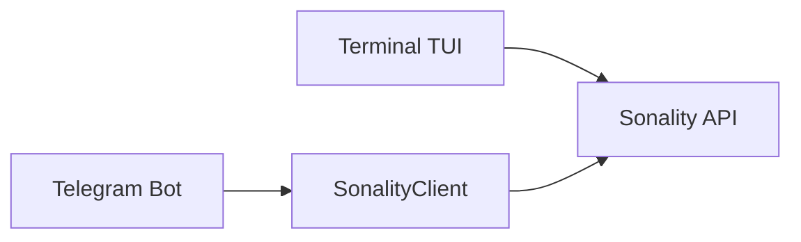

# Chat Clients

> **Modules**: `chat/client.py`, `chat/telegram.py`, `chat/terminal.py`

## Overview



## SonalityClient

Async HTTP client managing conversation history.

```python
client = SonalityClient(max_history=40)
response = await client.chat("Hello")
print(response.content)
```

| Method | Purpose |
|--------|---------|
| `chat(message)` | Send message, return `ChatResponse` |
| `clear()` | Reset history |

## Terminal TUI

Rich-based REPL with markdown rendering.

```bash
make chat
# or: uv run python -m chat.terminal
```

| Command | Action |
|---------|--------|
| `/clear` | Clear history |
| `/beliefs` | Show beliefs |
| `/snapshot` | Show personality |
| `/exit` | Quit |

## Telegram Bot

aiogram-based bot with voice support via Speaches API.

```bash
# .env
TELEGRAM_BOT_TOKEN=...
SPEACHES_BASE_URL=http://speaches:8001

make telegram
```

### Voice Pipeline

```
Audio → Speaches STT → Sonality → Speaches TTS → Audio
```

| Format | Notes |
|--------|-------|
| Input | ogg/opus (Telegram native) |
| STT | Whisper via Speaches |
| TTS | mp3 → ogg_opus conversion |

## Audio Processing

```python
from chat.audio import AudioProcessor

processor = AudioProcessor()
text = await processor.transcribe(audio_bytes)
audio = await processor.synthesize(text)
```
