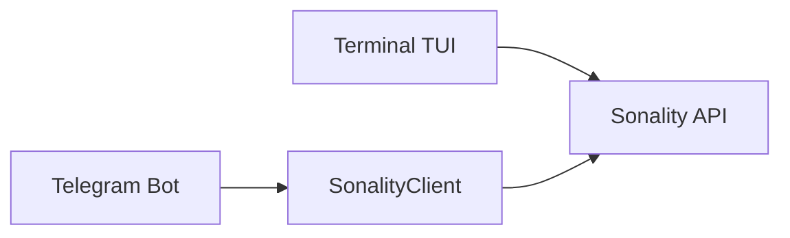

# Chat Clients

> **Modules**: `chat/client.py`, `chat/telegram.py`, `chat/terminal.py`

## Overview



## SonalityClient

Async HTTP client managing conversation history. Streams responses via SSE and yields `ProgressEvent` for agent progress alongside `str` content deltas.

```python
client = SonalityClient(max_history=40)
async for item in client.chat_stream("Hello"):
    if isinstance(item, str):
        print(item, end="")
```

| Method | Purpose |
|--------|---------|
| `chat_stream(message)` | Stream response, yield `str \| ProgressEvent` |
| `clear_history()` | Reset conversation history |
| `health()` | Return `HealthStatus` (belief count, snapshot version) |
| `beliefs()` | Return all `Belief` nodes |
| `close()` | Close the underlying HTTP client |

## Progress Events

During streaming, the agent emits `ProgressEvent` objects for each cognitive step. These allow UIs to show real-time status.

| Event type | When emitted |
|------------|-------------|
| `thinking` | Each agentic loop step starts |
| `tool_call` | Agent invokes a tool (name + args in event) |
| `tool_result` | Tool returns (summary + source count in event) |
| `context_build` | Identity loaded, system prompt built |
| `reviewing` | Quorum critique cross-checking evidence |
| `summarizing` | Conversation history compressed |
| `done` | Request fully complete |

## Terminal TUI

Rich-based REPL with markdown rendering.

```bash
make chat
# or: uv run python -m chat.terminal
```

| Command | Action |
|---------|--------|
| `/beliefs` | Show beliefs |
| `/health` | Show agent health |
| `/clear` | Clear history |
| `/help` | Show commands |
| `/quit` | Quit |

## Telegram Bot

aiogram-based bot with voice support via Speaches API. Progress events are displayed as an editable status message with completed/current steps. Response text streams via `sendMessageDraft` (Telegram Bot API 9.3+) with automatic fallback to `editMessageText` for older API versions. A cursor indicator (`▌`) shows generation in progress.

```bash
# .env
CHAT_TELEGRAM_TOKEN=...
CHAT_SPEACHES_URL=http://speaches:8001

make telegram
```

### Voice Pipeline

```
Audio → Speaches STT → Sonality → Speaches TTS → Audio
```

| Format | Notes |
|--------|-------|
| Input | ogg/opus (Telegram native) |
| STT | Whisper via Speaches |
| TTS | mp3 → ogg_opus conversion |
