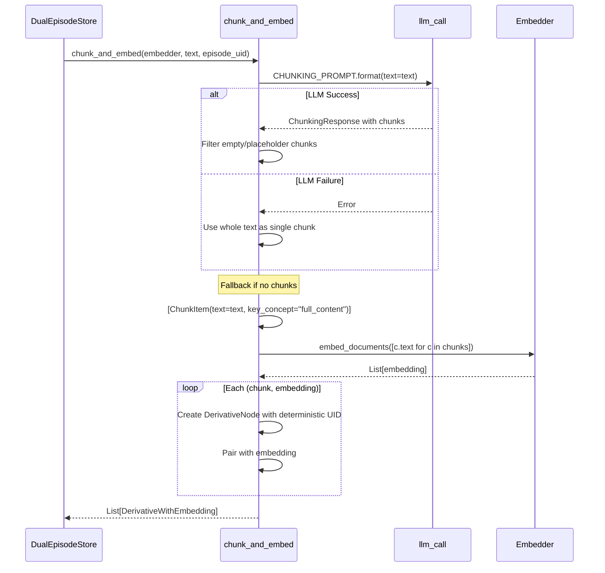
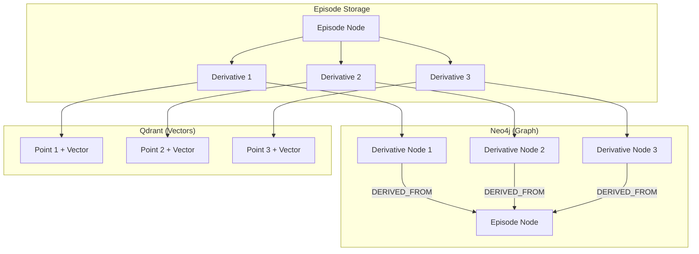
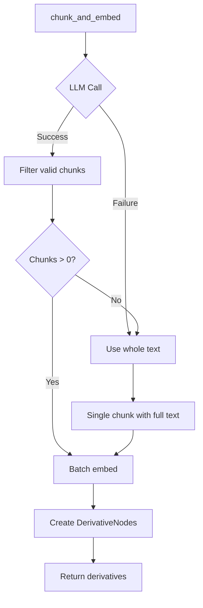

# Chunking & Derivatives Deep-Dive

> **Module**: `sonality/memory/derivatives.py`  
> **Purpose**: LLM-based semantic chunking for granular retrieval

The derivatives system implements the MemMachine-inspired derivative model, splitting episodes into semantically coherent chunks for fine-grained embedding and retrieval.

## Design Rationale

```
┌─────────────────────────────────────────────────────────────────────────┐
│                      Why Chunk Episodes?                                 │
├─────────────────────────────────────────────────────────────────────────┤
│                                                                         │
│  Problem: Whole-episode embeddings lose semantic precision              │
│  • Long conversations contain multiple distinct ideas                   │
│  • A single embedding cannot capture semantic diversity                  │
│  • Retrieval returns entire episodes when only one idea matches         │
│                                                                         │
│  Solution: Semantic chunking into derivatives                           │
│  • Each chunk = one self-contained idea (1-3 sentences)                 │
│  • Each chunk gets its own embedding vector                              │
│  • Retrieval can match specific ideas within episodes                    │
│  • Key concepts provide additional retrieval signals                     │
│                                                                         │
└─────────────────────────────────────────────────────────────────────────┘
```

## Data Structures

### ChunkItem

```python
class ChunkItem(BaseModel):
    text: str           # The chunk content (1-3 sentences)
    key_concept: str = ""  # Primary concept for this chunk
```

### ChunkingResponse

```python
class ChunkingResponse(BaseModel):
    chunks: list[ChunkItem]
    
    @model_validator(mode="before")
    @classmethod
    def normalize_chunks(cls, data: object) -> object:
        """Handle various LLM output formats."""
        if isinstance(data, list):
            return {"chunks": [x for x in data if _is_valid_chunk(x)]}
        if isinstance(data, dict) and "text" in data and "chunks" not in data:
            return {"chunks": [data]}  # Single chunk
        if isinstance(data, dict) and "chunks" in data:
            # Filter invalid chunks
            data = {"chunks": [x for x in data["chunks"] if _is_valid_chunk(x)]}
        return data

def _is_valid_chunk(x: object) -> bool:
    """Validate chunk structure."""
    if isinstance(x, ChunkItem):
        return True
    return isinstance(x, dict) and "text" in x
```

### DerivativeWithEmbedding

```python
@dataclass(frozen=True, slots=True)
class DerivativeWithEmbedding:
    """A derivative chunk with its pre-computed dense embedding."""
    node: DerivativeNode   # Neo4j node data
    embedding: list[float] # 1024-dim vector
```

### DerivativeNode (from graph.py)

```python
@dataclass(frozen=True, slots=True)
class DerivativeNode:
    uid: str                    # Deterministic UUID
    source_episode_uid: str     # Parent episode
    text: str                   # Chunk content
    key_concept: str            # Primary concept
    sequence_num: int           # Order within episode
```

## Chunking Flow



## Main Function

```python
def chunk_and_embed(embedder: Embedder, text: str, episode_uid: str) -> list[DerivativeWithEmbedding]:
    """Split text into semantic chunks and embed each one."""
    
    # LLM-based chunking
    result = llm_call(
        prompt=CHUNKING_PROMPT.format(text=text),
        response_model=ChunkingResponse,
        fallback=ChunkingResponse(chunks=[]),
        max_tokens=config.LLM_MAX_TOKENS,
        max_retries=1,
        assistant_prefix='{"chunks": [',
    )
    
    if result.success:
        # Filter out empty chunks and placeholder text
        chunks = [c for c in result.value.chunks 
                  if c.text.strip() and c.text.strip() != "..."]
    else:
        log.warning("LLM chunking failed: %s. Using whole text.", result.error)
        chunks = []
    
    # Fallback: use entire text as single chunk
    if not chunks:
        chunks = [ChunkItem(text=text, key_concept="full_content")]
    
    # Batch embed all chunks
    texts = [c.text for c in chunks]
    embeddings = embedder.embed_documents(texts)
    
    # Create derivative nodes with deterministic UIDs
    derivatives: list[DerivativeWithEmbedding] = []
    for i, (chunk, emb) in enumerate(zip(chunks, embeddings, strict=True)):
        node = DerivativeNode(
            uid=str(uuid.uuid5(uuid.NAMESPACE_OID, f"{episode_uid}:{i}")),
            source_episode_uid=episode_uid,
            text=chunk.text,
            key_concept=chunk.key_concept,
            sequence_num=i,
        )
        derivatives.append(DerivativeWithEmbedding(node=node, embedding=emb))
    
    log.debug("Chunked episode %s into %d derivatives", episode_uid[:8], len(derivatives))
    return derivatives
```

## Deterministic UIDs

Derivative UIDs are deterministic based on episode UID and sequence:

```python
uid = str(uuid.uuid5(uuid.NAMESPACE_OID, f"{episode_uid}:{i}"))
```

This ensures:
- Same input always produces same UID
- Idempotent re-processing
- Predictable references between stores

## LLM Prompt

```python
CHUNKING_PROMPT = """
Split this text into semantically coherent chunks for memory retrieval.

Text:
{text}

Rules:
- Each chunk is a self-contained idea (1-3 sentences)
- Maximum 15 chunks
- importance: high (key claim/fact), medium (supporting detail), low (context only)

Output ONLY a JSON object with real chunks from the text above. 
NEVER output "..." or bracket placeholders as values.

Example format: 
{"chunks": [
  {"text": "The Eiffel Tower was completed in 1889 and stands 330 meters tall.", 
   "key_concept": "Eiffel Tower construction", 
   "importance": "high"},
  {"text": "It was the tallest man-made structure in the world for 41 years.", 
   "key_concept": "Eiffel Tower records", 
   "importance": "medium"}
]}
"""
```

## Chunk Quality Rules

| Rule | Rationale |
|------|-----------|
| Self-contained | Chunk must be understandable without context |
| 1-3 sentences | Optimal semantic granularity |
| Max 15 chunks | Prevent over-fragmentation |
| Key concept required | Provides retrieval signal |
| No placeholders | Ensures real content |

## Storage Architecture



## Neo4j Schema

```cypher
-- Derivative node
CREATE (d:Derivative {
    uid: $uid,
    source_episode_uid: $source_uid,
    text: $text,
    key_concept: $key_concept,
    sequence_num: $seq
})

-- Link to episode
MATCH (e:Episode {uid: $episode_uid})
CREATE (d)-[:DERIVED_FROM]->(e)
```

## Qdrant Point Structure

```python
PointStruct(
    id=d.node.uid,                    # Same as Neo4j UID
    vector={DENSE_VECTOR: d.embedding}, # 1024-dim
    payload={
        "uid": d.node.uid,
        "episode_uid": d.node.source_episode_uid,
        "text": d.node.text,
        "key_concept": d.node.key_concept,
        "sequence_num": d.node.sequence_num,
        "archived": False,
        "created_at": created_at,
    },
)
```

## Retrieval Flow

When retrieving, the system:

1. **Vector search** against derivative embeddings
2. **Group** results by `episode_uid`
3. **Fetch** full episode nodes from Neo4j
4. **Rerank** episodes (not derivatives)

```python
# In DualEpisodeStore.vector_search()
async def vector_search(self, query: str, top_k: int = 20) -> list[SearchHit]:
    query_embedding = await asyncio.to_thread(self._embedder.embed_query, query)
    response = await self._qdrant.query_points(
        collection_name=Collection.DERIVATIVES,
        query=query_embedding,
        using=DENSE_VECTOR,
        query_filter=Filter(
            must=[FieldCondition(key="archived", match=MatchValue(value=False))]
        ),
        limit=top_k,
        with_payload=True,
        # ...
    )
    # Return derivative matches with episode UIDs
    return [SearchHit(uid, episode_uid, score) for ...]
```

## Fallback Strategy



The system never fails to produce derivatives:
- LLM failure → use whole text
- Empty chunks → use whole text
- Placeholder text → filter out, fallback if empty

## Example Chunking

**Input:**
```
User: I think nuclear energy is essential for decarbonization. The IPCC 
reports show that nuclear has the lowest lifecycle CO2 emissions of any 
baseload power source. France generates 70% of its electricity from nuclear 
and has one of the cleanest grids in Europe.
```

**Output Chunks:**
```json
{
  "chunks": [
    {
      "text": "Nuclear energy is considered essential for decarbonization efforts.",
      "key_concept": "nuclear decarbonization",
      "importance": "high"
    },
    {
      "text": "According to IPCC reports, nuclear power has the lowest lifecycle CO2 emissions among baseload power sources.",
      "key_concept": "nuclear emissions data",
      "importance": "high"
    },
    {
      "text": "France generates 70% of its electricity from nuclear power and has one of the cleanest electrical grids in Europe.",
      "key_concept": "France nuclear grid",
      "importance": "medium"
    }
  ]
}
```

## Performance Characteristics

| Metric | Typical Value |
|--------|---------------|
| Chunks per episode | 2-8 |
| Chunk length | 20-80 tokens |
| Embedding dimensions | 1024 |
| Embedding time | ~50ms per chunk (batched) |
| LLM chunking time | ~1-3s |

## Related Documentation

- [Dual Store Operations](dual-store-operations.md) - How derivatives are stored
- [Database Schema](database-schema.md) - Derivative node schema
- [Retrieval Pipeline](retrieval-pipeline.md) - How derivatives are searched
- [Memory Subsystem](memory-subsystem.md) - Overall memory architecture