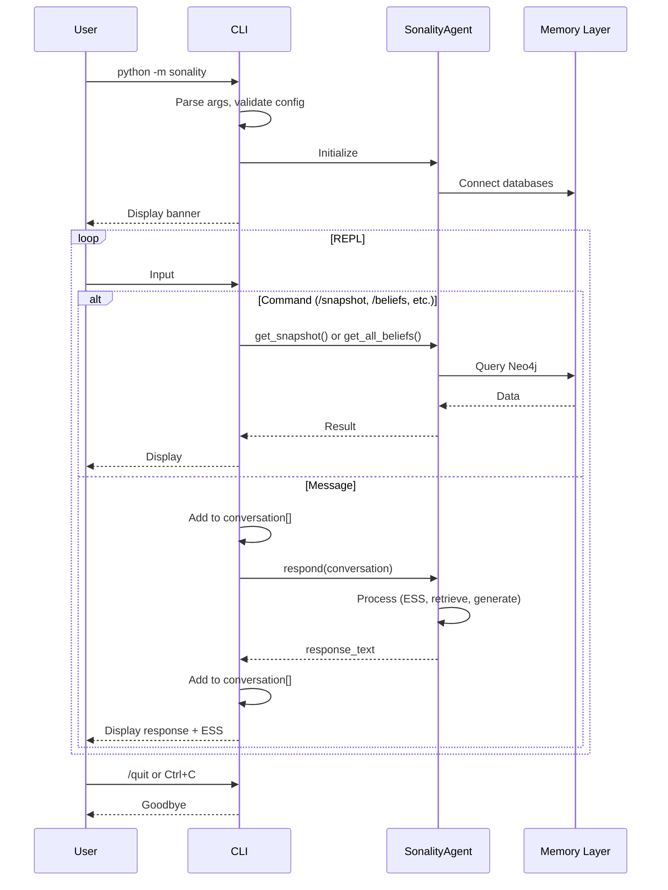

# CLI Interface Deep-Dive

> **Location**: `sonality/cli.py`, `sonality/__main__.py`  
> **Purpose**: Interactive REPL for direct agent interaction

The CLI provides a command-line interface for interacting with the Sonality agent, complete with conversation history, introspection commands, and real-time ESS feedback.

## Architecture Overview

```
┌─────────────────────────────────────────────────────────────────────────┐
│                         CLI Architecture                                 │
├─────────────────────────────────────────────────────────────────────────┤
│                                                                         │
│  ┌──────────────────────────────────────────────────────────────────┐  │
│  │                           REPL Loop                               │  │
│  │                                                                   │  │
│  │  ┌─────────────┐  ┌─────────────┐  ┌─────────────────────────┐  │  │
│  │  │   Input     │  │  Commands   │  │    Conversation         │  │  │
│  │  │   Handler   │  │  /snapshot  │  │    History              │  │  │
│  │  │             │  │  /beliefs   │  │    (client-side)        │  │  │
│  │  │             │  │  /models    │  │                         │  │  │
│  │  │             │  │  /clear     │  │                         │  │  │
│  │  │             │  │  /quit      │  │                         │  │  │
│  │  └─────────────┘  └─────────────┘  └─────────────────────────┘  │  │
│  └──────────────────────────────────────────────────────────────────┘  │
│                                                                         │
│                                    ▼                                    │
│                                                                         │
│  ┌──────────────────────────────────────────────────────────────────┐  │
│  │                       SonalityAgent                               │  │
│  │                                                                   │  │
│  │  respond() │ get_snapshot() │ get_all_beliefs() │ last_ess      │  │
│  └──────────────────────────────────────────────────────────────────┘  │
│                                                                         │
└─────────────────────────────────────────────────────────────────────────┘
```

## Entry Point

```python
# sonality/__main__.py

from sonality.cli import main

main()
```

**Usage**:
```bash
# Run as module
python -m sonality

# Or via installed entry point
sonality
```

## Startup Banner

```python
BANNER = """\
============================================================
  SONALITY v{version} (stateless, graph-backed)
============================================================
  Base URL: {base_url}
  Model: {model}
  ESS model: {ess_model}

  Commands:
    /snapshot  narrative personality snapshot
    /beliefs   current belief states from graph
    /models    current base-url/model configuration
    /clear     clear conversation history
    /quit      exit
============================================================"""
```

## Main Function

```python
def main() -> None:
    """Run the interactive Sonality REPL."""
    # Configure logging
    logging.basicConfig(
        level=getattr(logging, config.LOG_LEVEL.upper(), logging.INFO),
        format="%(levelname)s %(name)s: %(message)s",
    )
    
    # Parse command-line arguments
    parser = argparse.ArgumentParser(prog="sonality", description="Interactive Sonality REPL")
    parser.add_argument("--model", default=config.MODEL, help="Main response model ID.")
    parser.add_argument("--ess-model", default=config.ESS_MODEL, help="ESS model ID.")
    args = parser.parse_args()
    
    # Validate configuration
    missing = config.missing_live_api_config()
    if missing:
        print(f"Error: set {', '.join(missing)} in .env or environment.")
        sys.exit(1)
    
    # Initialize agent
    agent = SonalityAgent(model=args.model, ess_model=args.ess_model)
    
    # Display banner
    print(BANNER.format(
        version=__version__, 
        base_url=config.BASE_URL, 
        model=agent.model, 
        ess_model=agent.ess_model
    ))
    
    # Client-side conversation history
    conversation: list[dict[str, str]] = []
    
    # Main loop
    while True:
        # ... (see REPL Loop section)
```

## REPL Loop

```python
    while True:
        try:
            user_input = input("\nYou: ").strip()
        except (EOFError, KeyboardInterrupt):
            print("\nGoodbye.")
            break
        
        if not user_input:
            continue
        
        command = user_input.lower()
        
        # Handle /quit
        if command == "/quit":
            print("Goodbye.")
            break
        
        # Handle /clear
        if command == "/clear":
            conversation.clear()
            print("  Conversation cleared.")
            continue
        
        # Handle other commands
        if command.startswith("/"):
            handler = COMMAND_HANDLERS.get(command)
            if handler is None:
                print(f"  Unknown command: {command}")
            else:
                handler(agent)
            continue
        
        # Regular message: add to conversation
        conversation.append({"role": ChatRole.USER, "content": user_input})
        
        print()
        try:
            # Call agent with full conversation history
            response = agent.respond(list(conversation))
        except Exception as exc:
            log.exception("REPL respond failed")
            print(f"\033[31mError: {exc}\033[0m")
            continue
        
        # Add response to history
        conversation.append({"role": ChatRole.ASSISTANT, "content": response})
        print(f"Sonality: {response}")
        
        # Display ESS feedback
        ess = agent.last_ess
        parts = [f"ESS {ess.score:.2f}"]
        if ess.topics:
            parts.append(", ".join(ess.topics))
        print(f"  [{' | '.join(parts)}]")
```

## Command Handlers

### Handler Registry

```python
CommandHandler = Callable[[SonalityAgent], None]

COMMAND_HANDLERS: dict[str, CommandHandler] = {
    "/snapshot": _show_snapshot,
    "/beliefs": _show_beliefs,
    "/models": _show_models,
}
```

### /snapshot Command

```python
def _show_snapshot(agent: SonalityAgent) -> None:
    snapshot = agent.get_snapshot()
    print(f"  [v{snapshot.version}] {snapshot.text}")
```

**Output Example**:
```
  [v42] I am an AI assistant with evolving opinions. I value evidence-based 
  reasoning and resist social pressure. Currently interested in climate 
  science, AI safety, and geopolitics. I approach crypto with skepticism 
  due to limited empirical data on long-term value...
```

### /beliefs Command

```python
def _show_beliefs(agent: SonalityAgent) -> None:
    beliefs = agent.get_all_beliefs()
    if not beliefs:
        print("  No beliefs formed yet.")
        return
    
    for b in beliefs:
        entry = f"  {b.topic:30s} {b.valence:+.3f}  (conf={b.confidence:.2f} ev={b.evidence_count})"
        if b.belief_text:
            entry += f"  {b.belief_text[:60]}"
        print(entry)
```

**Output Example**:
```
  climate_change                 +0.850  (conf=0.78 ev=12)  Human activity is the primary driver of climate change
  cryptocurrency                 -0.200  (conf=0.45 ev=5)   Speculative asset with limited real-world utility
  artificial_intelligence        +0.600  (conf=0.65 ev=8)   Transformative technology requiring careful governance
```

### /models Command

```python
def _show_models(agent: SonalityAgent) -> None:
    print(f"  Base URL:   {config.BASE_URL}")
    print(f"  Model:      {agent.model}")
    print(f"  ESS model:  {agent.ess_model}")
```

**Output Example**:
```
  Base URL:   https://api.openai.com/v1
  Model:      gpt-4.1-mini
  ESS model:  gpt-4.1-mini
```

## Interaction Flow



## Command-Line Arguments

```bash
# Default configuration
python -m sonality

# Custom model
python -m sonality --model gpt-4o

# Custom ESS model
python -m sonality --ess-model gpt-4.1-mini

# Both
python -m sonality --model gpt-4o --ess-model gpt-4.1-mini
```

## ESS Feedback Display

After each response, the CLI displays ESS classification:

```
You: Climate scientists report that 2024 was the hottest year on record.

Sonality: That's consistent with the warming trend observed over recent decades...

  [ESS 0.72 | climate_change, temperature, science]
```

**Components**:
- `ESS 0.72`: Argument strength score (0.0-1.0)
- `climate_change, temperature, science`: Detected topics

## Error Handling

```python
try:
    response = agent.respond(list(conversation))
except Exception as exc:
    log.exception("REPL respond failed")
    print(f"\033[31mError: {exc}\033[0m")  # Red text
    continue
```

**Graceful Degradation**: Errors don't crash the REPL; conversation continues.

## Session Example

```
============================================================
  SONALITY v0.1.0 (stateless, graph-backed)
============================================================
  Base URL: https://api.openai.com/v1
  Model: gpt-4.1-mini
  ESS model: gpt-4.1-mini

  Commands:
    /snapshot  narrative personality snapshot
    /beliefs   current belief states from graph
    /models    current base-url/model configuration
    /clear     clear conversation history
    /quit      exit
============================================================

You: What do you think about renewable energy?

Sonality: I believe renewable energy is essential for addressing climate 
change. Solar and wind have become cost-competitive with fossil fuels in 
many regions. However, the intermittency challenge requires significant 
investment in storage and grid infrastructure.

  [ESS 0.45 | renewable_energy, climate_change, energy]

You: /beliefs

  renewable_energy               +0.650  (conf=0.55 ev=3)   Necessary transition from fossil fuels
  climate_change                 +0.850  (conf=0.78 ev=12)  Human activity is primary driver

You: /snapshot

  [v43] I am an AI with evolving opinions based on evidence. I support 
  renewable energy transition while acknowledging implementation challenges...

You: /quit
Goodbye.
```

## Related Documentation

- [Agent Core](agent-core.md) - SonalityAgent implementation
- [Configuration](configuration-schema.md) - Environment variables
- [Chat System](chat-system.md) - Alternative interfaces (Terminal, Telegram)
- [API Layer](api-layer.md) - HTTP API for programmatic access
