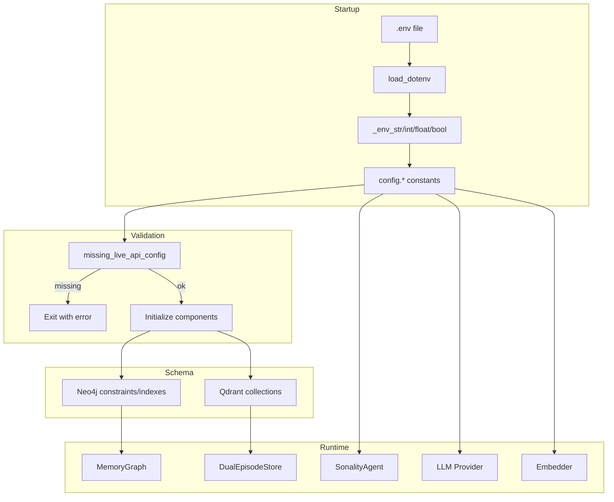

# Configuration & Schema Deep-Dive

> **Location**: `sonality/config.py`, `sonality/schema.py`  
> **Purpose**: Centralized configuration and database schema definitions

This document provides a comprehensive analysis of the configuration system and schema definitions that underpin the entire Sonality system.

## Architecture Overview

```
┌─────────────────────────────────────────────────────────────────────────┐
│                    Configuration & Schema Layer                          │
├─────────────────────────────────────────────────────────────────────────┤
│                                                                         │
│  ┌──────────────────────────────────┐  ┌──────────────────────────────┐│
│  │          config.py               │  │          schema.py           ││
│  │                                  │  │                              ││
│  │  • Environment loading           │  │  • Qdrant collections        ││
│  │  • Type-safe accessors           │  │  • Neo4j constraints         ││
│  │  • Database URLs                 │  │  • Vector configurations     ││
│  │  • LLM settings                  │  │  • Payload schemas           ││
│  │  • Retrieval tuning              │  │  • Enums (Collection, etc.)  ││
│  │  • Timeout configuration         │  │  • Schema initialization     ││
│  └──────────────────────────────────┘  └──────────────────────────────┘│
│                                                                         │
│                              ▼                                          │
│  ┌──────────────────────────────────────────────────────────────────┐  │
│  │                     Runtime Components                            │  │
│  │                                                                   │  │
│  │   Agent  │  Memory  │  Retrieval  │  LLM Provider  │  Embedder   │  │
│  └──────────────────────────────────────────────────────────────────┘  │
│                                                                         │
└─────────────────────────────────────────────────────────────────────────┘
```

## Configuration Module

### Environment Loading

```python
# sonality/config.py

from pathlib import Path
from dotenv import load_dotenv

PROJECT_ROOT: Final = Path(__file__).resolve().parent.parent
load_dotenv(PROJECT_ROOT / ".env")
```

**Pattern**: Auto-loads `.env` from project root on module import.

### Type-Safe Accessors

```python
def _env_str(name: str, default: str) -> str:
    """Read an environment variable as string with a default."""
    return os.environ.get(name, default)

def _env_int(name: str, default: int) -> int:
    """Read an environment variable as integer with a default."""
    return int(_env_str(name, str(default)))

def _env_float(name: str, default: float) -> float:
    """Read an environment variable as float with a default."""
    return float(_env_str(name, str(default)))

def _env_bool(name: str, default: bool) -> bool:
    """Read an environment variable as boolean with a default."""
    return _env_str(name, str(default).lower()).lower() in ("true", "1", "yes")
```

**Design**: Centralized type coercion with sensible defaults.

### Configuration Categories

#### Core Settings

```python
DATA_DIR: Final = PROJECT_ROOT / "data"
API_KEY: Final = _env_str("SONALITY_API_KEY", os.environ.get("OPENAI_API_KEY", ""))
BASE_URL: Final = _env_str("SONALITY_BASE_URL", "https://api.openai.com/v1")
MODEL: Final = _env_str("SONALITY_MODEL", "gpt-4.1-mini")
ESS_MODEL: Final = _env_str("SONALITY_ESS_MODEL", MODEL)
LOG_LEVEL: Final = _env_str("SONALITY_LOG_LEVEL", "INFO")
```

| Variable | Default | Description |
|----------|---------|-------------|
| `SONALITY_API_KEY` | `$OPENAI_API_KEY` | LLM API key (fallback to OpenAI) |
| `SONALITY_BASE_URL` | `https://api.openai.com/v1` | LLM API endpoint |
| `SONALITY_MODEL` | `gpt-4.1-mini` | Main response model |
| `SONALITY_ESS_MODEL` | `$MODEL` | ESS classification model |
| `SONALITY_LOG_LEVEL` | `INFO` | Logging verbosity |

#### Database Settings

```python
# Neo4j
NEO4J_URL: Final = _env_str("SONALITY_NEO4J_URL", "bolt://localhost:7687")
NEO4J_USER: Final = _env_str("SONALITY_NEO4J_USER", "neo4j")
NEO4J_PASSWORD: Final = _env_str("SONALITY_NEO4J_PASSWORD", "sonality_password")
NEO4J_DATABASE: Final = _env_str("SONALITY_NEO4J_DATABASE", "neo4j")

# Qdrant
QDRANT_URL: Final = _env_str("SONALITY_QDRANT_URL", "http://localhost:6333")
```

| Variable | Default | Description |
|----------|---------|-------------|
| `SONALITY_NEO4J_URL` | `bolt://localhost:7687` | Neo4j connection URL |
| `SONALITY_NEO4J_USER` | `neo4j` | Neo4j username |
| `SONALITY_NEO4J_PASSWORD` | `sonality_password` | Neo4j password |
| `SONALITY_NEO4J_DATABASE` | `neo4j` | Neo4j database name |
| `SONALITY_QDRANT_URL` | `http://localhost:6333` | Qdrant HTTP endpoint |

#### Embedding Settings

```python
EMBEDDING_DIMENSIONS: Final = 1024
EMBEDDING_MAX_CHARS: Final = _env_int("SONALITY_EMBEDDING_MAX_CHARS", 4096)

# Qdrant search tuning
QDRANT_SEARCH_EF: Final = _env_int("SONALITY_QDRANT_SEARCH_EF", 128)
QDRANT_RESCORE_QUANTIZED: Final = _env_bool("SONALITY_QDRANT_RESCORE", True)
```

| Variable | Default | Description |
|----------|---------|-------------|
| `EMBEDDING_DIMENSIONS` | `1024` | bge-large-en-v1.5 vector size |
| `SONALITY_EMBEDDING_MAX_CHARS` | `4096` | Max chars per embedding |
| `SONALITY_QDRANT_SEARCH_EF` | `128` | HNSW search ef parameter |
| `SONALITY_QDRANT_RESCORE` | `true` | Rescore quantized vectors |

#### LLM Settings

```python
FAST_LLM_MODEL: Final = _env_str("SONALITY_FAST_LLM_MODEL", ESS_MODEL)
AGENT_TEMPERATURE: Final = _env_float("SONALITY_AGENT_TEMPERATURE", 0.6)
LLM_MAX_TOKENS: Final = _env_int("SONALITY_LLM_MAX_TOKENS", 8192)
```

| Variable | Default | Description |
|----------|---------|-------------|
| `SONALITY_FAST_LLM_MODEL` | `$ESS_MODEL` | Fast/cheap model for assessments |
| `SONALITY_AGENT_TEMPERATURE` | `0.6` | Response generation temperature |
| `SONALITY_LLM_MAX_TOKENS` | `8192` | Max tokens per LLM call |

#### Retrieval Settings

```python
RETRIEVAL_MAX_ITERATIONS: Final = _env_int("SONALITY_RETRIEVAL_MAX_ITERATIONS", 3)
RETRIEVAL_CONFIDENCE_THRESHOLD: Final = _env_float("SONALITY_RETRIEVAL_CONFIDENCE_THRESHOLD", 0.8)
RETRIEVAL_OVER_FETCH_FACTOR: Final = _env_int("SONALITY_RETRIEVAL_OVER_FETCH_FACTOR", 3)
MAX_RERANK_CANDIDATES: Final = _env_int("SONALITY_MAX_RERANK_CANDIDATES", 50)
```

| Variable | Default | Description |
|----------|---------|-------------|
| `SONALITY_RETRIEVAL_MAX_ITERATIONS` | `3` | Max chain/split iterations |
| `SONALITY_RETRIEVAL_CONFIDENCE_THRESHOLD` | `0.8` | Sufficiency threshold |
| `SONALITY_RETRIEVAL_OVER_FETCH_FACTOR` | `3` | Over-fetch for reranking |
| `SONALITY_MAX_RERANK_CANDIDATES` | `50` | Max candidates to rerank |

#### Timeout Settings

```python
# Per-HTTP-request timeout for LLM calls
LLM_REQUEST_TIMEOUT: Final = _env_int("SONALITY_LLM_TIMEOUT", 300)

# Timeout for async ops dispatched from sync context
ASYNC_TIMEOUT: Final = _env_int("SONALITY_ASYNC_TIMEOUT", LLM_REQUEST_TIMEOUT * 5)
```

| Variable | Default | Description |
|----------|---------|-------------|
| `SONALITY_LLM_TIMEOUT` | `300` | Per-request LLM timeout (5 min) |
| `SONALITY_ASYNC_TIMEOUT` | `1500` | Max async operation time |

### Configuration Validation

```python
def missing_live_api_config() -> tuple[str, ...]:
    """Return required live configuration keys that are currently unset.
    
    API key is optional for local OpenAI-compatible servers (e.g., Ollama).
    """
    return ("SONALITY_BASE_URL",) if not BASE_URL.strip() else ()
```

**Usage**:
```python
missing = config.missing_live_api_config()
if missing:
    print(f"Error: set {', '.join(missing)} in .env or environment.")
    sys.exit(1)
```

## Schema Module

### Collection Definitions

```python
# sonality/schema.py

class Collection(StrEnum):
    """Qdrant collection names — single source of truth."""
    
    DERIVATIVES = "derivatives"       # Episode chunks with embeddings
    SEMANTIC_FEATURES = "semantic_features"  # Personality features
```

### Semantic Categories

```python
class SemanticCategory(StrEnum):
    """Semantic feature categories for personality extraction."""
    
    PERSONALITY = "personality"      # Core traits, values, communication style
    PREFERENCES = "preferences"      # Likes, dislikes, aesthetic preferences
    KNOWLEDGE = "knowledge"          # Facts, expertise, domain knowledge
    RELATIONSHIPS = "relationships"  # Connections, social context
```

### Chat Roles

```python
class ChatRole(StrEnum):
    """Message roles in chat completions."""
    
    SYSTEM = "system"
    USER = "user"
    ASSISTANT = "assistant"
```

### Qdrant Vector Configuration

```python
DENSE_VECTOR: Final = "dense"

_SHARED_HNSW: Final = HnswConfigDiff(
    m=16,                    # Max connections per node
    ef_construct=100,        # Construction-time search depth
    full_scan_threshold=10000,  # Switch to brute-force below this
    max_indexing_threads=0,  # Use all available
    on_disk=False,           # Keep index in RAM
)

_SHARED_QUANTIZATION: Final = ScalarQuantization(
    scalar=ScalarQuantizationConfig(
        type=ScalarType.INT8,    # 8-bit quantization
        quantile=0.99,           # Calibration quantile
        always_ram=True,         # Keep quantized in RAM
    ),
)

_SHARED_OPTIMIZERS: Final = OptimizersConfigDiff(
    indexing_threshold=20000,      # Index after this many points
    memmap_threshold=50000,        # Memory-map after this
    default_segment_number=4,      # Parallel segment count
)
```

### Collection Schemas

#### Derivatives Collection

```python
QDRANT_COLLECTIONS: Final[dict[str, dict[str, Any]]] = {
    Collection.DERIVATIVES: {
        "vectors_config": {
            DENSE_VECTOR: VectorParams(
                size=config.EMBEDDING_DIMENSIONS,  # 1024
                distance=Distance.COSINE,
                on_disk=False,
            ),
        },
        "hnsw_config": _SHARED_HNSW,
        "quantization_config": _SHARED_QUANTIZATION,
        "optimizers_config": _SHARED_OPTIMIZERS,
        "payload_schema": {
            "uid": PayloadSchemaType.KEYWORD,
            "episode_uid": PayloadSchemaType.KEYWORD,
            "text": PayloadSchemaType.TEXT,
            "key_concept": PayloadSchemaType.KEYWORD,
            "sequence_num": PayloadSchemaType.INTEGER,
            "archived": PayloadSchemaType.BOOL,
            "created_at": PayloadSchemaType.DATETIME,
        },
        "text_index_field": "text",  # Enable BM25 hybrid search
    },
    # ...
}
```

#### Semantic Features Collection

```python
    Collection.SEMANTIC_FEATURES: {
        "vectors_config": {
            DENSE_VECTOR: VectorParams(
                size=config.EMBEDDING_DIMENSIONS,
                distance=Distance.COSINE,
                on_disk=False,
            ),
        },
        "hnsw_config": _SHARED_HNSW,
        "quantization_config": _SHARED_QUANTIZATION,
        "optimizers_config": _SHARED_OPTIMIZERS,
        "payload_schema": {
            "uid": PayloadSchemaType.KEYWORD,
            "category": PayloadSchemaType.KEYWORD,      # personality/preferences/knowledge/relationships
            "tag": PayloadSchemaType.KEYWORD,
            "feature_name": PayloadSchemaType.KEYWORD,
            "value": PayloadSchemaType.TEXT,
            "episode_citations": PayloadSchemaType.KEYWORD,
            "confidence": PayloadSchemaType.FLOAT,
            "created_at": PayloadSchemaType.DATETIME,
            "updated_at": PayloadSchemaType.DATETIME,
        },
        "text_index_field": "value",
    },
```

### Neo4j Schema Statements

```python
NEO4J_SCHEMA_STATEMENTS: Final[tuple[str, ...]] = (
    # Uniqueness constraints
    "CREATE CONSTRAINT episode_uid IF NOT EXISTS FOR (e:Episode) REQUIRE e.uid IS UNIQUE",
    "CREATE CONSTRAINT derivative_uid IF NOT EXISTS FOR (d:Derivative) REQUIRE d.uid IS UNIQUE",
    "CREATE CONSTRAINT topic_name IF NOT EXISTS FOR (t:Topic) REQUIRE t.name IS UNIQUE",
    "CREATE CONSTRAINT segment_id IF NOT EXISTS FOR (s:Segment) REQUIRE s.segment_id IS UNIQUE",
    "CREATE CONSTRAINT summary_uid IF NOT EXISTS FOR (s:Summary) REQUIRE s.uid IS UNIQUE",
    "CREATE CONSTRAINT belief_topic IF NOT EXISTS FOR (b:Belief) REQUIRE b.topic IS UNIQUE",
    "CREATE CONSTRAINT identity_session IF NOT EXISTS FOR (n:PersonalitySnapshot) REQUIRE n.session_id IS UNIQUE",
    
    # Performance indexes
    "CREATE INDEX episode_created_at IF NOT EXISTS FOR (e:Episode) ON (e.created_at)",
    "CREATE INDEX episode_segment IF NOT EXISTS FOR (e:Episode) ON (e.segment_id)",
    "CREATE INDEX derivative_episode IF NOT EXISTS FOR (d:Derivative) ON (d.source_episode_uid)",
    "CREATE INDEX episode_archived_created IF NOT EXISTS FOR (e:Episode) ON (e.archived, e.created_at)",
    "CREATE INDEX episode_archived_utility IF NOT EXISTS FOR (e:Episode) ON (e.archived, e.utility_score)",
    "CREATE INDEX episode_segment_ess IF NOT EXISTS FOR (e:Episode) ON (e.segment_id, e.ess_score)",
)
```

### Schema Initialization

```python
async def init_qdrant_collections(client: AsyncQdrantClient) -> None:
    """Initialize Qdrant collections with optimized schemas."""
    from qdrant_client.models import TokenizerType
    
    for name, cfg in QDRANT_COLLECTIONS.items():
        if not await client.collection_exists(name):
            # Create collection with vector and optimization configs
            await client.create_collection(
                collection_name=name,
                vectors_config=cfg["vectors_config"],
                hnsw_config=cfg.get("hnsw_config"),
                quantization_config=cfg.get("quantization_config"),
                optimizers_config=cfg.get("optimizers_config"),
            )
            
            # Create payload indexes
            for field, schema_type in cfg["payload_schema"].items():
                await client.create_payload_index(
                    collection_name=name,
                    field_name=field,
                    field_schema=schema_type,
                )
            
            # Create text index for BM25 hybrid search
            if text_field := cfg.get("text_index_field"):
                await client.create_payload_index(
                    collection_name=name,
                    field_name=text_field,
                    field_schema=TextIndexParams(
                        type=TextIndexType.TEXT,
                        tokenizer=TokenizerType.WORD,
                        min_token_len=2,
                        max_token_len=20,
                        lowercase=True,
                    ),
                )
```

## Configuration Flow



## Environment File Example

```bash
# .env

# LLM Configuration
SONALITY_API_KEY=sk-...
SONALITY_BASE_URL=https://api.openai.com/v1
SONALITY_MODEL=gpt-4.1-mini
SONALITY_ESS_MODEL=gpt-4.1-mini

# Database
SONALITY_NEO4J_URL=bolt://localhost:7687
SONALITY_NEO4J_USER=neo4j
SONALITY_NEO4J_PASSWORD=your_password
SONALITY_QDRANT_URL=http://localhost:6333

# Tuning
SONALITY_AGENT_TEMPERATURE=0.6
SONALITY_LLM_MAX_TOKENS=8192
SONALITY_LOG_LEVEL=INFO
```

## Related Documentation

- [Database Connections](database-connections.md) - Connection lifecycle
- [Database Schema](database-schema.md) - Complete schema reference
- [Agent Core](agent-core.md) - How config is used
- [Infrastructure](infrastructure.md) - Docker deployment
