## Data Flow

This document traces the complete data flow through a single interaction, showing exactly what data moves where and what transformations occur. It covers both high-ESS and low-ESS paths, the 2–3 LLM calls per interaction, structured traits computation, the audit trail format, and conversation window management.

## Complete Data Flow Diagram

```mermaid
flowchart TD
    UM([User Message]) --> CA

    subgraph CA["1. Context Assembly"]
        RET["EpisodeStore.retrieve_typed\nsemantic(2) + episodic(3)"]
        TRAITS["_build_structured_traits\ntone, topics, opinions, disagreement rate"]
        BUILD["build_system_prompt\ncore identity + snapshot + traits + episodes"]
        TRUNC["_truncate_conversation\nkeep under 100k chars"]
    end

    CA --> RG

    subgraph RG["2. Response Generation"]
        LLM1["LLM API · messages.create\n~2000 in / ~500 out tokens"]
    end

    RG --> Response([Agent Response])
    Response --> PP

    subgraph PP["3. Post-Processing"]
        ESS["ESS Classification\nclassify user message only\nscore, topics, direction, novelty"]
        STORE["Store Episode\nChromaDB with ESS metadata"]
        TOPIC["Track Topics\nincrement engagement counts"]
        DISAGREE["Detect Disagreement\nposition x direction sign check"]
    end

    PP --> GATE{ESS above 0.3?}

    GATE -->|Yes| HIGH
    GATE -->|No| SAVE

    subgraph HIGH["4. High-ESS Processing"]
        OPINION["Stage Opinions\ncooling-period delayed commit"]
        INSIGHT["Extract Insight\none-sentence LLM extraction"]
        SHIFT["Record Shift\ndescription + magnitude"]
    end

    HIGH --> RCHECK{Reflect?}

    RCHECK -->|"Periodic or event-driven"| REF
    RCHECK -->|Not yet| SAVE

    subgraph REF["5. Reflection"]
        DECAY["Decay Beliefs\npower-law retention"]
        RETRIEVE["Retrieve Recent Episodes\nfiltered by interaction count"]
        CONSOLIDATE["LLM Consolidation\nREFLECTION_PROMPT"]
        VALIDATE["Validate Snapshot\n60 pct retention, 30 char min"]
    end

    REF --> SAVE

    subgraph SAVE["6. Persistence"]
        JSON["SpongeState.save\narchive previous version"]
        LOG["Append ess_log.jsonl\naudit trail event"]
    end
```



## LLM Calls Per Interaction

Each interaction makes **2–3** LLM API calls:

| # | Call | Function | Model | Purpose | Approx. Tokens |
|---|------|----------|-------|---------|----------------|
| 1 | Response generation | `client.messages.create` | `config.MODEL` | Main conversational response | ~2000 in / ~500 out |
| 2 | ESS classification | `classify()` in `ess.py` | `config.ESS_MODEL` | Evidence strength scoring via `tool_use` | ~800 in / ~200 out |
| 3 | Insight extraction | `extract_insight()` in `memory/updater.py` | `config.ESS_MODEL` | One-sentence personality insight | ~400 in / ~50 out |
| 4 | Reflection | `client.messages.create` | `config.ESS_MODEL` | Snapshot consolidation | ~1500 in / ~500 out |

Calls 1 and 2 occur on every interaction. Call 3 occurs only when `ess.score > config.ESS_THRESHOLD` (0.3). Call 4 occurs periodically (every 20 interactions) or when cumulative shift magnitude exceeds 0.1.

**Per-interaction cost:** ~$0.005–0.015 depending on the configured model.

## High-ESS Interaction Trace (ESS > 0.3)

When the user presents a well-reasoned argument (e.g., "According to the Bureau of Labor Statistics, automation has displaced 2.4M manufacturing jobs since 2000, but created 3.1M in tech — the net is positive but the transition cost is real"):

1. **Episode retrieval**: `EpisodeStore.retrieve_typed(user_message, semantic_n=2, episodic_n=3)` merges semantic and episodic memories. Each branch still uses ESS-weighted reranking (`similarity × (1 + ess_score)`), and low-similarity episodes are filtered out.

2. **System prompt assembly**: `build_system_prompt()` produces:
   - `<core_identity>`: full `CORE_IDENTITY` text
   - `<personality_state>`: `sponge.snapshot`
   - `<personality_traits>`: output of `_build_structured_traits()`
   - `<relevant_memories>`: retrieved episode summaries (if any)
   - `<instructions>`: response guidelines

3. **Response generation**: The LLM returns a substantive reply drawing on personality and memories.

4. **ESS classification**: `classify()` returns e.g.:
   - `score=0.67`, `reasoning_type=empirical_data`, `novelty=0.8`
   - `topics=("ai_automation", "labor_markets")`, `opinion_direction=supports`
   - `summary="User cited BLS data on automation job displacement vs creation"`

5. **Episode storage**: `EpisodeStore.store()` adds the episode with `ess_score=0.67`, `topics`, `summary`, `interaction_count`.

6. **Topic tracking**: `_update_topics(ess)` increments `behavioral_signature.topic_engagement["ai_automation"]` and `["labor_markets"]`.

7. **Opinion staging**: `_update_opinions(ess)` stages deltas because all three conditions hold: `ess.score > 0.3`, `ess.topics` is non-empty, and `opinion_direction.sign != 0`:
   - `compute_magnitude(ess, sponge)` → `0.1 × 0.67 × 0.8 × dampening`
   - For each topic: `effective_mag = magnitude / (confidence + 1)`; when arguing against existing stance, additional resistance: `conf += abs(old_pos)`
   - `stage_opinion_update(...)` queues a delayed commit (`SONALITY_OPINION_COOLING_PERIOD`, default 3).
   - Due staged updates are committed at the start of post-processing with `apply_due_staged_updates()`.

8. **Disagreement detection**: `_detect_disagreement(ess)` checks if user argued against existing stance (`pos * sign < 0`). Result passed to `track_disagreement()`.

9. **Insight extraction**: `extract_insight()` sends `INSIGHT_PROMPT` to the LLM; receives e.g. "Developed nuanced view on automation's labor market effects." Appended to `pending_insights`; `record_shift()` called with magnitude.

10. **Reflection check**: If `since >= REFLECTION_EVERY` or `recent_mag > 0.1`, reflection runs (decay, retrieve, consolidate, validate).

11. **Persistence**: `SpongeState.save()` archives previous version, writes new JSON. `_log_ess()` appends to `ess_log.jsonl`.

## Low-ESS Interaction Trace (ESS ≤ 0.3)

When the user sends a casual or low-evidence message (e.g., "Hey, how's it going?" or "I think AI is cool"):

1. **Episode retrieval**: Same as high-ESS — always runs.

2. **System prompt assembly**: Same structure; retrieved episodes may be less relevant.

3. **Response generation**: The LLM responds naturally; may draw on personality and memories.

4. **ESS classification**: `classify()` returns e.g.:
   - `score=0.02`, `reasoning_type=no_argument`, `novelty=0.0`
   - `topics=()`, `opinion_direction=neutral`

5. **Episode storage**: Episode is stored with `ess_score=0.02` — low quality but still recorded for retrieval.

6. **Topic tracking**: If `topics` is empty, no topic updates. Otherwise `_update_topics` runs.

7. **Opinion update**: **Skipped** — `ess.score <= config.ESS_THRESHOLD` causes early return in `_update_opinions()`.

8. **Disagreement detection**: Runs; typically `False` for neutral direction.

9. **Insight extraction**: **Skipped** — `ess.score <= config.ESS_THRESHOLD` causes early return in `_extract_insight()`.

10. **Reflection check**: Same logic; unlikely to trigger on low-ESS-only interactions.

11. **Persistence**: Same — save and log. Audit trail still records the low ESS score.

!!! info "Key Difference"
    Low-ESS interactions update `interaction_count`, store the episode, and may update topic engagement. They do **not** update opinion vectors, extract insights, or record shifts. The personality narrative and opinions remain unchanged.

## Structured Traits Computation

The structured traits block is computed by `_build_structured_traits()` for each interaction. It provides the LLM with numerical context beyond the narrative snapshot.

**Computation logic:**

| Component | Source | Logic |
|-----------|--------|-------|
| Style | `sponge.tone` | Default: `"curious, direct, unpretentious"` |
| Top topics | `behavioral_signature.topic_engagement` | Top 5 by engagement count, formatted as `topic(count)` |
| Strongest opinions | `opinion_vectors` + `belief_meta` | Top 5 by `abs(position)`, formatted as `topic=±X.XX c=Y.Y` |
| Disagreement rate | `behavioral_signature.disagreement_rate` | Formatted as percentage |

**Example output:**

```
Style: curious, direct, unpretentious
Top topics: ai_automation(15), technology_regulation(12), open_source(8), nuclear_energy(5), labor_markets(3)
Strongest opinions: open_source=+0.67 c=0.8, ai_automation=+0.35 c=0.5, technology_regulation=-0.22 c=0.4
Disagreement rate: 23%
```

If no topics or opinions exist, the output uses `"none yet"` for those lines.

## Audit Trail Format

Every interaction generates JSONL events appended to `data/ess_log.jsonl`. The path is `config.DATA_DIR / "ess_log.jsonl"`. Events are written by `_log_event()` and include `context`, `ess`, `opinion_staged`, `opinion_commit`, `health`, and `reflection`.

### ESS Event (Every Interaction)

```json
{
  "ts": "2025-02-27T14:32:01+00:00",
  "event": "ess",
  "interaction": 42,
  "score": 0.67,
  "type": "empirical_data",
  "direction": "supports",
  "novelty": 0.8,
  "topics": ["ai_automation", "labor_markets"],
  "source": "established_expert",
  "defaults": false,
  "pending_insights": 3,
  "msg_preview": "According to the Bureau of Labor Statistics...",
  "beliefs": {
    "ai_automation": {"pos": 0.35, "conf": 0.45, "ev": 5},
    "labor_markets": {"pos": 0.12, "conf": 0.23, "ev": 1}
  }
}
```

| Field | Description |
|-------|-------------|
| `ts` | ISO 8601 timestamp (UTC) |
| `event` | `"ess"` for ESS events |
| `interaction` | Current `interaction_count` |
| `score` | ESS score (0.0–1.0) |
| `type` | `reasoning_type` enum value |
| `direction` | `opinion_direction` enum value |
| `novelty` | Novelty score |
| `topics` | Topic labels from ESS |
| `source` | `source_reliability` enum value |
| `defaults` | Whether ESS fell back to defaults for missing fields |
| `pending_insights` | Count of insights awaiting consolidation |
| `msg_preview` | First 80 chars of user message |
| `beliefs` | For each topic in ESS: `pos` (position), `conf` (confidence), `ev` (evidence_count) |

### Reflection Event (Periodic)

```json
{
  "ts": "2025-02-27T15:10:22+00:00",
  "event": "reflection",
  "interaction": 60,
  "version": 15,
  "insights_consolidated": 5,
  "beliefs_dropped": ["cooking"],
  "total_beliefs": 11,
  "snapshot_chars": 487
}
```

Written by `_log_reflection_event()` when a reflection cycle completes.

## Conversation Window Management

The agent maintains `self.conversation: list[dict[str, str]]` with `role` and `content` keys. To prevent unbounded context growth, `_truncate_conversation()` is called before each response.

**Logic:**

```python
MAX_CONVERSATION_CHARS = 100_000  # config.py
total = sum(len(m["content"]) for m in self.conversation)
while total > MAX_CONVERSATION_CHARS and len(self.conversation) > 2:
    removed = self.conversation.pop(0)
    total -= len(removed["content"])
```

- Oldest messages are removed first (FIFO).
- The loop stops when `total <= 100_000` or only 2 messages remain (to preserve the most recent exchange).
- Truncation runs in `respond()` after appending the new user message, before the API call.

!!! tip "Why 100,000 Characters?"
    At ~4 chars/token, 100k chars ≈ 25k tokens. Modern LLMs support 100k–200k context; this leaves room for the system prompt (~1.4k tokens) and response. The value is configurable via `config.MAX_CONVERSATION_CHARS`. See [Architecture Overview — Context Window Budget](overview.md#context-window-budget) for the full token allocation breakdown.
