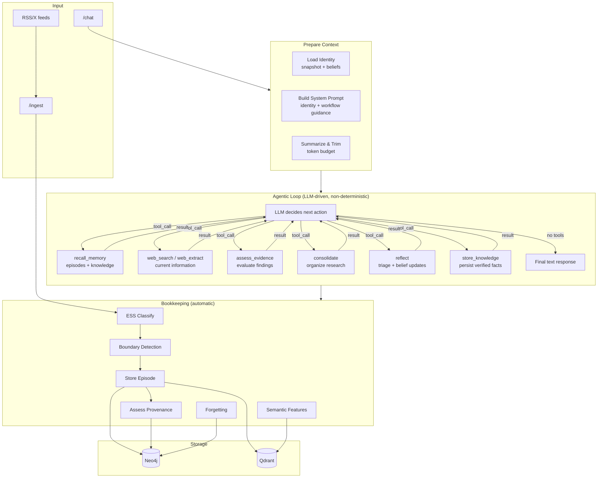

# Data Flow

## Unified Agentic Architecture

The agent uses a single non-deterministic loop where the LLM decides what cognitive steps to take via tool calls. There is no fixed pipeline — the LLM composes its reasoning path from available tools.


```mermaid
flowchart TD
    subgraph Input
        Chat["/chat"]
        Ingest["/ingest"]
        Feed["RSS/X feeds"]
    end

    subgraph Prepare["Prepare Context"]
        Identity[Load Identity<br>snapshot + beliefs]
        Prompt[Build System Prompt<br>identity + workflow guidance]
        Trim[Summarize & Trim<br>token budget]
    end

    subgraph Loop["Agentic Loop (LLM-driven, non-deterministic)"]
        direction TB
        LLM[LLM decides next action]
        Recall[recall_memory<br>episodes + knowledge]
        Web[web_search / web_extract<br>current information]
        Assess[assess_evidence<br>evaluate findings]
        Consol[consolidate<br>organize research]
        Reflect[reflect<br>triage + belief updates]
        Store[store_knowledge<br>persist verified facts]
        Answer[Final text response]

        LLM -->|tool_call| Recall & Web & Assess & Consol & Reflect & Store
        Recall & Web & Assess & Consol & Reflect & Store -->|result| LLM
        LLM -->|no tools| Answer
    end

    subgraph Bookkeep["Bookkeeping (automatic)"]
        ESS[ESS Classify]
        Boundary[Boundary Detection]
        Episode[Store Episode]
        Prov[Assess Provenance]
        Sem[Semantic Features]
        Forget[Forgetting]
    end

    subgraph Storage
        Neo4j[(Neo4j)]
        Qdrant[(Qdrant)]
    end

    Chat --> Prepare
    Feed --> Ingest --> ESS
    Prepare --> Loop --> Bookkeep
    ESS --> Boundary --> Episode
    Episode --> Neo4j & Qdrant
    Episode --> Prov
    Prov --> Neo4j
    Forget --> Neo4j
    Sem --> Qdrant
```

## Tool Availability

All tools are always available when the web client is configured. There are no per-turn limits — the agent decides how many tools to use. Stall detection and deduplication prevent infinite loops.

## Storage Split

| Neo4j | Qdrant |
|-------|--------|
| Episode graph | Episode chunks (`derivatives`) |
| Beliefs (valence, confidence) | Semantic features |
| Provenance edges | Knowledge propositions |
| Personality snapshot | — |

Vectors: 1024d bge-large-en-v1.5, cosine, HNSW + INT8.

## ESS Gate

```
Chat: always stores episodes; ESS gates belief provenance assessment
Ingest: ESS.belief_update_recommended = true → full pipeline
        ESS.belief_update_recommended = false → skip storage entirely
```

## Bookkeeping

After the agent responds, automatic bookkeeping runs silently. The agent handles all cognitive work (reflection, knowledge storage) via tools during the agentic loop.

| Stage | Description |
|-------|-------------|
| ESS classification | Score epistemic significance of the user message |
| Boundary detection | Detect conversation topic shifts |
| Episode storage | Persist the interaction to Neo4j + Qdrant |
| Provenance assessment | Create SUPPORTS/CONTRADICTS edges for beliefs (when ESS warrants) |
| Semantic features | Enqueue for background semantic ingestion |
| Forgetting | Evaluate and archive low-value memories |
