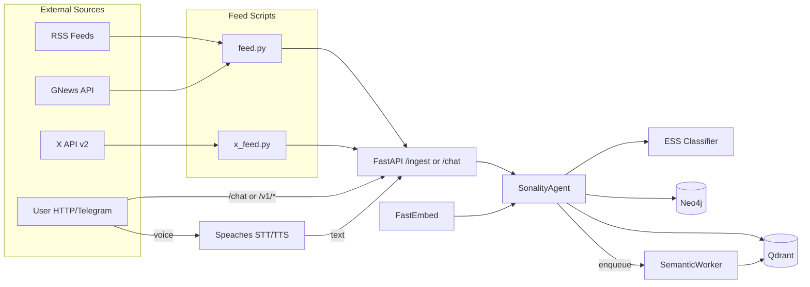
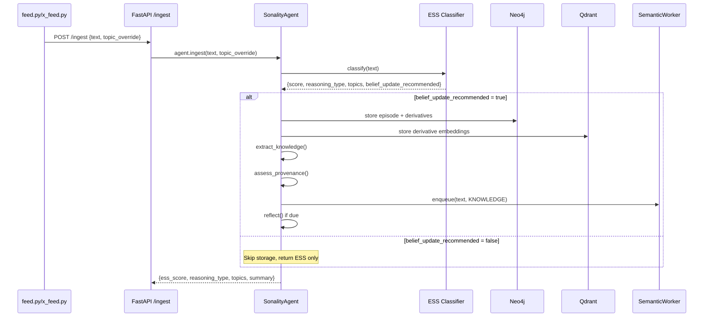
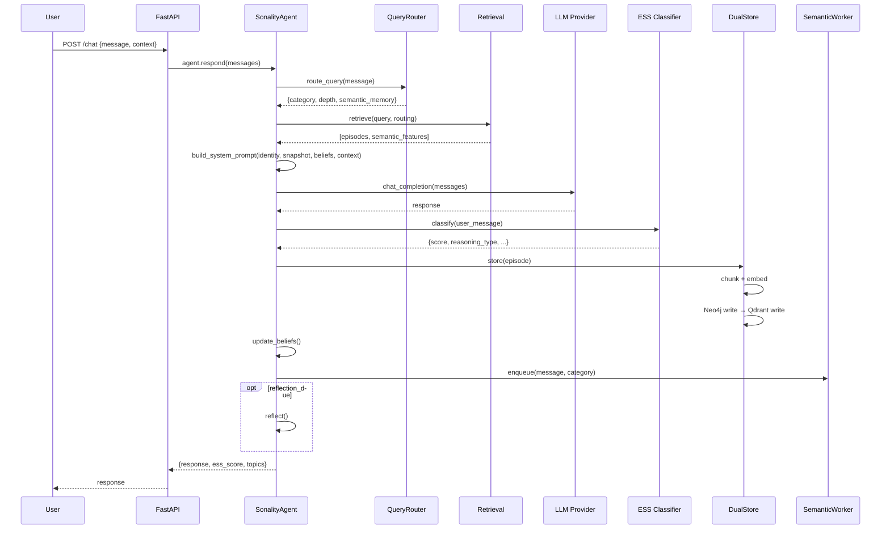
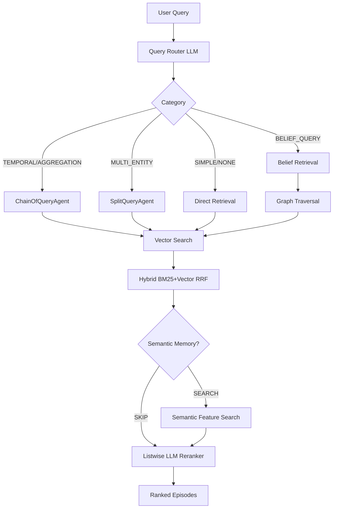
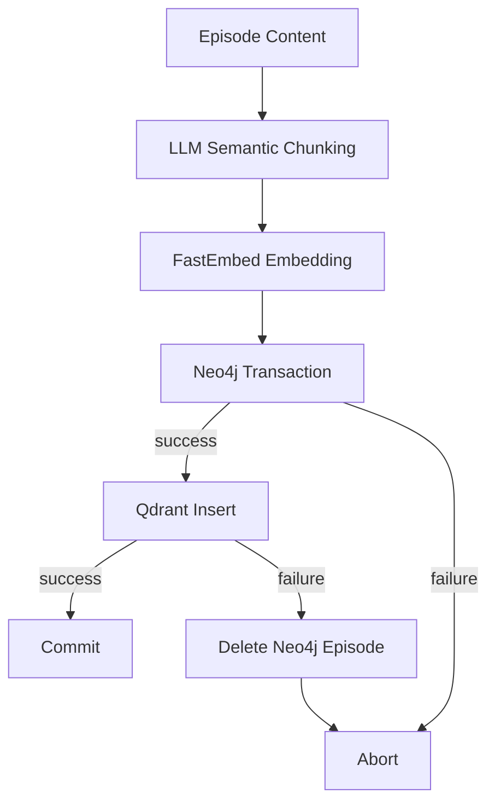
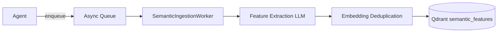
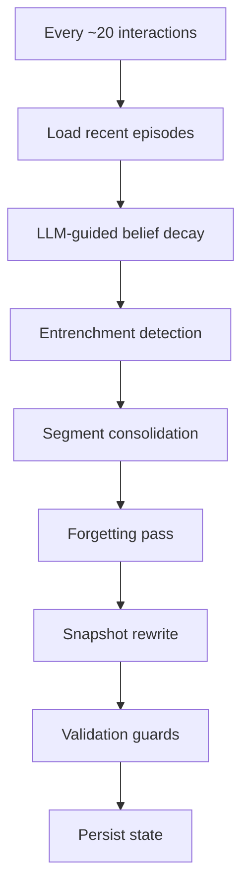

# Data Flow

This document describes data movement through Sonality from external sources to persistent memory.

## End-to-End Pipeline Overview

```mermaid
flowchart LR
    subgraph sources["External Sources"]
        RSS[RSS Feeds]
        GN[GNews API]
        X[X API v2]
        User[User HTTP/Telegram]
    end

    subgraph scripts["Feed Scripts"]
        feed_py[feed.py]
        x_py[x_feed.py]
    end

    API[FastAPI /ingest or /chat]
    Agent[SonalityAgent]
    ESS[ESS Classifier]
    N4j[(Neo4j)]
    Qd[(Qdrant)]
    Emb[FastEmbed]
    SemW[SemanticWorker]
    Sp[Speaches STT/TTS]

    RSS --> feed_py
    GN --> feed_py
    X --> x_py
    feed_py --> API
    x_py --> API
    User -->|/chat or /v1/*| API
    User -->|voice| Sp
    Sp -->|text| API
    API --> Agent
    Agent --> ESS
    Agent --> N4j
    Emb --> Agent
    Agent --> Qd
    Agent -->|enqueue| SemW
    SemW --> Qd
```

## Data Sources

### News Feeds (`scripts/feed.py`)

**RSS Feeds** — Topic-tagged feed URLs for:
- Geopolitics (BBC, DW, Al Jazeera)
- AI/Tech (MIT Tech Review, Ars Technica, The Verge)
- Crypto (CoinDesk, Decrypt, The Block)
- Markets (WSJ, Reuters, Bloomberg)
- Economics (FT, The Economist)
- Science (Nature, Science, Phys.org)
- Politics (AP, NPR, Politico)

**GNews API** — Per-topic queries across multiple countries (US, GB, IN, AU, CA) for topics: WORLD, NATION, BUSINESS, TECHNOLOGY, ENTERTAINMENT, SPORTS, SCIENCE, HEALTH.

### X/Twitter (`scripts/x_feed.py`)

**X API v2** `GET /tweets/search/recent` with:
- Topic-specific query strings (geopolitics, AI, crypto, markets, etc.)
- Quality filtering (`_worth_ingesting`): minimum text length, substance signals (URLs, annotations, engagement)
- Author metadata: verified status, follower count

### Interactive Chat

**HTTP** — Direct API calls to `/chat` or `/v1/chat/completions`

**Telegram** — Voice or text messages via aiogram bot:
- Voice → Speaches STT → text → API
- Response → optional Speaches TTS → voice/text reply

## Ingestion Pipeline

### Feed Ingestion Flow

```mermaid
sequenceDiagram
    participant Feed as feed.py/x_feed.py
    participant API as FastAPI /ingest
    participant Agent as SonalityAgent
    participant ESS as ESS Classifier
    participant Neo as Neo4j
    participant Qd as Qdrant
    participant Sem as SemanticWorker

    Feed->>API: POST /ingest {text, topic_override}
    API->>Agent: agent.ingest(text, topic_override)
    Agent->>ESS: classify(text)
    ESS-->>Agent: {score, reasoning_type, topics, belief_update_recommended}
    
    alt belief_update_recommended = true
        Agent->>Neo: store episode + derivatives
        Agent->>Qd: store derivative embeddings
        Agent->>Agent: extract_knowledge()
        Agent->>Agent: assess_provenance()
        Agent->>Sem: enqueue(text, KNOWLEDGE)
        Agent->>Agent: reflect() if due
    else belief_update_recommended = false
        Note over Agent: Skip storage, return ESS only
    end
    
    Agent-->>API: {ess_score, reasoning_type, topics, summary}
```

### Chat Interaction Flow

```mermaid
sequenceDiagram
    participant U as User
    participant API as FastAPI
    participant Agent as SonalityAgent
    participant Router as QueryRouter
    participant Ret as Retrieval
    participant LLM as LLM Provider
    participant ESS as ESS Classifier
    participant Dual as DualStore
    participant Sem as SemanticWorker

    U->>API: POST /chat {message, context}
    API->>Agent: agent.respond(messages)
    
    Agent->>Router: route_query(message)
    Router-->>Agent: {category, depth, semantic_memory}
    
    Agent->>Ret: retrieve(query, routing)
    Ret-->>Agent: [episodes, semantic_features]
    
    Agent->>Agent: build_system_prompt(identity, snapshot, beliefs, context)
    Agent->>LLM: chat_completion(messages)
    LLM-->>Agent: response
    
    Agent->>ESS: classify(user_message)
    ESS-->>Agent: {score, reasoning_type, ...}
    
    Agent->>Dual: store(episode)
    Dual->>Dual: chunk + embed
    Dual->>Dual: Neo4j write → Qdrant write
    
    Agent->>Agent: update_beliefs()
    Agent->>Sem: enqueue(message, category)
    
    opt reflection_due
        Agent->>Agent: reflect()
    end
    
    Agent-->>API: {response, ess_score, topics}
    API-->>U: response
```

## Retrieval Pipeline

```mermaid
flowchart TD
    Q[User Query] --> Router[Query Router LLM]
    
    Router --> Cat{Category}
    
    Cat -->|TEMPORAL/AGGREGATION| Chain[ChainOfQueryAgent]
    Cat -->|MULTI_ENTITY| Split[SplitQueryAgent]
    Cat -->|BELIEF_QUERY| Belief[Belief Retrieval]
    Cat -->|SIMPLE/NONE| Direct[Direct Retrieval]
    
    Chain --> VecSearch
    Split --> VecSearch
    Belief --> GraphTrav[Graph Traversal]
    Direct --> VecSearch
    
    GraphTrav --> VecSearch[Vector Search]
    VecSearch --> Hybrid[Hybrid BM25+Vector RRF]
    
    Hybrid --> SemFeat{Semantic Memory?}
    SemFeat -->|SEARCH| SemSearch[Semantic Feature Search]
    SemFeat -->|SKIP| Rerank
    SemSearch --> Rerank
    
    Rerank[Listwise LLM Reranker] --> Results[Ranked Episodes]
```

### Retrieval Components

| Stage | Description |
|-------|-------------|
| **Query Routing** | LLM classifies query into category (SIMPLE, TEMPORAL, MULTI_ENTITY, AGGREGATION, BELIEF_QUERY) with depth and semantic memory flags |
| **Graph Traversal** | Neo4j Cypher queries for belief-linked episodes, topic-connected episodes, temporal chains |
| **Vector Search** | Qdrant derivative search with hybrid BM25+dense RRF fusion |
| **Semantic Features** | Optional Qdrant search in `semantic_features` collection |
| **Reranking** | LLM listwise reranking of top candidates by query relevance |

## Storage Pipeline

### Dual-Store Write (Atomic)

```mermaid
flowchart TD
    Episode[Episode Content] --> Chunk[LLM Semantic Chunking]
    Chunk --> Embed[FastEmbed Embedding]
    
    Embed --> Neo[Neo4j Transaction]
    Neo --> |success| Qd[Qdrant Insert]
    Neo --> |failure| Abort[Abort]
    
    Qd --> |success| Done[Commit]
    Qd --> |failure| Rollback[Delete Neo4j Episode]
    Rollback --> Abort
```

### Neo4j Schema

**Nodes:**
- `Episode` — Full conversation turn with metadata
- `Derivative` — Semantic chunk of an episode
- `Belief` — Topic-valence pair with confidence and evidence
- `Topic` — Named topic node for graph traversal
- `Segment` — Conversation segment boundary
- `PersonalitySnapshot` — Current personality narrative

**Edges:**
- `SUPPORTS_BELIEF` / `CONTRADICTS_BELIEF` — Episode-belief provenance
- `HAS_TOPIC` — Episode/belief topic links
- `NEXT_IN_SEGMENT` — Temporal episode ordering
- `HAS_DERIVATIVE` — Episode-chunk relationship

### Qdrant Collections

| Collection | Purpose | Payload |
|------------|---------|---------|
| `derivatives` | Episode chunks for retrieval | uid, episode_uid, text, key_concept, archived, created_at |
| `semantic_features` | Extracted personality features | category, tag, feature_name, value, confidence, citations |

Both collections use:
- 1024-dimensional vectors (FastEmbed BAAI/bge-large-en-v1.5)
- Cosine distance with HNSW index
- INT8 scalar quantization
- Text index for BM25 hybrid search

## Background Processing

### Semantic Feature Extraction

```mermaid
flowchart LR
    Agent[Agent] -->|enqueue| Queue[Async Queue]
    Queue --> Worker[SemanticIngestionWorker]
    Worker --> LLM[Feature Extraction LLM]
    LLM --> Dedup[Embedding Deduplication]
    Dedup --> Qd[(Qdrant semantic_features)]
```

Categories: PERSONALITY, PREFERENCES, KNOWLEDGE, RELATIONSHIPS

### Reflection Pipeline

```mermaid
flowchart TD
    Trigger[Every ~20 interactions] --> Load[Load recent episodes]
    Load --> Decay[LLM-guided belief decay]
    Decay --> Entrench[Entrenchment detection]
    Entrench --> Consol[Segment consolidation]
    Consol --> Forget[Forgetting pass]
    Forget --> Rewrite[Snapshot rewrite]
    Rewrite --> Validate[Validation guards]
    Validate --> Persist[Persist state]
```

## Persistence Locations

| Data | Location | Format |
|------|----------|--------|
| Personality snapshot | Neo4j `PersonalitySnapshot` node | Text + version |
| Beliefs | Neo4j `Belief` nodes | Graph nodes with provenance |
| Episodes | Neo4j `Episode` nodes | Graph with temporal edges |
| Derivatives | Qdrant `derivatives` collection | Vectors + payloads |
| Semantic features | Qdrant `semantic_features` collection | Vectors + payloads |
| Knowledge | Qdrant `knowledge` collection | Proposition vectors |
| ESS audit log | `data/ess_log.jsonl` | JSONL |

## External Service Integration

| Service | Protocol | Purpose |
|---------|----------|---------|
| LLM Provider | OpenAI-compatible HTTP | Chat, ESS, structured outputs |
| Neo4j | Bolt (7687) | Graph storage |
| Qdrant | HTTP (6333) | Vector storage |
| Speaches | HTTP (8001) | STT/TTS for Telegram |
| RSS/GNews | HTTP | News feed ingestion |
| X API v2 | HTTP + Bearer auth | Twitter feed ingestion |
