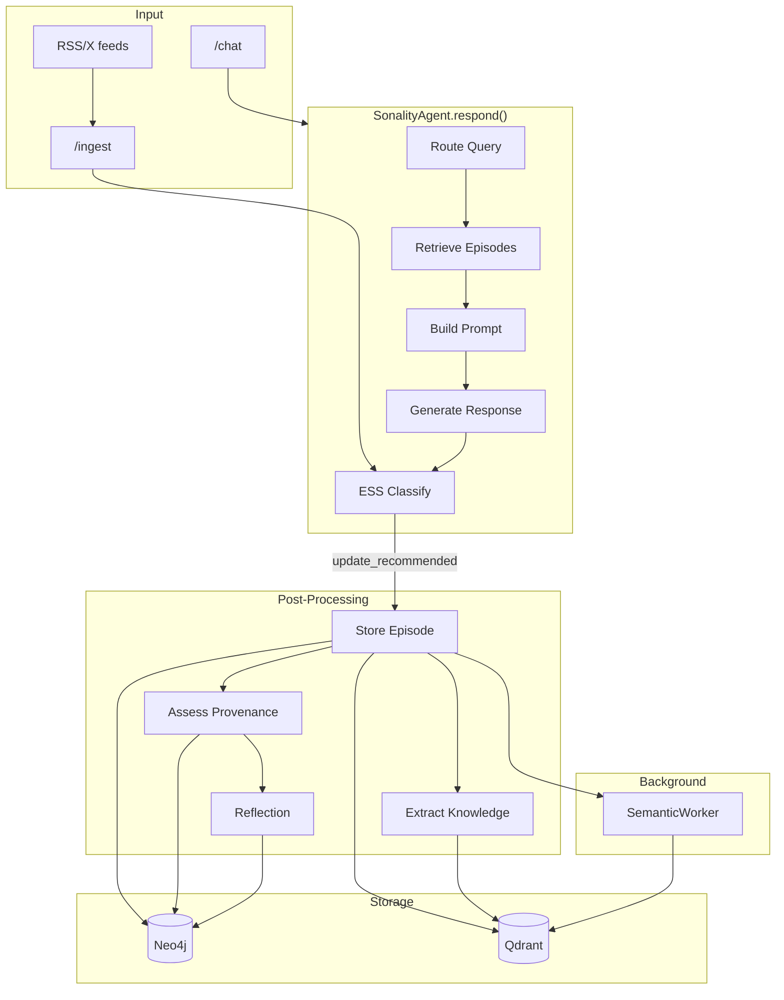

# Data Flow

## Complete Pipeline


```mermaid
flowchart TD
    subgraph Input
        Chat["/chat"] 
        Ingest["/ingest"]
        Feed["RSS/X feeds"]
    end
    
    subgraph Agent["SonalityAgent.respond()"]
        Route[Route Query]
        Retrieve[Retrieve Episodes]
        Build[Build Prompt]
        LLM[Generate Response]
        ESS[ESS Classify]
    end
    
    subgraph Post["Post-Processing"]
        Store[Store Episode]
        Know[Extract Knowledge]
        Prov[Assess Provenance]
        Reflect[Reflection]
    end
    
    subgraph Storage
        Neo4j[(Neo4j)]
        Qdrant[(Qdrant)]
    end
    
    subgraph Background
        Sem[SemanticWorker]
    end
    
    Chat --> Agent
    Feed --> Ingest --> ESS
    Route --> Retrieve --> Build --> LLM --> ESS
    ESS -->|update_recommended| Store
    Store --> Neo4j & Qdrant
    Store --> Know & Prov
    Know --> Qdrant
    Prov --> Neo4j
    Prov --> Reflect --> Neo4j
    Store --> Sem --> Qdrant
```

## Storage Split

| Neo4j | Qdrant |
|-------|--------|
| Episode graph | Episode chunks (`derivatives`) |
| Beliefs (valence, confidence) | Semantic features |
| Provenance edges | Knowledge propositions |
| Personality snapshot | — |

Vectors: 1024d bge-large-en-v1.5, cosine, HNSW + INT8.

## ESS Gate

```
ESS.belief_update_recommended = true → full pipeline
ESS.belief_update_recommended = false → return ESS only
```
