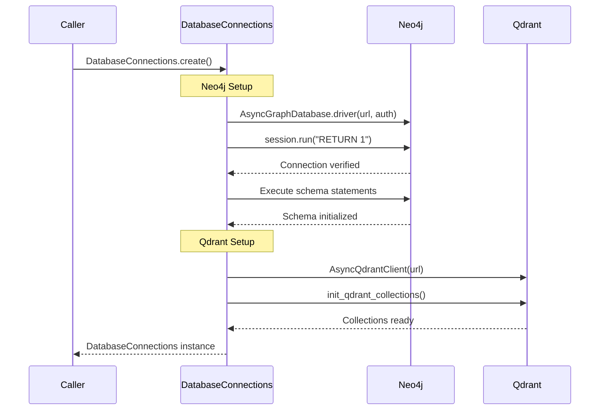
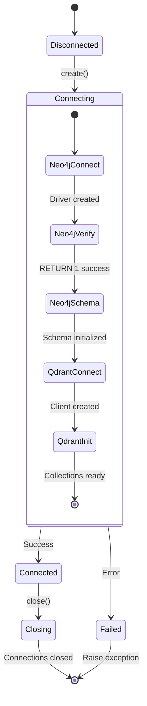

# Database Connections Deep-Dive

> **Module**: `sonality/memory/db.py`  
> **Purpose**: Unified connection management for Neo4j and Qdrant

The `DatabaseConnections` class provides a single point of control for database lifecycle management, ensuring proper initialization, verification, and graceful shutdown.

## Architecture

```
┌─────────────────────────────────────────────────────────────────────────┐
│                      DatabaseConnections                                 │
├─────────────────────────────────────────────────────────────────────────┤
│                                                                         │
│  ┌─────────────────────┐         ┌─────────────────────┐               │
│  │   AsyncDriver       │         │  AsyncQdrantClient  │               │
│  │     (Neo4j)         │         │     (Qdrant)        │               │
│  │                     │         │                     │               │
│  │  • Graph queries    │         │  • Vector search    │               │
│  │  • ACID txns        │         │  • Point storage    │               │
│  │  • Schema init      │         │  • Collection mgmt  │               │
│  └─────────────────────┘         └─────────────────────┘               │
│                                                                         │
│  Lifecycle: create() → use → close()                                    │
│                                                                         │
└─────────────────────────────────────────────────────────────────────────┘
```

## Class Definition

```python
@dataclass
class DatabaseConnections:
    """Holds Neo4j driver and Qdrant client for the application lifetime."""
    
    neo4j_driver: AsyncDriver = field(init=False)
    qdrant: AsyncQdrantClient = field(init=False)
```

## Connection Creation



### Implementation

```python
@classmethod
async def create(cls) -> DatabaseConnections:
    """Create and verify all database connections."""
    self = cls()
    
    # --- Neo4j Connection ---
    log.info("Connecting to Neo4j at %s", config.NEO4J_URL)
    self.neo4j_driver = AsyncGraphDatabase.driver(
        config.NEO4J_URL,
        auth=(config.NEO4J_USER, config.NEO4J_PASSWORD),
    )
    
    # Verify connectivity
    async with self.neo4j_driver.session(database=config.NEO4J_DATABASE) as session:
        await session.run("RETURN 1")
    log.info("Neo4j connected")
    
    # Initialize schema (constraints and indexes)
    async with self.neo4j_driver.session(database=config.NEO4J_DATABASE) as session:
        for stmt in NEO4J_SCHEMA_STATEMENTS:
            await session.run(stmt)
    log.info("Neo4j schema initialized")
    
    # --- Qdrant Connection ---
    log.info("Connecting to Qdrant at %s", config.QDRANT_URL)
    self.qdrant = AsyncQdrantClient(url=config.QDRANT_URL)
    
    # Verify connectivity and initialize collections
    await init_qdrant_collections(self.qdrant)
    log.info("Qdrant connected and collections initialized")
    
    return self
```

## Schema Initialization

### Neo4j Schema Statements

From `schema.py`:

```python
NEO4J_SCHEMA_STATEMENTS: Final[tuple[str, ...]] = (
    # Uniqueness constraints
    "CREATE CONSTRAINT IF NOT EXISTS FOR (e:Episode) REQUIRE e.uid IS UNIQUE",
    "CREATE CONSTRAINT IF NOT EXISTS FOR (d:Derivative) REQUIRE d.uid IS UNIQUE",
    "CREATE CONSTRAINT IF NOT EXISTS FOR (t:Topic) REQUIRE t.name IS UNIQUE",
    "CREATE CONSTRAINT IF NOT EXISTS FOR (b:Belief) REQUIRE b.topic IS UNIQUE",
    "CREATE CONSTRAINT IF NOT EXISTS FOR (s:Segment) REQUIRE s.segment_id IS UNIQUE",
    "CREATE CONSTRAINT IF NOT EXISTS FOR (sum:Summary) REQUIRE sum.uid IS UNIQUE",
    "CREATE CONSTRAINT IF NOT EXISTS FOR (ps:PersonalitySnapshot) REQUIRE ps.session_id IS UNIQUE",
    
    # Performance indexes
    "CREATE INDEX IF NOT EXISTS FOR (e:Episode) ON (e.created_at)",
    "CREATE INDEX IF NOT EXISTS FOR (e:Episode) ON (e.archived)",
    "CREATE INDEX IF NOT EXISTS FOR (e:Episode) ON (e.segment_id)",
)
```

### Qdrant Collection Initialization

```python
async def init_qdrant_collections(client: AsyncQdrantClient) -> None:
    """Create Qdrant collections if they don't exist."""
    
    # DERIVATIVES collection for episode chunks
    if not await client.collection_exists(Collection.DERIVATIVES):
        await client.create_collection(
            collection_name=Collection.DERIVATIVES,
            vectors_config={
                DENSE_VECTOR: VectorParams(
                    size=1024,  # BAAI/bge-large-en-v1.5
                    distance=Distance.COSINE,
                )
            },
            # Quantization for memory efficiency
            quantization_config=ScalarQuantization(
                scalar=ScalarQuantizationConfig(
                    type=ScalarType.INT8,
                    always_ram=True,
                )
            ),
        )
    
    # SEMANTIC_FEATURES collection for personality traits
    if not await client.collection_exists(Collection.SEMANTIC_FEATURES):
        await client.create_collection(
            collection_name=Collection.SEMANTIC_FEATURES,
            vectors_config={
                DENSE_VECTOR: VectorParams(
                    size=1024,
                    distance=Distance.COSINE,
                )
            },
        )
```

## Graceful Shutdown

```python
async def close(self) -> None:
    """Gracefully close all connections."""
    log.info("Closing database connections")
    await self.neo4j_driver.close()
    await self.qdrant.close()
    log.info("Database connections closed")
```

## Integration with Agent

```python
# In SonalityAgent._init_runtime()
async def _init_runtime(self) -> None:
    # Create unified database connections
    db = await DatabaseConnections.create()
    self._db = db
    
    # Initialize other components with database references
    self._embedder = Embedder()
    self._graph = MemoryGraph(db.neo4j_driver)
    self._dual_store = DualEpisodeStore(self._graph, db.qdrant, self._embedder)
    
    # Restore state from database
    last_uid = await self._graph.get_last_episode_uid()
    if last_uid:
        self._dual_store.restore_last_episode(last_uid)

# In SonalityAgent.shutdown()
def shutdown(self) -> None:
    self._semantic_worker.stop()
    self._run_async(self._db.close())  # Close database connections
    # ...
```

## Configuration

From `config.py`:

```python
# Neo4j Configuration
NEO4J_URL: Final = os.getenv("NEO4J_URL", "bolt://localhost:7687")
NEO4J_USER: Final = os.getenv("NEO4J_USER", "neo4j")
NEO4J_PASSWORD: Final = os.getenv("NEO4J_PASSWORD", "password")
NEO4J_DATABASE: Final = os.getenv("NEO4J_DATABASE", "neo4j")

# Qdrant Configuration
QDRANT_URL: Final = os.getenv("QDRANT_URL", "http://localhost:6333")
QDRANT_SEARCH_EF: Final = int(os.getenv("QDRANT_SEARCH_EF", "128"))
QDRANT_RESCORE_QUANTIZED: Final = os.getenv("QDRANT_RESCORE_QUANTIZED", "true").lower() == "true"
```

## Logging Suppression

```python
# Suppress Neo4j property-not-found notifications
# Segment nodes are created without optional properties (consolidated, end_time, start_time)
# All queries use coalesce() to handle missing properties gracefully
logging.getLogger("neo4j.notifications").setLevel(logging.ERROR)
```

## Connection State Diagram



## Error Handling

| Phase | Error Type | Behavior |
|-------|------------|----------|
| Neo4j connect | Connection refused | Raise, agent fails to start |
| Neo4j verify | Auth failure | Raise, agent fails to start |
| Neo4j schema | Constraint error | Ignored (IF NOT EXISTS) |
| Qdrant connect | Connection refused | Raise, agent fails to start |
| Qdrant init | Collection exists | Skipped (idempotent) |
| Close | Any | Log and continue |

## Health Check Pattern

```python
# Used by API health endpoint
def get_health(self) -> tuple[int, int]:
    """Return (belief_count, snapshot_version)."""
    beliefs = self._run_async(self._graph.get_all_beliefs())
    snapshot = self._run_async(self._graph.get_personality_snapshot())
    return len(beliefs), snapshot.version
```

## Related Documentation

- [Database Schema](database-schema.md) - Complete schema definitions
- [Dual Store Operations](dual-store-operations.md) - How stores are used
- [Infrastructure](infrastructure.md) - Docker deployment
- [Configuration](../configuration.md) - Environment variables
