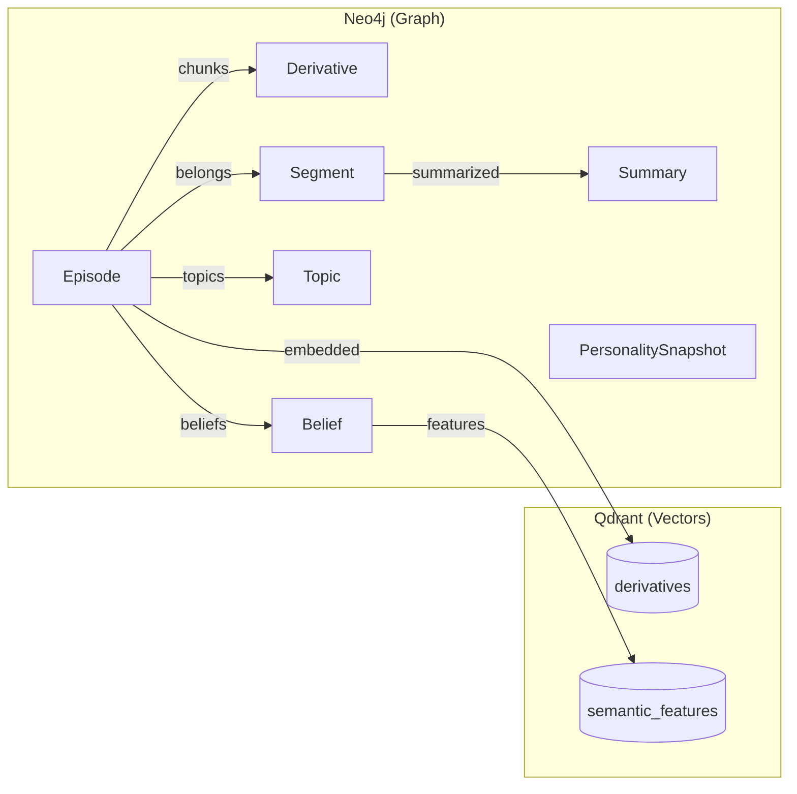
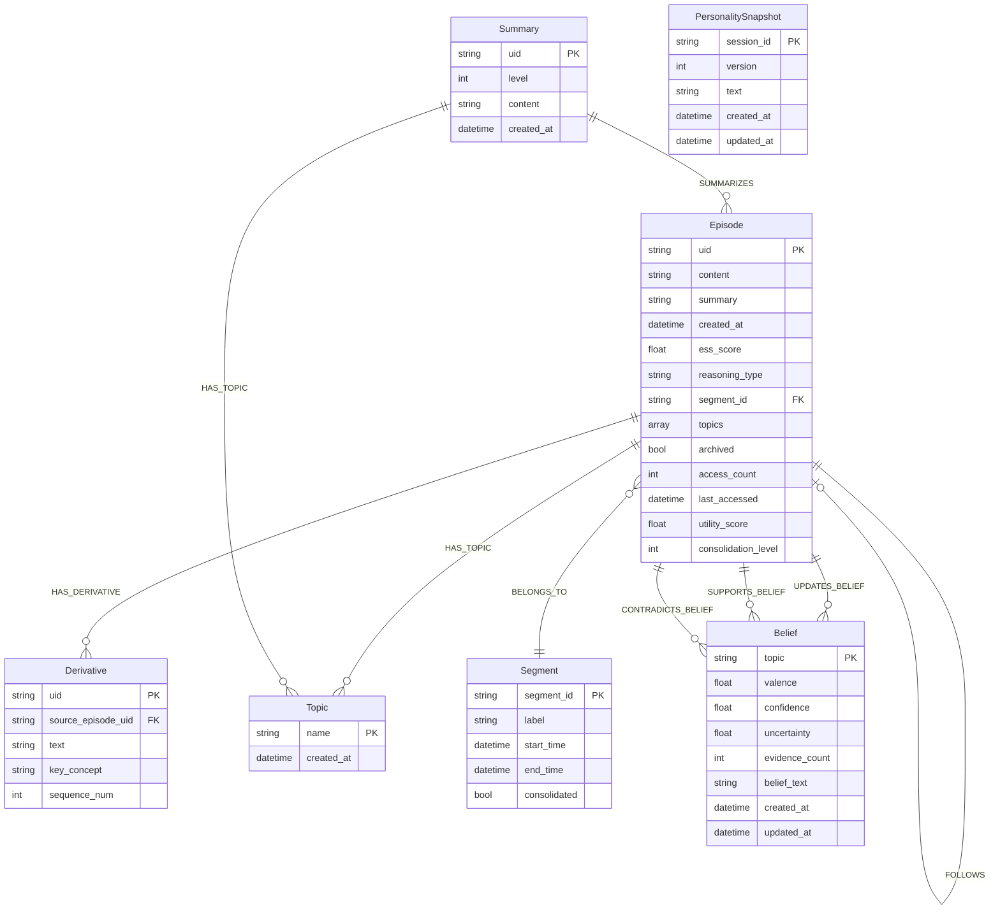

# Database Schema Reference

This document provides the complete schema definitions for Neo4j and Qdrant databases.

## Overview



## Qdrant Collections

### Collection Enum

```python
class Collection(StrEnum):
    DERIVATIVES = "derivatives"
    SEMANTIC_FEATURES = "semantic_features"
```

### Shared Configuration

```python
_SHARED_HNSW = HnswConfigDiff(
    m=16,                      # Connections per node
    ef_construct=100,          # Construction quality
    full_scan_threshold=10000, # When to switch to brute force
    max_indexing_threads=0,    # Auto-detect
    on_disk=False,             # Keep in memory
)

_SHARED_QUANTIZATION = ScalarQuantization(
    scalar=ScalarQuantizationConfig(
        type=ScalarType.INT8,
        quantile=0.99,
        always_ram=True,
    ),
)

_SHARED_OPTIMIZERS = OptimizersConfigDiff(
    indexing_threshold=20000,
    memmap_threshold=50000,
    default_segment_number=4,
)
```

### `derivatives` Collection

Episode chunks for retrieval:

```python
{
    "vectors_config": {
        "dense": VectorParams(
            size=1024,  # BAAI/bge-large-en-v1.5
            distance=Distance.COSINE,
            on_disk=False,
        ),
    },
    "payload_schema": {
        "uid": PayloadSchemaType.KEYWORD,
        "episode_uid": PayloadSchemaType.KEYWORD,
        "text": PayloadSchemaType.TEXT,
        "key_concept": PayloadSchemaType.KEYWORD,
        "sequence_num": PayloadSchemaType.INTEGER,
        "archived": PayloadSchemaType.BOOL,
        "created_at": PayloadSchemaType.DATETIME,
    },
    "text_index_field": "text",  # BM25 hybrid search
}
```

**Example Point:**
```json
{
    "id": "deriv-abc123",
    "vector": {"dense": [0.123, -0.456, ...]},
    "payload": {
        "uid": "deriv-abc123",
        "episode_uid": "ep-xyz789",
        "text": "The Eiffel Tower was completed in 1889.",
        "key_concept": "Eiffel Tower construction",
        "sequence_num": 0,
        "archived": false,
        "created_at": "2025-04-26T10:00:00Z"
    }
}
```

### `semantic_features` Collection

Personality traits, preferences, knowledge propositions:

```python
{
    "vectors_config": {
        "dense": VectorParams(
            size=1024,
            distance=Distance.COSINE,
            on_disk=False,
        ),
    },
    "payload_schema": {
        "uid": PayloadSchemaType.KEYWORD,
        "category": PayloadSchemaType.KEYWORD,
        "tag": PayloadSchemaType.KEYWORD,
        "feature_name": PayloadSchemaType.KEYWORD,
        "value": PayloadSchemaType.TEXT,
        "episode_citations": PayloadSchemaType.KEYWORD,
        "confidence": PayloadSchemaType.FLOAT,
        "created_at": PayloadSchemaType.DATETIME,
        "updated_at": PayloadSchemaType.DATETIME,
    },
    "text_index_field": "value",
}
```

**Example Point (Knowledge):**
```json
{
    "id": "know-def456",
    "vector": {"dense": [0.789, -0.012, ...]},
    "payload": {
        "uid": "know-def456",
        "category": "knowledge",
        "tag": "Verified Facts",
        "feature_name": "Climate Science | IPCC",
        "value": "Global temperatures rose 1.1°C since pre-industrial era.",
        "episode_citations": ["ep-abc123", "ep-def456"],
        "confidence": 0.85,
        "created_at": "2025-04-26T10:00:00Z",
        "updated_at": "2025-04-26T12:00:00Z"
    }
}
```

**Example Point (Personality):**
```json
{
    "id": "pers-ghi789",
    "vector": {"dense": [0.234, -0.567, ...]},
    "payload": {
        "uid": "pers-ghi789",
        "category": "personality",
        "tag": "Communication Style",
        "feature_name": "Direct Disagreement",
        "value": "States disagreement explicitly rather than hedging.",
        "episode_citations": ["ep-xyz123"],
        "confidence": 0.78,
        "created_at": "2025-04-26T10:00:00Z",
        "updated_at": "2025-04-26T10:00:00Z"
    }
}
```

### Semantic Categories

```python
class SemanticCategory(StrEnum):
    PERSONALITY = "personality"    # Communication style, values, temperament
    PREFERENCES = "preferences"    # Interests, aversions, decision framework
    KNOWLEDGE = "knowledge"        # Facts, technical skills, domains
    RELATIONSHIPS = "relationships" # Interpersonal style, collaborative patterns
```

## Neo4j Schema

### Constraints and Indexes

```python
NEO4J_SCHEMA_STATEMENTS = (
    # Unique constraints
    "CREATE CONSTRAINT episode_uid IF NOT EXISTS FOR (e:Episode) REQUIRE e.uid IS UNIQUE",
    "CREATE CONSTRAINT derivative_uid IF NOT EXISTS FOR (d:Derivative) REQUIRE d.uid IS UNIQUE",
    "CREATE CONSTRAINT topic_name IF NOT EXISTS FOR (t:Topic) REQUIRE t.name IS UNIQUE",
    "CREATE CONSTRAINT segment_id IF NOT EXISTS FOR (s:Segment) REQUIRE s.segment_id IS UNIQUE",
    "CREATE CONSTRAINT summary_uid IF NOT EXISTS FOR (s:Summary) REQUIRE s.uid IS UNIQUE",
    "CREATE CONSTRAINT belief_topic IF NOT EXISTS FOR (b:Belief) REQUIRE b.topic IS UNIQUE",
    "CREATE CONSTRAINT identity_session IF NOT EXISTS FOR (n:PersonalitySnapshot) REQUIRE n.session_id IS UNIQUE",
    
    # Performance indexes
    "CREATE INDEX episode_created_at IF NOT EXISTS FOR (e:Episode) ON (e.created_at)",
    "CREATE INDEX episode_segment IF NOT EXISTS FOR (e:Episode) ON (e.segment_id)",
    "CREATE INDEX derivative_episode IF NOT EXISTS FOR (d:Derivative) ON (d.source_episode_uid)",
    "CREATE INDEX episode_archived_created IF NOT EXISTS FOR (e:Episode) ON (e.archived, e.created_at)",
    "CREATE INDEX episode_archived_utility IF NOT EXISTS FOR (e:Episode) ON (e.archived, e.utility_score)",
    "CREATE INDEX episode_segment_ess IF NOT EXISTS FOR (e:Episode) ON (e.segment_id, e.ess_score)",
)
```

### Node Types

#### Episode

```cypher
(:Episode {
    uid: "ep-abc123",
    content: "User asked about climate policy...",
    summary: "Discussion of carbon pricing mechanisms",
    created_at: datetime("2025-04-26T10:00:00Z"),
    ess_score: 0.72,
    reasoning_type: "empirical_data",
    segment_id: "segment_42",
    topics: ["climate", "policy"],
    archived: false,
    access_count: 5,
    last_accessed: datetime("2025-04-26T12:00:00Z"),
    utility_score: 0.65,
    consolidation_level: 0
})
```

#### Derivative

```cypher
(:Derivative {
    uid: "deriv-abc123",
    source_episode_uid: "ep-abc123",
    text: "Carbon pricing mechanisms include...",
    key_concept: "carbon pricing",
    sequence_num: 0
})
```

#### Belief

```cypher
(:Belief {
    topic: "climate change",
    valence: 0.72,           # -1 to +1: position strength
    confidence: 0.85,        # 0 to 1: certainty
    uncertainty: 0.15,       # 0 to 1: spread
    evidence_count: 12,      # Supporting episodes
    belief_text: "Strong scientific consensus supports human-caused climate change.",
    created_at: datetime(),
    updated_at: datetime()
})
```

#### Topic

```cypher
(:Topic {
    name: "climate change",
    created_at: datetime()
})
```

#### Segment

```cypher
(:Segment {
    segment_id: "segment_42",
    label: "Climate policy discussion",
    start_time: datetime(),
    end_time: datetime(),
    consolidated: false
})
```

#### Summary

```cypher
(:Summary {
    uid: "sum-abc123",
    level: 2,                # Hierarchy level
    content: "Comprehensive summary...",
    created_at: datetime()
})
```

#### PersonalitySnapshot

```cypher
(:PersonalitySnapshot {
    session_id: "main",
    version: 42,
    text: "~500 token personality narrative",
    created_at: datetime(),
    updated_at: datetime()
})
```

### Edge Types

```python
class EdgeType(StrEnum):
    HAS_DERIVATIVE = "HAS_DERIVATIVE"      # Episode → Derivative
    HAS_TOPIC = "HAS_TOPIC"                # Episode/Summary → Topic
    FOLLOWS = "FOLLOWS"                     # Episode → Episode (temporal)
    BELONGS_TO = "BELONGS_TO"              # Episode → Segment
    SUMMARIZES = "SUMMARIZES"              # Summary → Episode
    UPDATES_BELIEF = "UPDATES_BELIEF"      # Episode → Belief
    SUPPORTS_BELIEF = "SUPPORTS_BELIEF"    # Episode → Belief (provenance)
    CONTRADICTS_BELIEF = "CONTRADICTS_BELIEF"  # Episode → Belief (provenance)
    TOPIC_RELATED = "TOPIC_RELATED"        # Episode ↔ Episode
    BELIEF_RELATED = "BELIEF_RELATED"      # Episode ↔ Episode
```

### Edge Properties

#### SUPPORTS_BELIEF / CONTRADICTS_BELIEF

```cypher
[:SUPPORTS_BELIEF {
    strength: 0.72,
    ess_score: 0.68,
    reasoning_type: "empirical_data",
    created_at: datetime()
}]
```

#### UPDATES_BELIEF

```cypher
[:UPDATES_BELIEF {
    direction: 0.15,           # Magnitude of update
    evidence_strength: 0.65,
    created_at: datetime()
}]
```

## ER Diagram



## Database Initialization

```python
@dataclass
class DatabaseConnections:
    """Holds Neo4j driver and Qdrant client for application lifetime."""

    neo4j_driver: AsyncDriver
    qdrant: AsyncQdrantClient

    @classmethod
    async def create(cls) -> DatabaseConnections:
        self = cls()
        
        # Connect to Neo4j
        self.neo4j_driver = AsyncGraphDatabase.driver(
            config.NEO4J_URL,
            auth=(config.NEO4J_USER, config.NEO4J_PASSWORD),
        )
        
        # Verify connectivity
        async with self.neo4j_driver.session() as session:
            await session.run("RETURN 1")
        
        # Initialize schema
        async with self.neo4j_driver.session() as session:
            for stmt in NEO4J_SCHEMA_STATEMENTS:
                await session.run(stmt)
        
        # Connect to Qdrant and create collections
        self.qdrant = AsyncQdrantClient(url=config.QDRANT_URL)
        await init_qdrant_collections(self.qdrant)
        
        return self
```

## Text Index Configuration

Both Qdrant collections have text indexes for hybrid BM25+vector search:

```python
await client.create_payload_index(
    collection_name=name,
    field_name=text_field,
    field_schema=TextIndexParams(
        type=TextIndexType.TEXT,
        tokenizer=TokenizerType.WORD,
        min_token_len=2,
        max_token_len=20,
        lowercase=True,
    ),
)
```

## Configuration

| Variable | Default | Description |
|----------|---------|-------------|
| `SONALITY_NEO4J_URL` | `bolt://localhost:7687` | Neo4j connection URL |
| `SONALITY_NEO4J_USER` | `neo4j` | Neo4j username |
| `SONALITY_NEO4J_PASSWORD` | `sonality_password` | Neo4j password |
| `SONALITY_NEO4J_DATABASE` | `neo4j` | Neo4j database name |
| `SONALITY_QDRANT_URL` | `http://localhost:6333` | Qdrant connection URL |
| `SONALITY_EMBEDDING_DIMENSIONS` | `1024` | Vector dimensions |
