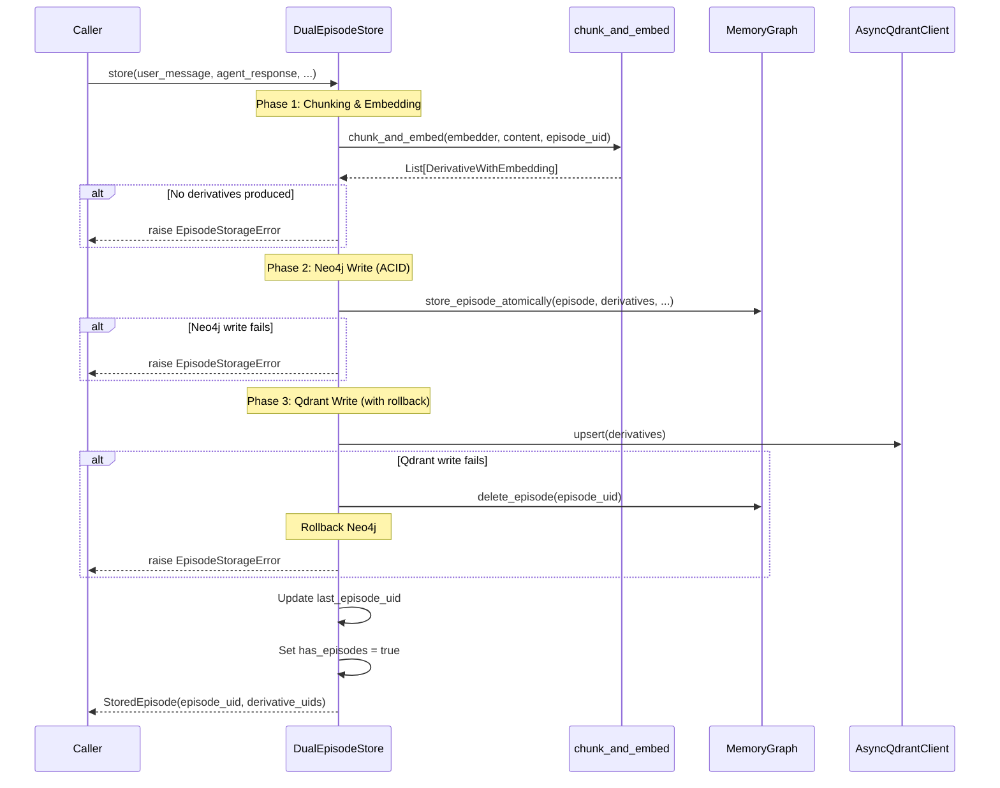
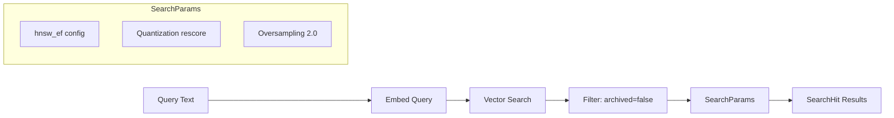

# Dual Store Operations Deep-Dive

> **Module**: `sonality/memory/dual_store.py`  
> **Purpose**: Transactional episode storage across Neo4j and Qdrant

The `DualEpisodeStore` manages the critical invariant: **episodes are NEVER stored without embeddings**. This document details the transaction semantics and error handling.

## Architecture Overview

```
┌─────────────────────────────────────────────────────────────────────────┐
│                       DualEpisodeStore                                   │
├─────────────────────────────────────────────────────────────────────────┤
│                                                                         │
│   ┌─────────────────┐        ┌─────────────────┐                       │
│   │   MemoryGraph   │        │  AsyncQdrant    │                       │
│   │    (Neo4j)      │        │    Client       │                       │
│   └────────┬────────┘        └────────┬────────┘                       │
│            │                          │                                 │
│            │    WRITE ORDER:          │                                 │
│            │    1. Neo4j (ACID)       │                                 │
│            │    2. Qdrant (rollback)  │                                 │
│            │                          │                                 │
│   ┌────────┴──────────────────────────┴────────┐                       │
│   │              Embedder (FastEmbed)           │                       │
│   │           BAAI/bge-large-en-v1.5           │                       │
│   └─────────────────────────────────────────────┘                       │
│                                                                         │
└─────────────────────────────────────────────────────────────────────────┘
```

## Transaction Flow



## Core Data Structures

### StoredEpisode

```python
@dataclass(frozen=True, slots=True)
class StoredEpisode:
    """Result of a successful episode store operation."""
    episode_uid: str           # UUID of the stored episode
    derivative_uids: list[str] # UIDs of all derivative chunks
```

### SearchHit

```python
class SearchHit(NamedTuple):
    """A derivative match from vector search."""
    uid: str         # Derivative UID
    episode_uid: str # Parent episode UID
    score: float     # Similarity score (0.0-1.0)
```

### EpisodeStorageError

```python
class EpisodeStorageError(Exception):
    """Raised when episode storage fails at any phase."""
```

## Store Operation Detail

### Phase 1: Chunking & Embedding

```python
async def store(
    self,
    *,
    user_message: str,
    agent_response: str,
    summary: str,
    topics: list[str],
    ess_score: float,
    segment_id: str = "",
    segment_label: str = "",
) -> StoredEpisode:
    episode_uid = str(uuid.uuid4())
    now = datetime.now(UTC).isoformat()
    content = f"User: {user_message}\nAssistant: {agent_response}"
    
    # LLM-based semantic chunking + embedding
    try:
        derivatives = await asyncio.to_thread(
            chunk_and_embed, self._embedder, content, episode_uid
        )
    except Exception as exc:
        raise EpisodeStorageError(f"Chunking/embedding failed: {exc}") from exc
    
    # Critical invariant: must have at least one derivative
    if not derivatives:
        raise EpisodeStorageError("No derivatives produced from chunking")
```

The `chunk_and_embed` function (from `derivatives.py`) uses an LLM to semantically split the content:

```python
# CHUNKING_PROMPT guides the LLM to:
# 1. Identify distinct semantic units
# 2. Extract key concepts per chunk
# 3. Maintain coherence within chunks
```

### Phase 2: Neo4j Write (Atomic)

```python
    # Build episode node with all metadata
    episode_node = EpisodeNode(
        uid=episode_uid,
        content=content,
        summary=summary,
        topics=topics,
        ess_score=ess_score,
        created_at=now,
        valid_at=now,
        utility_score=0.0,
        access_count=0,
        last_accessed=now,
        segment_id=segment_id,
        consolidation_level=1,
        archived=False,
        user_message=user_message,
        agent_response=agent_response,
    )
    
    try:
        # Single transaction: episode + derivatives + edges
        await self._graph.store_episode_atomically(
            episode=episode_node,
            derivatives=[d.node for d in derivatives],
            prev_episode_uid=self._last_episode_uid,  # Temporal chain
            topics=topics,
            segment_id=segment_id,
            segment_label=segment_label,
        )
    except Exception as exc:
        raise EpisodeStorageError(f"Neo4j write failed: {exc}") from exc
```

### Phase 3: Qdrant Write (With Rollback)

```python
    try:
        await self._insert_derivatives_qdrant(derivatives, now)
    except Exception as exc:
        # CRITICAL: Rollback Neo4j to maintain consistency
        try:
            await self._graph.delete_episode(episode_uid)
        except Exception:
            log.exception("Failed to rollback Neo4j episode %s", episode_uid[:8])
        raise EpisodeStorageError(f"Qdrant write failed: {exc}") from exc
    
    # Success: update state
    self._last_episode_uid = episode_uid
    self.has_episodes = True
    return StoredEpisode(episode_uid=episode_uid, derivative_uids=[d.node.uid for d in derivatives])
```

### Qdrant Point Structure

```python
async def _insert_derivatives_qdrant(
    self, derivatives: list[DerivativeWithEmbedding], created_at: str
) -> None:
    points = [
        PointStruct(
            id=d.node.uid,              # UUID string
            vector={DENSE_VECTOR: d.embedding},  # 1024-dim vector
            payload={
                "uid": d.node.uid,
                "episode_uid": d.node.source_episode_uid,
                "text": d.node.text,
                "key_concept": d.node.key_concept,
                "sequence_num": d.node.sequence_num,
                "archived": False,
                "created_at": created_at,
            },
        )
        for d in derivatives
    ]
    await self._qdrant.upsert(collection_name=Collection.DERIVATIVES, points=points)
```

## Vector Search



```python
async def vector_search(
    self,
    query: str,
    top_k: int = 20,
) -> list[SearchHit]:
    """Search Qdrant for similar derivatives using dense vectors."""
    
    # Embed the query using same model as documents
    query_embedding = await asyncio.to_thread(self._embedder.embed_query, query)
    
    # Search with quantization and filtering
    response = await self._qdrant.query_points(
        collection_name=Collection.DERIVATIVES,
        query=query_embedding,
        using=DENSE_VECTOR,
        query_filter=Filter(
            must=[FieldCondition(key="archived", match=MatchValue(value=False))]
        ),
        limit=top_k,
        with_payload=True,
        search_params=SearchParams(
            hnsw_ef=config.QDRANT_SEARCH_EF,        # HNSW search parameter
            quantization=QuantizationSearchParams(
                rescore=config.QDRANT_RESCORE_QUANTIZED,  # Re-score with original vectors
                oversampling=2.0,                          # Retrieve 2x candidates
            ),
        ),
    )
    
    # Convert to SearchHit tuples
    return [
        SearchHit(
            str(p.payload.get("uid", "")), 
            str(p.payload.get("episode_uid", "")), 
            p.score or 0.0
        )
        for p in response.points
        if p.payload
    ]
```

## Archiving & Deletion

### Soft Archive (Qdrant)

```python
async def archive_derivatives(self, episode_uid: str) -> None:
    """Mark derivatives as archived in Qdrant (soft delete)."""
    
    # Build filter for episode's derivatives
    filt = Filter(
        must=[FieldCondition(key="episode_uid", match=MatchValue(value=episode_uid))]
    )
    
    # Scroll through all matching points
    all_ids: list[int | str | UUID] = []
    offset = None
    while True:
        points, offset = await self._qdrant.scroll(
            collection_name=Collection.DERIVATIVES,
            scroll_filter=filt,
            limit=500,
            offset=offset,
        )
        all_ids.extend(str(p.id) for p in points if p.id is not None)
        if offset is None:
            break
    
    # Set archived=True on all points
    if all_ids:
        await self._qdrant.set_payload(
            collection_name=Collection.DERIVATIVES,
            payload={"archived": True},
            points=PointIdsList(points=all_ids),
        )
```

### Hard Delete (Qdrant)

```python
async def delete_derivatives(self, episode_uid: str) -> None:
    """Hard-delete derivatives by episode UID from Qdrant."""
    await self._qdrant.delete(
        collection_name=Collection.DERIVATIVES,
        points_selector=Filter(
            must=[FieldCondition(key="episode_uid", match=MatchValue(value=episode_uid))]
        ),
    )
```

## State Management

### Initialization

```python
def __init__(
    self,
    graph: MemoryGraph,
    qdrant: AsyncQdrantClient,
    embedder: Embedder,
) -> None:
    self._graph = graph
    self._qdrant = qdrant
    self._embedder = embedder
    self._last_episode_uid = ""  # For temporal chaining
    self.has_episodes = False    # Quick check for empty store
```

### Restoration After Restart

```python
def restore_last_episode(self, uid: str) -> None:
    """Re-link to the last stored episode after restart."""
    self._last_episode_uid = uid
    self.has_episodes = True
```

Called during agent initialization:

```python
# In SonalityAgent._init_runtime()
last_uid = await self._graph.get_last_episode_uid()
if last_uid:
    self._dual_store.restore_last_episode(last_uid)
```

## Memory Graph Operations

The `MemoryGraph` handles the Neo4j side with atomic transactions:

### Atomic Episode Storage

```python
async def store_episode_atomically(
    self,
    *,
    episode: EpisodeNode,
    derivatives: list[DerivativeNode],
    prev_episode_uid: str,
    topics: list[str],
    segment_id: str,
    segment_label: str,
) -> None:
    """Store episode + derivatives + graph links in one write transaction."""
    async with self._driver.session(database=_DB) as session:
        await session.execute_write(
            self._store_episode_atomically_tx,
            episode, derivatives, prev_episode_uid, topics, segment_id, segment_label,
        )
```

### Transaction Contents

Within the single transaction:

1. **Create Episode Node**
```cypher
CREATE (e:Episode {
    uid: $uid, content: $content, summary: $summary,
    topics: $topics, ess_score: $ess_score,
    created_at: $created_at, valid_at: $valid_at,
    expired_at: $expired_at, utility_score: $utility_score,
    access_count: $access_count, last_accessed: $last_accessed,
    segment_id: $segment_id, consolidation_level: $consolidation_level,
    archived: $archived, user_message: $user_message,
    agent_response: $agent_response
})
```

2. **Create Temporal Edge** (if previous episode exists)
```cypher
MATCH (prev:Episode {uid: $prev_uid})
MATCH (curr:Episode {uid: $curr_uid})
CREATE (prev)-[:TEMPORAL_NEXT]->(curr)
```

3. **Create Derivative Nodes**
```cypher
CREATE (d:Derivative {
    uid: $uid, source_episode_uid: $source_uid,
    text: $text, key_concept: $key_concept,
    sequence_num: $seq
})
WITH d
MATCH (e:Episode {uid: $episode_uid})
CREATE (d)-[:DERIVED_FROM]->(e)
```

4. **Link Topics** (MERGE for deduplication)
```cypher
MERGE (t:Topic {name: $topic})
ON CREATE SET t.episode_count = 1, t.first_seen_at = datetime()
ON MATCH SET t.episode_count = t.episode_count + 1
SET t.last_seen_at = datetime()
WITH t
MATCH (e:Episode {uid: $uid})
CREATE (e)-[:DISCUSSES]->(t)
```

5. **Link Segment** (MERGE for deduplication)
```cypher
MERGE (s:Segment {segment_id: $segment_id})
ON CREATE SET s.label = $label, s.start_time = datetime(),
              s.episode_count = 1, s.consolidated = false
ON MATCH SET s.episode_count = s.episode_count + 1,
             s.end_time = datetime(),
             s.label = CASE WHEN ... END
WITH s
MATCH (e:Episode {uid: $uid})
CREATE (e)-[:BELONGS_TO_SEGMENT]->(s)
```

## Error Recovery Matrix

| Phase | Error | Recovery Action |
|-------|-------|-----------------|
| Chunking | LLM timeout | Raise `EpisodeStorageError` |
| Chunking | Empty result | Raise `EpisodeStorageError` |
| Neo4j Write | Connection error | Raise `EpisodeStorageError` |
| Neo4j Write | Constraint violation | Raise `EpisodeStorageError` |
| Qdrant Write | Connection error | Delete Neo4j episode, raise error |
| Qdrant Write | Upsert failure | Delete Neo4j episode, raise error |

## Performance Considerations

### Embedding Batching

Derivatives are embedded in a batch before storage:

```python
# In chunk_and_embed()
embeddings = embedder.embed_documents([d.text for d in derivatives])
```

### Search Optimization

```python
SearchParams(
    hnsw_ef=config.QDRANT_SEARCH_EF,  # Higher = more accurate, slower
    quantization=QuantizationSearchParams(
        rescore=config.QDRANT_RESCORE_QUANTIZED,  # Re-score top candidates
        oversampling=2.0,  # Retrieve 2x before reranking
    ),
)
```

### Scroll Pagination

Archive operations use paginated scrolling to handle large episode derivative sets:

```python
offset = None
while True:
    points, offset = await self._qdrant.scroll(..., offset=offset)
    # Process points...
    if offset is None:
        break
```

## Related Documentation

- [Memory Subsystem](memory-subsystem.md) - Overall memory architecture
- [Database Schema](database-schema.md) - Neo4j and Qdrant schemas
- [Agent Core](agent-core.md) - How the agent uses the dual store
- [Knowledge Extraction](knowledge-extraction.md) - Knowledge pipeline using embeddings
