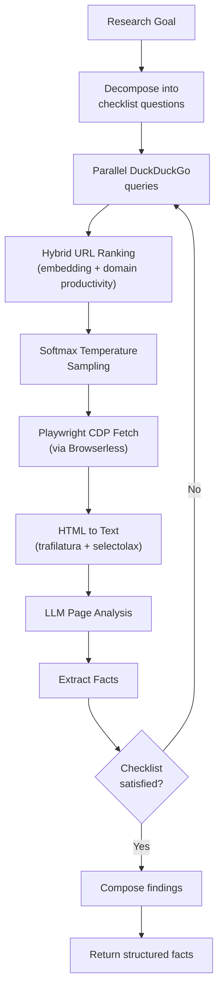
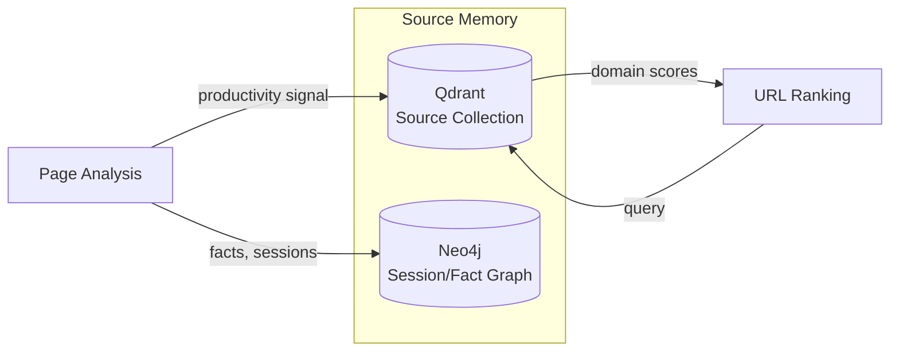
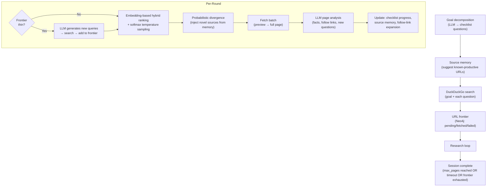

# Fathom Research Engine

Fathom is an autonomous web research service that performs goal-directed information gathering. It decomposes research questions into search queries, fetches and analyzes web pages, and returns structured facts with source attribution. Sonality delegates research tasks to Fathom when the agent determines that web information is needed to answer a question or form an opinion.

---

## Design Philosophy

Fathom operates on a single core principle: **zero heuristics**. Every judgment in the research pipeline is an LLM call. There are no hand-crafted rules for determining page relevance, no keyword-matching for fact extraction, no rule-based URL filtering. The rationale is that LLM judgment, while more expensive per-call, produces more robust and generalizable decisions than brittle heuristic systems.

This philosophy contrasts with traditional web research tools (Tavily, Perplexity, SerpAPI wrappers) which rely heavily on hand-tuned scoring functions, domain blocklists, and pattern-matching extractors.

**Blank Slate Principle**: Every research session starts with zero prior knowledge about the topic. No cross-session memory carries over within a session. The system discovers what works from scratch each time — whether the topic is quantum physics or medieval cooking. The only inputs are the research goal (text) and optionally seed URLs.

**Unified Loop (no phase separation)**: There is no separate "discovery phase" followed by a "research phase." Discovery and research are the same activity. A page reveals new links, new links open new sub-topics, sub-topics generate new search queries — all within the same continuous feedback loop. This prevents the rigid pipeline failure where a fixed "explore first, exploit second" design misses cross-cutting connections.

### Differentiation from Existing Systems

| System | Approach | Limitation | Fathom's Advantage |
|--------|----------|-----------|-------------------|
| Firecrawl | Web scraper with extraction | No reasoning about what to read next | LLM drives every navigation decision |
| GPT Researcher | Search → read top 5 → summarize | Deterministic; no exploration | Probabilistic sampling; each run explores different paths |
| STORM | Fixed pipeline: perspectives → questions → write | Rigid three-stage design | Unified loop where discovery/research feed into each other |
| Perplexity | Single-pass search + synthesis | No iterative deepening; no contradiction resolution | Iterates until checklist satisfied; resolves contradictions |
| Tavily / SerpAPI | API wrappers over search engines | Returns snippets, not deep analysis | Full page fetch + LLM content analysis |

Fathom's key architectural differentiator is that **no decision in the pipeline is rule-based**. URL relevance, page quality, fact extraction, source credibility, and research completeness are all LLM judgments. The code is pure orchestration and I/O.

---

## Research Loop

A research session follows this cycle:

Key aspects of the loop:

**Checklist-driven** --- The research goal is decomposed into specific questions that need answering. The loop continues until all checklist items are satisfied or the session budget (pages, time) is exhausted.

**Probabilistic URL selection** --- Rather than always choosing the top-ranked URLs, Fathom applies a softmax temperature to the ranking scores and samples from the resulting distribution. This introduces controlled exploration that prevents the system from getting stuck in local optima (always visiting the same high-authority domains).

**Progressive composition** --- Facts are accumulated incrementally. Each analyzed page can contribute new facts, confirm existing ones, or contradict previous findings. The final output is a synthesis of all accumulated evidence, not a single-pass summary.

---

## URL Ranking System

URL selection uses Reciprocal Rank Fusion (RRF) across two signals:

$$
\text{score}(u) = \frac{1}{k + \text{rank}_{\text{embedding}}(u)} + \frac{1}{k + \text{rank}_{\text{productivity}}(u)}
$$

Where:

- **Embedding rank** --- Cosine similarity between the query embedding and the URL/title/snippet embedding
- **Domain productivity** --- Historical success rate of the domain in previous research sessions (stored in source memory)
- $k$ --- Constant (typically 60) that controls the influence of rank position

The combined scores are then passed through a softmax with temperature parameter to produce a sampling distribution. Higher temperature increases exploration; lower temperature concentrates on top-ranked results.

---

## Source Memory

Fathom maintains cross-session memory about sources it has used:

When a page is analyzed, Fathom records:
- Whether the page yielded useful information (productivity)
- Which facts were extracted from it
- The domain's historical success rate

**Domain quality uses Bayesian smoothing** (Laplace/Beta prior):

$$
\text{quality\_rate}(d) = \frac{\text{quality\_sum}(d) + 1}{\text{visit\_count}(d) + 2}
$$

A new domain starts at 0.5 (uninformative prior). As visits accumulate, the rate converges toward the true productivity. This prevents cold-start penalization of domains that have been visited only once or twice.

When suggesting sources for a new research session, the scoring formula combines semantic relevance with domain quality:

$$
\text{suggestion\_score} = \text{cosine\_sim} \times \text{quality\_rate}^{0.5}
$$

The square-root power-law modulator ensures that low-quality domains are downweighted sub-linearly: a domain with 25% quality still contributes 50% of its semantic relevance, rather than being eliminated. This preserves the principle that *what* a page says matters more than *where* it comes from.

---

## Depth Presets

Research sessions are configured with depth presets that control resource allocation:

| Preset | Batch Size | Max Pages | Checklist Size | URL Pool | Use Case |
|--------|-----------|-----------|----------------|----------|----------|
| `glance` | 1 | 1 | 3 | 10 | Single-page fact verification |
| `quick` | 2 | 3 | 5 | 50 | Brief factual lookup |
| `focused` | 3 | 8 | 10 | 200 | Targeted analysis |
| `standard` | 6 | 30 | 25 | 1,500 | Normal research queries |
| `thorough` | 8 | 60 | 40 | 3,000 | Multi-faceted investigation |
| `deep` | 10 | 100 | 60 | 5,000 | Comprehensive coverage |
| `exhaustive` | 12 | 200 | 80 | 10,000 | Full-scale research |

The agent selects depth via the `web_research` tool definition. The tool description instructs the LLM to match depth to question complexity: "use glance/quick for simple facts, focused/standard for analysis, thorough/deep for comprehensive research requests." The URL pool size determines how many candidate URLs are evaluated before selection — larger pools produce more diverse source coverage.

---

## Session Execution Flow

Each research session follows a continuous loop without rigid phase boundaries:

Key design details:

- **Discovery is demand-driven** — New search queries are generated only when the frontier runs thin (< 3x batch size pending URLs), not on a fixed schedule
- **Probabilistic divergence** — After round 1, the system injects sources from memory that are semantically related to the goal but NOT already in the frontier. This prevents echo-chamber research by ensuring each session explores some novel domains
- **Preview-first fetching** — Before committing to a full page fetch, lightweight previews are retrieved to verify content quality. The first half of each batch proceeds unconditionally; the second half requires a successful preview
- **Follow-link expansion** — When page analysis identifies promising outbound links, they are added to the frontier for potential future rounds. This is how the unified loop enables cross-cutting discovery

---

## Content Extraction Pipeline

Fetched pages go through a multi-stage extraction process:

1. **Playwright fetch** --- CDP connection to Browserless headless Chromium; handles JavaScript rendering, infinite scrolls, and dynamic content
2. **trafilatura extraction** --- Primary HTML-to-text conversion; extracts main content while discarding navigation, ads, and boilerplate
3. **selectolax fallback** --- If trafilatura fails (timeout, parsing error), selectolax provides a fast DOM-based extraction
4. **LLM page analysis** --- The extracted text is analyzed by an LLM that identifies relevant facts, assesses source quality, and determines which checklist items the page addresses

This layered approach ensures robust extraction across diverse web content while keeping the primary path (trafilatura) fast and the fallback path (selectolax) reliable.

---

## API Contract

| Endpoint | Method | Description |
|----------|--------|-------------|
| `/research` | POST | Start a research session; returns `session_id` |
| `/research/{id}/stream` | GET | SSE stream of research progress events |
| `/research/{id}` | GET | Session status and accumulated facts |
| `/health` | GET | Service liveness |

Maximum concurrent sessions: **2**. This limit prevents resource exhaustion from parallel browser instances and ensures LLM inference bandwidth is available for the primary Sonality agent.

The SSE stream emits events for each research stage (searching, fetching, analyzing, fact extraction), allowing clients to display real-time research progress.

---

## Integration with Sonality

The `web_research` tool in Sonality acts as the integration point:

1. Agent decides research is needed during the agentic loop
2. `ResearchClient` sends a POST to Fathom's `/research` endpoint with the research goal and depth preset
3. SSE events are consumed and forwarded as agent progress events
4. Accumulated facts are formatted as the tool result
5. Mandatory consolidation distills the facts into LTM/STM entries

Fathom operates independently of Sonality's personality system. It has no awareness of the agent's beliefs or identity. This separation ensures that research results are not biased by the agent's existing opinions --- the agent applies its own judgment to Fathom's findings during the integration step.

---

## References

- DuckDuckGo search via `ddgs` library --- no API key required, avoids rate-limited commercial search APIs
- [Reciprocal Rank Fusion](https://cormack.uwaterloo.ca/cormacksigir09-rrf.pdf): Cormack, Clarke, and Buettcher (SIGIR 2009) --- standard approach for combining heterogeneous ranking signals
- Softmax temperature sampling for exploration/exploitation balance in information retrieval
- [Trafilatura](https://aclanthology.org/2021.acl-demo.15/): Barbaresi (ACL 2021) --- state-of-the-art boilerplate removal for web content extraction
- [Park et al. (2023)](https://arxiv.org/abs/2304.03442). "Generative Agents" --- reflection ablation showing 8 SD improvement in agent believability

See also: [Rejected Approaches](../design/rejected-approaches.md) for why heuristic scoring was replaced by LLM judgment, [Shared Infrastructure](shared.md) for RRF primitives.
