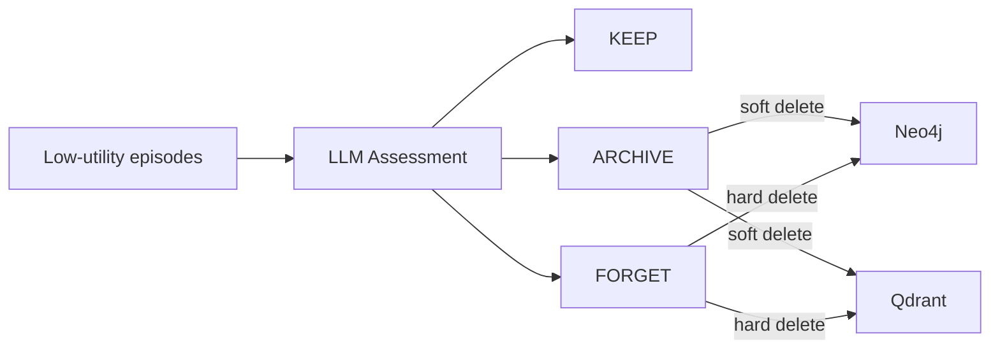

# Forgetting System

> **Module**: `sonality/memory/forgetting.py`

LLM-based memory pruning: KEEP, ARCHIVE (soft-delete), or FORGET (hard-delete).

## Flow



## Candidate Selection

```cypher
MATCH (e:Episode)
WHERE NOT e.archived 
  AND e.consolidation_level = 1
  AND e.created_at < datetime() - duration({minutes: 60})
ORDER BY e.utility_score ASC
LIMIT $limit  -- default: FORGETTING_CANDIDATE_LIMIT (10)
```

## Decision Criteria

Decisions are **LLM-driven** — the model receives candidate summaries alongside a personality snapshot excerpt and makes holistic judgments. There are no fixed numeric thresholds. The LLM considers epistemic value, access frequency, identity relevance, and redundancy when choosing KEEP, ARCHIVE, or FORGET for each candidate.

## Actions

| Action | Neo4j | Qdrant |
|--------|-------|--------|
| ARCHIVE | `archived=true, expired_at=now` | `archived=true` |
| FORGET | `DETACH DELETE` | Delete points |

## Integration

Runs from two entry points:
1. **Post-bookkeeping** — `_bookkeep()` in `agent.py` calls `run_forgetting(ctx)` after provenance
2. **During reflection** — `apply_reflection()` in `reflect.py` triggers forgetting after deep reflection

```python
candidates = await graph.get_forgetting_candidates(limit=config.FORGETTING_CANDIDATE_LIMIT)
if candidates:
    await assess_and_forget(candidates, graph, store, snapshot_excerpt)
```

## Error Handling

- LLM fails → KEEP all candidates
- Invalid/missing UID → KEEP (default)
- Delete fails → Log and continue
