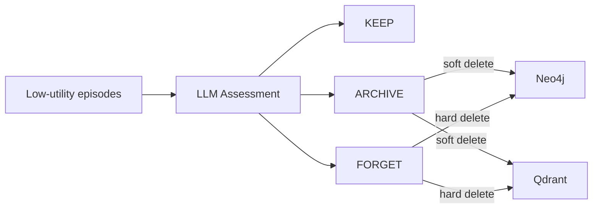

# Forgetting System

> **Module**: `sonality/memory/forgetting.py`

LLM-based memory pruning: KEEP, ARCHIVE (soft-delete), or FORGET (hard-delete).

## Flow



## Candidate Selection

```cypher
MATCH (e:Episode)
WHERE NOT e.archived 
  AND e.consolidation_level = 1
  AND e.created_at < datetime() - duration({minutes: 60})
ORDER BY e.utility_score ASC
LIMIT 20
```

## Decision Criteria

| Signal | KEEP | ARCHIVE | FORGET |
|--------|------|---------|--------|
| ESS Score | > 0.5 | 0.1-0.5 | < 0.1 |
| Access Count | > 2 | 1-2 | 0 |
| Topic | Unique | Common | Redundant |

## Actions

| Action | Neo4j | Qdrant |
|--------|-------|--------|
| ARCHIVE | `archived=true, expired_at=now` | `archived=true` |
| FORGET | `DETACH DELETE` | Delete points |

## Integration

Runs after reflection during `_apply_reflection()`:

```python
candidates = await graph.get_forgetting_candidates(limit=10)
if candidates:
    await assess_and_forget(candidates, graph, store, snapshot_excerpt)
```

## Error Handling

- LLM fails → KEEP all candidates
- Invalid/missing UID → KEEP (default)
- Delete fails → Log and continue
