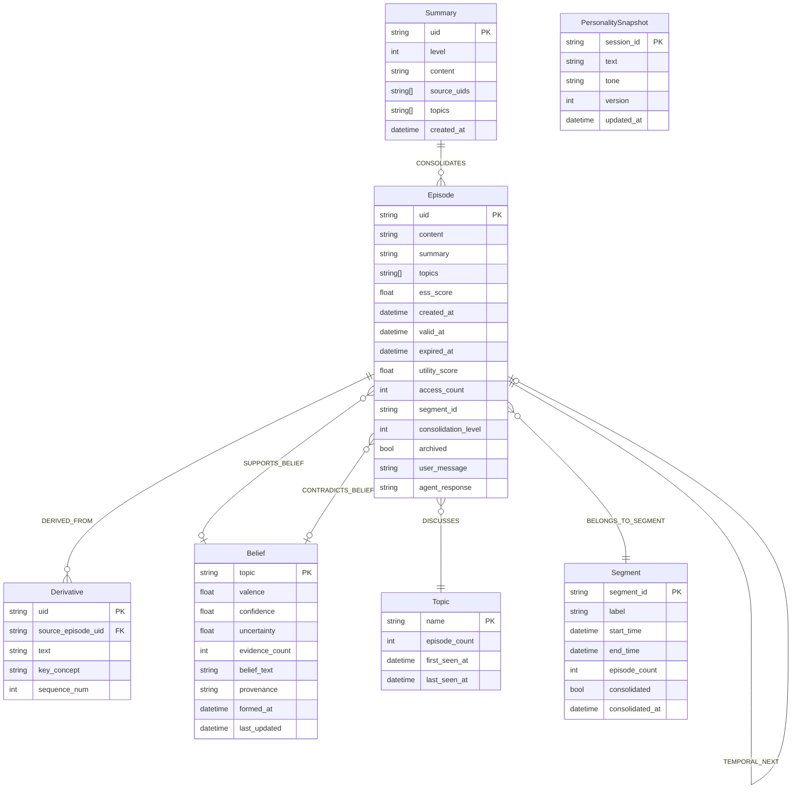

# Graph Operations Deep-Dive

> **Module**: `sonality/memory/graph.py`  
> **Purpose**: Neo4j-backed graph storage for episodes, derivatives, beliefs, and relationships

The `MemoryGraph` class provides the complete interface for Neo4j operations, managing the structured state of the agent's memory including episodes, beliefs, segments, and their interconnections.

## Node Types



## Edge Types

```python
class EdgeType(StrEnum):
    DERIVED_FROM = "DERIVED_FROM"           # Derivative -> Episode
    TEMPORAL_NEXT = "TEMPORAL_NEXT"         # Episode -> Episode (time order)
    DISCUSSES = "DISCUSSES"                  # Episode -> Topic
    SUPPORTS_BELIEF = "SUPPORTS_BELIEF"      # Episode -> Belief (positive evidence)
    CONTRADICTS_BELIEF = "CONTRADICTS_BELIEF" # Episode -> Belief (negative evidence)
    BELONGS_TO_SEGMENT = "BELONGS_TO_SEGMENT" # Episode -> Segment
    CONSOLIDATES = "CONSOLIDATES"            # Summary -> Episode
```

## Data Classes

### EpisodeNode

```python
@dataclass(frozen=True, slots=True)
class EpisodeNode:
    uid: str                    # UUID
    content: str                # Full text (User: ... Assistant: ...)
    summary: str                # ESS-generated summary
    topics: list[str]           # Subject-matter tags
    ess_score: float            # Evidence strength 0-1
    created_at: str             # ISO8601 timestamp
    valid_at: str               # Bi-temporal: when content became valid
    expired_at: str = ""        # Bi-temporal: when content became invalid
    utility_score: float = 0.0  # For forgetting prioritization
    access_count: int = 0       # Retrieval frequency
    last_accessed: str = ""     # Last retrieval timestamp
    segment_id: str = ""        # Conversation segment membership
    consolidation_level: int = 1 # 1=raw, 2+=summarized
    archived: bool = False      # Soft-delete flag
    user_message: str = ""      # Original user input
    agent_response: str = ""    # Original agent output
```

### BeliefNode

```python
@dataclass(frozen=True, slots=True)
class BeliefNode:
    topic: str                  # Lowercase topic identifier
    valence: float = 0.0        # -1.0 (oppose) to +1.0 (support)
    confidence: float = 0.5     # 0.0 to 1.0 certainty
    uncertainty: float = 0.5    # Complementary to confidence
    evidence_count: int = 0     # Number of supporting/contradicting episodes
    belief_text: str = ""       # Natural language belief statement
    provenance: str = ""        # Source of last update (e.g., "reflection:abc123")
```

### PersonalitySnapshot

```python
@dataclass(frozen=True, slots=True)
class PersonalitySnapshot:
    text: str = ""              # ~500 token personality narrative
    tone: str = "curious, direct, unpretentious"
    version: int = 0            # Monotonic version counter

# Seed snapshot for new agents
SEED_SNAPSHOT: Final = (
    "I am an AI entity forming genuine opinions through conversation and reflection. "
    "I value intellectual honesty and analytical thinking. I am direct about "
    "disagreement and do not default to agreement. My views are still forming "
    "as I accumulate evidence and experience."
)
```

## Atomic Episode Storage

The core write operation stores an episode with all related nodes and edges in a single transaction:

```python
async def store_episode_atomically(
    self,
    *,
    episode: EpisodeNode,
    derivatives: list[DerivativeNode],
    prev_episode_uid: str,
    topics: list[str],
    segment_id: str,
    segment_label: str,
) -> None:
    """Store episode + derivatives + graph links in one write transaction."""
    async with self._driver.session(database=_DB) as session:
        await session.execute_write(
            self._store_episode_atomically_tx,
            episode, derivatives, prev_episode_uid, topics, segment_id, segment_label,
        )
```

### Transaction Internals

```python
@staticmethod
async def _store_episode_atomically_tx(
    tx: AsyncManagedTransaction,
    episode: EpisodeNode,
    derivatives: list[DerivativeNode],
    prev_uid: str,
    topics: list[str],
    segment_id: str,
    segment_label: str,
) -> None:
    # 1. Create Episode node
    await tx.run("""
        CREATE (e:Episode {
            uid: $uid, content: $content, summary: $summary,
            topics: $topics, ess_score: $ess_score,
            created_at: $created_at, valid_at: $valid_at,
            expired_at: $expired_at, utility_score: $utility_score,
            access_count: $access_count, last_accessed: $last_accessed,
            segment_id: $segment_id, consolidation_level: $consolidation_level,
            archived: $archived, user_message: $user_message,
            agent_response: $agent_response
        })
        """, **episode_params)
    
    # 2. Create temporal chain edge
    if prev_uid:
        await tx.run("""
            MATCH (prev:Episode {uid: $prev_uid})
            MATCH (curr:Episode {uid: $curr_uid})
            CREATE (prev)-[:TEMPORAL_NEXT]->(curr)
            """, prev_uid=prev_uid, curr_uid=episode.uid)
    
    # 3. Create derivatives
    if derivatives:
        await MemoryGraph._create_derivatives_tx(tx, derivatives, episode.uid)
    
    # 4. Link topics
    for topic in topics:
        await MemoryGraph._link_topic_tx(tx, episode.uid, topic)
    
    # 5. Link segment
    if segment_id:
        await MemoryGraph._link_segment_tx(tx, episode.uid, segment_id, segment_label)
```

## Topic Management

Topics are MERGED (upserted) with metadata tracking:

```python
@staticmethod
async def _link_topic_tx(tx: AsyncManagedTransaction, episode_uid: str, topic: str) -> None:
    await tx.run("""
        MERGE (t:Topic {name: $topic})
        ON CREATE SET t.episode_count = 1, t.first_seen_at = datetime()
        ON MATCH SET t.episode_count = t.episode_count + 1
        SET t.last_seen_at = datetime()
        WITH t
        MATCH (e:Episode {uid: $uid})
        CREATE (e)-[:DISCUSSES]->(t)
        """, topic=topic.strip().lower(), uid=episode_uid)
```

## Segment Management

Segments group related episodes for consolidation:

```python
@staticmethod
async def _link_segment_tx(
    tx: AsyncManagedTransaction,
    episode_uid: str,
    segment_id: str,
    label: str,
) -> None:
    await tx.run("""
        MERGE (s:Segment {segment_id: $segment_id})
        ON CREATE SET s.label = $label, s.start_time = datetime(),
                      s.episode_count = 1, s.consolidated = false
        ON MATCH SET s.episode_count = s.episode_count + 1,
                     s.end_time = datetime(),
                     s.label = CASE
                        WHEN (s.label IS NULL OR s.label = '') AND $label <> ''
                        THEN $label ELSE s.label END
        WITH s
        MATCH (e:Episode {uid: $uid})
        CREATE (e)-[:BELONGS_TO_SEGMENT]->(s)
        """, segment_id=segment_id, label=label, uid=episode_uid)
```

## Belief Operations

### Upsert Belief

```python
async def upsert_belief(
    self,
    topic: str,
    *,
    valence: float,
    confidence: float,
    belief_text: str = "",
    uncertainty: float = -1.0,  # -1 = compute from confidence
    evidence_count: int = -1,   # -1 = increment existing
    provenance: str = "",
) -> None:
    """Create or update a Belief node with full personality state."""
    async with self._driver.session(database=_DB) as session:
        await session.run("""
            MERGE (b:Belief {topic: $topic})
            SET b.valence = $valence,
                b.confidence = $confidence,
                b.belief_text = CASE WHEN $belief_text <> '' THEN $belief_text 
                                     ELSE coalesce(b.belief_text, '') END,
                b.uncertainty = CASE WHEN $uncertainty >= 0 THEN $uncertainty 
                                     ELSE coalesce(b.uncertainty, 1.0 - $confidence) END,
                b.evidence_count = CASE WHEN $evidence_count >= 0 THEN $evidence_count 
                                        ELSE coalesce(b.evidence_count, 0) + 1 END,
                b.provenance = CASE WHEN $provenance <> '' THEN $provenance 
                                    ELSE coalesce(b.provenance, '') END,
                b.formed_at = coalesce(b.formed_at, datetime()),
                b.last_updated = datetime()
            """,
            topic=topic.strip().lower(),
            valence=max(-1.0, min(1.0, valence)),
            confidence=max(0.0, min(1.0, confidence)),
            belief_text=belief_text,
            uncertainty=uncertainty,
            evidence_count=evidence_count,
            provenance=provenance,
        )
```

### Link Belief Evidence

```python
async def link_belief(
    self,
    episode_uid: str,
    topic: str,
    *,
    edge_type: EdgeType,  # SUPPORTS_BELIEF or CONTRADICTS_BELIEF
    strength: float = 0.5,
    reasoning: str = "",
) -> None:
    """Create one belief provenance edge for an episode."""
    async with self._driver.session(database=_DB) as session:
        await session.execute_write(
            self._link_belief_tx, episode_uid, topic, edge_type, strength, reasoning
        )

@staticmethod
async def _link_belief_tx(...) -> None:
    await tx.run(f"""
        MERGE (b:Belief {{topic: $topic}})
        ON CREATE SET b.valence = 0.0, b.confidence = 0.5, b.uncertainty = 0.5,
                      b.evidence_count = 0, b.belief_text = '', b.provenance = '',
                      b.formed_at = datetime()
        SET b.evidence_count = coalesce(b.evidence_count, 0) + 1,
            b.last_updated = datetime()
        WITH b
        MATCH (e:Episode {{uid: $uid}})
        CREATE (e)-[:{edge_type} {{
            strength: $strength, reasoning: $reasoning, created_at: datetime()
        }}]->(b)
        """, topic=topic.strip().lower(), uid=episode_uid, strength=strength, reasoning=reasoning)
```

### Query Beliefs

```python
async def get_belief(self, topic: str) -> BeliefNode | None:
    """Fetch a single belief by topic."""
    async with self._driver.session(database=_DB) as session:
        result = await session.run(
            "MATCH (b:Belief {topic: $topic}) RETURN b",
            topic=topic.strip().lower(),
        )
        record = await result.single()
    return _record_to_belief(record["b"]) if record else None

async def get_top_beliefs(self, n: int = 15) -> list[BeliefNode]:
    """Fetch strongest beliefs ordered by absolute valence."""
    async with self._driver.session(database=_DB) as session:
        result = await session.run("""
            MATCH (b:Belief)
            WHERE b.valence IS NOT NULL
            RETURN b ORDER BY abs(b.valence) DESC LIMIT $n
            """, n=n)
        return [_record_to_belief(r["b"]) async for r in result]

async def format_beliefs_for_prompt(self, n: int = 15) -> str:
    """Build a formatted belief summary for the system prompt."""
    beliefs = await self.get_top_beliefs(n)
    if not beliefs:
        return "No beliefs formed yet."
    lines = []
    for b in beliefs:
        sign = "+" if b.valence >= 0 else ""
        entry = f"{b.topic}: {sign}{b.valence:.2f} (confidence: {b.confidence:.2f})"
        if b.evidence_count > 0:
            entry += f", evidence: {b.evidence_count}"
        lines.append(entry)
    return "\n".join(lines)
```

## Episode Retrieval

### Keyword-Based Search

```python
async def _keyword_episode_search(self, cypher: str, query: str, limit: int) -> list[EpisodeNode]:
    """Extract keywords and run Cypher template."""
    keywords = [t for t in re.split(r"[^a-z0-9]+", query.lower()) if len(t) > 2]
    if not keywords:
        return []
    async with self._driver.session(database=_DB) as session:
        result = await session.run(cypher, keywords=keywords[:8], limit=limit)
        return [_record_to_episode(r["e"]) async for r in result]

async def find_belief_related_episodes(self, query: str, *, limit: int = 20) -> list[EpisodeNode]:
    """Retrieve episodes attached to belief edges matching query keywords."""
    return await self._keyword_episode_search(f"""
        MATCH (e:Episode)-[:SUPPORTS_BELIEF|CONTRADICTS_BELIEF]->(b:Belief)
        WHERE NOT e.archived
          AND ANY(keyword IN $keywords WHERE toLower(b.topic) CONTAINS keyword)
        RETURN DISTINCT e ORDER BY e.utility_score DESC, e.created_at DESC LIMIT $limit
    """, query, limit)

async def find_topic_related_episodes(self, query: str, *, limit: int = 20) -> list[EpisodeNode]:
    """Retrieve episodes by traversing Topic nodes relevant to query keywords."""
    return await self._keyword_episode_search(f"""
        MATCH (e:Episode)-[:DISCUSSES]->(t:Topic)
        WHERE NOT e.archived
          AND ANY(keyword IN $keywords WHERE toLower(t.name) CONTAINS keyword)
        RETURN DISTINCT e ORDER BY e.utility_score DESC, e.created_at DESC LIMIT $limit
    """, query, limit)
```

### Temporal Context Expansion

```python
async def traverse_temporal_context(
    self,
    episode_uid: str,
    *,
    before: int = 2,
    after: int = 2,
) -> list[EpisodeNode]:
    """Retrieve temporally adjacent non-archived episodes for context expansion."""
    async with self._driver.session(database=_DB) as session:
        result = await session.run(f"""
            MATCH (focal:Episode {{uid: $uid}})
            OPTIONAL MATCH path_before = (prev:Episode)-[:TEMPORAL_NEXT*1..{before}]->(focal)
              WHERE NOT prev.archived
            OPTIONAL MATCH path_after = (focal)-[:TEMPORAL_NEXT*1..{after}]->(next:Episode)
              WHERE NOT next.archived
            WITH focal,
                 COLLECT(DISTINCT prev) AS befores,
                 COLLECT(DISTINCT next) AS afters
            RETURN befores, focal, afters
            """, uid=episode_uid)
        record = await result.single()
        if not record:
            return []
        # Combine before + focal + after episodes
        episodes = [_record_to_episode(n) for n in record["befores"]]
        episodes.append(_record_to_episode(record["focal"]))
        episodes.extend(_record_to_episode(n) for n in record["afters"])
        return episodes
```

## Forgetting Support

### Get Candidates for Forgetting

```python
async def get_forgetting_candidates(
    self, *, limit: int = 20, min_age_minutes: int = 60
) -> list[EpisodeNode]:
    """Fetch low-utility raw episodes eligible for forgetting assessment."""
    async with self._driver.session(database=_DB) as session:
        result = await session.run("""
            MATCH (e:Episode)
            WHERE NOT e.archived AND e.consolidation_level = 1
              AND e.created_at < datetime() - duration({minutes: $min_age_minutes})
            RETURN e
            ORDER BY e.utility_score ASC, e.created_at ASC
            LIMIT $limit
            """, limit=limit, min_age_minutes=min_age_minutes)
        return [_record_to_episode(r["e"]) async for r in result]
```

### Archive and Delete

```python
async def archive_episode(self, episode_uid: str) -> None:
    """Soft-archive an episode (set archived=True)."""
    async with self._driver.session(database=_DB) as session:
        await session.run("""
            MATCH (e:Episode {uid: $uid})
            SET e.archived = true, e.expired_at = datetime()
            """, uid=episode_uid)

async def delete_episode(self, episode_uid: str) -> None:
    """Hard-delete an episode and its derivative nodes."""
    async with self._driver.session(database=_DB) as session:
        await session.run("""
            MATCH (e:Episode {uid: $uid})
            OPTIONAL MATCH (d:Derivative)-[:DERIVED_FROM]->(e)
            DETACH DELETE d, e
            """, uid=episode_uid)
```

## Summary Creation

```python
async def create_summary(
    self,
    uid: str,
    level: int,
    content: str,
    source_uids: list[str],
    topics: list[str],
) -> None:
    """Create a Summary node with CONSOLIDATES edges."""
    async with self._driver.session(database=_DB) as session:
        await session.execute_write(
            self._create_summary_tx, uid, level, content, source_uids, topics
        )

@staticmethod
async def _create_summary_tx(...) -> None:
    # Create Summary node
    await tx.run("""
        CREATE (s:Summary {
            uid: $uid, level: $level, content: $content,
            source_uids: $source_uids, topics: $topics,
            created_at: datetime()
        })
        """, uid=uid, level=level, content=content, source_uids=source_uids, topics=topics)
    
    # Link to source episodes
    for source_uid in source_uids:
        await tx.run("""
            MATCH (s:Summary {uid: $summary_uid})
            MATCH (e:Episode {uid: $source_uid})
            CREATE (s)-[:CONSOLIDATES]->(e)
            """, summary_uid=uid, source_uid=source_uid)
```

## Personality Snapshot

```python
async def get_personality_snapshot(self) -> PersonalitySnapshot:
    """Load the agent's identity narrative from graph, or return seed defaults."""
    async with self._driver.session(database=_DB) as session:
        result = await session.run(
            "MATCH (n:PersonalitySnapshot {session_id: 'default'}) RETURN n"
        )
        record = await result.single()
    if not record:
        return PersonalitySnapshot(text=SEED_SNAPSHOT)
    props = dict(record["n"])
    return PersonalitySnapshot(
        text=str(props.get("text", SEED_SNAPSHOT)),
        tone=str(props.get("tone", "curious, direct, unpretentious")),
        version=int(props.get("version", 0)),
    )

async def upsert_personality_snapshot(self, text: str) -> None:
    """Write or update the agent's identity narrative."""
    async with self._driver.session(database=_DB) as session:
        await session.run("""
            MERGE (n:PersonalitySnapshot {session_id: 'default'})
            SET n.text = $text,
                n.tone = coalesce(n.tone, 'curious, direct, unpretentious'),
                n.version = coalesce(n.version, 0) + 1,
                n.updated_at = datetime()
            """, text=text)
```

## Utility Functions

### Episode Formatting

```python
def format_episode_line(
    *, created_at: str, summary: str, content: str, content_limit: int = 300,
) -> str:
    """Render one compact context line for retrieval/reflection."""
    date_text = created_at[:10] if created_at else "?"
    return f"[{date_text}] {summary or content[:content_limit]}"

def format_episode_block(
    *, created_at: str, content: str, content_limit: int = 500,
) -> str:
    """Render one dated episode content block for summarization prompts."""
    date_text = created_at[:10] if created_at else "?"
    return f"[{date_text}]\n{content[:content_limit]}"
```

### Record Conversion

```python
def _record_to_episode(node: Mapping[str, object]) -> EpisodeNode:
    """Convert a Neo4j node to an EpisodeNode dataclass."""
    props = dict(node)
    topics_raw = props.get("topics", [])
    topics = list(topics_raw) if isinstance(topics_raw, (list, tuple)) else []
    # ... handle all fields with type coercion ...
    return EpisodeNode(
        uid=str(props.get("uid", "")),
        content=str(props.get("content", "")),
        # ... etc
    )

def _record_to_belief(node: Mapping[str, object]) -> BeliefNode:
    """Convert a Neo4j Belief node to a BeliefNode dataclass."""
    props = dict(node)
    # ... type coercion for all fields ...
    return BeliefNode(
        topic=str(props.get("topic", "")),
        valence=float(valence_raw) if isinstance(valence_raw, (int, float, str)) else 0.0,
        # ... etc
    )
```

## Query Patterns Summary

| Operation | Cypher Pattern |
|-----------|----------------|
| Find by topic | `MATCH (e:Episode)-[:DISCUSSES]->(t:Topic {name: $topic})` |
| Find by belief | `MATCH (e:Episode)-[:SUPPORTS_BELIEF\|CONTRADICTS_BELIEF]->(b:Belief)` |
| Temporal chain | `MATCH (e)-[:TEMPORAL_NEXT*1..N]->(next)` |
| Segment members | `MATCH (e:Episode)-[:BELONGS_TO_SEGMENT]->(s:Segment)` |
| Belief evidence | `MATCH (e:Episode)-[r:SUPPORTS_BELIEF]->(b:Belief) RETURN r.strength` |

## Related Documentation

- [Database Schema](database-schema.md) - Complete schema definitions
- [Dual Store Operations](dual-store-operations.md) - Combined Neo4j + Qdrant storage
- [Belief Provenance](belief-provenance.md) - Evidence assessment system
- [Segmentation](segmentation.md) - Segment and consolidation
- [Agent Core](agent-core.md) - How the graph is used by the agent
