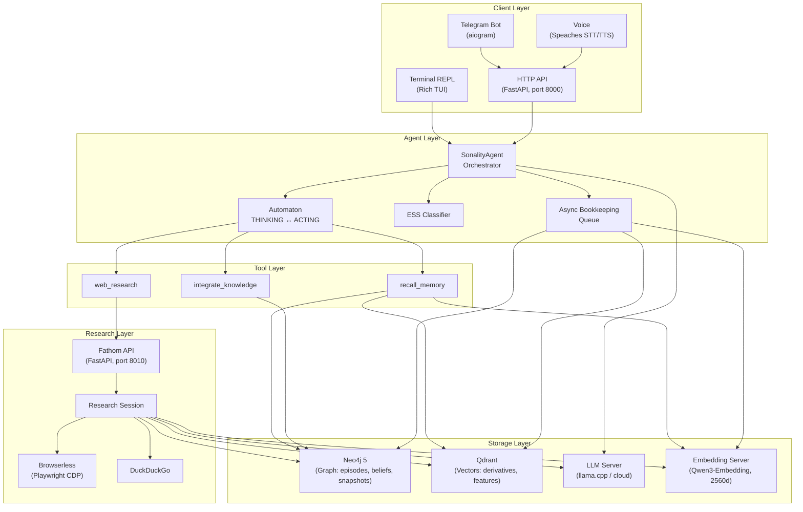
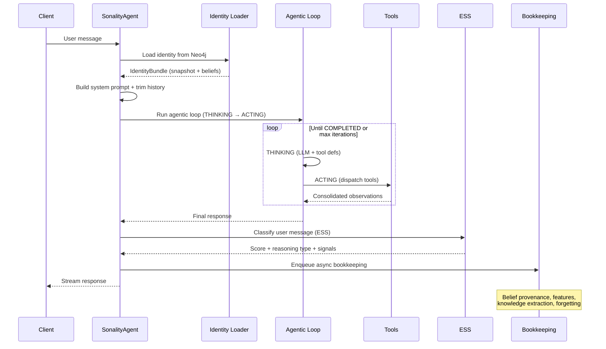
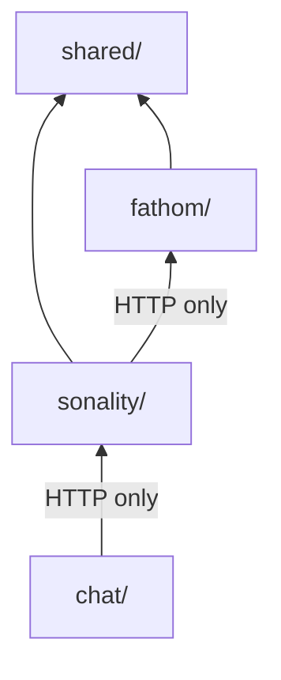
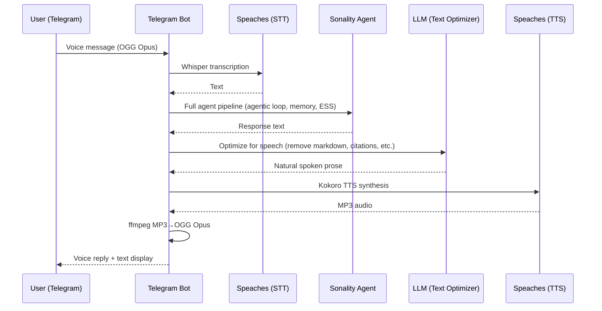

# Architecture Overview

Sonality is a stateless agent that reconstructs its personality from persistent storage on every request. This section describes the system topology, request lifecycle, and how the four packages cooperate to deliver evolving personality behavior.

## System Topology

## Request Lifecycle

Every incoming message follows a deterministic pipeline:

### Phase Details

1. **Identity loading** — `request_identity` fetches the current personality snapshot and belief vectors from Neo4j, cached per-request via `ContextVar`.

2. **Prompt assembly** — `prompts.build_system_prompt` combines immutable core identity, the mutable ~500-token snapshot, structured belief state, and retrieved memory context.

3. **Token budgeting** — `token_budget.summarize_and_trim` ensures conversation history fits within the model's effective context (65% of maximum, accounting for system prompt and response reserve).

4. **Agentic loop** — A two-phase state machine (`automaton.py`) alternates between THINKING (LLM generates reasoning + tool calls) and ACTING (tools execute, output is consolidated into concise observations). Maximum 12 iterations.

5. **ESS classification** — After response generation, the user's message is evaluated for argument quality. Third-person framing prevents sycophancy bias in self-evaluation.

6. **Bookkeeping** — Non-blocking async pipeline handles: belief provenance assessment, semantic feature extraction, knowledge proposition storage, episode chunking, and forgetting evaluation.

## Package Dependency Rules

- `shared` has no internal dependencies — it provides LLM, embedding, Neo4j, and Qdrant primitives
- `sonality` imports from `shared` but never from `fathom` or `chat`
- `fathom` imports from `shared` but never from `sonality`
- `chat` communicates with `sonality` exclusively via HTTP (no direct imports)
- `sonality` communicates with `fathom` exclusively via HTTP/SSE

This layering ensures each package can be deployed, tested, and scaled independently.

### Data Ownership

Each package owns a distinct slice of the persistent state:

| Owner | Data | Storage | Accessed By |
|-------|------|---------|-------------|
| `sonality` | Episodes, beliefs, personality snapshots, knowledge, features | Neo4j + Qdrant | `sonality` only |
| `fathom` | Source memory (domain productivity), research sessions | Neo4j + Qdrant (separate collections) | `fathom` only |
| `shared` | None (stateless primitives) | --- | --- |
| `chat` | Conversation history (client-side, ephemeral) | In-memory per session | `chat` only |

Fathom's source memory and Sonality's episode memory share Neo4j and Qdrant instances but use separate collections and graph labels. No cross-package data reads occur at the storage level — all inter-package communication flows through HTTP APIs.

## Concurrency Model

The system manages concurrency across multiple boundaries:

| Boundary | Mechanism | Rationale |
|----------|-----------|-----------|
| LLM HTTP calls | `threading.Semaphore(1)` | Prevents overwhelming single-threaded local inference servers |
| Async LLM/embedding | `asyncio.Semaphore` | Controls concurrent requests to cloud endpoints |
| Bookkeeping | Dedicated background thread with own event loop | Non-blocking post-response work |
| Neo4j | Async driver with connection pool (configurable size) | Shared across all subsystems |
| Qdrant | Async client per worker | Eliminates cross-loop contention |

The `SonalityAgent` maintains a dedicated `asyncio` event loop in a background thread, bridged to synchronous callers via `_run_async`. This allows the CLI (synchronous) and API (async) to share the same agent instance.

**Streaming bridge**: The agent exposes a synchronous generator (`respond_stream()`) that yields text deltas and progress events. The FastAPI server runs this generator inside `asyncio.to_thread(next, ...)` to avoid blocking the event loop, enabling multiple SSE streams without thread starvation. Research progress from Fathom (which runs on the agent's async loop) crosses thread boundaries via a `threading.Queue` with deadline-based cancel and partial-fact recovery on stream failure.

## Data Flow Summary

| Data | Source | Destination | Trigger |
|------|--------|-------------|---------|
| Personality snapshot | Neo4j | System prompt | Every request |
| Belief vectors | Neo4j | System prompt + tools | Every request |
| Episode derivatives | Qdrant | Retrieval pipeline | `recall_memory` tool |
| Web research facts | Fathom → Neo4j/Qdrant | Agent context | `web_research` tool |
| ESS classification | LLM structured call | Bookkeeping gate | Post-response |
| Belief provenance | LLM assessment | Neo4j edges | Bookkeeping (when ESS passes) |
| Semantic features | LLM extraction | Qdrant | Bookkeeping |
| Knowledge propositions | LLM extraction | Neo4j | Bookkeeping |
| Forgetting decisions | LLM batch assessment | Neo4j archival flags | Bookkeeping |

## Communication Protocols

| From | To | Protocol | Purpose |
|------|-----|----------|---------|
| Clients | Sonality | HTTP + SSE | Chat completions, ingest, belief queries |
| Sonality | Fathom | HTTP + SSE | Research delegation with streaming progress |
| Sonality | Neo4j | Bolt (async driver) | Graph reads/writes for episodes, beliefs, snapshots |
| Sonality | Qdrant | gRPC/HTTP | Vector upsert and similarity search |
| Sonality | LLM | HTTP (OpenAI-compatible) | All reasoning and classification calls |
| Fathom | Browserless | CDP (WebSocket) | Page fetching via headless Chromium |

## Failure Boundaries

Each service handles failures independently with a "never raise to the user" philosophy:

- **Fathom unavailable** --- The `web_research` tool returns a failure message; the agent continues with existing memory context.
- **Neo4j down** --- Agent cannot load identity or store episodes; requests fail gracefully with health check degradation.
- **Qdrant down** --- Vector retrieval returns empty results; the agent operates with reduced context but remains functional.
- **LLM timeout** --- Exponential backoff with jitter; structured calls return typed fallback values on exhaustion. Terminal HTTP statuses (4xx) short-circuit retries.
- **Partial retrieval** --- Episode store and knowledge store fail independently; the pipeline returns whatever succeeded rather than failing entirely.
- **Tool dispatch** --- No tool exception propagates to the loop. Unknown tools and execution errors are converted to string results that inform the LLM.
- **Bookkeeping failure** --- Post-response memory writes are fire-and-forget; individual pipeline stage failures are logged but do not affect subsequent stages.

The system degrades gracefully rather than failing catastrophically. A partial stack (missing Fathom or embedding server) produces a functional but reduced-capability agent.

## Client Layer

The `chat` package provides multiple client implementations, each tailored to a different interaction modality:

| Client | Interface | Capabilities |
|--------|-----------|-------------|
| Terminal TUI | Rich Live panels, command-line | Streaming progress display, `/beliefs` and `/health` commands, conversation persistence |
| Telegram Bot | aiogram, per-user client pool (1h idle TTL) | Voice messages (STT → chat → TTS), streaming edits, group-aware |
| Voice | Speaches integration | Whisper STT, Kokoro TTS with LLM-optimized text, ffmpeg MP3→OGG conversion |

### Voice Pipeline

The voice interaction flow is a multi-stage pipeline that bridges speech and text modalities while preserving full personality capabilities:

**Design decision:** The LLM optimization step is not simple formatting removal — it rewrites the response as flowing prose with natural pauses, varied sentence openings, and no formatting artifacts. This produces speech that sounds authored rather than read aloud from a document. The rewrite uses `compose_guarded` for context-budget-safe operation.

## Further Reading

- [Sonality Engine](sonality.md) --- Agent orchestrator, automaton, ESS, bookkeeping
- [Fathom Research](fathom.md) --- Autonomous web research with source tracking
- [Memory System](memory.md) --- Dual-store design, schema, write/read paths
- [Shared Infrastructure](shared.md) --- LLM provider, embeddings, RRF, error handling
