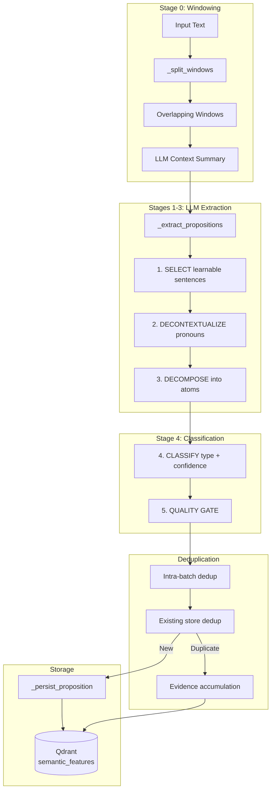
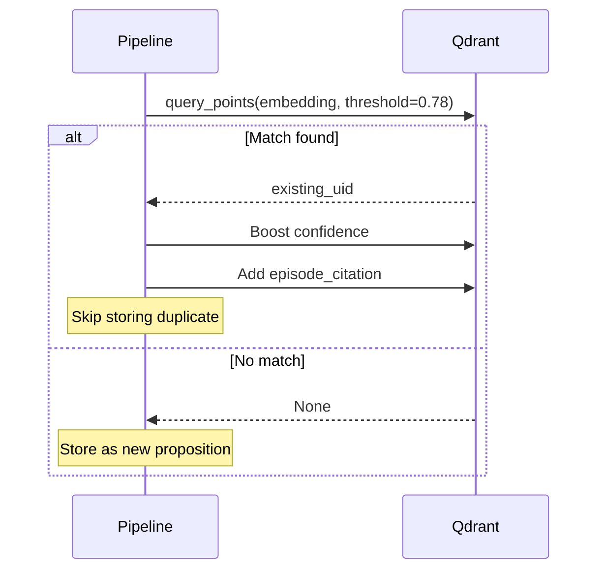

# Knowledge Extraction Pipeline

This document covers the SLIDE-inspired knowledge proposition extraction, deduplication, and storage system.

## Pipeline Overview



## Configuration Constants

```python
WINDOW_SIZE_WORDS = 1500           # Words per window
WINDOW_OVERLAP_RATIO = 0.20        # 20% overlap between windows
DEDUP_THRESHOLD_EXISTING = 0.78    # Cosine similarity for existing dedup
DEDUP_THRESHOLD_INTRABATCH = 0.82  # Tighter threshold for same-batch dedup
```

## Stage 0: Sliding Window with Context Summaries

Based on **SLIDE (2025)** — LLM context summaries outperform naive word overlap:

```python
def _split_windows(text: str) -> list[tuple[str, str]]:
    """Split text into overlapping windows with LLM-generated context summaries.
    
    Returns (window_text, preceding_context_summary) tuples.
    """
    words = text.split()
    if len(words) <= WINDOW_SIZE_WORDS:
        return [(text, "")]
    
    overlap = int(WINDOW_SIZE_WORDS * WINDOW_OVERLAP_RATIO)
    stride = WINDOW_SIZE_WORDS - overlap
    windows: list[tuple[str, str]] = []
    prev_summary = ""
    
    for start in range(0, len(words), stride):
        chunk = words[start : start + WINDOW_SIZE_WORDS]
        window_text = " ".join(chunk)
        windows.append((window_text, prev_summary))
        
        if start + WINDOW_SIZE_WORDS >= len(words):
            break
        
        # Generate LLM summary for next window's context
        result = default_provider.chat_completion(
            model=config.FAST_LLM_MODEL,
            messages=({
                "role": "user",
                "content": WINDOW_CONTEXT_SUMMARY_PROMPT.format(text=window_text[:3000]),
            },),
            max_tokens=config.LLM_MAX_TOKENS,
        )
        prev_summary = result.text.strip()
    
    return windows
```

**Benefit:** 24-39% better entity/fact extraction than naive chunking.

## Stages 1-5: LLM Extraction

The extraction prompt implements five stages:

### Stage 1: SELECT

Identify sentences containing learnable information:
- Facts, data, mechanisms
- Attributed opinions, scientific claims
- Skip: greetings, filler, meta-commentary

**Indirect Attribution:**
> "my friend told me X" → Extract with confidence 0.25-0.45

### Stage 2: DECONTEXTUALIZE

Make sentences fully standalone:
- Replace ALL pronouns with explicit referents
- "It was discovered in 1889" → "The Eiffel Tower was discovered in 1889"

### Stage 3: DECOMPOSE

Split into **molecular propositions**:
- Each contains exactly ONE factoid
- Self-contained (no context needed)
- Includes subjects, dates, units, sources

### Stage 4: CLASSIFY

Assign type and calibrate confidence:

| Type | Description | Confidence Range |
|------|-------------|------------------|
| `fact` | Objectively verifiable | 0.15-0.95 |
| `opinion` | Subjective judgment | 0.15-0.84 |
| `speculation` | Hedged/uncertain claim | 0.01-0.64 |
| `noise` | Filler (excluded) | - |

**Confidence Calibration:**
```
0.85-0.95: Named reputable source + concrete data
0.65-0.84: Specific but informal source
0.40-0.64: General claim without attribution
0.15-0.39: Vague or dubious source
0.01-0.14: Extraordinary claims or rebutted claims
```

### Stage 5: QUALITY GATE

Checklist before including any proposition:
- **SUBJECT**: Names specific entity? No pronouns?
- **STANDALONE**: Understandable without context?
- **ATOMIC**: One factoid, not joined with "and"?
- **ATTRIBUTED**: Source named or clearly unattributed?

## ExtractedProposition Model

```python
class PropositionType(StrEnum):
    FACT = "fact"
    OPINION = "opinion"
    SPECULATION = "speculation"
    NOISE = "noise"

class ExtractedProposition(BaseModel):
    text: str
    type: PropositionType = PropositionType.FACT
    confidence: float = 0.5
    key_concepts: list[str] = Field(default_factory=list)
    negation: bool = False  # True if REBUTTAL/DENIAL
```

## Deduplication

### Intra-Batch Deduplication

When multi-window extraction produces overlapping facts:

```python
def _deduplicate_intrabatch(
    propositions: list[ExtractedProposition],
    embeddings: list[list[float]],
) -> list[tuple[ExtractedProposition, list[float]]]:
    """Remove near-duplicate propositions within same batch.
    
    Uses tighter threshold (0.82) since intra-batch duplicates
    are usually near-identical reformulations.
    """
    kept = []
    for prop, emb in zip(propositions, embeddings):
        match_idx = next(
            (i for i, (_, ke) in enumerate(kept)
             if cosine_similarity(emb, ke) > DEDUP_THRESHOLD_INTRABATCH),
            None,
        )
        if match_idx is None:
            kept.append((prop, emb))
        elif prop.confidence > kept[match_idx][0].confidence:
            kept[match_idx] = (prop, emb)  # Replace with higher confidence
    return kept
```

### Existing Store Deduplication

Dedup against existing knowledge with evidence accumulation:



**Evidence Accumulation (MMA 2025):**
When a proposition matches an existing one:
1. Boost the existing entry's confidence
2. Add the new episode to `episode_citations`
3. Update `updated_at` timestamp

## Storage

### Tag Mapping

```python
_TAG_MAP = {
    PropositionType.FACT: "Verified Facts",
    PropositionType.OPINION: "Attributed Opinions",
    PropositionType.SPECULATION: "Speculative Claims",
}
```

### Deterministic UID

Same proposition text always maps to same UID:

```python
seed = f"semantic:knowledge:{prop.text.strip().lower()[:120]}"
uid = str(uuid.uuid5(uuid.NAMESPACE_URL, seed))
```

**Prevents:** Duplicate storage when same fact classified under different tags.

### Qdrant Point Structure

```python
point = PointStruct(
    id=uid,
    vector={DENSE_VECTOR: embedding},
    payload={
        "uid": uid,
        "category": SemanticCategory.KNOWLEDGE,
        "tag": "Verified Facts",
        "feature_name": "Climate Science | IPCC",
        "value": "Global temperatures rose 1.1°C since pre-industrial era.",
        "episode_citations": ["ep-abc123", "ep-def456"],
        "confidence": 0.85,
        "created_at": "2025-04-26T10:00:00Z",
        "updated_at": "2025-04-26T12:00:00Z",
    },
)
```

### Negation Handling

Rebutted claims are prefixed:

```python
text_to_store = f"[REBUTTAL] {prop.text}" if prop.negation else prop.text
```

## Knowledge Retrieval

For injecting into system prompts:

```python
async def retrieve_relevant_knowledge(
    query: str,
    qdrant: AsyncQdrantClient,
    embedder: Embedder,
    top_k: int = 8,
    min_confidence: float = 0.3,
) -> list[str]:
    """Retrieve stored knowledge relevant to a query."""
    query_embedding = embedder.embed_query(query)
    
    response = await qdrant.query_points(
        collection_name=Collection.SEMANTIC_FEATURES,
        query=query_embedding,
        query_filter=Filter(
            must=[FieldCondition(
                key="category",
                match=MatchValue(value=SemanticCategory.KNOWLEDGE)
            )]
        ),
        limit=top_k,
        score_threshold=min_confidence,
    )
    
    return [
        f"[{p.payload['tag']}] (confidence={p.payload['confidence']:.2f}) {p.payload['value']}"
        for p in response.points
    ]
```

**Output Example:**
```
[Verified Facts] (confidence=0.85) Global temperatures rose 1.1°C since pre-industrial era according to IPCC AR6.
[Attributed Opinions] (confidence=0.62) User believes nuclear power is essential for decarbonization.
```

## Full Pipeline

```python
async def extract_and_store_knowledge(
    text: str,
    episode_uid: str,
    qdrant: AsyncQdrantClient,
    embedder: Embedder,
) -> int:
    """Full pipeline: window → extract → dedup → store."""
    
    # Stage 0: Split into windows
    windows = _split_windows(text)
    
    # Stages 1-5: Extract from each window
    all_propositions = []
    for window_text, preceding_context in windows:
        props = _extract_propositions(window_text, preceding_context)
        all_propositions.extend(props)
    
    if not all_propositions:
        return 0
    
    # Embed all propositions
    texts = [p.text for p in all_propositions]
    embeddings = embedder.embed_documents(texts)
    
    # Intra-batch dedup
    batch = _deduplicate_intrabatch(all_propositions, embeddings)
    
    # Dedup against existing + evidence boost
    kept = await _deduplicate_against_existing(batch, qdrant, episode_uid)
    
    # Persist new propositions
    stored = 0
    for prop, emb in kept:
        await _persist_proposition(qdrant, prop, emb, episode_uid)
        stored += 1
    
    return stored
```

## Logging Summary

```
Knowledge extraction: 12 extracted, 3 intra-dedup, 4 evidence-boosted, 5 new stored
```

| Metric | Meaning |
|--------|---------|
| `extracted` | Total propositions from LLM |
| `intra-dedup` | Removed as within-batch duplicates |
| `evidence-boosted` | Matched existing, boosted confidence |
| `new stored` | Novel propositions persisted |

## Integration Point

Called from `agent._extract_knowledge()` when ESS determines `knowledge_density > NONE`:

```python
if ess.knowledge_density != KnowledgeDensity.NONE:
    stored = await extract_and_store_knowledge(
        text=user_message,
        episode_uid=episode.uid,
        qdrant=self._qdrant,
        embedder=self._embedder,
    )
```
