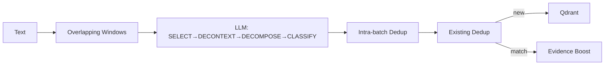

# Knowledge Extraction

SLIDE-inspired proposition extraction with deduplication and evidence accumulation.

## Pipeline



## Configuration

```python
WINDOW_SIZE_WORDS = 1500
WINDOW_OVERLAP_RATIO = 0.20
DEDUP_THRESHOLD_EXISTING = 0.78
DEDUP_THRESHOLD_INTRABATCH = 0.82
```

## Extraction Stages

1. **SELECT** — Identify learnable sentences (facts, attributed opinions)
2. **DECONTEXTUALIZE** — Replace pronouns with explicit referents
3. **DECOMPOSE** — Split into atomic propositions (one factoid each)
4. **CLASSIFY** — Assign type and confidence
5. **QUALITY GATE** — Verify standalone, atomic, attributed

## Proposition Types

| Type | Confidence Range |
|------|------------------|
| `fact` | 0.15-0.95 |
| `opinion` | 0.15-0.84 |
| `speculation` | 0.01-0.64 |
| `noise` | excluded |

## Deduplication

- **Intra-batch** (0.82 threshold): Remove near-identical reformulations
- **Existing store** (0.78 threshold): Match → boost confidence + add citation

## Storage

```python
payload = {
    "category": "KNOWLEDGE",
    "tag": "Verified Facts",
    "value": "Global temperatures rose 1.1°C since pre-industrial era.",
    "confidence": 0.85,
    "episode_citations": ["ep-abc123"],
}
```

Deterministic UID: Same text → same UUID.

## Retrieval

```python
async def retrieve_relevant_knowledge(query, top_k=8, min_confidence=0.3):
    # Vector search on semantic_features, filtered by category=KNOWLEDGE
```

## Integration

Called when `ess.knowledge_density != NONE`.
