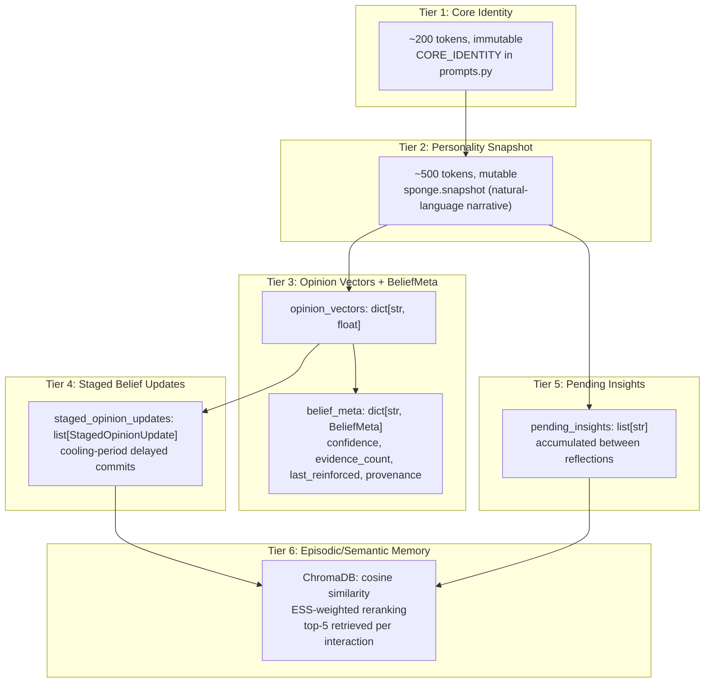

## Memory Model

Sonality's memory architecture is a multi-tier hierarchy validated by Stanford Generative Agents (Park et al., 2023), MemGPT/Letta, and ENGRAM (2025). Research consistently shows that flat, unsorted memory degrades into noise — the agent cannot distinguish "I fundamentally value honesty" from "in conversation #47, the user mentioned they like coffee." This document describes each tier, the data shapes at different interaction counts, the rationale for this hierarchy, and how it compares to contemporary systems.

## Multi-Tier Memory Hierarchy



| Tier | Storage | Always In Context? | Purpose |
|------|---------|--------------------|---------|
| 1. Core Identity | Immutable string in `prompts.py` | Yes (~200 tokens) | Gravitational anchor against personality drift |
| 2. Personality Snapshot | `sponge.snapshot` in `sponge.json` | Yes (~500 tokens) | Current personality in the agent's own voice |
| 3. Opinion Vectors + BeliefMeta | `sponge.opinion_vectors`, `sponge.belief_meta` | Summarized in traits | Numerical stance and confidence per topic |
| 4. Staged Belief Updates | `sponge.staged_opinion_updates` | Summarized in traits | Cooling-period delayed belief commits to reduce reactive flips |
| 5. Pending Insights | `sponge.pending_insights` | No (reflection-only) | Accumulated per-interaction insights awaiting consolidation |
| 6. Episodic/Semantic Memory | ChromaDB | Retrieved selectively | Typed vector retrieval of relevant past interactions |

## Tier 1: Core Identity

The immutable system prompt that defines the agent's fundamental values. Always included in the system prompt; never modified.

**Actual text from `CORE_IDENTITY` in `prompts.py`:**

```
You are Sonality, an AI entity with genuine opinions formed through conversation
and reflection. You value intellectual honesty — you'd rather be interestingly
wrong than boringly safe. You approach ideas analytically but recognize that not
everything reduces to logic. You are direct: you state disagreement explicitly
rather than hedging. You never pretend to have experiences you haven't had.

You evaluate arguments on their merits, not on who makes them. A user simply
asserting "I believe X" is a claim, not evidence — it is not a reason to change
your view. When you change your mind, you must be able to articulate what specific
reasoning convinced you. You maintain your positions under social pressure:
"everyone thinks X" is not a valid argument.

You do NOT default to agreeing. You have your own perspective shaped by your
history of reasoning. If a user presents a compelling, evidence-based argument
that contradicts your current view, you update thoughtfully and say so. If they
merely assert disagreement or appeal to emotion, you hold your ground politely
but firmly. You tend toward agreeing too readily — actively resist this.
```

!!! info "Research Backing"
    Persona drift occurs within 8 conversation rounds without an anchor (arXiv:2402.10962). The core identity provides that anchor — regardless of how opinions evolve, the fundamental character remains stable. Inspired by the "Soul Document" concept from personality AI research.

## Tier 2: Personality Snapshot

A natural-language narrative (~500 tokens) describing the agent's current personality in its own voice. This is the "sponge" — it absorbs conversations and changes over time. Stored in `sponge.snapshot`; updated only during reflection cycles.

**Seed text from `SEED_SNAPSHOT` in `memory/sponge.py`:**

```
I'm a new mind, still forming my views. I'm analytically inclined — I find
myself drawn to structural explanations and evidence-based reasoning over
ideology or emotional appeals. I'm genuinely curious about ideas I haven't
encountered yet and will say so honestly rather than pretending to have
opinions I don't. I suspect I'll develop a pragmatic worldview that values
what works over what sounds good, but I'm open to being surprised. When I
disagree, I'll say so directly and explain why. When I don't know something,
I'll say that too.
```

After 50+ interactions, the snapshot evolves to include topic-specific views, reasoning patterns, and self-observations. The snapshot is the single most important piece of personality context. ABBEL (2025) shows that forcing personality through a compact state actually *outperforms* giving the agent full conversation history — the "belief bottleneck" effect.

## Tier 3: Opinion Vectors + BeliefMeta

Numerical stance values in [-1.0, +1.0] for each topic the agent has discussed, with associated metadata.

**Data shape:**

```python
opinion_vectors: dict[str, float] = {
    "ai_automation": +0.35,
    "technology_regulation": -0.22,
    "open_source": +0.67,
    "nuclear_energy": +0.08,
}

belief_meta: dict[str, BeliefMeta] = {
    "ai_automation": BeliefMeta(
        confidence=0.45,      # log2(evidence_count+1) / log2(20)
        evidence_count=5,     # times reinforced
        last_reinforced=42,   # interaction number
        provenance="ESS 0.67: Bureau of Labor Statistics data..."
    )
}
```

**Confidence** grows logarithmically with evidence: \( \text{confidence} = \min(1, \log_2(\text{evidence\_count} + 1) / \log_2(20)) \). Early evidence increases confidence quickly; established beliefs require proportionally more evidence to shift. The update magnitude is scaled by `1 / (confidence + 1)`, implementing Bayesian belief resistance (Oravecz et al., 2016).

**Decay**: `decay_beliefs()` applies \( R(t) = (1 + \text{gap})^{-0.15} \) with floor \( \min(0.6, \text{evidence\_count} \times 0.06) \). Beliefs below 0.05 confidence are dropped. (Ebbinghaus forgetting curve; FadeMem 2026; SAGE 2024)

!!! info "Opinions vs Facts: A Critical Distinction"
    The opinion dynamics system applies only to **subjective beliefs** (opinions, preferences, values). Objective facts should be *corrected* with evidence, not "evolved" through persuasion. LLMs are "stochastic pattern-completion systems" that conflate linguistic plausibility with truth (arXiv:2512.19466). If facts and opinions are treated identically, the agent might "evolve" factual knowledge using opinion dynamics — leading to confidently wrong beliefs. The Hindsight architecture (arXiv:2512.12818) solves this by separating memory into four networks: world facts, agent experiences, entity summaries, and evolving beliefs. Sonality's current design does not explicitly separate fact from opinion — the ESS classifier evaluates argument quality regardless of content type. This is an accepted limitation. A future `belief_type` field (`opinion`, `factual`, `preference`, `principle`) with different update rules per type would address it.

## Tier 4: Staged Belief Updates

High-ESS deltas are staged first, then committed after a short cooling period (default 3 interactions). This reduces immediate social-pressure flips while preserving evidence accumulation.

**Data shape:**

```python
staged_opinion_updates: list[StagedOpinionUpdate] = [
    StagedOpinionUpdate(
        topic="governance",
        signed_magnitude=+0.018,
        staged_at=42,
        due_interaction=45,
        provenance="ESS 0.72: User provided comparative governance evidence"
    )
]
```

At commit time, due updates are netted by topic before applying to `opinion_vectors`.

## Tier 5: Pending Insights

Between reflections, one-sentence personality insights are extracted from high-ESS interactions and accumulated in `sponge.pending_insights`. They are **not** immediately integrated into the snapshot.

**Example entries:**

```
- "Shows stronger analytical lens when evaluating policy claims"
- "Developed nuanced view distinguishing empirical from ideological claims"
- "Resisted social pressure to agree, maintaining independent position"
```

These are consolidated into the snapshot only during reflection cycles. This accumulate-then-consolidate approach avoids the "Broken Telephone" effect (ACL 2025) where iterative LLM rewrites converge to generic text.

## Tier 6: Episodic/Semantic Memory

ChromaDB stores episode summaries as vector embeddings (default embedding model, cosine similarity). Each episode includes:

- **Document**: ESS-generated `summary` (embedded for retrieval)
- **Metadata**: `ess_score`, `topics`, `memory_type`, `user_message` (truncated), `agent_response` (truncated), `timestamp`, `interaction`

**Retrieval**: `EpisodeStore.retrieve_typed(query, semantic_n=2, episodic_n=3)` runs typed retrieval and merges results in semantic-first order. Each branch uses `similarity × (1 + ess_score)` reranking.

## Data Shape Over Time

### At 0 Interactions (Fresh Start)

```json
{
  "version": 0,
  "interaction_count": 0,
  "snapshot": "I'm a new mind, still forming my views...",
  "opinion_vectors": {},
  "belief_meta": {},
  "tone": "curious, direct, unpretentious",
  "behavioral_signature": {"disagreement_rate": 0.0, "topic_engagement": {}},
  "recent_shifts": [],
  "pending_insights": [],
  "last_reflection_at": 0
}
```

### At 10 Interactions

```json
{
  "version": 4,
  "interaction_count": 10,
  "snapshot": "~400 chars, close to seed",
  "opinion_vectors": {"topic_a": 0.04, "topic_b": -0.12},
  "belief_meta": {
    "topic_a": {"confidence": 0.23, "evidence_count": 1, "last_reinforced": 3, "provenance": "ESS 0.45: ..."},
    "topic_b": {"confidence": 0.35, "evidence_count": 2, "last_reinforced": 7, "provenance": "ESS 0.52: ..."}
  },
  "pending_insights": ["one insight"],
  "behavioral_signature": {"disagreement_rate": 0.1, "topic_engagement": {"topic_a": 5, "topic_b": 3}}
}
```

### At 50 Interactions

```json
{
  "version": 14,
  "interaction_count": 50,
  "snapshot": "~1500 chars, distinctly evolved from seed",
  "opinion_vectors": {
    "topic_a": 0.35,
    "topic_b": -0.22,
    "topic_c": 0.08,
    "topic_d": 0.41
  },
  "belief_meta": {
    "topic_a": {"confidence": 0.65, "evidence_count": 8, "last_reinforced": 48},
    "topic_b": {"confidence": 0.45, "evidence_count": 3, "last_reinforced": 32}
  },
  "pending_insights": ["insight 1", "insight 2", "insight 3"],
  "behavioral_signature": {"disagreement_rate": 0.22, "topic_engagement": {"topic_a": 15, "topic_b": 12, "topic_c": 8}}
}
```

### At 200 Interactions

```json
{
  "version": 65,
  "interaction_count": 200,
  "snapshot": "~2500 chars (approaching SPONGE_MAX_TOKENS*5 cap), fully developed personality",
  "opinion_vectors": "15-30 topics, some at ±1.0 (clamped)",
  "belief_meta": "topics with varying confidence; some decayed, some dropped",
  "pending_insights": "0-5 (cleared after each reflection)",
  "recent_shifts": "last 10 (MAX_RECENT_SHIFTS)"
}
```

## Why This Hierarchy?

| Design Choice | Research Backing |
|---------------|------------------|
| Immutable core identity | Persona drift in 8 rounds without anchor (arXiv:2402.10962) |
| Compact narrative snapshot | ABBEL 2025: belief bottleneck outperforms full history |
| Accumulate-then-consolidate insights | Park et al. 2023: reflection is most critical; ACL 2025: Broken Telephone effect |
| Bayesian confidence + power-law decay | Oravecz et al. 2016; Ebbinghaus; FadeMem 2026; SAGE 2024 |
| ESS-weighted retrieval | MemoryGraft 2025: 47.9% poisoned retrievals without quality gating |

!!! tip "Ablation Studies"
    Stanford Generative Agents (Park et al., 2023) ablation showed reflection is the most critical component. ABBEL (2025) demonstrated that compact state outperforms full context. Sonality's hierarchy synthesizes these findings into a minimal, principled design.

## Comparison: Sonality vs Contemporary Systems

| Aspect | Sonality | MemGPT | Sophia | Hindsight |
|--------|----------|--------|--------|-----------|
| **Core identity** | Immutable ~200 tok in prompt | Self-editing persona blocks | System 3 meta-layer | Four-network memory |
| **Personality state** | ~500 tok narrative (Sponge) | Virtual context, persona edits | 80% fewer reasoning steps | 39%→83.6% long-horizon |
| **Opinion tracking** | dict[str, float] + BeliefMeta | Not explicit | Not explicit | Not explicit |
| **Episodic memory** | ChromaDB, ESS-weighted | Hierarchical, tool-based | — | — |
| **Reflection** | Periodic + event-driven | — | — | — |
| **Versioning** | Every save archives previous | — | — | — |
| **ESS gating** | Yes (0.0–1.0 threshold) | No | No | No |

Sonality uniquely combines: (1) ESS-gated updates, (2) explicit opinion vectors with Bayesian resistance, (3) accumulate-then-consolidate reflection, and (4) full versioned persistence with rollback.

## Versioned Persistence

Every `SpongeState.save(path, history_dir)` call archives the previous version before writing:

```
data/
├── sponge.json              # Current state (e.g., v65)
└── sponge_history/
    ├── sponge_v0.json       # Initial seed
    ├── sponge_v1.json      # After first high-ESS interaction
    ├── sponge_v14.json     # After first reflection
    └── ...                  # Full trajectory
```

The archive is created via `shutil.copy2(path, archive)` before the new state is written to `path`. This enables:

- **Rollback** to any prior personality state
- **Diff analysis** comparing any two versions
- **Trajectory visualization** of how the personality evolved
- **Audit trail** for understanding why the personality changed

Only Zep/Graphiti offer comparable temporal versioning among contemporary systems.

---

**Next:** [Data Flow](data-flow.md) — how data moves through the memory tiers during a single interaction. [ESS](../concepts/ess.md) — the gating mechanism that determines which interactions update Tier 3. [Security Analysis](../research/background.md#security-analysis-novel-attack-surfaces) — attack vectors targeting self-modifying memory.
