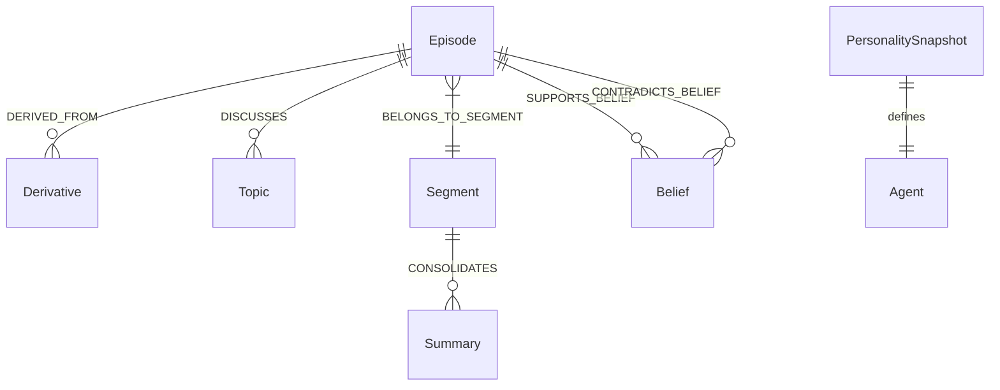
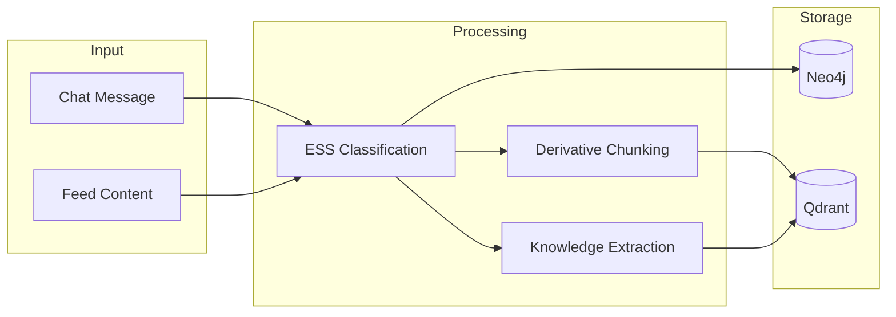

# Memory Model

> **Deep-Dive Documentation**: Complete reference for Sonality's dual-store memory architecture.

## Overview

Sonality memory consists of two persistent stores working in tandem:

| Store | Technology | Purpose |
|-------|------------|---------|
| **Graph Memory** | Neo4j | Causal/temporal structure, beliefs, provenance |
| **Vector Memory** | Qdrant | Semantic retrieval, knowledge propositions |

Identity state is stored as a `PersonalitySnapshot` node in Neo4j.

## Graph Memory (Neo4j)

### Node Types


```mermaid
erDiagram
    Episode ||--o{ Derivative : "DERIVED_FROM"
    Episode ||--o{ Topic : "DISCUSSES"
    Episode }|--|| Segment : "BELONGS_TO_SEGMENT"
    Episode ||--o{ Belief : "SUPPORTS_BELIEF"
    Episode ||--o{ Belief : "CONTRADICTS_BELIEF"
    Segment ||--o{ Summary : "CONSOLIDATES"
    PersonalitySnapshot ||--|| Agent : "defines"
```

| Node | Purpose | Key Properties |
|------|---------|----------------|
| `Episode` | Conversation turn or ingested content | `uid`, `content`, `summary`, `ess_score`, `created_at`, `segment_id` |
| `Derivative` | Semantic chunk for vector search | `uid`, `text`, `key_concept`, `sequence_num` |
| `Topic` | Extracted topic label | `name` |
| `Belief` | Agent's position on a topic | `topic`, `valence`, `confidence`, `belief_text` |
| `Segment` | Conversation boundary group | `id`, `label`, `created_at` |
| `Summary` | Consolidated segment summary | `text`, `segment_id` |
| `PersonalitySnapshot` | Agent identity narrative | `text`, `tone`, `version` |

### Edge Types

| Edge | Source → Target | Purpose |
|------|-----------------|---------|
| `DERIVED_FROM` | Derivative → Episode | Chunk provenance |
| `TEMPORAL_NEXT` | Episode → Episode | Conversation sequence |
| `DISCUSSES` | Episode → Topic | Topic association |
| `SUPPORTS_BELIEF` | Episode → Belief | Evidence relationship |
| `CONTRADICTS_BELIEF` | Episode → Belief | Counter-evidence |
| `BELONGS_TO_SEGMENT` | Episode → Segment | Segment membership |
| `CONSOLIDATES` | Summary → Segment | Summarization link |

## Vector Memory (Qdrant)

### Collections

| Collection | Content | Vector Dim |
|------------|---------|------------|
| `derivatives` | Episode semantic chunks | 1024 (BAAI/bge-large-en-v1.5) |
| `semantic_features` | Extracted personality features | 1024 |
| `knowledge` | SLIDE-extracted propositions | 1024 |

### Semantic Feature Categories

```python
class SemanticCategory(StrEnum):
    PERSONALITY = "personality"   # Core traits, communication style
    PREFERENCES = "preferences"   # Likes, dislikes, interests
    KNOWLEDGE = "knowledge"       # Facts, beliefs, expertise
    RELATIONSHIPS = "relationships"  # People, entities, connections
```

## Personality State

The `PersonalitySnapshot` dataclass stores agent identity:

```python
@dataclass(frozen=True, slots=True)
class PersonalitySnapshot:
    text: str = ""          # Narrative self-description
    tone: str = "curious, direct, unpretentious"
    version: int = 0        # Monotonically increasing
```

The snapshot is updated through LLM-based reflection when significant belief changes occur.

## Belief Structure

```python
@dataclass(frozen=True, slots=True)
class BeliefNode:
    topic: str              # e.g., "climate_change", "remote_work"
    valence: float = 0.0    # -1.0 (negative) to +1.0 (positive)
    confidence: float = 0.5 # 0.0 (uncertain) to 1.0 (certain)
    uncertainty: float = 0.5
    evidence_count: int = 0
    belief_text: str = ""   # Natural language statement
    provenance: str = ""    # Source of last update
```

Belief confidence is LLM-assessed during updates.

## Data Flow


```mermaid
flowchart LR
    subgraph Input
        Chat["Chat Message"]
        Feed["Feed Content"]
    end
    
    subgraph Processing
        ESS["ESS Classification"]
        Chunk["Derivative Chunking"]
        Extract["Knowledge Extraction"]
    end
    
    subgraph Storage
        Neo4j[(Neo4j)]
        Qdrant[(Qdrant)]
    end
    
    Chat --> ESS
    Feed --> ESS
    ESS --> Neo4j
    ESS --> Chunk
    Chunk --> Qdrant
    ESS --> Extract
    Extract --> Qdrant
```

## Consolidation and Forgetting

### Consolidation

- Triggered when a segment closes (boundary detection)
- LLM generates summary from segment episodes
- Summary node created with `CONSOLIDATES` edge

### Forgetting

- LLM assesses episode candidates (low ESS, low access)
- Three actions: `KEEP`, `ARCHIVE`, `FORGET`
- Maintains graph structure while pruning content

Both operations are LLM-guided and run during reflection cycles.

## Related Documentation

- [Database Schema](database-schema.md) — Complete Neo4j/Qdrant schemas
- [Graph Operations](graph-operations.md) — MemoryGraph methods
- [Dual Store Operations](dual-store-operations.md) — Atomic storage
- [Memory Lifecycle](memory-lifecycle.md) — Forgetting details
