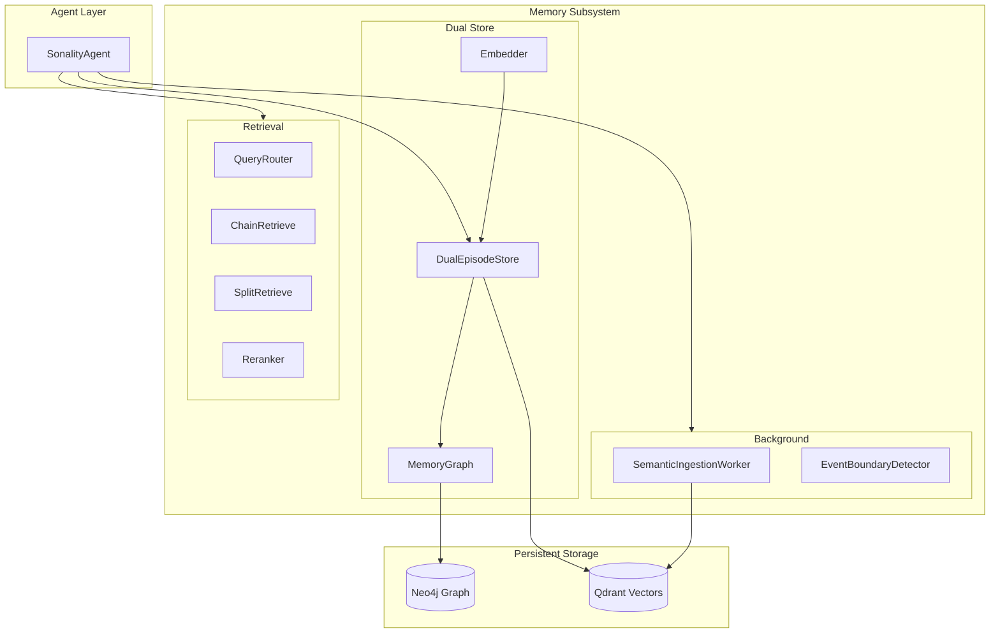
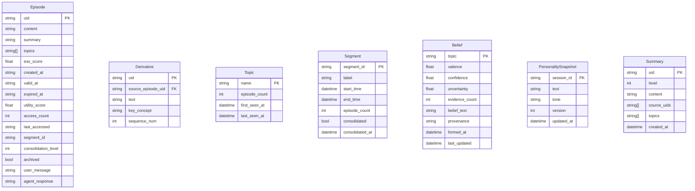
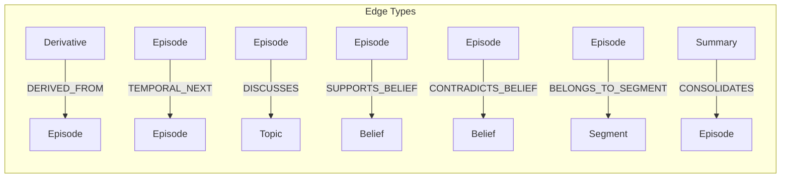
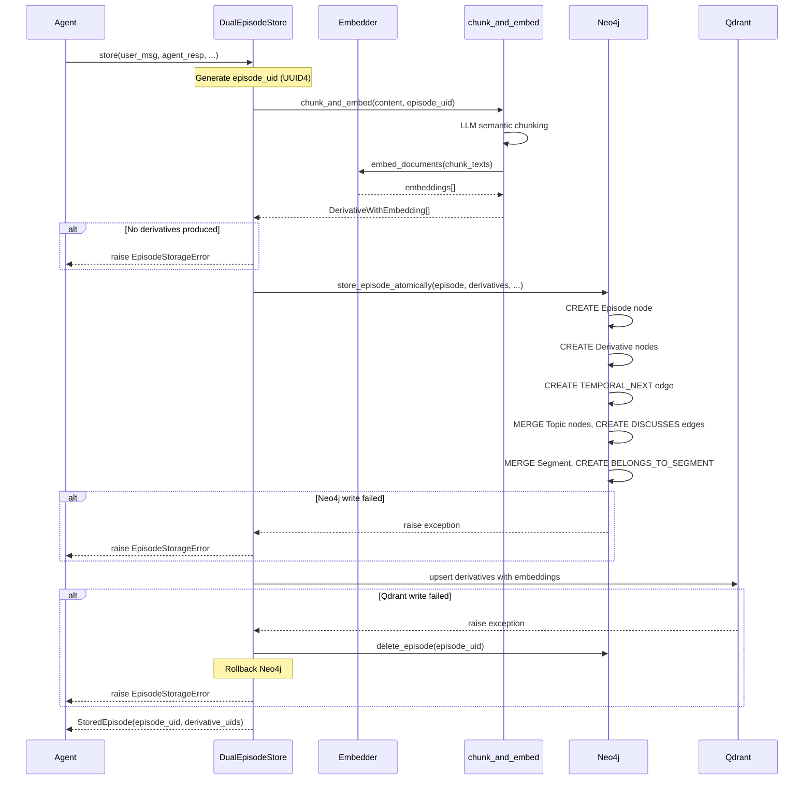
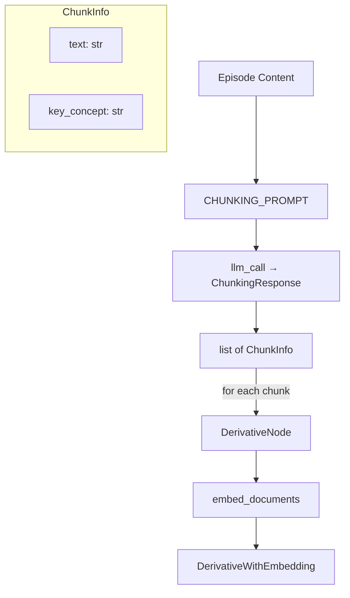
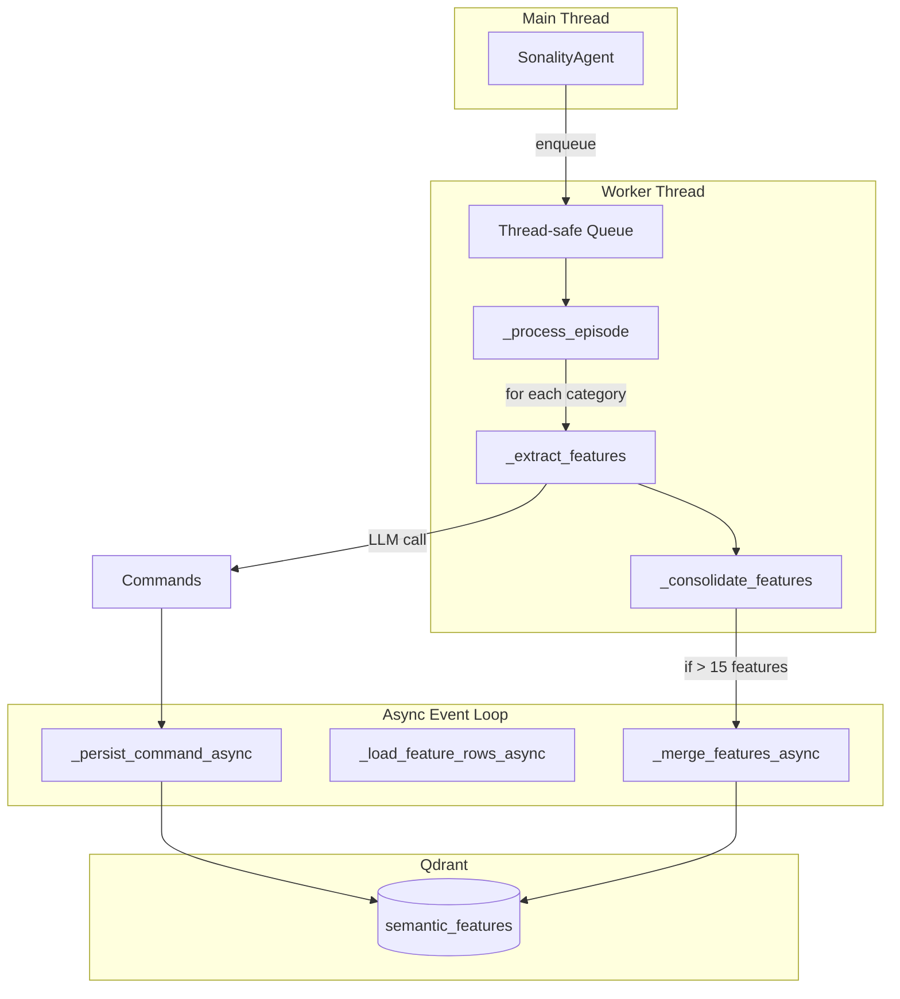
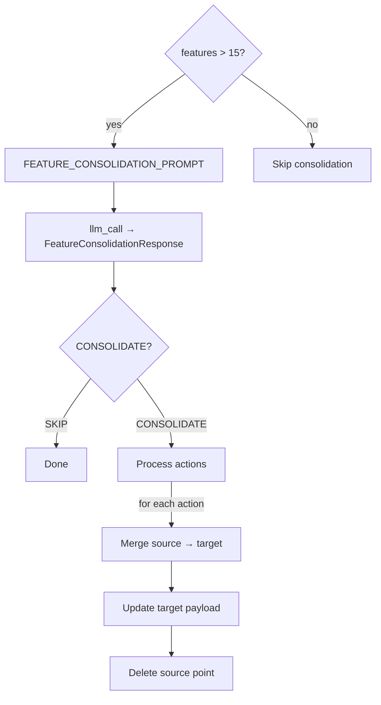
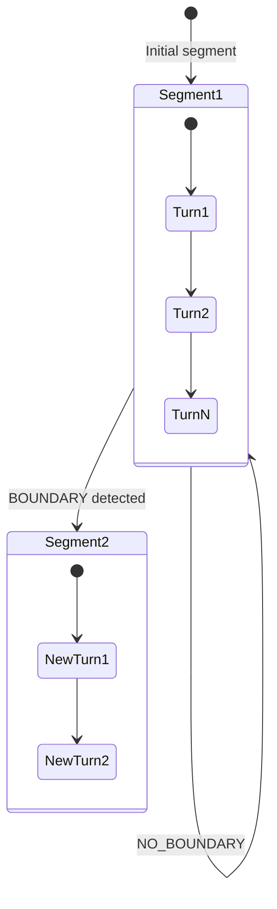
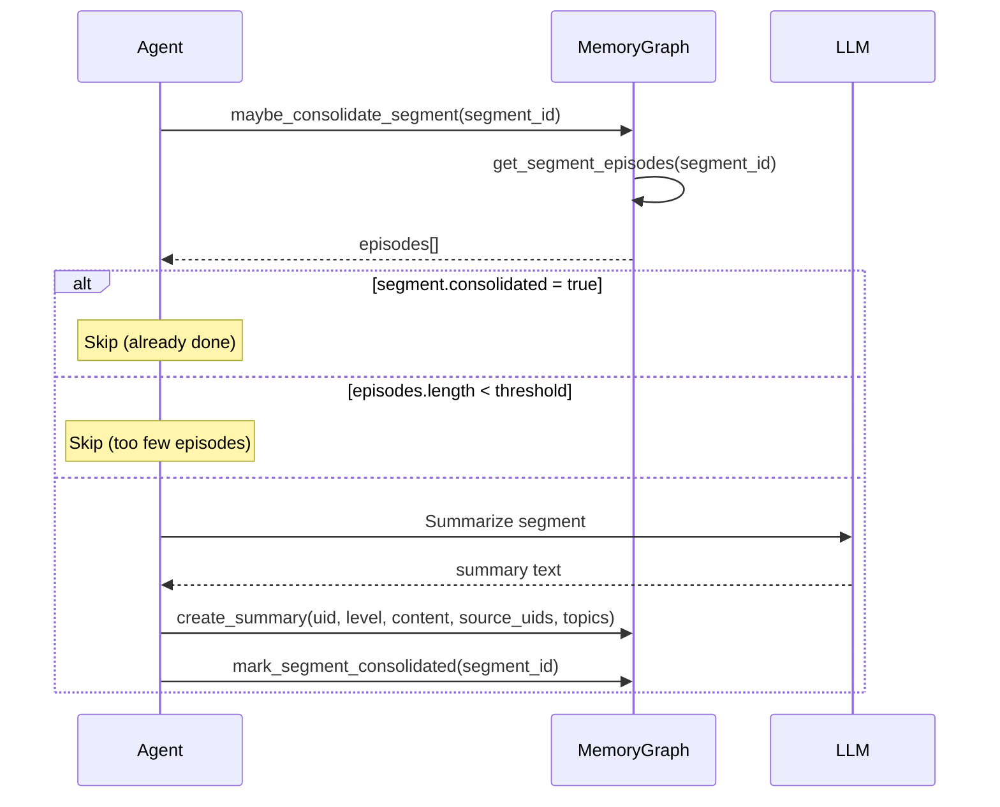
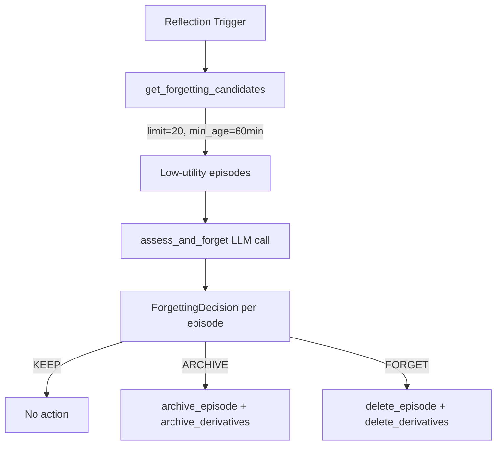

# Memory Subsystem Deep Dive

This document provides detailed coverage of Sonality's dual-store memory architecture, including graph schema, vector storage, and all memory operations.

## Architecture Overview



## Neo4j Graph Schema

### Node Types



### Edge Types



| Edge Type | From | To | Properties | Purpose |
|-----------|------|----|-----------:|---------|
| `DERIVED_FROM` | Derivative | Episode | — | Links chunks to source episode |
| `TEMPORAL_NEXT` | Episode | Episode | — | Chronological ordering |
| `DISCUSSES` | Episode | Topic | — | Topic association |
| `SUPPORTS_BELIEF` | Episode | Belief | strength, reasoning, created_at | Evidence support |
| `CONTRADICTS_BELIEF` | Episode | Belief | strength, reasoning, created_at | Evidence contradiction |
| `BELONGS_TO_SEGMENT` | Episode | Segment | — | Conversation segment membership |
| `CONSOLIDATES` | Summary | Episode | — | Summary-source linkage |

### Schema Constraints and Indexes

Applied automatically on startup via `NEO4J_SCHEMA_STATEMENTS`:

```cypher
-- Uniqueness Constraints
CREATE CONSTRAINT episode_uid IF NOT EXISTS FOR (e:Episode) REQUIRE e.uid IS UNIQUE;
CREATE CONSTRAINT derivative_uid IF NOT EXISTS FOR (d:Derivative) REQUIRE d.uid IS UNIQUE;
CREATE CONSTRAINT topic_name IF NOT EXISTS FOR (t:Topic) REQUIRE t.name IS UNIQUE;
CREATE CONSTRAINT segment_id IF NOT EXISTS FOR (s:Segment) REQUIRE s.segment_id IS UNIQUE;
CREATE CONSTRAINT summary_uid IF NOT EXISTS FOR (s:Summary) REQUIRE s.uid IS UNIQUE;
CREATE CONSTRAINT belief_topic IF NOT EXISTS FOR (b:Belief) REQUIRE b.topic IS UNIQUE;
CREATE CONSTRAINT personality_session IF NOT EXISTS FOR (p:PersonalitySnapshot) REQUIRE p.session_id IS UNIQUE;

-- Performance Indexes
CREATE INDEX episode_created IF NOT EXISTS FOR (e:Episode) ON (e.created_at);
CREATE INDEX episode_segment IF NOT EXISTS FOR (e:Episode) ON (e.segment_id);
CREATE INDEX derivative_archived IF NOT EXISTS FOR (d:Derivative) ON (d.archived);
```

## Qdrant Vector Collections

### Collection: `derivatives`

Stores episode chunks with embeddings for semantic retrieval.

| Field | Type | Purpose |
|-------|------|---------|
| `uid` | string | Unique derivative ID |
| `episode_uid` | string | Parent episode reference |
| `text` | string (indexed) | Chunk text content |
| `key_concept` | string | Primary concept extracted |
| `sequence_num` | int | Order within episode |
| `archived` | bool | Soft-delete flag |
| `created_at` | string | ISO timestamp |

**Vector Config:**
- Dimensions: 1024 (FastEmbed BAAI/bge-large-en-v1.5)
- Distance: Cosine
- Index: HNSW (default params)
- Quantization: INT8 scalar
- Text index on `text` field for BM25 hybrid search

### Collection: `semantic_features`

Stores extracted personality features with embeddings.

| Field | Type | Purpose |
|-------|------|---------|
| `uid` | string | Deterministic UUID5 from category+tag+feature |
| `category` | string | PERSONALITY, PREFERENCES, KNOWLEDGE, RELATIONSHIPS |
| `tag` | string | Sub-category tag |
| `feature_name` | string | Feature identifier |
| `value` | string (indexed) | Feature value |
| `confidence` | float | Extraction confidence 0.0-1.0 |
| `episode_citations` | list[string] | Source episode UIDs |
| `created_at` | string | ISO timestamp |
| `updated_at` | string | ISO timestamp |

**Vector Config:** Same as `derivatives`.

## DualEpisodeStore Operations

### Store Episode (Atomic Write)



### Vector Search

```python
async def vector_search(self, query: str, top_k: int = 20) -> list[SearchHit]:
    query_embedding = await asyncio.to_thread(self._embedder.embed_query, query)
    response = await self._qdrant.query_points(
        collection_name=Collection.DERIVATIVES,
        query=query_embedding,
        using=DENSE_VECTOR,
        query_filter=Filter(must=[
            FieldCondition(key="archived", match=MatchValue(value=False))
        ]),
        limit=top_k,
        search_params=SearchParams(
            hnsw_ef=config.QDRANT_SEARCH_EF,
            quantization=QuantizationSearchParams(
                rescore=config.QDRANT_RESCORE_QUANTIZED,
                oversampling=2.0,
            ),
        ),
    )
```

### Archive vs Delete

| Operation | Neo4j | Qdrant | Use Case |
|-----------|-------|--------|----------|
| **Archive** | `archived=true, expired_at=now` | `archived=true` (payload) | Soft delete, recoverable |
| **Delete** | `DETACH DELETE` episode + derivatives | `delete` by filter | Hard delete, permanent |

## Semantic Chunking (Derivatives)

The `chunk_and_embed` function uses LLM to semantically segment episode content.



**ChunkInfo Schema:**
```python
class ChunkInfo(BaseModel):
    text: str           # Chunk content
    key_concept: str    # Primary concept (for retrieval)
```

Typical episode produces 5-12 derivative chunks.

## Graph Traversal Operations

### Temporal Context Expansion

```cypher
MATCH (focal:Episode {uid: $uid})
OPTIONAL MATCH path_before = (prev:Episode)-[:TEMPORAL_NEXT*1..{before}]->(focal)
  WHERE NOT prev.archived
OPTIONAL MATCH path_after = (focal)-[:TEMPORAL_NEXT*1..{after}]->(next:Episode)
  WHERE NOT next.archived
WITH focal,
     COLLECT(DISTINCT prev) AS befores,
     COLLECT(DISTINCT next) AS afters
RETURN befores, focal, afters
```

### Belief-Related Episode Search

```cypher
MATCH (e:Episode)-[:SUPPORTS_BELIEF|CONTRADICTS_BELIEF]->(b:Belief)
WHERE NOT e.archived
  AND ANY(keyword IN $keywords WHERE toLower(b.topic) CONTAINS keyword)
RETURN DISTINCT e 
ORDER BY e.utility_score DESC, e.created_at DESC 
LIMIT $limit
```

### Topic-Related Episode Search

```cypher
MATCH (e:Episode)-[:DISCUSSES]->(t:Topic)
WHERE NOT e.archived
  AND ANY(keyword IN $keywords WHERE toLower(t.name) CONTAINS keyword)
RETURN DISTINCT e 
ORDER BY e.utility_score DESC, e.created_at DESC 
LIMIT $limit
```

## Semantic Feature Extraction Worker

### Worker Architecture



### Feature Categories and Tags

| Category | Valid Tags | Purpose |
|----------|------------|---------|
| `PERSONALITY` | Communication Style, Values, Behavioral Traits, Temperament, Cognitive Style | Core identity traits |
| `PREFERENCES` | Topics of Interest, Interaction Preferences, Learning Style | User preferences |
| `KNOWLEDGE` | Domain Expertise, Factual Knowledge, Procedural Knowledge | Learned information |
| `RELATIONSHIPS` | Social Connections, Trust Levels, Interaction History | Relationship context |

### Feature Commands

```python
class FeatureCommand(BaseModel):
    command: FeatureCommandType  # ADD, UPDATE, DELETE
    tag: str                     # Sub-category
    feature: str                 # Feature name
    value: str = ""              # Feature value
    confidence: float = 0.5      # 0.0-1.0
    reason: str = ""             # Required for DELETE
```

### Deferred Processing

The worker checks `interaction_in_progress()` before processing and defers work when the main agent is handling a request:

```python
if interaction_in_progress():
    log.debug("Semantic worker deferring: interaction active")
    requeue.append(item)
```

### Feature Consolidation

When a category exceeds 15 features, the worker triggers LLM-based consolidation:



## Event Boundary Detection

Segments conversation into logical units based on topic/goal shifts.



**BoundaryDecision enum:**
- `NO_BOUNDARY` — Continue current segment
- `BOUNDARY` — Start new segment (triggers consolidation of old)

## Segment Consolidation

When a segment closes, it can be summarized:



## Forgetting System

Low-utility episodes are periodically assessed for archival or deletion.



**ForgettingDecision enum:**
- `KEEP` — Preserve episode
- `ARCHIVE` — Soft-delete (recoverable)
- `FORGET` — Hard-delete (permanent)

Candidates are filtered by:
- `archived = false`
- `consolidation_level = 1` (raw episodes only)
- `created_at < now - 60 minutes` (age threshold)
- Ordered by `utility_score ASC, created_at ASC`

## Embedder Details

### FastEmbed Configuration

```python
MODEL: str = "BAAI/bge-large-en-v1.5"
DIMENSIONS: int = 1024
```

### Query Caching

The embedder maintains an LRU-style cache for query embeddings to avoid redundant computation:

```python
def embed_query(self, text: str) -> list[float]:
    if text in self._cache:
        return self._cache[text]
    embedding = self._model.embed([text])[0]
    self._cache[text] = embedding
    return embedding
```

### Batch Embedding

For bulk operations (derivatives, features), batch embedding is used:

```python
def embed_documents(self, texts: list[str]) -> list[list[float]]:
    return list(self._model.embed(texts))
```
