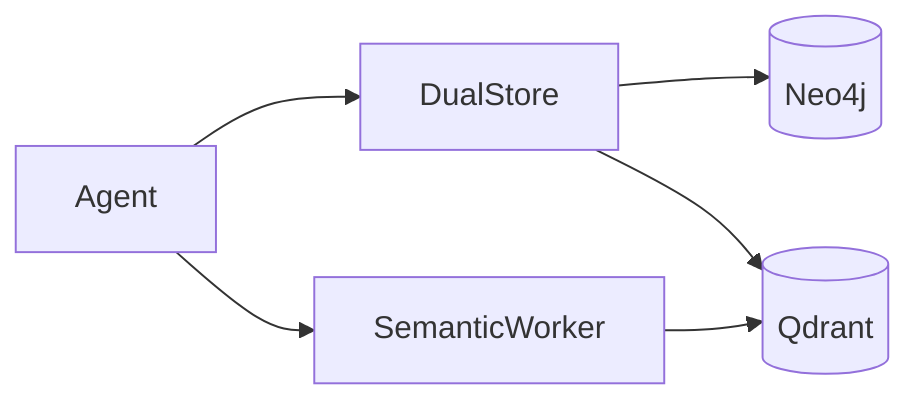
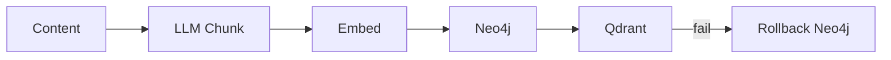

# Memory System

Dual-store: Neo4j (graph) + Qdrant (vectors).

## Architecture



## Neo4j Schema

### Nodes

| Node | Key Properties |
|------|----------------|
| `Episode` | uid, content, summary, ess_score, segment_id, archived |
| `Derivative` | uid, text, key_concept, sequence_num |
| `Belief` | topic, valence (-1→+1), confidence, evidence_count |
| `Segment` | id, label, created_at |
| `PersonalitySnapshot` | text, tone, version |

### Edges

| Edge | Purpose |
|------|---------|
| `TEMPORAL_NEXT` | Episode sequence |
| `SUPPORTS_BELIEF` | Evidence for |
| `CONTRADICTS_BELIEF` | Evidence against |
| `DERIVED_FROM` | Chunk→Episode |
| `DISCUSSES` | Topic link |

## Qdrant Collections

| Collection | Purpose |
|------------|---------|
| `derivatives` | Episode chunks for retrieval |
| `semantic_features` | Personality traits |
| `knowledge` | SLIDE propositions |

Vectors: 1024d bge-large-en-v1.5, cosine, HNSW + INT8.

## DualStore Transaction



**Invariant:** Episodes never stored without embeddings.

## Key Graph Queries

```cypher
-- Belief-related episodes
MATCH (e:Episode)-[:SUPPORTS_BELIEF|CONTRADICTS_BELIEF]->(b:Belief)
WHERE toLower(b.topic) CONTAINS $keyword

-- Temporal context  
MATCH (focal)-[:TEMPORAL_NEXT*1..2]->(next)

-- Forgetting candidates
MATCH (e:Episode) WHERE NOT e.archived AND e.utility_score < 0.3
```

## Background Workers

| Worker | Function |
|--------|----------|
| SemanticWorker | Extracts personality features |
| BoundaryDetector | Segments conversations |
| Forgetting | Archives low-utility episodes |
