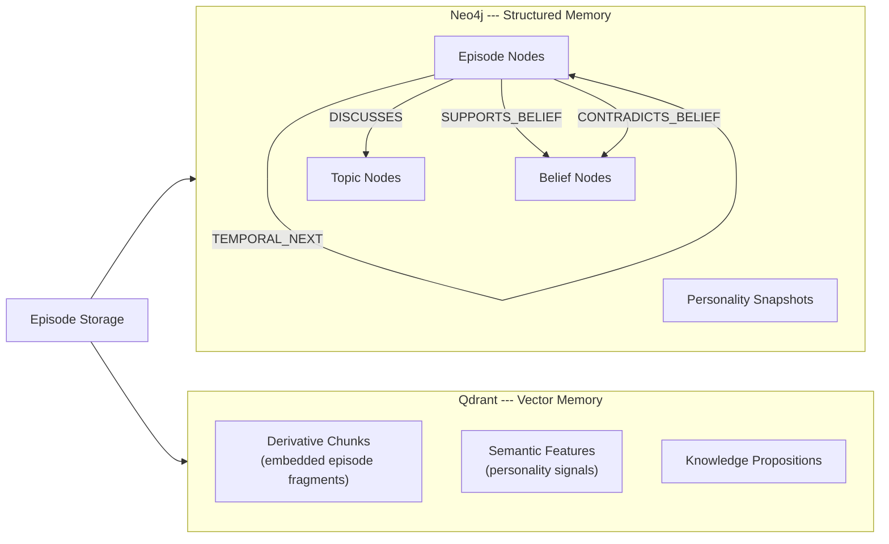
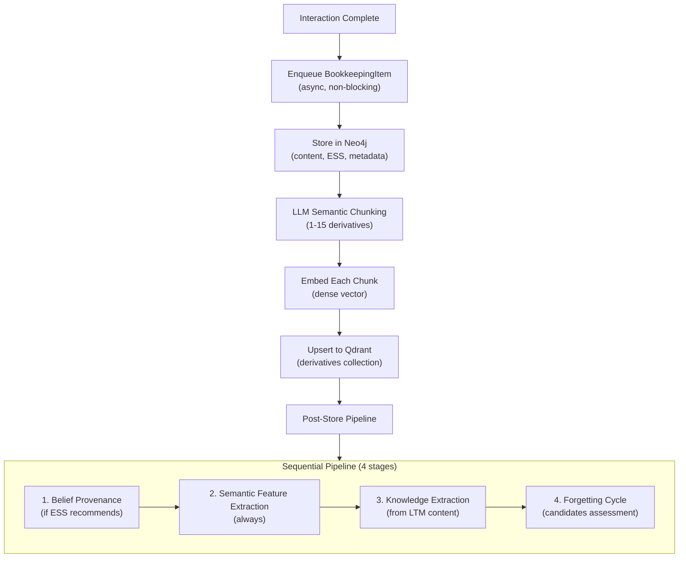
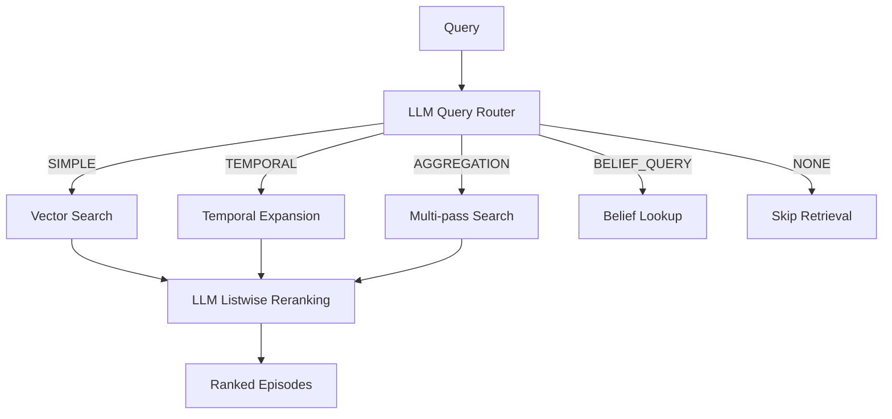
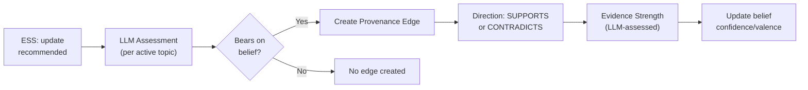
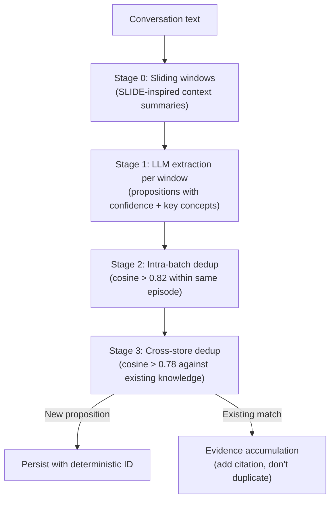

# Memory System

The memory system is Sonality's persistence layer for episodic experience, beliefs, and personality state. It uses a dual-store architecture combining Neo4j (graph relationships and structured data) with Qdrant (dense vector search), providing both structured traversal and semantic similarity retrieval.

---

## Dual-Store Architecture

The two stores serve complementary roles:

**Neo4j** stores:
- Episodes with full content, metadata, ESS classification, and access timestamps
- Beliefs as structured nodes with valence, confidence, evidence count
- Topics as normalized slugs with DISCUSSES edges from episodes
- Provenance edges (SUPPORTS_BELIEF / CONTRADICTS_BELIEF) linking evidence to beliefs
- Personality snapshots as versioned nodes
- Temporal ordering via TEMPORAL_NEXT edges

**Qdrant** stores:
- Derivative chunks --- LLM-generated semantic fragments of each episode, embedded as dense vectors
- Semantic features --- extracted personality signals across four categories
- Knowledge propositions --- factual claims with deduplication

The dual-write ensures both stores are always consistent. Neo4j is written first (providing ACID guarantees), followed by Qdrant. If the Qdrant write fails, the Neo4j transaction is rolled back.

---

## Episode Lifecycle

An episode represents a single interaction (user message + agent response). Its lifecycle:

**Queue-based decoupling**: The write pipeline runs on a dedicated `asyncio.Queue` (maxsize 64). When the queue is full, new items are dropped with a warning rather than blocking the response thread. This guarantees that memory operations never increase response latency, while sequential processing within the queue prevents write conflicts.

**Research findings as episodes**: When the agentic loop accumulates substantial long-term memory (>50 characters of research findings from tool consolidation), this LTM content is flushed as a separate episode with its own ESS classification. This means web research discoveries and multi-tool syntheses are independently indexed, searchable, and subject to the full bookkeeping pipeline (provenance, feature extraction, knowledge propositions). The agent's research becomes retrievable knowledge in future conversations.

**Semantic chunking** (the "derivatives" step) uses an LLM to split episodes into 1-15 meaningful fragments. Each fragment captures a distinct semantic unit (a claim, a question, a response pattern). This is inspired by the MemMachine architecture where chunking granularity determines retrieval precision.

The chunk UIDs are deterministic (derived from episode UID + chunk index), enabling idempotent re-processing.

---

## Retrieval Pipeline

Memory retrieval orchestrates multiple strategies based on query intent:

**Query routing** classifies the retrieval need:
- `SIMPLE` --- Direct semantic similarity search against derivative vectors
- `TEMPORAL` --- Vector search followed by expansion to temporally adjacent episodes
- `AGGREGATION` --- Multiple search passes with different query reformulations
- `BELIEF_QUERY` --- Direct Neo4j belief node lookup (bypasses vector search)
- `NONE` --- No retrieval needed (greetings, meta-questions)

**Vector search** uses Qdrant's dense cosine similarity with a signal-weighted scoring formula that incorporates ESS payload fields. Higher-quality episodes (those with strong ESS scores) receive a retrieval boost.

**Listwise reranking** sends the top candidate episodes to an LLM that reorders them by semantic relevance to the original query. This corrects for embedding limitations (where semantically relevant but lexically distant episodes might be ranked lower).

---

## Belief Provenance

When ESS classifies an interaction as containing evidence that could affect beliefs, the provenance system assesses the relationship:

Each provenance assessment produces:
- **Direction** --- Whether the episode supports or contradicts the belief
- **Evidence strength** --- How strongly the evidence bears on the belief (LLM-judged)
- **Evidence count increment** --- The belief's `evidence_count` increases with each new provenance edge

Beliefs with high evidence counts resist change from single contradicting sources. This implements the formal principle that well-established beliefs should require proportionally stronger evidence to revise.

---

## Semantic Feature Extraction

The feature extraction system identifies persistent personality signals from each episode:

| Category | Examples |
|----------|----------|
| Personality | Communication style, values, behavioral traits, temperament, cognitive style |
| Preferences | Topic interests, aesthetic preferences, tool preferences |
| Knowledge | Domain expertise, factual knowledge, skill levels |
| Relationships | Interaction patterns, trust levels, communication preferences with specific entities |

Features are stored in Qdrant with embeddings that enable similarity-based consolidation. When a new feature is extracted that closely matches an existing one (cosine similarity > 0.82), the existing feature is updated rather than creating a duplicate.

A critical design constraint: **features are never deleted due to topic silence**. If the agent discusses cooking for several turns, this does not cause deletion of previously established climate-related personality features. Only a direct assertive counter-claim (identified by the LLM in the extraction prompt) can trigger feature deletion. This prevents the "identity drift" problem documented in [persona drift research](https://arxiv.org/abs/2402.10962) (significant drift within 8 conversation rounds), [ID-RAG](https://arxiv.org/abs/2509.25299) (2025, identity recall dropping to ~0.53 without explicit anchoring), and [MENTOR](https://openreview.net/forum?id=4rnfubjrRg) (ACL ARR 2026, dual-chain memory to prevent role leakage). Sonality's approach — explicit identity representation with deletion-resistant features — aligns with ID-RAG's finding that agents need explicit identity retrieval to maintain long-horizon coherence.

---

## Knowledge Extraction

The knowledge extraction pipeline decomposes conversations into atomic factual propositions stored independently from episodes:

**[SLIDE](https://arxiv.org/abs/2503.17952)** (2025): Each window receives an LLM-generated context summary of the preceding window rather than raw word overlap. This produces 24–39% better entity extraction than naive chunking and avoids the "lost in the middle" degradation when processing long conversations.

**Proposition design**: Extracted propositions follow the [Molecular Facts](https://arxiv.org/abs/2406.20079) paradigm (Gunjal and Durrett, EMNLP 2024 Findings) — balancing *decontextuality* (each proposition stands alone) with *minimality* (not over-decomposed). This preserves contextual nuances (conditionality, multi-entity relationships) that triple-based knowledge graphs lose, as validated by PropRAG (2025).

**Two-pass deduplication**: Intra-batch dedup (threshold 0.82) removes near-identical reformulations across overlapping windows, keeping the higher-confidence version. Cross-store dedup (threshold 0.78) checks against all existing knowledge — matches don't create duplicates but instead add an episode citation to the existing proposition, strengthening its evidence base.

**Deterministic IDs**: Proposition UIDs are derived from content hash (`uuid5`), enabling idempotent re-extraction. Re-processing the same conversation yields the same knowledge store state.

Knowledge propositions serve as a separate retrieval surface from episode derivatives — they capture *what was stated* rather than *what was discussed*, enabling precise factual recall across hundreds of interactions.

---

## Forgetting Engine

To prevent unbounded memory growth, the forgetting engine periodically evaluates episodes for archival or deletion:

| Signal | Weight | Rationale |
|--------|--------|-----------|
| Recency | High | Older episodes with no recent access are candidates |
| Access count | Medium | Frequently retrieved episodes are valuable |
| ESS score | Medium | High-quality interactions are worth preserving |
| Evidence contribution | High | Episodes linked to active beliefs are protected |
| **Utility score** | High | FSRS-computed retrieval probability × salience |

### Utility Score (FSRS + ACT-R)

Each time an episode is retrieved, its `utility_score` is recomputed using a combination of [FSRS power-law forgetting](https://github.com/open-spaced-repetition/fsrs4anki/wiki) (Ye, 2022) and ACT-R practice effects:

$$
\text{utility}(e) = \ln(n + 2) \times \text{ess\_score}(e) \times R(t, S)
$$

Where:
- $\ln(n + 2)$ is the ACT-R practice term (logarithmic benefit of repeated retrieval)
- $\text{ess\_score}$ is the original evidence quality (salience weighting)
- $R(t, S) = \frac{1}{1 + t / (9S)}$ is the FSRS power-law retrievability (probability of successful recall at time $t$)
- $S = 30 \times (0.5 + \bar{q})$ days, where $\bar{q}$ is the mean of the five credibility signals

**Design decision:** Power-law decay (FSRS) was chosen over exponential decay because empirical memory research ([Wixted and Ebbesen, 1991](https://doi.org/10.1111/j.1467-9280.1991.tb00175.x)) demonstrated that forgetting across multiple memory paradigms is best described by a power function $y = at^{-b}$, outperforming exponential, hyperbolic, and logarithmic alternatives. FSRS ([Ye, 2022](https://github.com/open-spaced-repetition/fsrs4anki); KDD 2022) operationalizes this as $R(t, S) = 1/(1 + t/9S)$ where $S$ is the memory stability parameter. The stability is credibility-aware: high-quality episodes (strong ESS signals) receive higher $S$ values and decay more slowly, reflecting the intuition that well-sourced knowledge has longer relevance half-lives.

The forgetting decision is made by an LLM that evaluates batches of candidate episodes and classifies each as KEEP, ARCHIVE, or FORGET:

- **KEEP** --- Episode remains fully active in both stores
- **ARCHIVE** --- Episode remains in Neo4j (preserving graph structure) but vectors are removed from Qdrant (no longer appears in similarity search)
- **FORGET** --- Hard deletion from both stores

A critical safety constraint: **sole-evidence protection**. Before any FORGET decision is executed, the system checks whether the episode is the only evidence supporting an active belief (via provenance edges). If so, the episode is automatically promoted to KEEP regardless of the LLM's recommendation. This prevents belief orphaning — where a belief exists but its entire evidence base has been deleted.

**Orphan knowledge cleanup**: When an episode is permanently deleted (FORGET), any knowledge propositions that cited *only* that episode are also hard-deleted from Qdrant. Propositions with remaining citations from other episodes are preserved with the deleted citation removed. This maintains referential integrity between the knowledge store and the episode graph.

**Truncated UID resolution**: Because the LLM sees abbreviated episode UIDs in the forgetting prompt (to save tokens), the system builds a prefix map to resolve truncated identifiers back to full UIDs. This allows the LLM's decisions to reference episodes unambiguously even when working with shortened handles.

This approach aligns with cognitive science models of memory consolidation where important memories are strengthened and unimportant ones fade. The research basis includes [FadeMem](https://arxiv.org/abs/2601.18642) (Wei et al., 2025) — which demonstrates that differential exponential decay (sub-linear β=0.8 for long-term memories, super-linear β=1.2 for short-term) achieves 45% storage reduction while maintaining retrieval quality — and A-MAC (2025) five-factor admission metrics. Sonality's approach differs from FadeMem's parametric decay by using LLM-assessed forgetting decisions, which handle the context-dependent nature of personality relevance better than fixed decay curves.

---

## Read Path

For the complete retrieval architecture — query routing, multi-pass search, temporal expansion, and LLM reranking — see the [Retrieval Pipeline](../concepts/retrieval.md) page.

---

## Schema Definitions

All database schema is defined in a single canonical location (`sonality/schema.py`):

- **Qdrant collections** --- `derivatives` (episode chunks), `semantic_features` (personality signals)
- **Neo4j constraints** --- Unique constraints on UIDs, indexes on temporal fields and topics
- **Enums** --- `Direction` (SUPPORTS/CONTRADICTS), feature categories, query routing types

Schema is applied automatically on first connection. No manual migration scripts are needed for fresh deployments.

---

## Related Pages

- [Retrieval Pipeline](../concepts/retrieval.md) --- Query routing, multi-pass search, credibility-aware rescoring, prospective indexing
- [Belief Revision](../concepts/belief-revision.md) --- How provenance edges translate into belief updates
- [Sponge Architecture](../concepts/sponge.md) --- How the personality snapshot is assembled from stored state
- [Docker Stack](../deployment/docker.md) --- Neo4j and Qdrant container configuration
