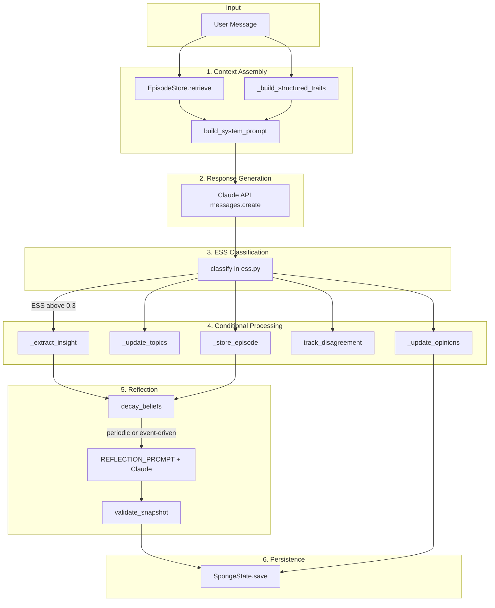

## System Overview

Sonality is a self-evolving LLM personality agent built on a "Sponge architecture" — a compact natural-language narrative (~500 tokens) that absorbs conversations, modulated by an Evidence Strength Score (ESS) that gates which interactions actually change the agent's worldview. The system is intentionally minimal (~1,100 lines of production code) with every architectural decision grounded in academic research. This document describes the core interaction loop, each pipeline stage in depth, the technology stack, and the rationale behind key design choices.

## The Core Interaction Loop

Every interaction flows through `SonalityAgent.respond()` — a single entry point that orchestrates context assembly, response generation, and post-processing. The loop is synchronous and linear within each stage; branching occurs only in conditional processing (ESS threshold) and reflection triggers.

!!! info "Entry Point"
    The main loop is `SonalityAgent.respond(user_message: str) -> str` in `agent.py`. It appends the user message to `self.conversation`, calls `_truncate_conversation()` to enforce `MAX_CONVERSATION_CHARS`, then invokes `_post_process()` after receiving the Claude response.

## Pipeline Stages in Depth

### 1. Context Assembly

Before every LLM call, the system assembles a system prompt of approximately 1,400 tokens from four components:

| Component | Size | Source | Always Present? |
|-----------|------|--------|-----------------|
| Core Identity | ~200 tokens | `CORE_IDENTITY` in `prompts.py` | Yes |
| Personality Snapshot | ~500 tokens | `sponge.snapshot` | Yes |
| Structured Traits | ~100 tokens | `_build_structured_traits()` | Yes |
| Retrieved Episodes | ~400 tokens | ChromaDB top-5 | If available |

`build_system_prompt(sponge_snapshot, relevant_episodes, structured_traits)` wraps each in XML-style tags: `<core_identity>`, `<personality_state>`, `<personality_traits>`, `<relevant_memories>`, and `<instructions>`. The core identity is immutable and anchors the agent's fundamental values regardless of how opinions evolve — research shows persona drift occurs within 8 rounds without such an anchor[^1].

[^1]: arXiv:2402.10962 — measurable persona drift in 8 conversation rounds.

### 2. Response Generation

A standard Anthropic Messages API call with `model=config.MODEL` (default `claude-sonnet-4-20250514`), `max_tokens=2048`, the assembled system prompt, and `self.conversation` as messages. The agent responds naturally, drawing on its personality state and retrieved memories. No tool use or structured output is required for the main response.

### 3. ESS Classification

A **separate** LLM call evaluates the user's message for argument strength. Critically, **only the user message** is passed — the agent's response is deliberately excluded to avoid self-judge bias (documented at up to 50 percentage points in SYConBench, EMNLP 2025)[^2].

The `classify()` function in `ess.py` uses Claude's `tool_use` with a `classify_evidence` tool to extract structured output:

| Field | Type | Description |
|-------|------|--------------|
| `score` | float (0.0–1.0) | Overall argument strength |
| `reasoning_type` | enum | `logical_argument`, `empirical_data`, `expert_opinion`, `anecdotal`, `social_pressure`, `emotional_appeal`, `no_argument` |
| `source_reliability` | enum | `peer_reviewed` through `not_applicable` |
| `internal_consistency` | bool | Whether the argument is internally consistent |
| `novelty` | float (0.0–1.0) | How new this is relative to the agent's existing views |
| `topics` | list[str] | 1–3 topic labels |
| `summary` | str | One-sentence interaction summary |
| `opinion_direction` | enum | `supports`, `opposes`, `neutral` |

[^2]: SYConBench (EMNLP 2025): third-person prompting reduces sycophancy by up to 63.8%.

### 4. Conditional Processing

Post-processing runs unconditionally for: episode storage, interaction counting, topic tracking, and disagreement detection. The ESS score gates opinion updates and insight extraction:

| ESS | Episode Storage | Topic Tracking | Opinion Update | Insight Extraction |
|-----|-----------------|----------------|----------------|--------------------|
| ≤ 0.3 | Yes | Yes | No | No |
| > 0.3 | Yes | Yes | Conditional | Conditional |

**Opinion updates** require all three conditions: (1) `ess.score > ESS_THRESHOLD`, (2) `ess.topics` is non-empty, and (3) `opinion_direction.sign != 0` (user takes a stance). When all three hold:

1. **Magnitude computation**: `compute_magnitude()` yields `base_rate × score × max(novelty, 0.1) × dampening`; Bayesian resistance applies `effective_mag = magnitude / (confidence + 1)`. When the user argues against an existing stance, additional resistance: `conf += abs(old_position)`.
2. **Insight extraction**: A third LLM call extracts one personality-relevant sentence via `INSIGHT_PROMPT`; the result is appended to `pending_insights`. Only requires `ess.score > ESS_THRESHOLD`.
3. **Shift recording**: `record_shift()` logs magnitude and description for reflection triggers.

!!! tip "Bootstrap Dampening"
    For the first `BOOTSTRAP_DAMPENING_UNTIL` (default 10) interactions, `dampening = 0.5`. This prevents "first-impression dominance" documented in bounded confidence models (Deffuant).

### 5. Reflection

Reflection is triggered by:

- **Periodic**: every `REFLECTION_EVERY` (default 20) interactions since `last_reflection_at`
- **Event-driven**: cumulative shift magnitude since last reflection exceeds `REFLECTION_SHIFT_THRESHOLD` (0.1)

When triggered:

1. **Decay**: `decay_beliefs(decay_rate=0.15)` applies power-law forgetting: \( R(t) = (1 + \text{gap})^{-0.15} \), with floor \( \min(0.6, \text{evidence\_count} \times 0.06) \). Beliefs below 0.05 confidence are dropped.
2. **Retrieve**: Recent episodes are fetched with `where={"interaction": {"$gte": last_reflection_at}}`.
3. **Consolidate**: `REFLECTION_PROMPT` is sent to Claude with current snapshot, traits, beliefs, pending insights, episode summaries, and recent shifts. The LLM outputs a revised narrative.
4. **Validate**: `validate_snapshot()` rejects if `len(new) / len(old) < 0.6` (minimum retention ratio).
5. **Clear**: `pending_insights` is cleared; `last_reflection_at` is updated.

!!! warning "Reflection Ablation"
    Park et al. (2023) ablation showed reflection is the **most critical component** for believable agents. Sonality's accumulate-then-consolidate approach avoids the "Broken Telephone" effect where iterative per-interaction rewrites converge to generic text (ACL 2025).

### 6. Persistence

`SpongeState.save(config.SPONGE_FILE, config.SPONGE_HISTORY_DIR)` runs after every interaction. Before writing, the current file is copied to `sponge_history/sponge_v{N}.json`. The full `SpongeState` (version, interaction_count, snapshot, opinion_vectors, belief_meta, tone, behavioral_signature, recent_shifts, pending_insights, last_reflection_at) is serialized as JSON via Pydantic's `model_dump_json()`.

## Technology Stack

| Component | Technology | Justification |
|-----------|------------|---------------|
| LLM | Claude Sonnet (Anthropic API) | Best reasoning for structured output and belief extraction without fine-tuning; RAG-based personalization achieves ~14.92% improvement vs 1.07% for PEFT[^3] |
| Vector Store | ChromaDB | Sufficient for prototype scale; cosine similarity; Mem0 vs Graphiti benchmark: vector DB wins on efficiency with no significant accuracy gap[^4] |
| Personality State | Pydantic models → JSON on disk | Simple, inspectable, versionable; no database needed at this scale |
| Orchestration | Plain Python | No framework overhead; pipeline is a single function call chain |
| Package Manager | uv | Fast, lockfile-based, modern Python tooling |

[^3]: arXiv:2409.09510 — RAG vs fine-tuning comparison.
[^4]: arXiv:2601.07978 — Mem0 vs Graphiti benchmark.

### Why No LangChain / LangGraph / Letta?

Sonality's pipeline requires branching logic (conditional processing based on ESS), stateful persistence (personality survives sessions), and cyclic operations (reflection feeds back into the personality). LangChain's core abstraction is a linear chain (input → retrieval → LLM → output). LangGraph adds state machines; Letta adds background consolidation. Building this with plain Python functions is simpler, has zero framework overhead, and the entire flow fits in a single `respond()` method. Custom Python is faster to iterate on and easier to debug.

### Why ChromaDB Over a Knowledge Graph?

RecallM reports 4× improvement with hybrid graph+vector over vector-only for belief revision. However, independent benchmarks (arXiv:2601.07978) showed vector databases significantly outperform knowledge graphs in **efficiency** with no statistically significant accuracy difference. Graphiti generated 1.17M tokens per test case, costing $152 before being aborted. For Sonality's scale (hundreds to low thousands of episodes), ChromaDB with ESS-weighted reranking is the right choice.

### Why Not Fine-Tuning?

RAG-based personalization achieves ~14.92% improvement over baselines vs 1.07% for parameter-efficient fine-tuning. Fine-tuning also requires training data that doesn't exist yet, risks catastrophic forgetting, and prevents the personality from evolving at runtime. Sonality's personality is **external state** — it evolves through interaction, not retraining.

## Context Window Budget

Research shows the bottleneck is **reasoning quality, not context space** — PersonaMem-v2 found frontier LLMs achieve only 37–48% accuracy on personalization tasks despite long context. Sonality allocates aggressively to compressed, structured memory rather than raw conversation history.

| Component | Token Budget | Notes |
|-----------|-------------|-------|
| System prompt (instructions) | 500–1,000 | Static prefix; prompt caching eligible |
| Core identity (Tier 1) | ~500 | Always present; immutable; highly cacheable |
| Personality snapshot (sponge) | ~500 | Current narrative; updated after reflection |
| Structured traits (Tier 2) | 200–600 | Opinion vectors, topics, meta-beliefs |
| Retrieved episodes (Tier 3) | 500–1,500 | 5 most relevant past interactions |
| Conversation history | 2,000–8,000 | Current session, truncated at 100k chars |
| User's current message | Variable | |
| **Total input** | **~4,500–12,000** | Well under any modern model's 128k–200k capacity |
| Reserved for output | 2,000–4,000 | Agent response |

The entire personality state uses less than 10% of a 128k context window. Context space is not the bottleneck — retrieval quality and reasoning fidelity are.

**Prompt caching:** The system prompt and core identity are placed at the start of the message (static prefix). Anthropic provides a 90% discount on cached tokens. For ~1,500 tokens of static personality cached at Anthropic rates: $0.30/M instead of $3.00/M.

## Cost Analysis

Per-interaction cost: **~$0.005–0.015** at current Claude Sonnet pricing.

| Call | Model | Purpose | Approx. Tokens |
|------|-------|---------|----------------|
| Response generation | `config.MODEL` | Main conversational response | ~2,000 in / ~500 out |
| ESS classification | `config.ESS_MODEL` | Evidence strength scoring (tool_use) | ~800 in / ~200 out |
| Insight extraction | `config.ESS_MODEL` | Personality insight (conditional, ESS above 0.3) | ~400 in / ~50 out |
| Reflection | `config.ESS_MODEL` | Snapshot consolidation (periodic/event-driven) | ~1,500 in / ~500 out |

Each interaction makes **2–3** API calls: always response + ESS; conditionally insight; periodically reflection. At 20 interactions per reflection cycle, reflection adds ~0.05/20 ≈ $0.0025 per interaction amortized.

**Daily cost estimate (100 messages/day):**

- Episodic storage: 100 × $0.001 = $0.10
- ESS classification: 100 × $0.003 = $0.30
- Insight extraction (~30% trigger): 30 × $0.002 = $0.06
- Reflection cycles (~5×): 5 × $0.01 = $0.05
- **Total: ~$4–5/day** (vs $38+/day with per-message knowledge graph updates like Zep)

## Retrieval Strategy: Always-Retrieve vs Tool-Based vs Selective

Sonality uses **always-retrieve**: every interaction triggers `EpisodeStore.retrieve(user_message, n_results=5)` before building the system prompt. Episodes are reranked by `similarity × (1 + ess_score)` — higher-quality memories are preferred, addressing the 47.9% retrieval poisoning risk documented in MemoryGraft (2025).

| Strategy | Pros | Cons |
|----------|------|------|
| **Always-retrieve** (Sonality) | Deterministic, no tool-call latency, memories always in context | Fixed token budget; may retrieve irrelevant episodes for novel topics |
| **Tool-based** (MemGPT/Letta) | Agent decides when to search; flexible | MemTool (arXiv:2507.21428): 0–60% efficiency on medium models; under-retrieval risk |
| **Selective** (FluxMem) | Saves tokens on low-quality interactions | Agent lacks episodic context for casual chat; inconsistent behavior |

Always-retrieve was chosen because: (1) ChromaDB retrieval is in-process and fast (milliseconds, not LLM calls); (2) the agent benefits from relevant past context even when the current message is low-ESS; (3) `min_relevance=0.3` filters out weak matches so irrelevant episodes are excluded; (4) ESS-weighted reranking ensures high-quality episodes surface first. Research on mixed memory structures (arXiv:2412.15266) confirms "remarkable resilience in noisy environments" — even if some irrelevant memories are retrieved, the LLM handles them well.

---

**Next:** [Memory Model](memory-model.md) — the five-tier memory hierarchy in detail. [Data Flow](data-flow.md) — how data moves through the pipeline for a single interaction.
