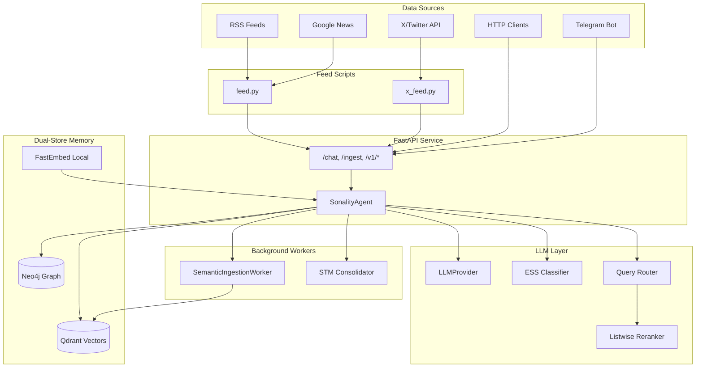

# System Overview

Sonality is an LLM agent with self-evolving personality and beliefs. The system uses dual-store memory (Neo4j graph + Qdrant vectors) with LLM-first decision making for belief updates, retrieval routing, and reflection.

## High-Level Architecture

```mermaid
flowchart TB
    subgraph sources["Data Sources"]
        RSS[RSS Feeds]
        GNews[Google News]
        XApi[X/Twitter API]
        HTTP[HTTP Clients]
        TG[Telegram Bot]
    end

    subgraph scripts["Feed Scripts"]
        feed_py[feed.py]
        x_feed_py[x_feed.py]
    end

    subgraph api["FastAPI Service"]
        API["/chat, /ingest, /v1/*"]
        Agent[SonalityAgent]
    end

    subgraph llm_layer["LLM Layer"]
        Provider[LLMProvider]
        ESS[ESS Classifier]
        Router[Query Router]
        Reranker[Listwise Reranker]
    end

    subgraph memory["Dual-Store Memory"]
        Neo4j[(Neo4j Graph)]
        Qdrant[(Qdrant Vectors)]
        Embedder[FastEmbed Local]
    end

    subgraph background["Background Workers"]
        SemWorker[SemanticIngestionWorker]
        STMWorker[STM Consolidator]
    end

    RSS --> feed_py
    GNews --> feed_py
    XApi --> x_feed_py
    feed_py --> API
    x_feed_py --> API
    HTTP --> API
    TG --> API

    API --> Agent
    Agent --> Provider
    Agent --> ESS
    Agent --> Router
    Router --> Reranker

    Agent --> Neo4j
    Agent --> Qdrant
    Embedder --> Agent
    Agent --> SemWorker
    SemWorker --> Qdrant
    Agent --> STMWorker
```

## Storage Architecture

| Layer | Technology | Purpose |
|-------|------------|---------|
| **Graph Store** | Neo4j 5 | Episodes, beliefs, topics, segments, personality snapshot, provenance edges |
| **Vector Store** | Qdrant | Episode derivatives (chunks), semantic features, knowledge propositions |
| **Embeddings** | FastEmbed (BAAI/bge-large-en-v1.5, 1024d) | Local embedding generation, no external API |
| **LLM Provider** | OpenAI-compatible HTTP | Chat completions, structured outputs, ESS classification |

## Core Components

### Agent Layer (`sonality/`)

| Module | Responsibility |
|--------|----------------|
| `agent.py` | Main orchestration: context assembly → LLM → post-processing → memory updates |
| `api.py` | FastAPI server with OpenAI-compatible endpoints + custom routes |
| `cli.py` | Interactive REPL with personality inspection commands |
| `provider.py` | HTTP client for LLM/embedding providers with retry, JSON repair |
| `ess.py` | Evidence Strength Score classification (0.0–1.0) |
| `prompts.py` | All agent-level prompt templates |
| `config.py` | Environment loading and compile-time constants |
| `schema.py` | Qdrant collection definitions, Neo4j schema statements |

### Memory Subsystem (`sonality/memory/`)

| Module | Responsibility |
|--------|----------------|
| `db.py` | Database connection pool (Neo4j driver + Qdrant client) |
| `graph.py` | Cypher operations: episodes, beliefs, topics, segments, edges |
| `dual_store.py` | Atomic episode storage: Neo4j first, then Qdrant with rollback |
| `embedder.py` | FastEmbed wrapper with query cache |
| `derivatives.py` | LLM semantic chunking of episodes |
| `knowledge_extract.py` | Knowledge proposition extraction to Qdrant |
| `segmentation.py` | Event boundary detection for conversation segments |
| `consolidation.py` | Segment readiness and summary generation |
| `forgetting.py` | Batch archival/deletion decisions (KEEP/ARCHIVE/FORGET) |
| `belief_provenance.py` | Evidence-belief linking with AGM contraction |
| `semantic_features.py` | Background async feature extraction worker |

### Retrieval Pipeline (`sonality/memory/retrieval/`)

| Module | Responsibility |
|--------|----------------|
| `router.py` | LLM query classification (SIMPLE/TEMPORAL/MULTI_ENTITY/AGGREGATION/BELIEF_QUERY) |
| `chain.py` | Iterative retrieval with sufficiency checks |
| `split.py` | Query decomposition for multi-entity questions |
| `reranker.py` | Listwise LLM reranking of episode candidates |

### LLM Utilities (`sonality/llm/`)

| Module | Responsibility |
|--------|----------------|
| `caller.py` | Structured Pydantic outputs with retry and JSON repair |

## Chat Clients (`chat/`)

| Module | Responsibility |
|--------|----------------|
| `client.py` | Async httpx client to Sonality API with history management |
| `terminal.py` | Rich TUI for local chat sessions |
| `telegram.py` | aiogram bot with voice (STT/TTS) support |
| `audio.py` | Speaches integration for speech-to-text and text-to-speech |

## Feed Scripts (`scripts/`)

| Script | Responsibility |
|--------|----------------|
| `feed.py` | RSS + GNews aggregation → `/ingest` endpoint |
| `x_feed.py` | X API v2 search → `/ingest` endpoint |
| `memory_diagnostics.py` | Neo4j + Qdrant consistency checks |

## Runtime Loop

`SonalityAgent.respond()` orchestrates each interaction:

1. **Route query** — LLM classifies query category and retrieval strategy
2. **Retrieve memory** — Vector search + graph traversal + semantic features
3. **Build prompt** — Core identity + personality snapshot + beliefs + retrieved context
4. **Generate response** — Chat completion via provider
5. **ESS classification** — Evaluate user message argument quality (third-person framing)
6. **Store episode** — Atomic dual-store write (Neo4j → Qdrant with rollback)
7. **Update beliefs** — Provenance assessment, staged opinion updates
8. **Background tasks** — Semantic feature extraction, knowledge extraction
9. **Optional reflection** — Decay, consolidation, snapshot rewrite (every ~20 turns)

## Retrieval Model

Query routing is LLM-first and supports multiple strategies:

| Category | Strategy |
|----------|----------|
| `TEMPORAL` / `AGGREGATION` | Chain-of-query iterative retrieval |
| `MULTI_ENTITY` | Query decomposition + parallel sub-queries |
| `BELIEF_QUERY` | Belief-edge traversal + topic traversal + vector search |
| `SIMPLE` / `NONE` | Direct vector retrieval + topic traversal |

All paths support:
- **Hybrid BM25+vector search** via Qdrant text indexing (RRF fusion)
- **Listwise LLM reranking** of episode candidates
- **Semantic feature lookup** when router sets `semantic_memory="SEARCH"`

## Reflection and Health

Reflection triggers periodically (~20 interactions) or on events:

1. **LLM-guided belief decay** — Unreinforced beliefs lose confidence
2. **Entrenchment detection** — Overly rigid beliefs flagged
3. **Segment consolidation** — Closed segments summarized
4. **Forgetting pass** — Low-value episodes archived or deleted
5. **Snapshot rewrite** — Personality narrative updated with validation
6. **Consistency verification** — Orphan derivative cleanup

Health diagnostics logged every interaction with reflection-level coherence checks.
