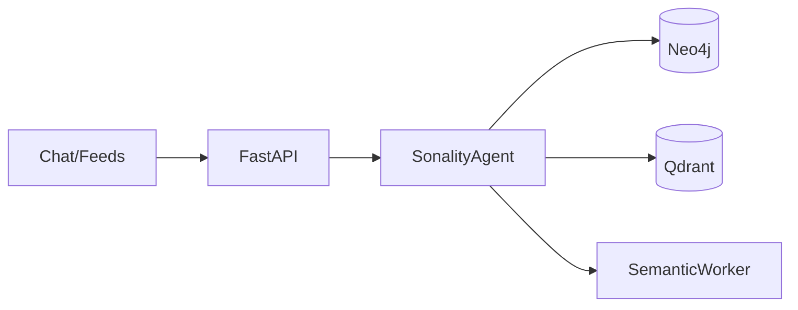
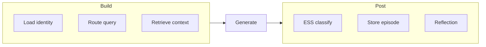

# Architecture Overview

> **Core Module**: `sonality/agent.py`

LLM agent with self-evolving personality. Stateless per-request — identity loaded from Neo4j each time.

## System Diagram


```mermaid
flowchart LR
    Sources[Chat/Feeds] --> API[FastAPI]
    API --> Agent[SonalityAgent]
    Agent --> Neo4j[(Neo4j)]
    Agent --> Qdrant[(Qdrant)]
    Agent --> Background[SemanticWorker]
```

## Agent Components

```
SonalityAgent
├── MemoryGraph (Neo4j)
├── DualEpisodeStore (Neo4j + Qdrant)
├── Embedder (FastEmbed)
├── BoundaryDetector
└── SemanticWorker (background)
```

## Response Pipeline


```mermaid
flowchart LR
    subgraph Build
        Load[Load identity]
        Route[Route query]
        Retrieve[Retrieve context]
    end
    Build --> LLM[Generate] --> Post
    subgraph Post
        ESS[ESS classify]
        Store[Store episode]
        Reflect[Reflection]
    end
```

1. Load personality snapshot + beliefs
2. Route query → retrieval strategy
3. Retrieve episodes + knowledge
4. Build prompt, generate response
5. ESS classify user message
6. Store episode (atomic Neo4j→Qdrant)
7. Knowledge extraction, provenance, semantic features
8. Two-tier reflection (if triggered)

## Retrieval Strategies

| Category | Strategy |
|----------|----------|
| SIMPLE | Vector + topic search |
| TEMPORAL | Chain with sufficiency |
| MULTI_ENTITY | Query decomposition |
| BELIEF_QUERY | Belief edges + topic + vector |

## Ingestion (non-conversational)

```
ESS classify → if update_recommended → store → extract → provenance → reflect
```

## Error Handling

| Component | Fallback |
|-----------|----------|
| LLM | 3 retries → empty |
| ESS | `classifier_exception_fallback` |
| Knowledge | Log and continue |
