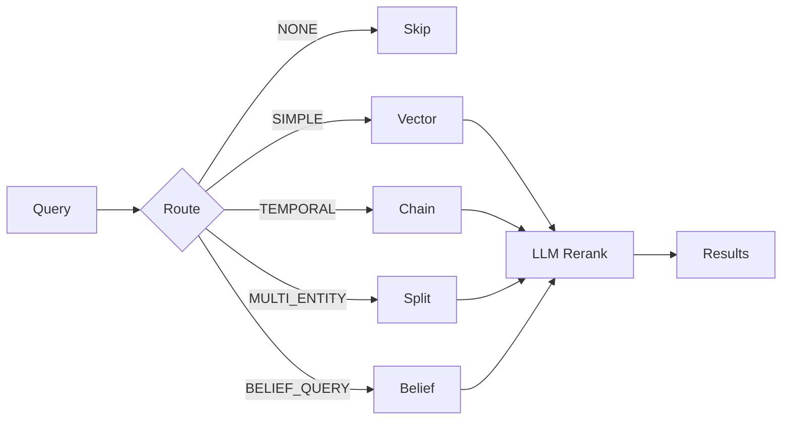

# Retrieval Pipeline

## Flow



## Query Categories

| Category | Strategy | Use Case |
|----------|----------|----------|
| NONE | Skip | Chitchat |
| SIMPLE | Vector search | Single topic lookup |
| TEMPORAL | Chain retrieval | Chronological ordering |
| MULTI_ENTITY | Split retrieval | Compare entities |
| AGGREGATION | Chain retrieval | Cross-conversation synthesis |
| BELIEF_QUERY | Belief edges + vector | Agent's own view |

## Retrieval Depth

| Depth | Episodes |
|-------|----------|
| MINIMAL | 2 |
| MODERATE | 7 |
| DEEP | 15 |

## Chain Retrieval

Iterative search with LLM sufficiency checking:

```
for iteration in [1..RETRIEVAL_MAX_ITERATIONS]:
    results = vector_search(query)
    if llm_sufficiency_decision(results) == SUFFICIENT:
        return results
    query = llm_refine(query)
```

## Split Retrieval

Decompose multi-entity queries:

```
"Compare X and Y" → ["X?", "Y?"]
parallel search → aggregate (interleave)
```

## LLM Reranker

Listwise reranking of up to 50 candidates:
1. Format numbered candidates
2. LLM ranks by relevance
3. Return top-k

## Config

| Variable | Default |
|----------|---------|
| `RETRIEVAL_MAX_ITERATIONS` | 3 |
| `MAX_RERANK_CANDIDATES` | 50 |
| `QDRANT_SEARCH_EF` | 128 |

Sufficiency is determined by an LLM decision (SUFFICIENT / INSUFFICIENT), not a fixed confidence threshold.
