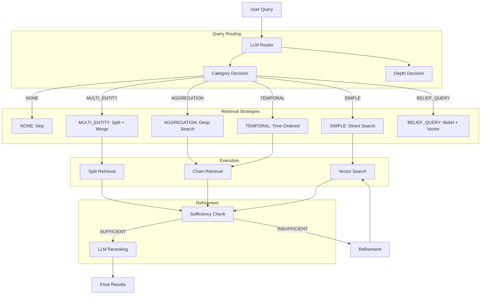
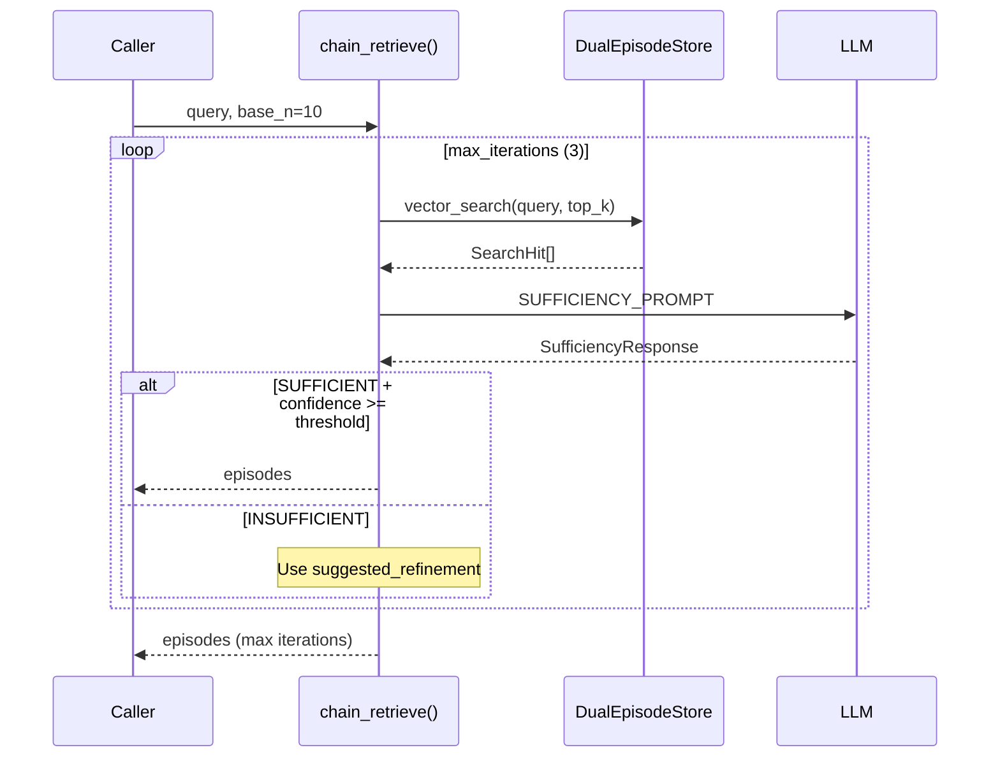
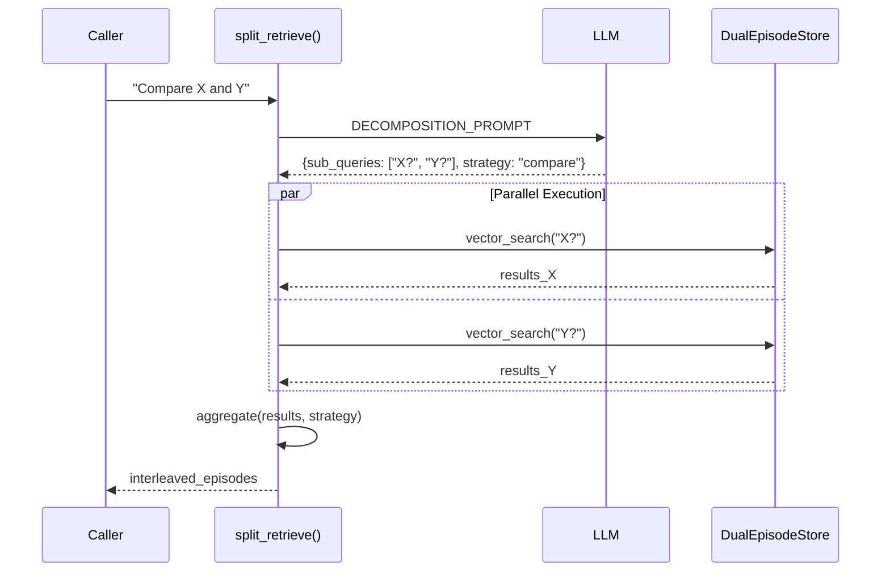

# Retrieval Pipeline Deep Dive

This document covers Sonality's multi-stage retrieval system: routing, chain retrieval, split retrieval, and LLM reranking.

## Pipeline Overview



## Query Router

### Routing Decision Model

```python
class QueryCategory(StrEnum):
    NONE = "NONE"              # Pure chitchat
    SIMPLE = "SIMPLE"          # Single topic lookup
    TEMPORAL = "TEMPORAL"      # Chronological ordering needed
    MULTI_ENTITY = "MULTI_ENTITY"  # Compare 2+ entities
    AGGREGATION = "AGGREGATION"    # Cross-conversation synthesis
    BELIEF_QUERY = "BELIEF_QUERY"  # Agent's own view

class RetrievalDepth(StrEnum):
    MINIMAL = "MINIMAL"    # 2 episodes
    MODERATE = "MODERATE"  # 7 episodes
    DEEP = "DEEP"          # 15 episodes

class TemporalExpansionDecision(StrEnum):
    EXPAND = "EXPAND"      # Fetch temporal context
    NO_EXPAND = "NO_EXPAND"

class SemanticMemoryDecision(StrEnum):
    SEARCH = "SEARCH"      # Query semantic features
    SKIP = "SKIP"

class RoutingDecision(BaseModel):
    category: QueryCategory
    depth: RetrievalDepth
    temporal_expansion: TemporalExpansionDecision
    semantic_memory: SemanticMemoryDecision
    reasoning: str = ""
```

### Routing Examples

| Query | Category | Depth | Temporal | Semantic |
|-------|----------|-------|----------|----------|
| "Hi there" | NONE | - | - | - |
| "What do you know about X?" | SIMPLE | MODERATE | NO_EXPAND | SKIP |
| "What's your view on X?" | BELIEF_QUERY | MODERATE | NO_EXPAND | SEARCH |
| "How has X changed?" | TEMPORAL | DEEP | EXPAND | SKIP |
| "Compare X and Y" | MULTI_ENTITY | DEEP | NO_EXPAND | SKIP |
| "Summarize everything" | AGGREGATION | DEEP | EXPAND | SEARCH |

## Chain Retrieval

Iterative search with LLM sufficiency checking:



### Implementation

```python
async def chain_retrieve(
    store: DualEpisodeStore, graph: MemoryGraph, query: str, base_n: int = 10,
) -> list[EpisodeNode]:
    """Iteratively search and refine until sufficient results found."""
    all_uids: set[str] = set()
    all_episodes: list[EpisodeNode] = []
    current_query = query
    max_iter = config.RETRIEVAL_MAX_ITERATIONS  # 3
    threshold = config.RETRIEVAL_CONFIDENCE_THRESHOLD  # 0.8

    for iteration in range(1, max_iter + 1):
        results = await store.vector_search(current_query, top_k=base_n)
        new_uids = [h.episode_uid for h in results if h.episode_uid not in all_uids]

        if new_uids:
            episodes = await graph.get_episodes(new_uids)
            for ep in episodes:
                if ep.uid not in all_uids:
                    all_uids.add(ep.uid)
                    all_episodes.append(ep)
        elif iteration > 1:
            break  # No new results, stop

        # Check sufficiency
        context = "\n\n".join(
            f"[{ep.created_at}] {ep.summary or ep.content[:200]}" for ep in all_episodes
        )
        sufficiency = llm_call(
            prompt=SUFFICIENCY_PROMPT.format(query=query, context=context),
            response_model=_SufficiencyResponse,
        )

        if (sufficiency.sufficiency_decision is SUFFICIENT 
            and sufficiency.confidence >= threshold):
            return all_episodes

        if sufficiency.suggested_refinement:
            current_query = sufficiency.suggested_refinement
        else:
            break

    return all_episodes
```

## Split Retrieval

Query decomposition with parallel execution:



### Aggregation Strategies

```python
class _AggregationStrategy(StrEnum):
    MERGE = "merge"      # Dedupe and concatenate
    COMPARE = "compare"  # Interleave results
    TIMELINE = "timeline"  # Sort by created_at

def _aggregate(sub_results: list[list[EpisodeNode]], strategy: _AggregationStrategy):
    if strategy is COMPARE:
        # Interleave: [A1, B1, A2, B2, ...]
        interleaved = []
        max_len = max(len(batch) for batch in sub_results)
        for index in range(max_len):
            for batch in sub_results:
                if index < len(batch):
                    interleaved.append(batch[index])
        return _dedupe(interleaved)
    
    if strategy is TIMELINE:
        return sorted(_dedupe([...]), key=lambda ep: ep.created_at)
    
    # MERGE: simple dedupe
    return _dedupe([ep for batch in sub_results for ep in batch])
```

## LLM Listwise Reranker

Cross-document reasoning for relevance ranking:

```python
def rerank_episodes(
    query: str,
    candidates: list[EpisodeNode],
    *,
    top_k: int = 0,
) -> list[EpisodeNode]:
    """Rerank candidate episodes using LLM Listwise approach."""
    if len(candidates) <= 1:
        return candidates

    max_candidates = config.MAX_RERANK_CANDIDATES  # 50
    to_rank = candidates[:max_candidates]

    # Format numbered candidates
    numbered = "\n\n".join(
        f"[{i + 1}] ({ep.created_at[:10]}) {ep.summary or ep.content[:300]}"
        for i, ep in enumerate(to_rank)
    )

    result = llm_call(
        prompt=RERANK_PROMPT.format(query=query, numbered_candidates=numbered),
        response_model=_RerankResponse,
        fallback=_RerankResponse(ranking=list(range(1, len(to_rank) + 1))),
    )

    # Map 1-indexed ranking to 0-indexed episodes
    reranked = []
    seen = set()
    for idx in result.value.ranking:
        zero_idx = idx - 1
        if 0 <= zero_idx < len(to_rank) and zero_idx not in seen:
            reranked.append(to_rank[zero_idx])
            seen.add(zero_idx)

    # Add any missed candidates
    for i, ep in enumerate(to_rank):
        if i not in seen:
            reranked.append(ep)

    return reranked[:top_k] if top_k > 0 else reranked
```

### Ranking Criteria

From `RERANK_PROMPT`:

1. **Topical match** — Same subject/topic as query?
2. **Directness** — Directly addresses query without detours?
3. **Recency** — Among topically matched, prefer recent

## Vector Search

The underlying search uses Qdrant with HNSW:

```python
async def vector_search(
    self, query: str, top_k: int = 10
) -> list[SearchHit]:
    """Semantic search in derivatives collection."""
    embedding = await self._embed(query)
    
    results = await self._qdrant.search(
        collection_name="derivatives",
        query_vector=embedding,
        limit=top_k,
        search_params=models.SearchParams(
            hnsw_ef=config.QDRANT_SEARCH_EF,  # 128
            exact=False,
        ),
        with_payload=True,
    )
    
    return [
        SearchHit(
            derivative_uid=r.id,
            episode_uid=r.payload.get("episode_uid"),
            score=r.score,
            text=r.payload.get("text", ""),
        )
        for r in results
    ]
```

## Full Retrieval Pipeline

Putting it together in `agent.py`:

```python
async def _retrieve_context(self, query: str) -> list[str]:
    # 1. Route the query
    routing = await self._route_query(query)
    
    if routing.category is QueryCategory.NONE:
        return []
    
    # 2. Determine depth
    depth_map = {
        RetrievalDepth.MINIMAL: 2,
        RetrievalDepth.MODERATE: 7,
        RetrievalDepth.DEEP: 15,
    }
    n = depth_map.get(routing.depth, 7)
    
    # 3. Execute appropriate strategy
    if routing.category is QueryCategory.MULTI_ENTITY:
        episodes = await split_retrieve(self._store, self._graph, query, n)
    elif routing.category in {QueryCategory.TEMPORAL, QueryCategory.AGGREGATION}:
        episodes = await chain_retrieve(self._store, self._graph, query, n)
    else:
        results = await self._store.vector_search(query, top_k=n * 3)
        uids = [h.episode_uid for h in results]
        episodes = await self._graph.get_episodes(uids)
    
    # 4. Temporal expansion if needed
    if routing.temporal_expansion is TemporalExpansionDecision.EXPAND:
        episodes = await self._expand_temporal(episodes)
    
    # 5. Rerank
    episodes = rerank_episodes(query, episodes, top_k=n)
    
    # 6. Semantic features if needed
    features = []
    if routing.semantic_memory is SemanticMemoryDecision.SEARCH:
        features = await self._search_semantic_features(query)
    
    return self._format_context(episodes, features)
```

## Configuration

| Variable | Default | Description |
|----------|---------|-------------|
| `SONALITY_RETRIEVAL_MAX_ITERATIONS` | `3` | Chain retrieval iterations |
| `SONALITY_RETRIEVAL_CONFIDENCE_THRESHOLD` | `0.8` | Sufficiency confidence |
| `SONALITY_RETRIEVAL_OVER_FETCH_FACTOR` | `3` | Over-fetch before rerank |
| `SONALITY_MAX_RERANK_CANDIDATES` | `50` | Max candidates for LLM rerank |
| `SONALITY_QDRANT_SEARCH_EF` | `128` | HNSW search ef parameter |

## Performance Considerations

1. **Over-fetch + Rerank** — Fetch 3x candidates, rerank to top-k
2. **Parallel Sub-queries** — Split retrieval uses `asyncio.gather`
3. **Semaphore Limits** — Max 4 concurrent sub-queries
4. **Early Termination** — Chain stops when no new results
5. **Cached Embeddings** — FastEmbed caches model weights
