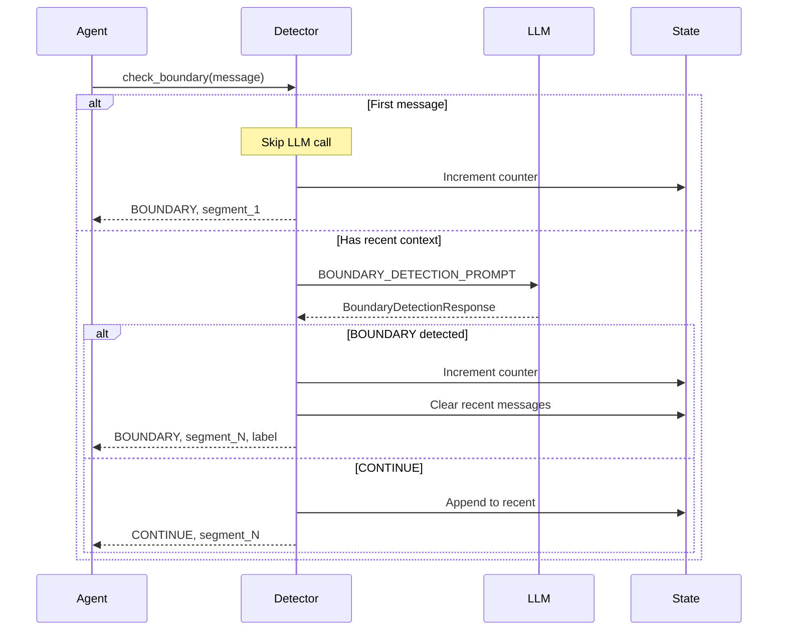
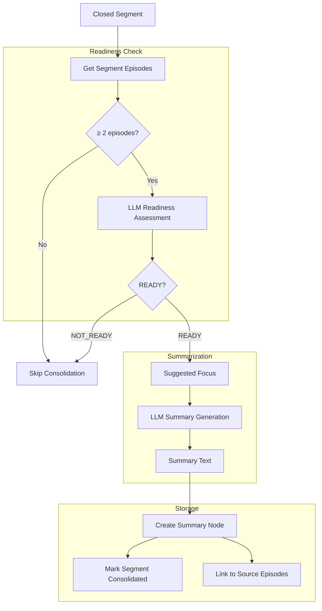
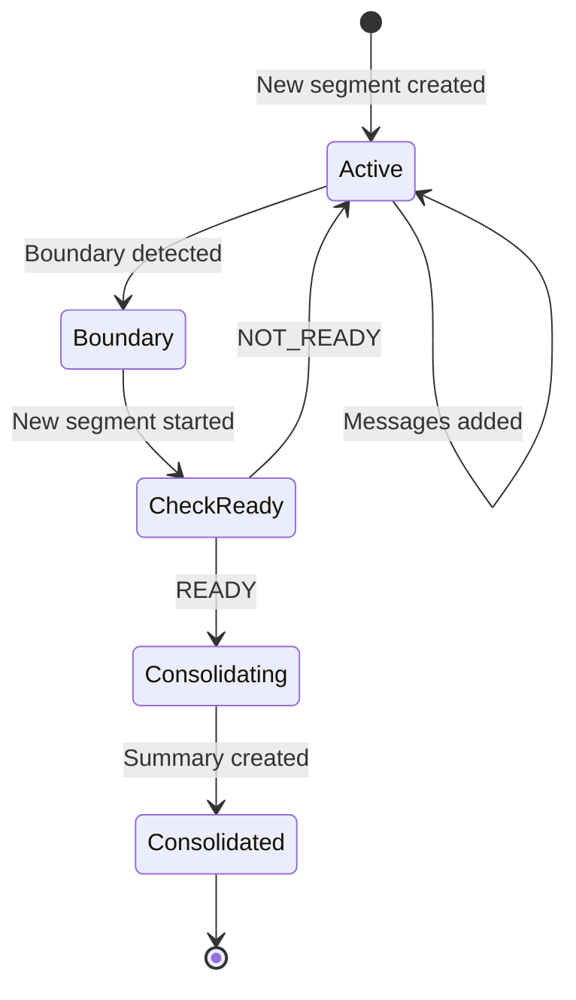

# Conversation Segmentation and Consolidation

This document covers LLM-based event boundary detection, segment management, and the consolidation pipeline.

## System Overview

```mermaid
flowchart TB
    subgraph detection["Boundary Detection"]
        Message[New Message]
        Detector[EventBoundaryDetector]
        Recent[Recent Messages Window]
        LLMCheck[LLM Boundary Check]
    end
    
    subgraph segments["Segment Management"]
        SegmentID[segment_N]
        Episodes[Episode Nodes]
        Neo4j[(Neo4j Graph)]
    end
    
    subgraph consolidation["Consolidation"]
        Readiness[Readiness Check]
        Summary[Summary Generation]
        SummaryNode[Summary Node]
    end
    
    Message --> Detector
    Detector --> Recent
    Recent --> LLMCheck
    LLMCheck -->|BOUNDARY| SegmentID
    LLMCheck -->|CONTINUE| SegmentID
    SegmentID --> Episodes
    Episodes --> Neo4j
    
    Episodes -->|Segment closed| Readiness
    Readiness -->|READY| Summary
    Summary --> SummaryNode
    SummaryNode --> Neo4j
```



## Event Boundary Detection

### Purpose

Replace cosine-distance threshold approaches with **LLM contextual analysis** to identify:
- Topic shifts
- Goal changes
- Explicit transitions

### EventBoundaryDetector Class

```python
class EventBoundaryDetector:
    """LLM-based conversation boundary detector."""

    def __init__(self) -> None:
        self._recent_messages: deque[str] = deque(maxlen=5)
        self._current_segment_id: str = "segment_0"
        self._segment_counter: int = 0

    @property
    def current_segment_id(self) -> str:
        return self._current_segment_id

    def set_segment_counter(self, counter: int) -> None:
        """Restore persisted segment numbering after restart."""
        self._segment_counter = max(counter, 0)
        self._current_segment_id = f"segment_{self._segment_counter}"
```

### Boundary Check Flow



### Boundary Detection Response

```python
class BoundaryDecision(StrEnum):
    BOUNDARY = "BOUNDARY"
    CONTINUE = "CONTINUE"

class BoundaryDetectionResponse(BaseModel):
    boundary_decision: BoundaryDecision = BoundaryDecision.CONTINUE
    confidence: float = 0.0
    boundary_type: str = "none"  # topic_shift, goal_change, explicit_transition
    reasoning: str = ""
    suggested_segment_label: str = ""
```

### Boundary Detection Prompt

```python
BOUNDARY_DETECTION_PROMPT = """
Analyze if this message represents a significant topic or segment boundary.

Recent conversation context (last 5 messages):
{recent_context}

Current message:
{current_message}

Consider:
- Is this introducing a completely new topic unrelated to recent discussion?
- Is this a natural conversation breakpoint (task completed, question answered)?
- Did the user explicitly shift to a different subject?
- Is this a continuation/elaboration of the current topic?

Output JSON:
{{"boundary_decision": "BOUNDARY/CONTINUE", "confidence": 0.0-1.0,
  "boundary_type": "topic_shift/goal_change/explicit_transition/none",
  "reasoning": "...", "suggested_segment_label": "..."}}
"""
```

### Boundary Types

| Type | Description | Example |
|------|-------------|---------|
| `topic_shift` | Completely new subject | "Let's talk about cooking" after AI discussion |
| `goal_change` | Different objective | Switching from learning to debugging |
| `explicit_transition` | User signals change | "Anyway...", "Moving on..." |
| `none` | Continuation | Follow-up question on same topic |

## Segment Consolidation

### Purpose

When a conversation segment closes, generate a summary using **HEMA principle** (hierarchical episodic memory):
- Summaries supplement (not replace) raw episodes
- Enable multi-level retrieval
- Reduce context length for old conversations

### Consolidation Pipeline



### Readiness Assessment

```python
async def maybe_consolidate_segment(graph: MemoryGraph, segment_id: str) -> str:
    """Check if a segment is ready for consolidation and summarize if so.
    
    Returns the summary UID if consolidated, empty string otherwise.
    """
    episodes = await graph.get_segment_episodes(segment_id)
    if len(episodes) < 2:
        return ""

    readiness = _check_readiness(segment_id, episodes)
    if readiness.readiness_decision is not _ReadinessDecision.READY:
        return ""

    summary_text = _generate_summary(episodes, readiness.suggested_summary_focus)
    if not summary_text:
        return ""

    summary_uid = str(uuid.uuid4())
    source_uids = [ep.uid for ep in episodes]
    topics = list({t for ep in episodes for t in ep.topics})

    await graph.create_summary(
        uid=summary_uid, level=2, content=summary_text,
        source_uids=source_uids, topics=topics,
    )
    await graph.mark_segment_consolidated(segment_id)

    return summary_uid
```

### Readiness Response

```python
class _ReadinessDecision(StrEnum):
    READY = "READY"
    NOT_READY = "NOT_READY"

class _ReadinessResponse(BaseModel):
    readiness_decision: _ReadinessDecision = _ReadinessDecision.NOT_READY
    confidence: float = 0.0
    reasoning: str = ""
    suggested_summary_focus: str = ""
```

### Readiness Prompt

```python
CONSOLIDATION_READINESS_PROMPT = """
Assess if this conversation segment is ready for consolidation into a summary.

Segment ID: {segment_id}
Episode count: {episode_count}
Time span: {start_time} to {end_time}

Episodes in segment:
{episode_summaries}

Consider:
- Has the topic/discussion reached a natural conclusion?
- Are there unresolved threads that might continue?
- Is there enough substantive content for a meaningful summary?
- Would consolidating now lose important ongoing context?

Output JSON:
{{"readiness_decision": "READY/NOT_READY", "confidence": 0.0-1.0,
  "reasoning": "...", "suggested_summary_focus": "..." or null}}
"""
```

### Summary Generation

```python
def _generate_summary(episodes: list[EpisodeNode], focus: str) -> str:
    content = "\n\n".join(
        format_episode_block(
            created_at=ep.created_at,
            content=ep.content,
            content_limit=500
        )
        for ep in episodes
    )
    focus_instruction = f"\n\nFocus on: {focus}" if focus else ""
    prompt = (
        f"Summarize these conversation episodes into a concise, comprehensive summary.\n"
        f"Preserve key facts, decisions, opinions, and important context.\n\n"
        f"Episodes:\n{content}{focus_instruction}\n\nWrite the summary:"
    )
    completion = default_provider.chat_completion(
        model=config.FAST_LLM_MODEL,
        max_tokens=config.LLM_MAX_TOKENS,
        messages=({"role": "user", "content": prompt},),
    )
    return completion.text.strip()
```

## Neo4j Schema

### Segment Node

```cypher
(:Segment {
    segment_id: "segment_42",
    label: "Climate policy discussion",
    start_time: datetime(),
    end_time: datetime(),
    consolidated: false
})
```

### Episode → Segment Relationship

```cypher
(:Episode)-[:BELONGS_TO]->(:Segment)
```

### Summary Node

```cypher
(:Summary {
    uid: "sum-abc123",
    level: 2,
    content: "Discussion covered climate policy...",
    created_at: datetime()
})
```

### Summary Relationships

```cypher
(:Summary)-[:SUMMARIZES]->(:Episode)
(:Summary)-[:HAS_TOPIC]->(:Topic)
```

## Segment Lifecycle



## Integration with Agent

### On Message Processing

```python
def respond(self, messages: list[dict]) -> str:
    # Check for segment boundary
    boundary_result = self._boundary_detector.check_boundary(user_message)
    
    if boundary_result.boundary_decision is BoundaryDecision.BOUNDARY:
        # Trigger consolidation for previous segment
        old_segment = self._previous_segment_id
        asyncio.create_task(
            maybe_consolidate_segment(self._graph, old_segment)
        )
```

### Segment Counter Persistence

On agent restart, restore the segment counter from the graph:

```python
max_segment = await graph.get_max_segment_number()
self._boundary_detector.set_segment_counter(max_segment)
```

## Design Decisions

### Why LLM-based boundary detection?

Cosine similarity thresholds fail when:
- Topic continues but vocabulary shifts (same topic, different words)
- Vocabulary is similar but topic changed (related but distinct topics)
- User explicitly signals transition but continues similar language

LLM understands **semantic transitions** that embedding distances miss.

### Why deferred consolidation?

Immediate consolidation risks:
- Summarizing incomplete discussions
- Missing follow-up context
- Premature closure of ongoing threads

The readiness check prevents premature consolidation.

### Why keep raw episodes alongside summaries?

HEMA principle: hierarchical but **not lossy**
- Summaries for efficient retrieval of old conversations
- Raw episodes for detailed recall when needed
- Both linked in graph for flexible traversal
