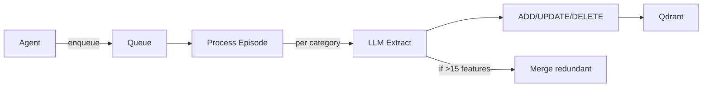

# Semantic Features Worker

> **Module**: `sonality/memory/semantic_features.py`

Background daemon extracting personality features from episodes into Qdrant.

## Categories

| Category | Tags |
|----------|------|
| PERSONALITY | traits, values, communication_style, emotional_patterns |
| PREFERENCES | likes, dislikes, opinions, aesthetics |
| KNOWLEDGE | facts, expertise, interests, concepts |
| RELATIONSHIPS | people, organizations, connections |

## Flow



## Commands

```python
class FeatureCommand(BaseModel):
    command: FeatureCommandType  # ADD, UPDATE, DELETE
    tag: str                     # Sub-category
    feature: str
    value: str
    confidence: float = 0.5
```

## Interaction Awareness

- Defers during `interaction_in_progress()`
- Checks `llm_semaphore_idle()` before LLM calls
- Re-queues remaining categories on interruption

## Consolidation

Triggered when category exceeds 15 features. LLM merges redundant features (max 2 merges per pass).

## Storage

Deterministic UID: `uuid5(f"semantic:{category}:{tag}:{feature}")`

Payload: `{uid, category, tag, feature_name, value, confidence, episode_citations[]}`
