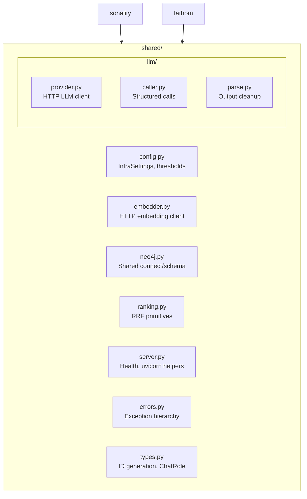
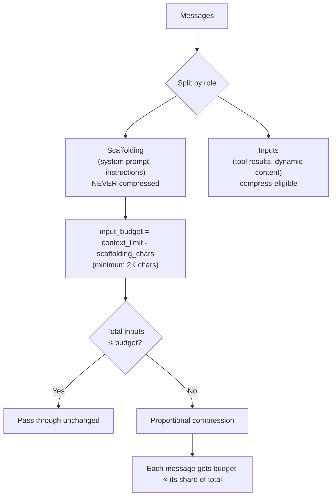

# Shared Infrastructure

The `shared` package provides cross-service infrastructure used by both Sonality and Fathom. It eliminates duplication of common concerns: LLM communication, embeddings, database connectivity, and output parsing.

---

## Package Structure



---

## LLM Provider

The LLM provider (`shared/llm/provider.py`) implements an OpenAI-compatible HTTP client that works with any endpoint following the chat completions API contract:

- **llama.cpp** (local inference)
- **OpenAI** (cloud)
- **Anthropic** (via OpenAI-compatible proxy)
- **OpenRouter** (multi-provider routing)

Design choices:
- No OpenAI SDK dependency --- uses `httpx` directly for full control over retry logic, timeout behavior, and response parsing
- `threading.Semaphore` gates concurrent requests to prevent overwhelming single-slot inference servers
- Exponential backoff with jitter on transient failures
- Streaming support via SSE parsing

---

## Structured LLM Calls

The caller module (`shared/llm/caller.py`) provides higher-level abstractions for structured output:

1. **`llm_call`** --- Sends a prompt expecting a Pydantic model as response; parses JSON from LLM output; applies fallback values on parse failure
2. **`format_prompt`** --- Template rendering with variable substitution
3. **`compose_guarded`** --- Context-budget-aware prompt composition (detailed below)

All structured calls disable thinking mode (`enable_thinking=False`) because chain-of-thought output is incompatible with JSON prefill and degrades structured output accuracy. This is a deliberate tradeoff: structured classification tasks (ESS, routing, provenance) benefit more from reliable parsing than from extended reasoning.

### Context Compression: `compose_guarded`

The context budget problem: dynamic inputs (tool results, retrieved memories, research outputs) can exceed context limits at any time. Rather than hard-truncating, `compose_guarded` implements proportional LLM-based compression:



The proportional allocation formula:

$$
\text{msg\_budget}(i) = \max\left(500,\; \left\lfloor \frac{\text{budget} \times \text{size}(i)}{\text{total\_size}} \right\rfloor\right)
$$

Only messages exceeding their individual budget are compressed (via an LLM summarization call). Messages under budget pass unchanged. This ensures large tool outputs are compressed more aggressively while short messages remain intact — preserving information density where it matters most.

---

## Output Parsing

The parse module (`shared/llm/parse.py`) handles the reality of LLM output, which is often imperfect:

| Challenge | Solution |
|-----------|----------|
| Thinking blocks (`<think>...</think>`) | Regex removal before parsing |
| Markdown code fences around JSON | Extraction of content between fences |
| Buried JSON in natural language | Pattern matching for `{...}` blocks |
| Escaped quotes and unicode | Normalization before JSON parsing |
| Pipe-separated enum options (`"A" \| "B"`) | First-value extraction |
| Type placeholders (`float`, `string`) | Default value substitution |
| Trailing ellipsis (`0.3...`) | Truncation to valid number |
| Tool call format variants | Unified parsing across formats |

This extensive normalization enables reliable operation with quantized models (down to IQ2_M, ~2 bits/weight) that produce syntactically imperfect but semantically correct outputs. The 49 unit tests in `tests/shared/llm/test_parse.py` document the specific edge cases handled.

---

## Embedding Client

The embedder (`shared/embedder.py`) communicates with a llama.cpp embedding server:

- **Instruction-aware prefixing** --- Query embeddings receive a "search_query:" prefix while document embeddings receive "search_document:" prefix, following the embedding model's training protocol
- **[Matryoshka Representation Learning](https://huggingface.co/blog/matryoshka) (MRL)** --- Embeddings can be truncated to lower dimensions without retraining; the model frontloads important information into earlier dimensions. The system uses 2560-dimensional embeddings from Qwen3-Embedding-4B
- **Caching** --- An LRU cache (configurable size, default 10K entries) prevents redundant embedding computations for repeated queries
- **Character limit** --- Inputs exceeding 4096 characters are truncated to prevent embedding quality degradation on overly long texts

---

## Reciprocal Rank Fusion

The ranking module (`shared/ranking.py`) provides RRF primitives used by both Sonality's retrieval pipeline and Fathom's URL ranking:

$$
\text{RRF}(d) = \sum_{r \in R} \frac{1}{k + r(d)}
$$

Where $R$ is the set of ranking functions and $r(d)$ is the rank of document $d$ in ranking $r$. The constant $k$ (default 60) controls how much weight is given to high-ranked vs. low-ranked items.

RRF is used because it:
- Requires no score normalization between heterogeneous ranking signals
- Is parameter-free (aside from $k$)
- Performs competitively with learned-weight fusion in practice

---

## Error Hierarchy

The shared error module defines a structured exception hierarchy:

```
SonalityError (base)
├── LLMError
│   ├── LLMTimeoutError
│   ├── LLMParseError
│   └── LLMRateLimitError
├── DatabaseError
│   ├── Neo4jConnectionError
│   └── QdrantConnectionError
├── ResearchError
│   ├── SearchError
│   └── FetchError
└── ConfigurationError
```

All services catch and handle errors from this hierarchy, enabling consistent error reporting and graceful degradation across the stack.

---

## Configuration

`InfraSettings` (via pydantic-settings) provides shared configuration:

| Setting | Purpose |
|---------|---------|
| `INFRA_NEO4J_URI` | Neo4j bolt connection URI |
| `INFRA_QDRANT_URL` | Qdrant gRPC/HTTP endpoint |
| `INFRA_EMBEDDING_URL` | Embedding server endpoint |
| `VECTOR_SEARCH_THRESHOLD` | Minimum cosine similarity for retrieval results |

These are shared by both Sonality and Fathom, ensuring both services connect to the same infrastructure without configuration drift.

---

## Related Pages

- [Sonality Engine](sonality.md) --- How the agent uses the shared LLM provider and caller
- [Fathom Research](fathom.md) --- How research sessions use shared embedding and ranking primitives
- [Retrieval Pipeline](../concepts/retrieval.md) --- Concrete application of RRF in multi-pass memory retrieval
- [Configuration](../deployment/configuration.md) --- Full environment variable reference including `INFRA_*` settings
