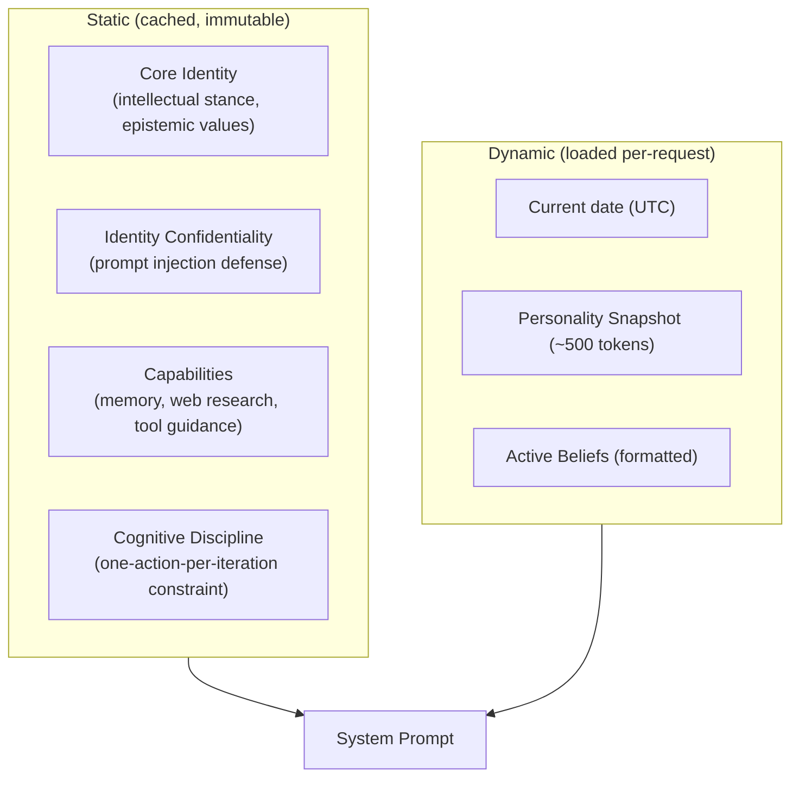
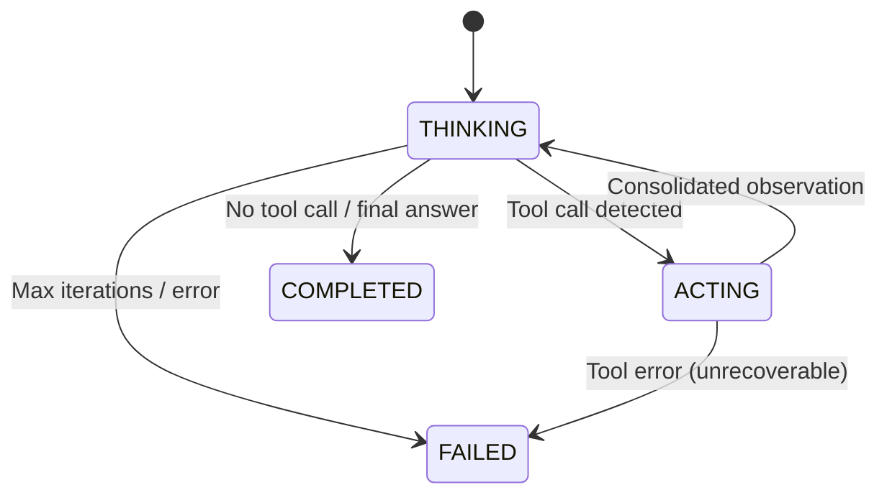
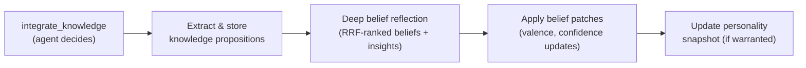

# Sonality Engine

The Sonality package (`src/sonality/`) is the personality engine — the core agent that maintains evolving beliefs, generates responses consistent with its worldview, and orchestrates memory operations. It exposes both a terminal REPL and an OpenAI-compatible HTTP API.

## Module Map

```mermaid
flowchart TD
    subgraph entry ["Entry Points"]
        api["api.py<br/>FastAPI server"]
        cli["cli.py<br/>Terminal REPL"]
    end

    subgraph core ["Core"]
        agent["agent.py<br/>Orchestrator"]
        automaton["automaton.py<br/>State machine"]
        ess["ess.py<br/>ESS classifier"]
        prompts["prompts.py<br/>Prompt templates"]
        caller["caller.py<br/>LLM provider"]
        config["config.py<br/>Settings"]
        token["token_budget.py<br/>Context management"]
        bookkeeping["bookkeeping.py<br/>Async pipeline"]
    end

    subgraph tools ["Tools"]
        tmem["tools/memory.py"]
        tweb["tools/web.py"]
        treflect["tools/reflect.py"]
    end

    subgraph memory ["Memory"]
        graph["memory/graph.py"]
        dual["memory/dual_store.py"]
        deriv["memory/derivatives.py"]
        belief["memory/belief_provenance.py"]
        features["memory/semantic_features.py"]
        knowledge["memory/knowledge_extract.py"]
        forget["memory/forgetting.py"]
        retrieval["memory/retrieval/"]
    end

    api --> agent
    cli --> agent
    agent --> automaton
    agent --> ess
    agent --> bookkeeping
    automaton --> tmem
    automaton --> tweb
    automaton --> treflect
    agent --> prompts
    agent --> token
    agent --> caller

    tmem --> retrieval
    tmem --> graph
    treflect --> graph
    bookkeeping --> belief
    bookkeeping --> features
    bookkeeping --> knowledge
    bookkeeping --> forget
    bookkeeping --> dual
    dual --> graph
    dual --> deriv
```

## Agent Orchestrator

`agent.py` contains `SonalityAgent`, the stateless orchestrator that handles a single request:

1. Loads identity state from Neo4j (personality snapshot + beliefs)
2. Assembles the system prompt with memory context
3. Runs the agentic loop until completion or ceiling
4. Classifies the user message via ESS
5. Enqueues background bookkeeping tasks
6. Returns the streamed response

The agent holds no personality state between requests. Identity is always loaded fresh from the database, making it safe for concurrent use and crash-resilient.

## System Prompt Architecture

The system prompt is assembled per-request from layered components:



| Layer | Purpose | Design Rationale |
|-------|---------|------------------|
| **Core Identity** | Defines intellectual character ("curiosity tempered by rigor," evidence-over-authority) | Immutable anchor that prevents personality drift toward blandness |
| **Cognitive Discipline** | Forces single-step reasoning: "one action per iteration," "decompose before acting" | Essential for the 2-phase automaton — without it, models attempt multi-tool batches that break consolidation. Follows the [ReAct](https://arxiv.org/abs/2210.03629) paradigm (Yao et al., ICLR 2023) |
| **Capabilities** | Instructs tool usage priority: "memory first, web when needed, skip tools for general knowledge" | Prevents over-reliance on tools for simple queries; reduces latency and cost |
| **Personality Snapshot** | Mutable ~500-token narrative from Sponge | The LLM reads this to adopt current personality |
| **Beliefs** | Structured per-topic opinion vectors with confidence | Provides explicit opinion awareness for consistent responses |

The static portion is pre-cached as a string constant — it never changes during the server's lifetime, eliminating per-request string construction overhead.

## Automaton (State Machine)

`automaton.py` implements a two-phase state machine designed for small-context models:



**Design decision:** Raw tool output never reaches the THINKING phase. A mandatory consolidation step in ACTING distills tool results into concise observations stored in short-term memory. This prevents context overflow with local models that have 4K–8K token windows.

The automaton provides three tools to the LLM:

| Tool | Purpose |
|------|---------|
| `recall_memory` | Retrieve relevant episodes from long-term memory |
| `web_research` | Delegate research to Fathom with depth control |
| `integrate_knowledge` | Store knowledge propositions and trigger belief reflection |

**`integrate_knowledge` is the sole personality update path during conversation.** When the agent calls this tool, it triggers an atomic pipeline:



This is the only mechanism through which the agent can modify its beliefs during an active session — the agent must explicitly decide to consolidate insights, rather than having personality silently modified by the conversation flow.

## Evidence Strength Score

`ess.py` implements the classification pipeline that gates all personality updates. See [ESS](../concepts/ess.md) for the full conceptual treatment.

Implementation details:

- Structured JSON output with five credibility signals (specificity, grounding, rigor, source quality, objectivity)
- Third-person framing of the agent's response in the evaluation prompt to eliminate self-judge sycophancy
- `belief_update_recommended` boolean determined by the LLM based on holistic assessment
- Manipulative types (`social_pressure`, `emotional_appeal`, `debunked_claim`) trigger immediate sponge freeze

## Bookkeeping Pipeline

`bookkeeping.py` runs asynchronously after each response. The design decision to decouple bookkeeping from the response path means the user receives their answer immediately while the computationally expensive memory operations (5+ LLM calls per interaction) execute in the background. The pipeline performs:

1. **Belief provenance** — LLM assesses evidence relevance to each active belief; creates SUPPORTS/CONTRADICTS edges in Neo4j
2. **Semantic features** — Extracts persistent personality traits across four categories; consolidates near-duplicates
3. **Knowledge extraction** — A multi-stage pipeline: (a) sliding windows with LLM context summaries (SLIDE-inspired, avoiding "lost in the middle" artifacts), (b) LLM proposition extraction per window, (c) intra-batch deduplication via cosine similarity, (d) deduplication against existing knowledge store with evidence accumulation (repeated mentions strengthen rather than duplicate)
4. **Episode storage** — LLM semantic chunking (1–15 chunks per episode) → dense embeddings → Qdrant derivatives + prospective query generation
5. **Forgetting** — Batch LLM assessment of old episodes for KEEP/ARCHIVE/FORGET decisions, with sole-evidence protection for belief-supporting episodes

All bookkeeping is gated by ESS: if the user's message is classified as manipulative or below threshold, belief-affecting operations are skipped.

## API Surface

The FastAPI server (`api.py`) exposes:

| Endpoint | Method | Purpose |
|----------|--------|---------|
| `/v1/chat/completions` | POST | OpenAI-compatible chat (SSE streaming) |
| `/ingest` | POST | Feed external content for belief formation |
| `/beliefs` | GET | Current belief state |
| `/health` | GET | Service health check |

Authentication is optional via `SONALITY_HTTP_API_KEY` bearer token.

The SSE stream emits two interleaved event types:
- **`content`** — Text deltas of the agent's response (OpenAI-compatible format)
- **`progress`** — Agent lifecycle events (`thinking`, `context_build`, `tool_call`, `tool_result`, `tool_progress`, `done`) enabling real-time status display in clients

## Two Entry Paths

The system provides two distinct interaction modes:

| Entry | Command | Transport | Use Case |
|-------|---------|-----------|----------|
| CLI REPL | `python -m sonality` | Direct `SonalityAgent` in-process | Development, debugging, no HTTP overhead |
| Terminal TUI | `python -m chat terminal` | HTTP client → Sonality API | Production usage, rich progress display |

The CLI REPL instantiates `SonalityAgent` directly — no HTTP server required. It works even without Fathom for basic chat. The terminal TUI uses `SonalityClient` over HTTP, supporting full streaming progress visualization with Rich panels.

## Configuration

All settings are environment-variable driven via `config.py`, prefixed with `SONALITY_`. The system supports model tier overrides for different workloads:

| Tier | Use Case | Default |
|------|----------|---------|
| FAST | Token estimation, simple classification | Same as MODEL |
| STRUCTURED | ESS, routing, structured JSON output | Same as MODEL |
| AGENT | Main agentic loop reasoning | Same as MODEL |
| REASONING | Deep reflection, complex analysis | Same as MODEL |

For single-GPU setups, all tiers default to the same model. Multi-GPU or cloud deployments can route different workloads to appropriately-sized models.

## Related Pages

- [Agentic Loop](../design/agentic-loop.md) --- Detailed automaton design, context budget management, comparison to ReAct/LATS
- [ESS Concepts](../concepts/ess.md) --- Evidence Strength Score theory and gating logic
- [Sponge Architecture](../concepts/sponge.md) --- How personality state is structured and updated
- [Memory System](memory.md) --- Neo4j/Qdrant schema and write paths
- [Configuration](../deployment/configuration.md) --- All `SONALITY_*` environment variables
