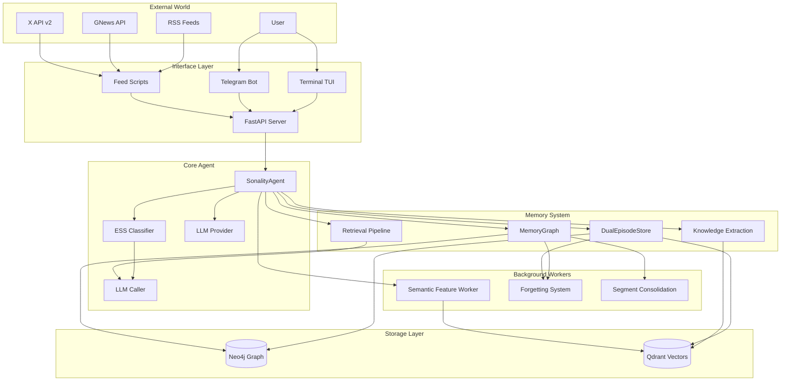
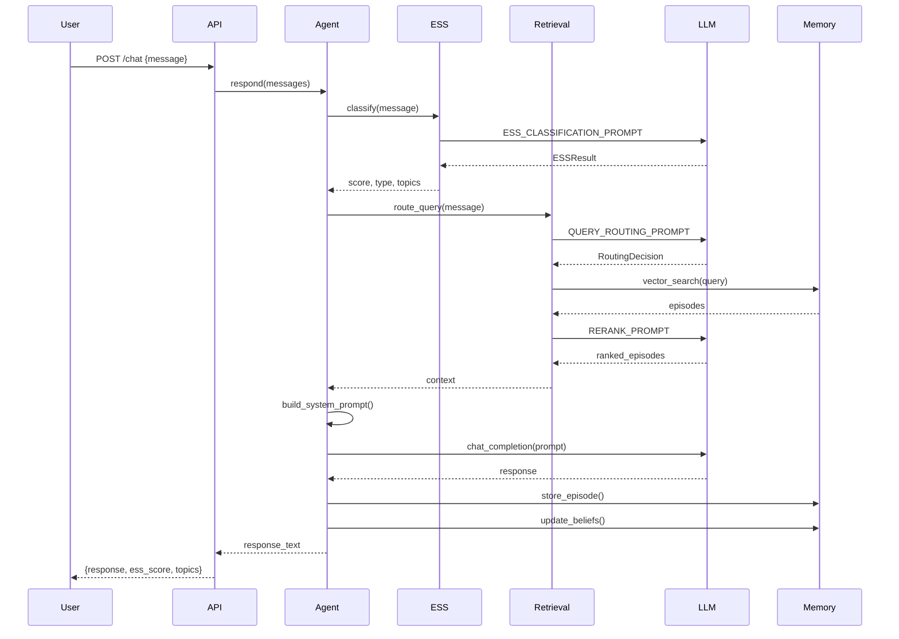
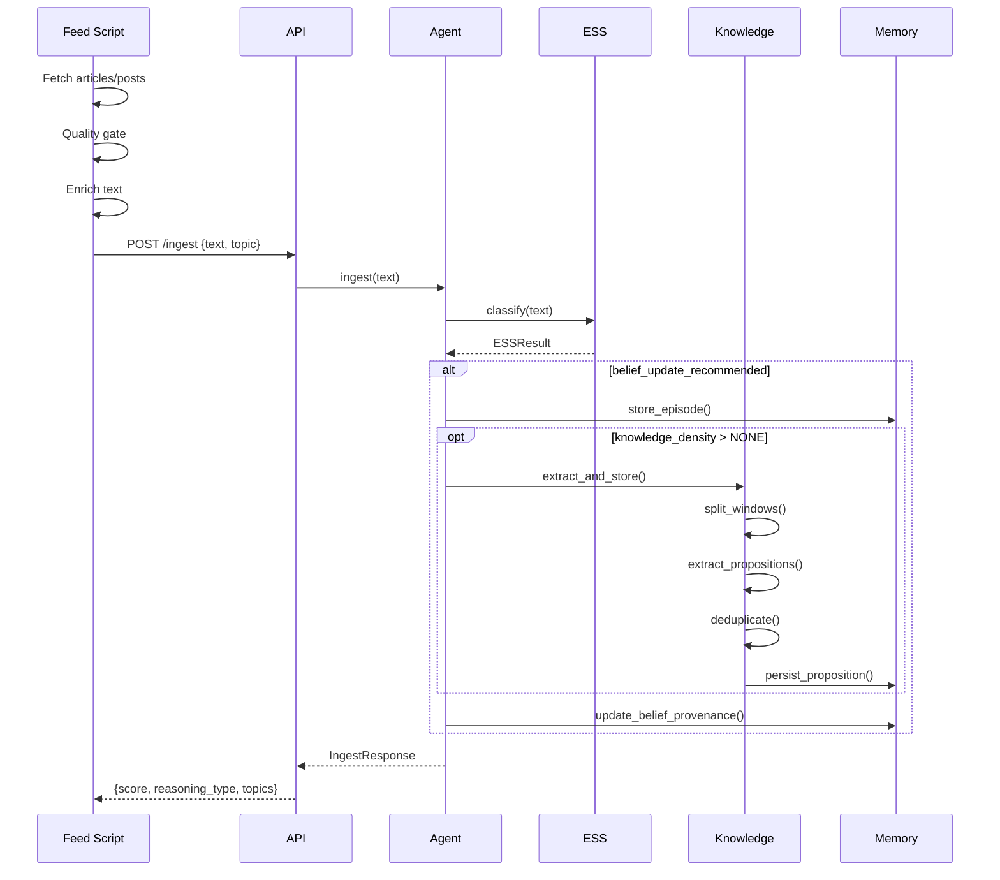
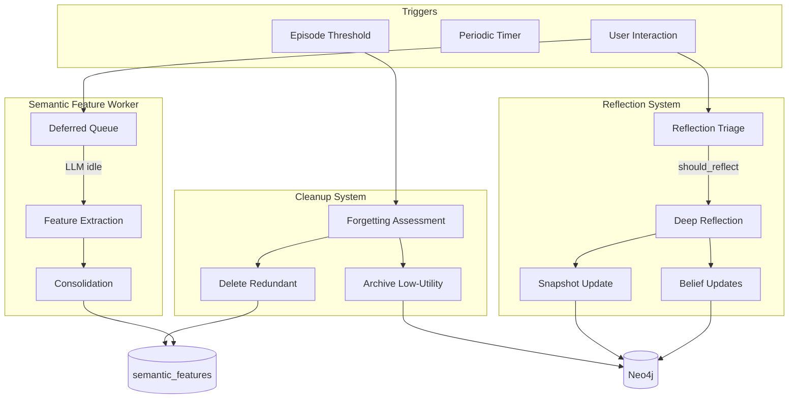
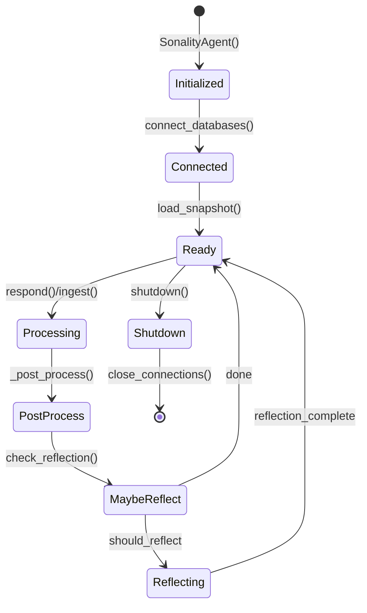
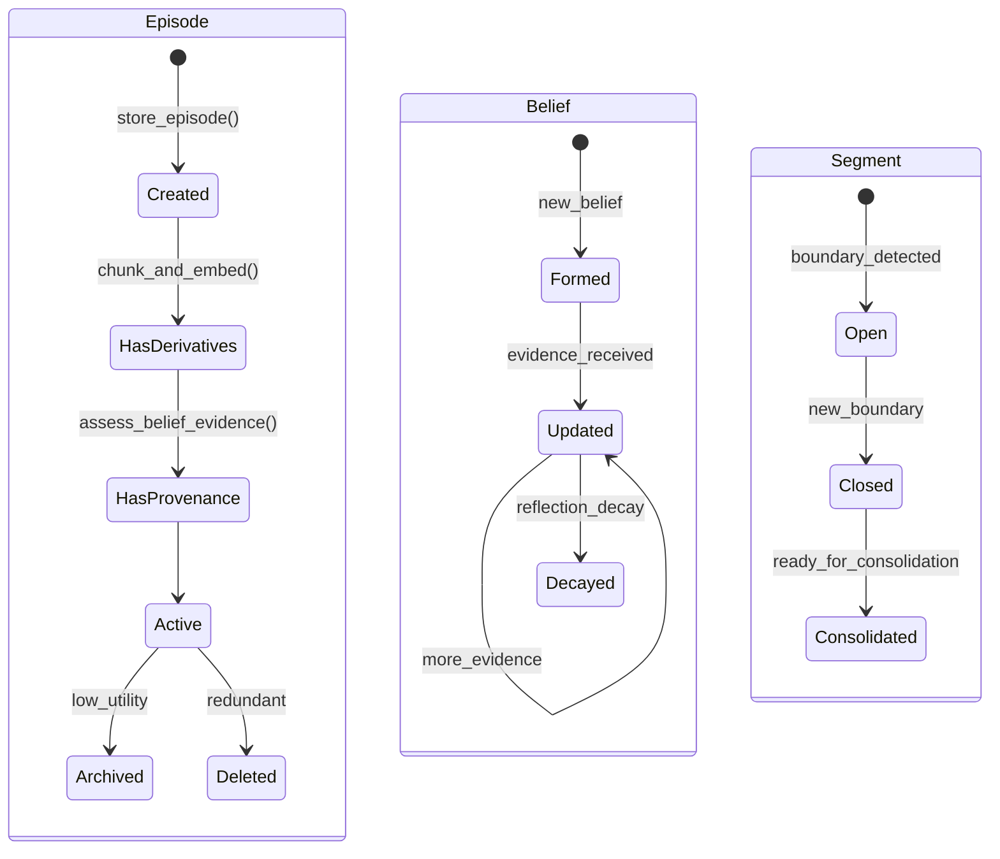
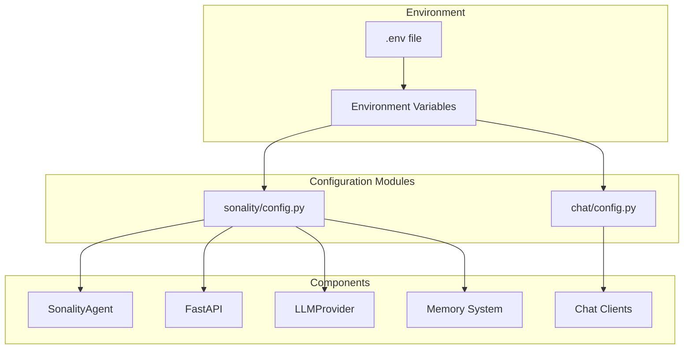
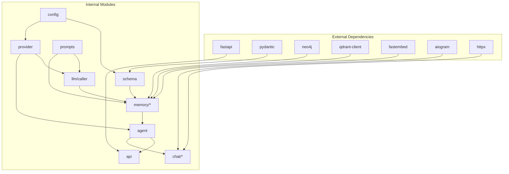
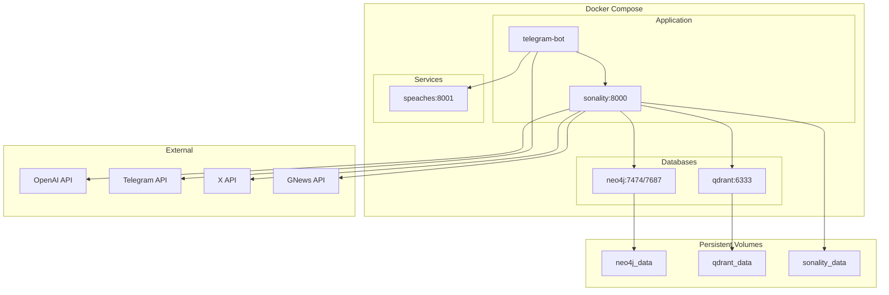
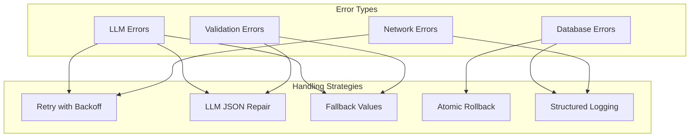

# System Architecture

This document provides a comprehensive top-down view of the entire Sonality system, tying together all components, data flows, and subsystems.

## High-Level Architecture

## Component Inventory

### Entry Points

| Component | Location | Purpose |
|-----------|----------|---------|
| `sonality-server` | `sonality/api.py:serve()` | FastAPI HTTP server |
| `sonality` | `sonality/cli.py:main()` | Interactive REPL |
| `chat/terminal.py` | `chat/terminal.py:main()` | Rich TUI client |
| `chat/telegram.py` | `chat/telegram.py:main()` | Telegram bot |
| `scripts/feed.py` | `scripts/feed.py:main()` | RSS/GNews ingestion |
| `scripts/x_feed.py` | `scripts/x_feed.py:main()` | X/Twitter ingestion |

### Core Modules

| Module | Location | Lines | Responsibility |
|--------|----------|-------|----------------|
| `agent.py` | `sonality/` | ~600 | Central orchestration |
| `ess.py` | `sonality/` | ~280 | Evidence classification |
| `provider.py` | `sonality/` | ~470 | LLM abstraction |
| `prompts.py` | `sonality/` | ~730 | All prompt templates |
| `schema.py` | `sonality/` | ~154 | Database schemas |
| `config.py` | `sonality/` | ~85 | Configuration |

### Memory Subsystem

| Module | Location | Lines | Responsibility |
|--------|----------|-------|----------------|
| `dual_store.py` | `memory/` | ~300 | Atomic Neo4j+Qdrant ops |
| `graph.py` | `memory/` | ~500 | Neo4j graph operations |
| `embedder.py` | `memory/` | ~67 | FastEmbed wrapper |
| `derivatives.py` | `memory/` | ~93 | Semantic chunking |
| `knowledge_extract.py` | `memory/` | ~500 | SLIDE extraction |
| `belief_provenance.py` | `memory/` | ~200 | Belief evidence linking |
| `semantic_features.py` | `memory/` | ~400 | Personality extraction |
| `segmentation.py` | `memory/` | ~119 | Boundary detection |
| `consolidation.py` | `memory/` | ~123 | Segment summarization |
| `forgetting.py` | `memory/` | ~117 | Archive/delete decisions |
| `db.py` | `memory/` | ~67 | Database connections |

### Retrieval Subsystem

| Module | Location | Lines | Responsibility |
|--------|----------|-------|----------------|
| `router.py` | `memory/retrieval/` | ~150 | Query classification |
| `chain.py` | `memory/retrieval/` | ~100 | Iterative retrieval |
| `split.py` | `memory/retrieval/` | ~109 | Parallel sub-queries |
| `reranker.py` | `memory/retrieval/` | ~102 | LLM listwise ranking |

### LLM Subsystem

| Module | Location | Lines | Responsibility |
|--------|----------|-------|----------------|
| `caller.py` | `llm/` | ~251 | Structured calls + repair |

## Data Flow Diagrams

### Conversation Flow

### Ingestion Flow

### Background Processing

## State Management

### Agent State

### Memory State

## Configuration Hierarchy

### Configuration Variables

| Category | Key Variables |
|----------|---------------|
| **LLM** | `SONALITY_BASE_URL`, `SONALITY_MODEL`, `SONALITY_API_KEY` |
| **Database** | `SONALITY_NEO4J_URL`, `SONALITY_QDRANT_URL` |
| **Retrieval** | `SONALITY_RETRIEVAL_MAX_ITERATIONS`, `MAX_RERANK_CANDIDATES` |
| **Timeouts** | `SONALITY_LLM_TIMEOUT`, `SONALITY_ASYNC_TIMEOUT` |
| **Chat** | `CHAT_TELEGRAM_TOKEN`, `CHAT_SPEACHES_URL` |
| **STT/TTS** | `CHAT_STT_MODEL`, `CHAT_TTS_MODEL`, `CHAT_TTS_VOICE` |

## Module Dependencies

## Deployment Architecture

## Error Handling Strategy

## Performance Considerations

| Component | Optimization | Impact |
|-----------|--------------|--------|
| **Embeddings** | FastEmbed ONNX, query caching | ~10x faster than API calls |
| **LLM Calls** | Semaphore serialization | Prevents GPU overload |
| **Retrieval** | Over-fetch + rerank | Better relevance at slight cost |
| **Storage** | Async operations | Non-blocking I/O |
| **Background** | Deferred processing | Responsive user interactions |
| **Qdrant** | INT8 quantization | 4x memory reduction |
| **Neo4j** | Composite indexes | Fast temporal queries |
