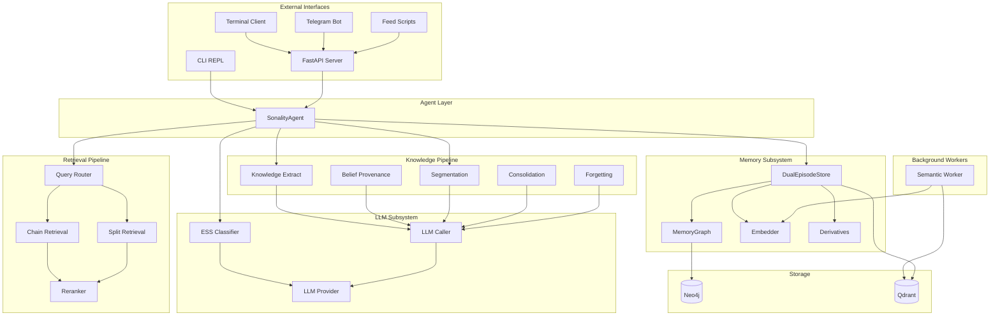
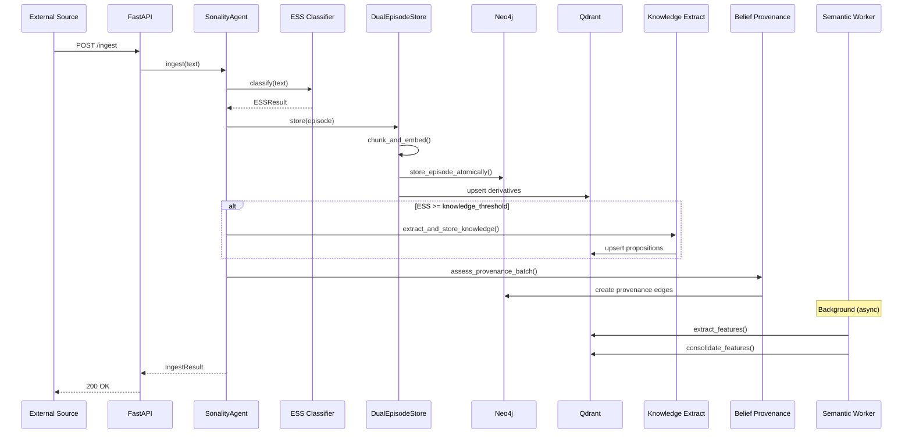
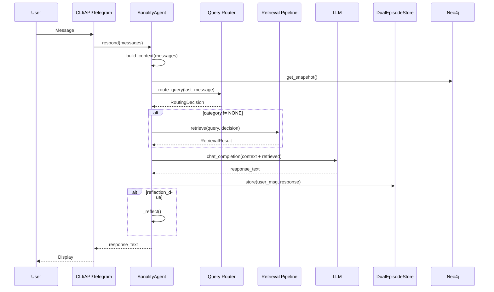
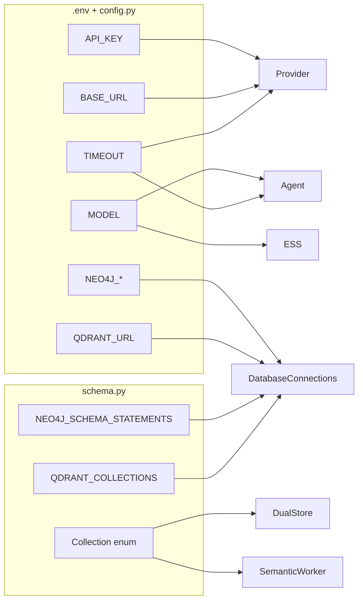

# System Integration Map

> **Purpose**: Complete visualization of how all Sonality components interconnect

This document provides a comprehensive map of component relationships, data flows, and integration points across the entire Sonality system.

## Master Architecture Diagram

```
┌─────────────────────────────────────────────────────────────────────────────────────┐
│                              SONALITY SYSTEM INTEGRATION MAP                         │
├─────────────────────────────────────────────────────────────────────────────────────┤
│                                                                                     │
│  ┌─────────────────────────────────────────────────────────────────────────────┐   │
│  │                           EXTERNAL INTERFACES                                │   │
│  │  ┌───────────┐  ┌───────────┐  ┌───────────┐  ┌───────────┐  ┌───────────┐ │   │
│  │  │  CLI      │  │ Terminal  │  │ Telegram  │  │ FastAPI   │  │  Feed     │ │   │
│  │  │  REPL     │  │ (Rich)    │  │ Bot       │  │ /chat     │  │  Scripts  │ │   │
│  │  │  cli.py   │  │terminal.py│  │telegram.py│  │  /ingest  │  │ feed.py   │ │   │
│  │  └─────┬─────┘  └─────┬─────┘  └─────┬─────┘  └─────┬─────┘  └─────┬─────┘ │   │
│  └────────┼──────────────┼──────────────┼──────────────┼──────────────┼───────┘   │
│           │              │              │              │              │           │
│           │              │       ┌──────┴──────┐       │              │           │
│           │              │       │AudioProcessor│       │              │           │
│           │              │       │  STT / TTS  │       │              │           │
│           │              │       └──────┬──────┘       │              │           │
│           │              │              │              │              │           │
│           └──────────────┴──────────────┼──────────────┴──────────────┘           │
│                                         │                                         │
│  ┌──────────────────────────────────────┼───────────────────────────────────────┐ │
│  │                                      ▼                                        │ │
│  │  ┌───────────────────────────────────────────────────────────────────────┐   │ │
│  │  │                         SONALITY AGENT                                 │   │ │
│  │  │                           agent.py                                     │   │ │
│  │  │  ┌─────────────┐ ┌─────────────┐ ┌─────────────┐ ┌─────────────┐      │   │ │
│  │  │  │   respond   │ │   ingest    │ │  _reflect   │ │ get_snapshot│      │   │ │
│  │  │  │   pipeline  │ │   pipeline  │ │  (periodic) │ │ get_beliefs │      │   │ │
│  │  │  └──────┬──────┘ └──────┬──────┘ └──────┬──────┘ └─────────────┘      │   │ │
│  │  └─────────┼───────────────┼───────────────┼─────────────────────────────┘   │ │
│  │            │               │               │                                  │ │
│  │  ┌─────────┼───────────────┼───────────────┼─────────────────────────────┐   │ │
│  │  │         ▼               ▼               ▼                              │   │ │
│  │  │  ┌─────────────────────────────────────────────────────────────────┐  │   │ │
│  │  │  │                    LLM SUBSYSTEM                                 │  │   │ │
│  │  │  │  ┌───────────┐  ┌───────────┐  ┌───────────┐  ┌───────────┐    │  │   │ │
│  │  │  │  │   ESS     │  │   LLM     │  │   LLM     │  │  default  │    │  │   │ │
│  │  │  │  │ Classifier│  │  Caller   │  │ Provider  │  │ _provider │    │  │   │ │
│  │  │  │  │  ess.py   │  │ caller.py │  │provider.py│  │           │    │  │   │ │
│  │  │  │  └───────────┘  └───────────┘  └─────┬─────┘  └───────────┘    │  │   │ │
│  │  │  │                                      │                          │  │   │ │
│  │  │  │                                      ▼                          │  │   │ │
│  │  │  │                         ┌───────────────────────┐               │  │   │ │
│  │  │  │                         │  OpenAI-Compatible   │               │  │   │ │
│  │  │  │                         │  HTTP API            │               │  │   │ │
│  │  │  │                         └───────────────────────┘               │  │   │ │
│  │  │  └─────────────────────────────────────────────────────────────────┘  │   │ │
│  │  │                                                                        │   │ │
│  │  │  ┌─────────────────────────────────────────────────────────────────┐  │   │ │
│  │  │  │                    MEMORY SUBSYSTEM                              │  │   │ │
│  │  │  │                                                                  │  │   │ │
│  │  │  │  ┌─────────────────────────────────────────────────────────┐   │  │   │ │
│  │  │  │  │                 DUAL EPISODE STORE                       │   │  │   │ │
│  │  │  │  │                  dual_store.py                           │   │  │   │ │
│  │  │  │  │  ┌─────────────┐  ┌─────────────┐  ┌─────────────┐      │   │  │   │ │
│  │  │  │  │  │   store     │  │vector_search│  │  archive    │      │   │  │   │ │
│  │  │  │  │  │ (transact.) │  │ (hybrid)    │  │  delete     │      │   │  │   │ │
│  │  │  │  │  └──────┬──────┘  └──────┬──────┘  └─────────────┘      │   │  │   │ │
│  │  │  │  └─────────┼───────────────┼────────────────────────────────┘   │  │   │ │
│  │  │  │            │               │                                     │  │   │ │
│  │  │  │  ┌─────────┼───────────────┼────────────────────────────────┐   │  │   │ │
│  │  │  │  │         ▼               ▼                                 │   │  │   │ │
│  │  │  │  │  ┌─────────────┐  ┌─────────────┐  ┌─────────────┐       │   │  │   │ │
│  │  │  │  │  │ MemoryGraph │  │   Embedder  │  │ Derivatives │       │   │  │   │ │
│  │  │  │  │  │  graph.py   │  │ embedder.py │  │derivatives.py│       │   │  │   │ │
│  │  │  │  │  └──────┬──────┘  └──────┬──────┘  └─────────────┘       │   │  │   │ │
│  │  │  │  └─────────┼───────────────┼─────────────────────────────────┘   │  │   │ │
│  │  │  │            │               │                                     │  │   │ │
│  │  │  │  ┌─────────┼───────────────┼────────────────────────────────┐   │  │   │ │
│  │  │  │  │         ▼               ▼                                 │   │  │   │ │
│  │  │  │  │  ┌─────────────────────────────────────────────────┐     │   │  │   │ │
│  │  │  │  │  │           DATABASE CONNECTIONS                   │     │   │  │   │ │
│  │  │  │  │  │                  db.py                           │     │   │  │   │ │
│  │  │  │  │  │  ┌─────────────────┐  ┌─────────────────┐       │     │   │  │   │ │
│  │  │  │  │  │  │  AsyncDriver   │  │AsyncQdrantClient│       │     │   │  │   │ │
│  │  │  │  │  │  │   (Neo4j)      │  │   (Qdrant)      │       │     │   │  │   │ │
│  │  │  │  │  │  └───────┬────────┘  └───────┬─────────┘       │     │   │  │   │ │
│  │  │  │  │  └──────────┼───────────────────┼──────────────────┘     │   │  │   │ │
│  │  │  │  └─────────────┼───────────────────┼─────────────────────────┘   │  │   │ │
│  │  │  │                │                   │                             │  │   │ │
│  │  │  │  ┌─────────────┼───────────────────┼────────────────────────┐   │  │   │ │
│  │  │  │  │             ▼                   ▼                         │   │  │   │ │
│  │  │  │  │   RETRIEVAL PIPELINE                KNOWLEDGE PIPELINE    │   │  │   │ │
│  │  │  │  │  ┌───────────────────┐         ┌───────────────────┐     │   │  │   │ │
│  │  │  │  │  │ Query Router     │         │Knowledge Extract  │     │   │  │   │ │
│  │  │  │  │  │ Chain Retrieval  │         │Belief Provenance  │     │   │  │   │ │
│  │  │  │  │  │ Split Retrieval  │         │Segmentation       │     │   │  │   │ │
│  │  │  │  │  │ Reranker         │         │Consolidation      │     │   │  │   │ │
│  │  │  │  │  └───────────────────┘         │Forgetting         │     │   │  │   │ │
│  │  │  │  │                                └───────────────────┘     │   │  │   │ │
│  │  │  │  └──────────────────────────────────────────────────────────┘   │  │   │ │
│  │  │  │                                                                  │  │   │ │
│  │  │  │  ┌───────────────────────────────────────────────────────────┐  │  │   │ │
│  │  │  │  │              BACKGROUND WORKERS                            │  │  │   │ │
│  │  │  │  │  ┌───────────────────────────────────────────────────┐    │  │  │   │ │
│  │  │  │  │  │         Semantic Ingestion Worker                  │    │  │  │   │ │
│  │  │  │  │  │              semantic_features.py                  │    │  │  │   │ │
│  │  │  │  │  │  Feature Extraction → Embedding → Consolidation    │    │  │  │   │ │
│  │  │  │  │  └───────────────────────────────────────────────────┘    │  │  │   │ │
│  │  │  │  └───────────────────────────────────────────────────────────┘  │  │   │ │
│  │  │  └─────────────────────────────────────────────────────────────────┘  │   │ │
│  │  └───────────────────────────────────────────────────────────────────────┘   │ │
│  │                                                                               │ │
│  │                              CONFIGURATION LAYER                              │ │
│  │  ┌─────────────┐  ┌─────────────┐  ┌─────────────┐  ┌─────────────┐          │ │
│  │  │  config.py  │  │  schema.py  │  │ prompts.py  │  │   .env      │          │ │
│  │  └─────────────┘  └─────────────┘  └─────────────┘  └─────────────┘          │ │
│  └───────────────────────────────────────────────────────────────────────────────┘ │
│                                                                                     │
│  ┌─────────────────────────────────────────────────────────────────────────────┐   │
│  │                           PERSISTENT STORAGE                                 │   │
│  │                                                                              │   │
│  │  ┌─────────────────────────────┐  ┌─────────────────────────────┐           │   │
│  │  │         NEO4J 5             │  │          QDRANT              │           │   │
│  │  │                             │  │                              │           │   │
│  │  │  Nodes:                     │  │  Collections:                │           │   │
│  │  │  • Episode                  │  │  • derivatives               │           │   │
│  │  │  • Derivative               │  │    - dense vectors (1024d)   │           │   │
│  │  │  • Topic                    │  │    - BM25 text index         │           │   │
│  │  │  • Segment                  │  │                              │           │   │
│  │  │  • Summary                  │  │  • semantic_features         │           │   │
│  │  │  • Belief                   │  │    - personality/preferences │           │   │
│  │  │  • PersonalitySnapshot      │  │    - knowledge/relationships │           │   │
│  │  │                             │  │                              │           │   │
│  │  │  Edges:                     │  │  Indexing:                   │           │   │
│  │  │  • TEMPORAL_NEXT            │  │  • HNSW (m=16, ef=100)       │           │   │
│  │  │  • DISCUSSES                │  │  • INT8 Scalar Quantization  │           │   │
│  │  │  • DERIVED_FROM             │  │                              │           │   │
│  │  │  • BELONGS_TO_SEGMENT       │  │                              │           │   │
│  │  │  • CONSOLIDATES             │  │                              │           │   │
│  │  │  • SUPPORTS_BELIEF          │  │                              │           │   │
│  │  │  • CONTRADICTS_BELIEF       │  │                              │           │   │
│  │  └─────────────────────────────┘  └─────────────────────────────┘           │   │
│  └─────────────────────────────────────────────────────────────────────────────┘   │
│                                                                                     │
└─────────────────────────────────────────────────────────────────────────────────────┘
```

## Component Dependency Graph



## Data Flow Integration

### Ingest Flow



### Respond Flow



## Module Inventory

### Core Modules

| Module | Lines | Purpose | Key Exports |
|--------|-------|---------|-------------|
| `agent.py` | ~400 | Central orchestrator | `SonalityAgent` |
| `api.py` | ~330 | FastAPI server | `app`, endpoints |
| `cli.py` | ~130 | Interactive REPL | `main()` |
| `config.py` | ~85 | Configuration | Constants |
| `schema.py` | ~155 | Schema definitions | `Collection`, `init_qdrant_collections` |
| `prompts.py` | ~500 | Prompt templates | 18+ prompts |
| `ess.py` | ~250 | ESS classifier | `classify()`, `ESSResult` |
| `provider.py` | ~300 | LLM provider | `LLMProvider`, `default_provider` |

### Memory Modules

| Module | Lines | Purpose | Key Exports |
|--------|-------|---------|-------------|
| `dual_store.py` | ~300 | Transactional storage | `DualEpisodeStore` |
| `graph.py` | ~600 | Neo4j operations | `MemoryGraph` |
| `db.py` | ~150 | Connection management | `DatabaseConnections` |
| `embedder.py` | ~70 | Embedding service | `Embedder` |
| `derivatives.py` | ~150 | Semantic chunking | `chunk_and_embed()` |
| `forgetting.py` | ~200 | Memory pruning | `assess_and_forget()` |
| `consolidation.py` | ~125 | Segment summaries | `maybe_consolidate_segment()` |
| `segmentation.py` | ~250 | Boundary detection | `detect_boundary()` |
| `semantic_features.py` | ~350 | Feature extraction | `SemanticIngestionWorker` |
| `knowledge_extract.py` | ~300 | SLIDE pipeline | `extract_and_store_knowledge()` |
| `belief_provenance.py` | ~200 | Evidence tracking | `assess_provenance_batch()` |

### Retrieval Modules

| Module | Lines | Purpose | Key Exports |
|--------|-------|---------|-------------|
| `router.py` | ~150 | Query routing | `route_query()` |
| `chain.py` | ~200 | Iterative retrieval | `chain_retrieve()` |
| `split.py` | ~150 | Query decomposition | `split_retrieve()` |
| `reranker.py` | ~100 | LLM reranking | `rerank()` |

### LLM Modules

| Module | Lines | Purpose | Key Exports |
|--------|-------|---------|-------------|
| `caller.py` | ~200 | Structured calls | `llm_call()` |

### Chat Modules

| Module | Lines | Purpose | Key Exports |
|--------|-------|---------|-------------|
| `client.py` | ~140 | HTTP client | `SonalityClient` |
| `terminal.py` | ~140 | Rich TUI | `main()` |
| `telegram.py` | ~240 | Telegram bot | Router handlers |
| `audio.py` | ~175 | STT/TTS | `AudioProcessor` |
| `config.py` | ~50 | Chat config | Constants |

### Scripts

| Module | Lines | Purpose | Key Function |
|--------|-------|---------|--------------|
| `feed.py` | ~310 | RSS/GNews ingestion | `main()` |
| `x_feed.py` | ~425 | X API ingestion | `main()` |
| `_helpers.py` | ~62 | Display utilities | `print_result()`, `show_beliefs()` |

## Configuration Integration



## Infrastructure Integration

```yaml
# docker-compose.yml integration

services:
  sonality:
    depends_on: [neo4j, qdrant]
    environment:
      - SONALITY_NEO4J_URL=bolt://neo4j:7687
      - SONALITY_QDRANT_URL=http://qdrant:6333
    
  neo4j:
    image: neo4j:5
    ports: ["7474:7474", "7687:7687"]
    
  qdrant:
    image: qdrant/qdrant
    ports: ["6333:6333"]
    
  speaches:  # For Telegram voice
    image: speaches
    ports: ["8001:8000"]
```

## Related Documentation

### Architecture Deep-Dives
- [Agent Core](agent-core.md) - SonalityAgent implementation
- [Dual Store Operations](dual-store-operations.md) - Transaction semantics
- [Graph Operations](graph-operations.md) - Neo4j operations
- [Retrieval Pipeline](retrieval-pipeline.md) - Query processing

### Subsystem Documentation
- [ESS Classifier](ess-classifier.md) - Evidence scoring
- [Semantic Features Worker](semantic-features-worker.md) - Background extraction
- [Knowledge Extraction](knowledge-extraction.md) - SLIDE pipeline
- [Belief Provenance](belief-provenance.md) - Evidence tracking

### Interface Documentation
- [API Layer](api-layer.md) - FastAPI endpoints
- [CLI Interface](cli-interface.md) - REPL
- [Chat System](chat-system.md) - Terminal/Telegram
- [Feed Scripts](feed-scripts.md) - Data ingestion

### Configuration
- [Configuration & Schema](configuration-schema.md) - Settings
- [Database Schema](database-schema.md) - Complete schema
- [Infrastructure](infrastructure.md) - Docker deployment
