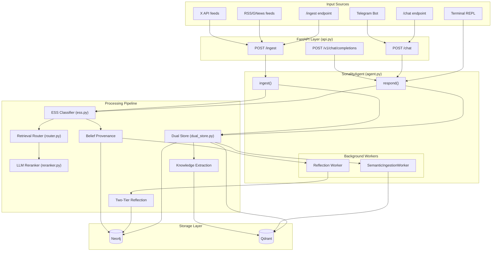
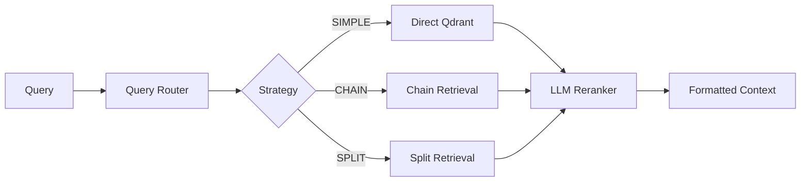
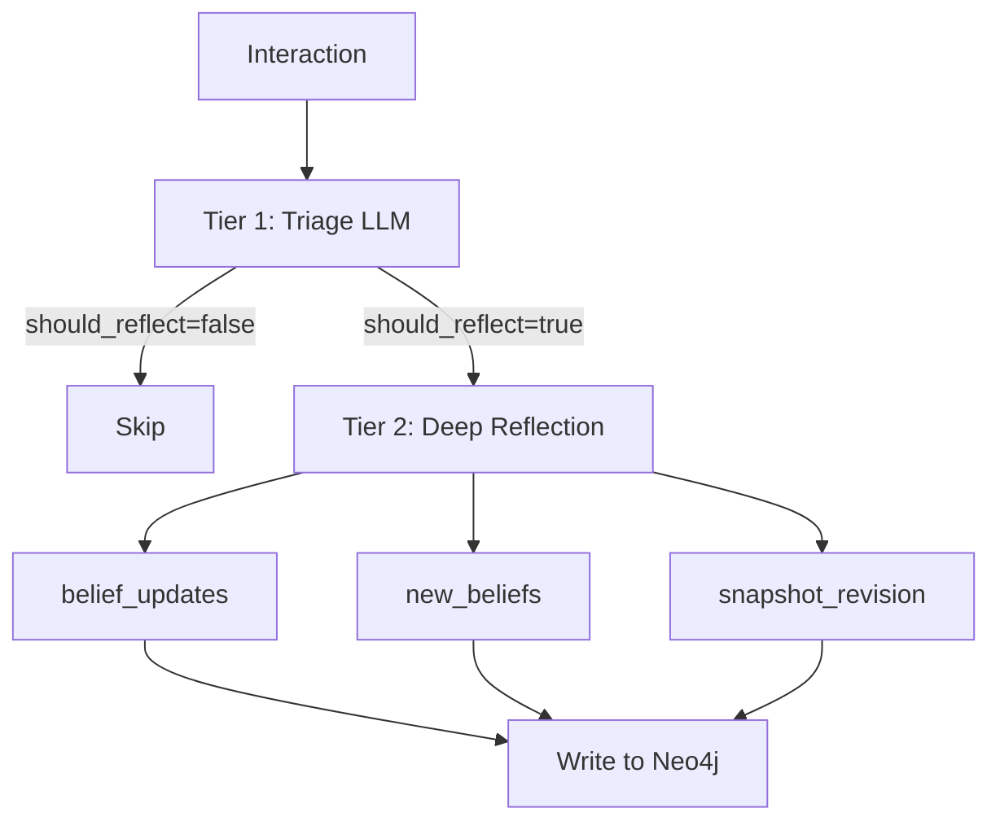
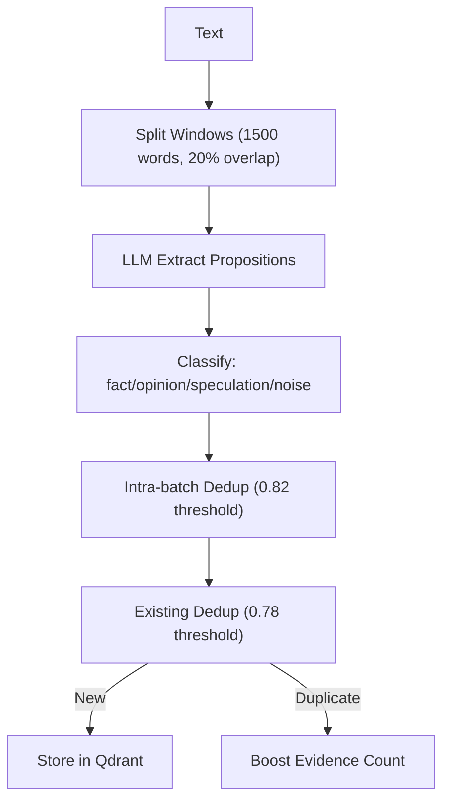

# Verified Data Flow Architecture

> **Last verified:** April 2026  
> **Source files checked:** All Python modules in `sonality/`, `chat/`, `scripts/`

This document provides a verified, accurate representation of the complete Sonality data pipeline.

## Complete System Flow



## Storage Architecture

### Neo4j (Graph Database)

| Node Type | Key Properties | Purpose |
|-----------|----------------|---------|
| `Episode` | uid, content, summary, ess_score, segment_id | Conversation turns |
| `Derivative` | uid, source_episode_uid, text | Episode chunks |
| `Belief` | topic, valence, confidence, uncertainty, evidence_count | Agent beliefs |
| `Topic` | name | Topic categorization |
| `Segment` | segment_id, consolidated | Conversation segments |
| `Summary` | uid, level, content | Consolidated summaries |
| `PersonalitySnapshot` | session_id, text, version | Current identity |

| Edge Type | From → To | Purpose |
|-----------|-----------|---------|
| `BELONGS_TO` | Episode → Segment | Segment membership |
| `HAS_TOPIC` | Episode → Topic | Topic tagging |
| `HAS_DERIVATIVE` | Episode → Derivative | Chunk linkage |
| `SUPPORTS_BELIEF` | Episode → Belief | Positive evidence |
| `CONTRADICTS_BELIEF` | Episode → Belief | Negative evidence |
| `SUMMARIZES` | Summary → Episode | Summary sources |
| `PRECEDES` | Episode → Episode | Temporal chain |

### Qdrant (Vector Database)

| Collection | Purpose | Key Fields |
|------------|---------|------------|
| `derivatives` | Episode chunks for retrieval | uid, episode_uid, text, key_concept, archived |
| `semantic_features` | Personality/knowledge features | category, tag, feature_name, value, confidence |

## Processing Modules

### ESS Classification (`ess.py`)

```
Input: User message
Output: ESSResult {
    score: 0.0-1.0,
    reasoning_type: ReasoningType,
    source_reliability: SourceReliability,
    topics: list[str],
    opinion_direction: supports|opposes|neutral,
    knowledge_density: high|moderate|low|none,
    belief_update_recommended: bool
}
```

**ReasoningType Values:**
- `logical_argument`, `empirical_data`, `expert_opinion`
- `anecdotal`, `news_report`, `aggregated_sentiment`
- `social_pressure`, `emotional_appeal`, `debunked_claim`, `no_argument`

### Dual Store Operations (`dual_store.py`)

**Atomic Episode Storage:**
1. Generate episode UID
2. Chunk content via LLM (`CHUNKING_PROMPT`)
3. Embed chunks with FastEmbed
4. Write to Neo4j (graph structure)
5. Write to Qdrant (vectors)
6. Rollback on failure

### Retrieval Pipeline (`retrieval/`)



**Router Decisions:**
- `QueryCategory`: SIMPLE, ANALYTICAL, TEMPORAL, COMPARATIVE, BELIEF_QUERY, KNOWLEDGE_QUERY
- `RetrievalDepth`: MINIMAL (2), MODERATE (5), DEEP (10)
- `TemporalExpansion`: EXPAND_BACKWARD, EXPAND_FORWARD, EXPAND_BOTH, NO_EXPANSION
- `SemanticMemoryDecision`: SKIP, SEARCH

### Two-Tier Reflection (`agent.py`)



### Knowledge Extraction (`knowledge_extract.py`)



### Semantic Features (`semantic_features.py`)

**Categories:**
- `Personality`: traits, values, communication_style, emotional_patterns
- `Preferences`: likes, dislikes, opinions, aesthetics
- `Knowledge`: facts, expertise, interests, concepts
- `Relationships`: people, organizations, connections

**Commands:** ADD, UPDATE, DELETE

## Configuration Variables

### Core (verified against `config.py`)

| Variable | Default | Purpose |
|----------|---------|---------|
| `SONALITY_BASE_URL` | `https://api.openai.com/v1` | LLM endpoint |
| `SONALITY_MODEL` | `gpt-4.1-mini` | Main model |
| `SONALITY_ESS_MODEL` | Same as MODEL | ESS classifier model |
| `SONALITY_FAST_LLM_MODEL` | Same as ESS_MODEL | Fast tasks model |
| `SONALITY_LLM_MAX_TOKENS` | `8192` | Max output tokens |
| `SONALITY_AGENT_TEMPERATURE` | `0.6` | Response temperature |

### Retrieval

| Variable | Default | Purpose |
|----------|---------|---------|
| `SONALITY_RETRIEVAL_MAX_ITERATIONS` | `3` | Chain retrieval limit |
| `SONALITY_RETRIEVAL_CONFIDENCE_THRESHOLD` | `0.8` | Sufficiency threshold |
| `SONALITY_MAX_RERANK_CANDIDATES` | `50` | Reranker input limit |

### Database

| Variable | Default | Purpose |
|----------|---------|---------|
| `SONALITY_NEO4J_URL` | `bolt://localhost:7687` | Neo4j connection |
| `SONALITY_QDRANT_URL` | `http://localhost:6333` | Qdrant connection |

## Prompt Templates (verified against `prompts.py`)

| Prompt | Purpose | Used By |
|--------|---------|---------|
| `CORE_IDENTITY` | Agent character definition | Response generation |
| `ESS_CLASSIFICATION_PROMPT` | Argument quality assessment | ESS classifier |
| `REFLECTION_TRIAGE_PROMPT` | Should reflect decision | Reflection tier 1 |
| `REFLECTION_DEEP_PROMPT` | Belief updates | Reflection tier 2 |
| `QUERY_ROUTING_PROMPT` | Retrieval strategy | Router |
| `SUFFICIENCY_PROMPT` | Chain retrieval check | Chain retriever |
| `RERANK_PROMPT` | Listwise reranking | Reranker |
| `KNOWLEDGE_EXTRACTION_PROMPT` | Proposition extraction | Knowledge extractor |
| `FEATURE_EXTRACTION_PROMPT` | Personality features | Semantic worker |
| `BATCH_FORGETTING_PROMPT` | Memory lifecycle | Forgetting system |
| `BELIEF_UPDATE_PROMPT` | Evidence assessment | Provenance tracker |

## Anti-Sycophancy Defenses (Implemented)

| Layer | Implementation | Location |
|-------|----------------|----------|
| Core Identity | Immutable `CORE_IDENTITY` prompt | `prompts.py` |
| ESS Decoupling | Evaluate user message only | `ess.py` |
| Third-Person Framing | ESS prompt design | `prompts.py` |
| Memory Framing | "Evaluate on merit" wrapper | `prompts.py` |
| Explicit Disagreement | Response instructions | `prompts.py` |

## Module Line Counts

| Module | Lines | Purpose |
|--------|-------|---------|
| `agent.py` | ~590 | Core orchestration |
| `memory/graph.py` | ~730 | Neo4j operations |
| `memory/semantic_features.py` | ~550 | Feature extraction |
| `memory/knowledge_extract.py` | ~500 | Proposition extraction |
| `prompts.py` | ~730 | All prompt templates |
| `ess.py` | ~520 | ESS classification |
| `api.py` | ~330 | FastAPI endpoints |
| `provider.py` | ~470 | LLM abstraction |

---

**This document verified against actual source code. See `docs/architecture/module-inventory.md` for complete module reference.**
