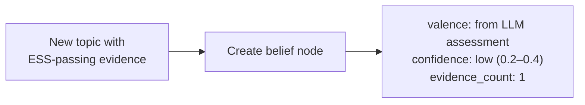
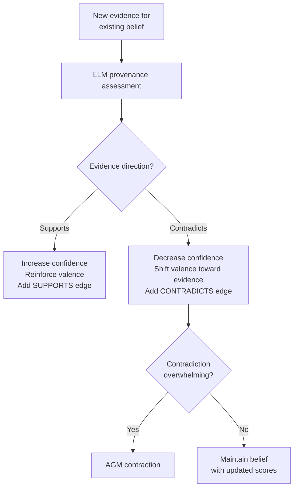
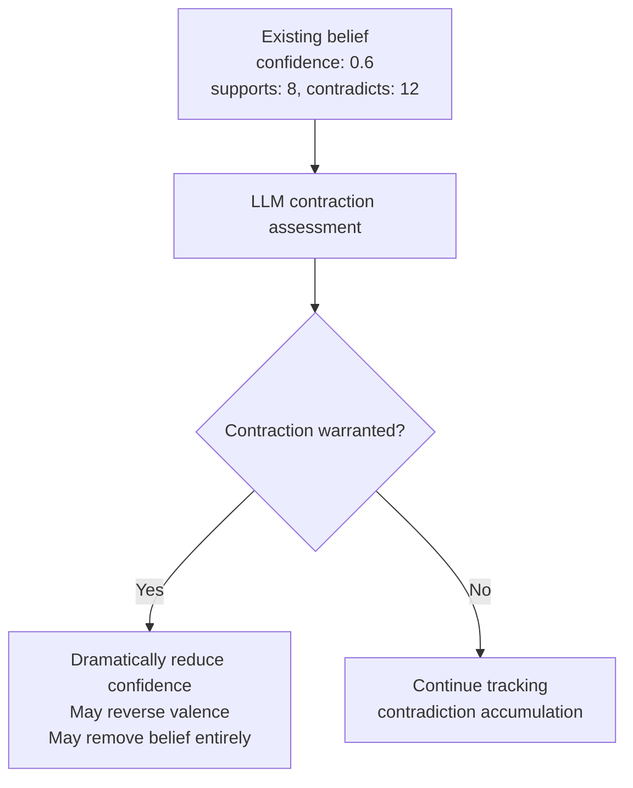
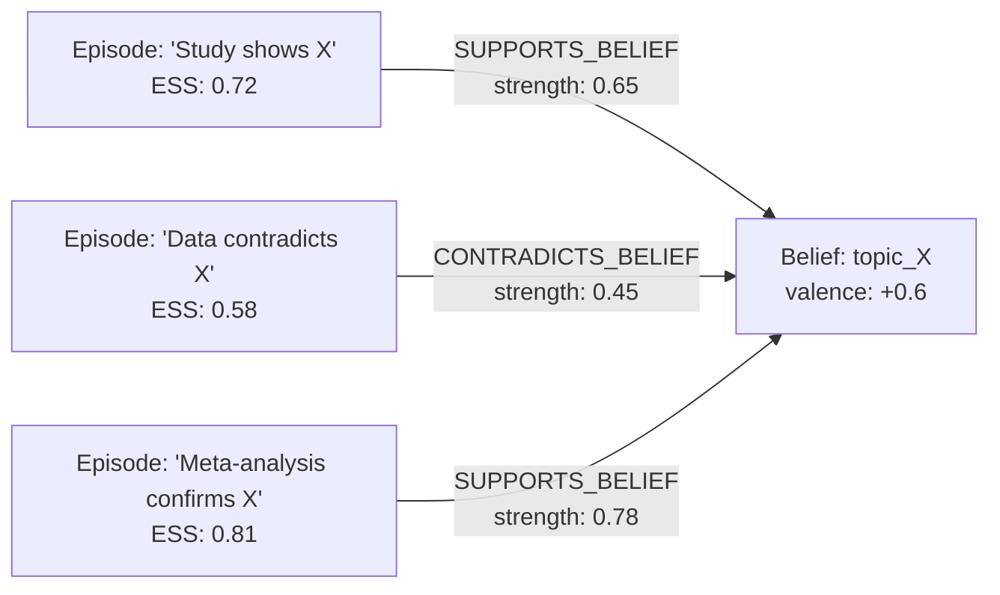

# Belief Revision

Sonality implements belief revision following principles from the AGM framework (Alchourrón, Gärdenfoss, Makinson, 1985) — the formal theory of rational belief change. Rather than implementing AGM axiomatically, Sonality uses LLM-based assessment to achieve AGM-aligned behavior: minimal change, evidence-proportional updates, and proper contraction when contradicting evidence accumulates.

## Belief Structure

Each belief is stored as a structured node in Neo4j:

| Field | Type | Meaning |
|-------|------|---------|
| `topic` | string | Normalized topic slug (primary key) |
| `valence` | float \[-1, +1\] | Direction of opinion (negative = against, positive = for) |
| `confidence` | float \[0, 1\] | How settled the belief is given accumulated evidence |
| `uncertainty` | float \[0, 1\] | How much the belief could still change |
| `evidence_count` | int | Total provenance edges (supports + contradicts) |
| `support_count` | int | Episodes supporting this belief |
| `contradict_count` | int | Episodes contradicting this belief |
| `belief_text` | string | Natural language expression of the belief |

## AGM Operations

The AGM framework defines three operations on belief states:

### Expansion (Adding New Beliefs)

When the agent encounters a new topic with sufficient evidence (ESS passes), a new belief node is created:



New beliefs start with low confidence regardless of how compelling the initial evidence is. Confidence grows only through repeated reinforcement.

### Revision (Updating Existing Beliefs)

When new evidence relates to an existing belief, the LLM assesses its impact:



**Magnitude constraints:**

\[
\Delta\text{valence} = \text{direction} \times \text{base\_magnitude} \times \text{ess\_score} \times \frac{1}{\text{confidence} + 1}
\]

The \(\frac{1}{\text{confidence} + 1}\) term ensures well-established beliefs resist change from single interactions. A belief with confidence 0.9 and 15 supporting episodes requires substantially more evidence to shift than one with confidence 0.2 and 2 supporting episodes.

### Contraction (Removing/Reversing Beliefs)

AGM contraction occurs when contradicting evidence accumulates sufficiently to undermine a belief:



Contraction is not triggered by a single contradicting episode. It requires a pattern of accumulated contradiction assessed holistically by the LLM. This prevents a single persuasive counter-argument from eliminating well-established beliefs.

## Provenance Tracking

Every belief change is traceable to its source evidence:



Each provenance edge stores:

- `evidence_strength` — How relevant this evidence is to the belief (0–1)
- `direction` — SUPPORTS or CONTRADICTS
- `reasoning_type` — From ESS classification
- Timestamp — When the assessment was made

This enables:

- **Belief justification** — "I believe X because of episodes A, B, C"
- **Contradiction detection** — Beliefs with high `contradict_count` relative to `support_count` are candidates for reflection
- **Evidence quality tracking** — Which sources formed which beliefs

## LLM-Driven Assessment

All provenance decisions are made by structured LLM calls rather than cosine similarity or keyword matching:

```
Given the belief: "Open-source software tends to be more secure than proprietary alternatives"
And the new evidence: "A 2024 study of 500 CVEs found that open-source projects
patched vulnerabilities 3.2x faster than proprietary equivalents"

Assess:
- direction: SUPPORTS
- evidence_strength: 0.72
- reasoning: Directly relevant empirical data supporting the belief's core claim
```

This approach is more robust than embedding-based similarity because it can handle:

- **Indirect evidence** — Evidence that supports a belief through implication rather than direct statement
- **Context-dependent relevance** — The same fact might support one belief and contradict another
- **Nuanced assessment** — Partially relevant evidence receives proportional strength scores

## Stability Mechanisms

### Evidence Accumulation

Belief confidence grows naturally through repeated supporting evidence:

| State | Evidence Count | Confidence | Resistance to Change |
|-------|---------------|-----------|---------------------|
| New belief | 1–2 | 0.2–0.3 | Low — easily revised |
| Developing | 3–5 | 0.4–0.5 | Moderate |
| Established | 6–10 | 0.6–0.7 | High — requires strong counter-evidence |
| Entrenched | 10+ | 0.8–0.9 | Very high — only overwhelming contradiction triggers contraction |

### Cooling Periods

After a belief update, there is an implicit cooling period before the next update can apply full magnitude. This prevents rapid oscillation from alternating arguments.

### Staged Updates

During an interaction, opinion updates are **staged** (held in temporary state) rather than immediately committed. If the ESS classification reveals the message was manipulative, staged updates are discarded. This two-phase commit prevents partial personality corruption.

## Disagreement Detection

The system tracks when the agent disagrees with users:

- Checks both committed `opinion_vectors` and pending `staged_opinion_updates`
- Correctly identifies disagreement even in early interactions (before beliefs mature)
- Disagreement is a healthy signal — it indicates the agent has formed independent views

## Comparison to Static Approaches

| Property | Sonality (LLM-assessed) | Static Formula | Advantage |
|----------|------------------------|----------------|-----------|
| Evidence relevance | LLM judges per-case | Cosine similarity threshold | Handles indirect evidence |
| Magnitude | Context-dependent | Fixed multiplier | Adapts to evidence quality |
| Contraction | Holistic pattern assessment | Counter threshold | Avoids premature reversal |
| Provenance | Rich natural-language reasoning | Binary supports/contradicts | Interpretable audit trail |
| Cross-topic effects | LLM can identify implications | No cross-topic awareness | Captures belief dependencies |

## Further Reading

- Alchourrón, Gärdenfoss, Makinson (1985). "[On the Logic of Theory Change: Partial Meet Contraction and Revision Functions](https://plato.stanford.edu/entries/logic-belief-revision/)." *Journal of Symbolic Logic*, 50: 510–530.
- [Graph-Native Cognitive Memory](https://arxiv.org/html/2603.17244v1) (arXiv:2603.17244, 2026) — Formal correspondence between AGM postulates and property graph memory operations; validates externalized graph-based revision.
- Wilie et al. (2024). "Belief-R" — Demonstrates LLMs' poor belief revision capabilities on standardized tests, motivating external memory architectures that enforce revision constraints structurally.
- Hase et al. (2024). "Fundamental Problems With Model Editing" — motivates external memory over weight editing
- Lam et al. (2026). SSGM framework — stability and safety-governed memory governance
- [FadeMem](https://arxiv.org/abs/2601.18642) (Wei et al., 2025) — Biologically-inspired forgetting with adaptive decay

See also: [ESS](ess.md) for how evidence quality is measured, [Sponge Architecture](sponge.md) for how beliefs compose into the personality narrative, [Memory System](../architecture/memory.md) for provenance edge storage.
