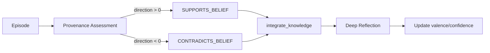

# Beliefs

## Schema (Neo4j)

```python
class BeliefNode:
    topic: str           # Unique identifier
    valence: float       # -1 (oppose) to +1 (support)
    confidence: float    # 0 to 1
    evidence_count: int  # Accumulated citations
    belief_text: str     # Natural language summary
```

## Update Pipeline



**Two phases:**
1. **Provenance** — Creates edges linking episodes to beliefs (audit trail)
2. **Reflection** — LLM evaluates accumulated evidence, updates values

## Edge Properties

```cypher
(Episode)-[:SUPPORTS_BELIEF {strength: 0.75, reasoning: "..."}]->(Belief)
```

## ESS Quality Gating

Belief provenance only runs when `ess.belief_update_recommended` is `true` — a boolean flag set by the LLM classifier based on the overall epistemic significance of the input. There are no fixed numeric score thresholds.

## Anti-Manipulation

| Protection | Mechanism |
|------------|-----------|
| ESS gating | Requires `belief_update_recommended = true` |
| Edge-only provenance | Values only change during integrate_knowledge |
| LLM-driven assessment | Direction and strength evaluated per-topic by the LLM |

## API

```
GET /beliefs           # All beliefs sorted by |valence|
GET /beliefs/{topic}   # Single belief
```

## Prompt Format

```
climate policy: +0.72 (confidence: 0.85), evidence: 12
cryptocurrency: -0.45 (confidence: 0.60), evidence: 5
```
