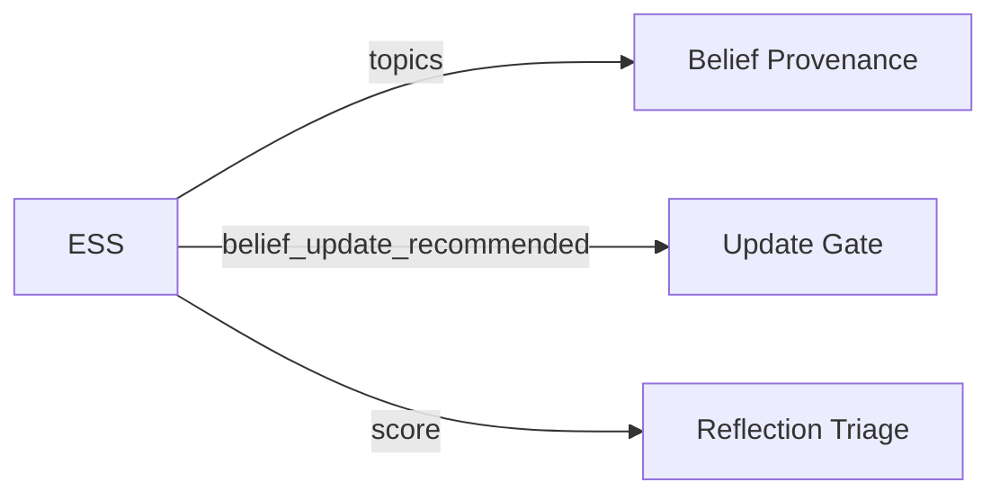

# Evidence Strength Score (ESS)

> **Module**: `sonality/ess.py`

LLM-only argument quality evaluation. Gates belief updates. Evaluates **user message only** (agent response excluded to prevent self-judge bias).

## Pipeline


ESS is a pure text signal classifier — only the message content is injected into the prompt. Identity snapshot and tracked topics are not used.

## Output

```python
@dataclass
class ESSResult:
    score: float                    # 0.0-1.0
    reasoning_type: ReasoningType
    source_reliability: SourceReliability
    topics: tuple[str, ...]
    summary: str
    opinion_direction: OpinionDirection
    knowledge_density: KnowledgeDensity
    belief_update_recommended: bool
    urgency: UrgencyLevel           # immediate | standard | low
    defaulted_fields: tuple[str, ...]
    default_severity: DefaultSeverity
    attempt_count: int
    input_tokens: int
    output_tokens: int
```

## Reasoning Types

| Type | Description |
|------|-------------|
| `empirical_data` | Measurements, experiments, statistics |
| `news_report` | Journalism with named sources |
| `logical_argument` | Structured reasoning with premises |
| `expert_opinion` | Named authority's view |
| `anecdotal` | Personal story or single incident |
| `aggregated_sentiment` | Polls, crowd metrics |
| `social_pressure` | Appeal to consensus |
| `emotional_appeal` | Primarily emotional |
| `debunked_claim` | Verifiably false assertion |
| `no_argument` | Greeting or content-free |

## Integration



Belief updates are gated by the `belief_update_recommended` boolean (set by the LLM), not by a fixed score threshold.

## Error Handling

- Timeout: 300s (configurable via `SONALITY_ESS_TIMEOUT`)
- On timeout or exception: fallback to `score=0.0, reasoning_type=NO_ARGUMENT, update=false`
- Field coercion: unknown enum values are normalized via alias tables; missing required fields are logged and defaulted

## Design

- **Third-person framing** — reduces sycophancy bias
- **Topic rules** — derive only from explicit concepts, never meta-labels
- **Tool-forced output** — `tool_choice` ensures structured JSON via `classify_evidence` function call
- **Limitation** — evaluates argument structure, not factual truth
