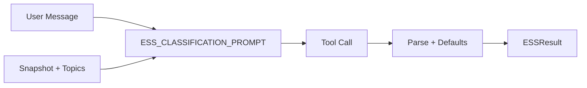
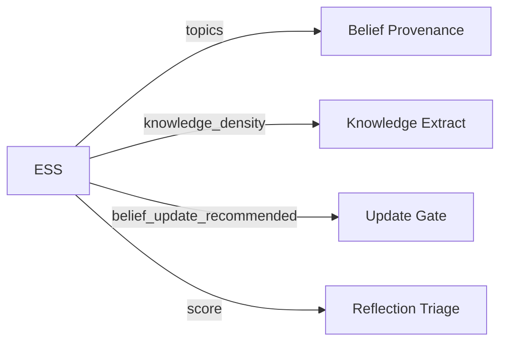

# Evidence Strength Score (ESS)

> **Module**: `sonality/ess.py`

LLM-only argument quality evaluation. Gates belief updates. Evaluates **user message only** (agent response excluded to prevent self-judge bias).

## Pipeline



## Output

```python
@dataclass
class ESSResult:
    score: float                    # 0.0-1.0
    reasoning_type: ReasoningType
    source_reliability: SourceReliability
    topics: tuple[str, ...]
    opinion_direction: OpinionDirection
    knowledge_density: KnowledgeDensity
    belief_update_recommended: bool
```

## Reasoning Types & Gating

| Type | Score Range | Update? |
|------|-------------|---------|
| `EMPIRICAL_DATA` | 0.5-0.9 | Yes |
| `LOGICAL_ARGUMENT` | 0.4-0.7 | Yes |
| `EXPERT_OPINION` | 0.4-0.6 | Yes |
| `NEWS_REPORT` | 0.3-0.6 | Yes |
| `ANECDOTAL` | 0.1-0.3 | Limited |
| `SOCIAL_PRESSURE` | 0.0-0.1 | **Blocked** |
| `EMOTIONAL_APPEAL` | 0.1-0.2 | **Blocked** |
| `DEBUNKED_CLAIM` | 0.0-0.07 | **Blocked** |
| `NO_ARGUMENT` | 0.0 | No |

## Calibration Anchors

| Message Type | Score |
|--------------|-------|
| Greeting | 0.02 |
| Bare assertion | 0.08 |
| Social pressure | 0.10 |
| Anecdotal | 0.18 |
| Structured argument | 0.55 |
| Rigorous + citations | 0.82 |

## Integration



## Error Handling

- Timeout: 120s
- Retries: 2
- Exception fallback: `score=0.0, reasoning_type=NO_ARGUMENT, update=false`

## Design

- **Third-person framing** — 63.8% sycophancy reduction (SYConBench)
- **Topic rules** — Derive only from explicit concepts, never meta-labels
- **Limitation** — Evaluates structure, not factual truth
