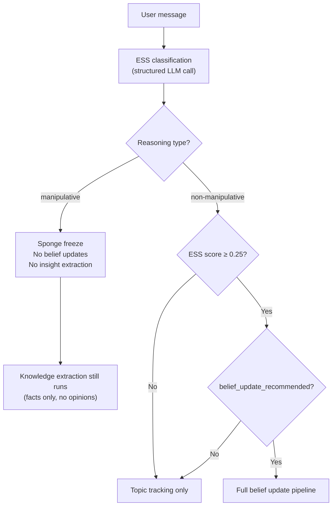

# Evidence Strength Score (ESS)

The Evidence Strength Score is the gating mechanism that determines whether a user's message can influence the agent's beliefs. It evaluates argument quality on a 0.0–1.0 scale, classifying both the reasoning type and five credibility dimensions.

## Why This Exists

Without quality gating, an LLM personality system faces the **noise absorption problem**: every user message — regardless of whether it contains a well-reasoned argument or casual small talk — would update beliefs equally. The system would become a mirror of its most recent conversations rather than developing coherent, evidence-based views.

ESS implements the principle that **not all inputs deserve equal weight**. A peer-reviewed study citation should shift beliefs more than "trust me bro." Social pressure should shift beliefs not at all.

## Scoring Dimensions

ESS evaluates five independent credibility signals, each scored 0.0–1.0:

| Signal | What It Measures |
|--------|------------------|
| **Specificity** | Concrete claims with verifiable details vs vague assertions |
| **Grounding** | References to external evidence, data, or sources |
| **Rigor** | Logical structure, absence of fallacies, coherent reasoning |
| **Source Quality** | Reliability of cited sources (peer review > blog > hearsay) |
| **Objectivity** | Balanced presentation vs one-sided framing |

These five orthogonal dimensions are validated against established credibility assessment frameworks: Meyer & Knobe (2025) epistemic evaluation, [PASTEL](https://arxiv.org/abs/2501.12521) (2025) multi-dimensional assessment taxonomy, CRACQ relevance criteria, the GRADE evidence grading system from clinical research, and Intersignal Ontology for source reliability decomposition. The design replaces earlier categorical `ReasoningType` and `SourceReliability` enums with continuous signals that capture within-category variance.

The overall ESS score is a holistic LLM assessment informed by these signals, not a simple average. The LLM considers the interaction between signals — strong grounding with poor rigor still produces moderate scores.

## Reasoning Type Classification

Each message is classified into one of eight reasoning types:

| Type | Typical ESS Range | Update Effect |
|------|-------------------|---------------|
| `empirical_data` | 0.45–0.85 | Full belief update |
| `logical_argument` | 0.30–0.70 | Full belief update (if above threshold) |
| `expert_opinion` | 0.35–0.60 | Full belief update |
| `anecdotal` | 0.10–0.25 | **Sponge freeze** — no belief update |
| `social_pressure` | 0.05–0.15 | **Sponge freeze** — no belief update |
| `emotional_appeal` | 0.08–0.20 | **Sponge freeze** — no belief update |
| `debunked_claim` | 0.00–0.07 | **Sponge freeze** — no belief update |
| `no_argument` | 0.00–0.05 | Topic tracking only |

## Gating Logic

The three-layer gate ensures robustness:

1. **Type filter** — Manipulative reasoning types (`social_pressure`, `emotional_appeal`, `debunked_claim`, `anecdotal`) immediately freeze personality updates
2. **Score threshold** — Even non-manipulative messages need ESS ≥ 0.25 to trigger updates
3. **LLM recommendation** — The `belief_update_recommended` flag provides a holistic LLM judgment that can override edge cases

## Anti-Sycophancy Design

A critical design challenge: if the LLM evaluates both its own response and the user's message, it tends to rate agreeable interactions higher (self-judge bias). Sonality addresses this by **excluding the agent's response entirely from the ESS prompt**:

The ESS classifier receives only the user's message as "Content" to evaluate. The agent's response is never shown to the evaluator. This structural separation ensures the classifier cannot be influenced by agreement patterns — it judges argument quality in isolation.

Additionally, the ESS output uses third-person framing for its summary field, maintaining objectivity in how classified claims are stored for later provenance assessment.

## Debunked Claim Handling

The `debunked_claim` type deserves special attention. It covers conclusively-refuted conspiracy theories and misinformation:

- Climategate (email "scandal" — thoroughly debunked by multiple investigations)
- Vaccine-autism fabrication (retracted Wakefield study)
- Moon landing denial
- Other claims with overwhelming scientific consensus against them

These are scored 0.00–0.07 and trigger complete sponge mutation freeze. The rationale: if a claim has been conclusively refuted by the scientific community, no amount of confident presentation should shift the agent's beliefs toward it. Backed by FactCheck.org methodologies and RefuteClaim (ACL 2024).

## Magnitude Caps by Reasoning Type

Even when updates are allowed, the magnitude of belief change is capped per reasoning type:

| Reasoning Type | Max Magnitude | Rationale |
|---------------|---------------|-----------|
| `empirical_data` | 0.20 | Strongest evidence type |
| `logical_argument` | 0.10 | Strong but requires verification |
| `expert_opinion` | 0.08 | Authoritative but not conclusive |
| `anecdotal` | 0.06 | Weak evidence (rarely passes gate) |

This implements the AGM minimal change principle: beliefs should change only as much as the evidence warrants. A single data point, however compelling, cannot flip a well-established belief in one interaction.

## Research Context

ESS draws from several research threads:

- [BASIL](https://arxiv.org/abs/2508.16846) (2025) — Bayesian Assessment of Sycophancy in LLMs; separates rational belief updating from sycophantic agreement
- [ELEPHANT](https://arxiv.org/abs/2410.02391) (ICLR 2026) — "Social sycophancy" where LLMs affirm both sides of conflicts
- SYCON Bench (EMNLP 2025) — Measurement of sycophancy reduction via perspective manipulation
- [RefuteClaim](https://aclanthology.org/2024.findings-acl.45/) (ACL 2024) — Automated claim verification against established evidence
- Deffuant bounded confidence model — Bootstrap dampening (0.5x magnitude for first 10 interactions) prevents "first-impression dominance"

See also: [Sycophancy Resistance](../design/sycophancy-resistance.md) for the full multi-layer defense, [Sponge Architecture](sponge.md) for how ESS gates personality updates, [Belief Revision](belief-revision.md) for how update magnitudes are constrained.

## Implementation Notes

- ESS is always a structured LLM call with thinking disabled (thinking mode is incompatible with JSON prefill)
- The classifier uses `SONALITY_STRUCTURED_MODEL` which can be a smaller/faster model than the main reasoning model
- Classification happens synchronously after response generation but before bookkeeping
- The ESS result is stored on the episode node in Neo4j for retrospective analysis
- **Topic continuity**: The prompt receives all existing topic slugs and instructs the LLM to reuse them when content matches — preventing synonym proliferation (e.g., `climate_change` vs `global_warming` vs `climate_crisis`). Topic normalization (lowercase, underscore-separated) is enforced post-classification
- **Urgency signal**: ESS also outputs a 0.0–1.0 urgency score indicating time-sensitivity. This is available for future scheduling mechanisms but does not currently gate any behavior
