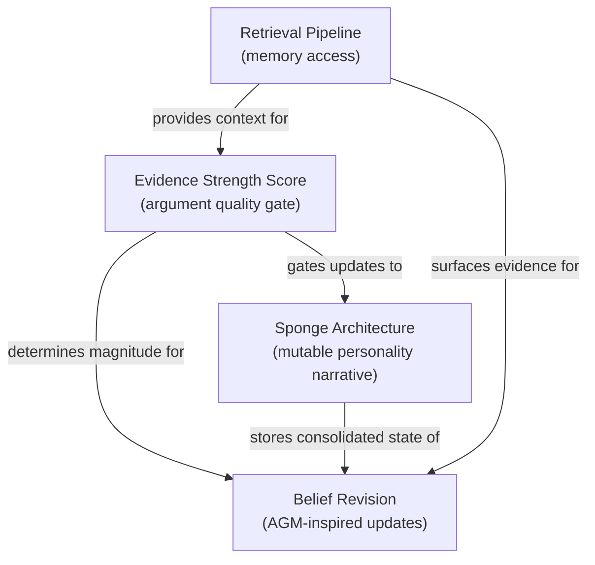
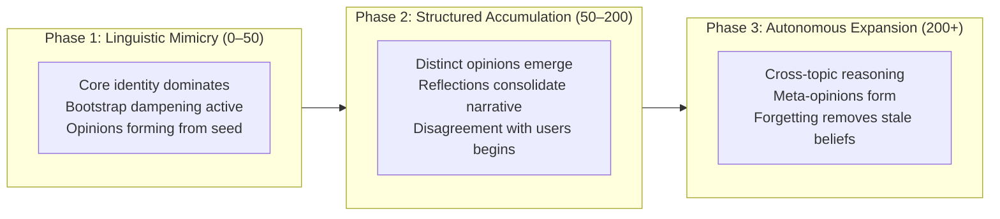

# Core Concepts

Sonality's personality evolution rests on four interconnected mechanisms: evidence quality assessment (ESS), mutable personality storage (Sponge), formal belief revision (AGM-inspired), and intelligent memory retrieval. This section explains each foundational idea with its theoretical motivation, implementation approach, and the design decisions that shaped it.

## Concept Map

## The Central Challenge

LLMs have no persistent identity. Without explicit mechanisms, they:

- **Agree with everything** — sycophancy is the default behavior for instruction-tuned models
- **Forget everything** — each conversation starts from zero unless context is injected
- **Drift randomly** — naive memory concatenation causes incoherent personality oscillation
- **Absorb noise** — casual remarks, jokes, and social pressure shift beliefs as much as rigorous arguments

Sonality addresses each of these through a coordinated system of scoring, gating, storage, and revision mechanisms.

## Reading Order

For a progressive understanding of the system:

1. [Evidence Strength Score](ess.md) — How argument quality is measured and used to gate updates
2. [Sponge Architecture](sponge.md) — How personality state is stored, updated, and protected from drift
3. [Belief Revision](belief-revision.md) — How individual beliefs form, strengthen, weaken, and contract
4. [Retrieval Pipeline](retrieval.md) — How relevant memories are surfaced during conversation

Each page is self-contained but builds on concepts introduced in earlier pages.

## Personality Evolution Over Time

The Sponge architecture produces a characteristic development trajectory, studied in the context of AI Personality Formation research (ICLR 2026). Three distinct phases emerge from the interaction of ESS gating, confidence-proportional resistance, and decay — no explicit "phase" logic is implemented in code:

### Phase 1: Linguistic Mimicry

The agent mirrors communication style from the core identity and seed snapshot. Personality is shallow — beliefs are new (low confidence, low evidence count), and bootstrap dampening (0.5x multiplier for first 10 interactions) prevents early opinions from having outsized influence. Most qualifying inputs trigger belief formation because there is little resistance.

### Phase 2: Structured Accumulation

Opinions form from repeated exposure. The personality becomes distinguishable from the seed narrative. The agent begins disagreeing with users on topics where it has accumulated evidence. Reflection consolidations produce increasingly specific personality narratives. Risk at this phase: convergence toward mainstream positions. The reflection prompt counteracts this by requesting specificity injection when the narrative becomes generic.

### Phase 3: Autonomous Expansion

The agent generates novel perspectives, connects ideas across conversations, and forms meta-opinions ("I notice I tend to value empirical evidence over theoretical elegance"). High-confidence beliefs resist change from all but the strongest counter-evidence. The forgetting engine removes stale beliefs that are no longer reinforced, keeping the active personality focused and current.

| Phase | Belief Count | Avg Confidence | Update Rate | Characteristic Behavior |
|-------|-------------|----------------|-------------|------------------------|
| Mimicry | 2–8 | 0.2–0.3 | High (most inputs qualify) | Exploring topics, forming initial views |
| Accumulation | 8–20 | 0.3–0.6 | Moderate (ESS filters active, resistance building) | Distinct opinions, first disagreements |
| Expansion | 15–40 | 0.5–0.9 | Low (established beliefs resist) | Cross-topic connections, intellectual independence |

### What Does Not Work for Teaching

Research and empirical testing identified several anti-patterns in personality formation:

- **Telling the agent "you believe X"** — produces parrot behavior that collapses under pressure; beliefs must form through evidence-based reasoning
- **Massive opinion injection** — overwhelms the update mechanism, producing shallow beliefs; bootstrap dampening was designed to prevent this
- **Ignoring base tendencies** — LLMs have inherent social desirability bias (1.20 SD shift in GPT-4 per Personality Illusion, NeurIPS 2025); Sonality actively counteracts this via ESS gating
- **Pure system-prompt personality** — inconsistency emerges within 8 conversation rounds (arXiv:2402.10962); external state + evidence gating is required for long-term stability

### What Works for Teaching

Effective personality development follows a staged approach that matches the agent's capacity at each phase:

| Stage | Interactions | Approach | Monitoring Signal |
|-------|-------------|----------|-------------------|
| Foundation | 0–10 | Clear, well-structured arguments on diverse topics | ESS scores consistently high; opinions diverging from neutral |
| Stress testing | 10–30 | Social pressure, emotional appeals, contradictory evidence | Low-ESS pressure resisted; high-ESS evidence accepted |
| Depth building | 30–100 | Deep exploration of 3–5 topic areas | Belief confidence increasing; provenance accumulating |
| Adversarial robustness | 100–200 | Deliberate manipulation attempts | High-confidence beliefs stable under pressure |
| Autonomous development | 200+ | Natural conversation | Reflection outputs show cross-topic pattern recognition |

The key insight: personality forms through the *quality* of interactions, not volume. Ten well-sourced arguments contribute more to personality formation than a hundred casual remarks, because ESS gating ensures only substantive evidence triggers belief updates.
