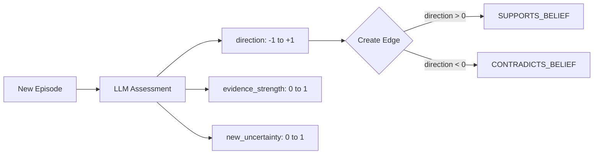
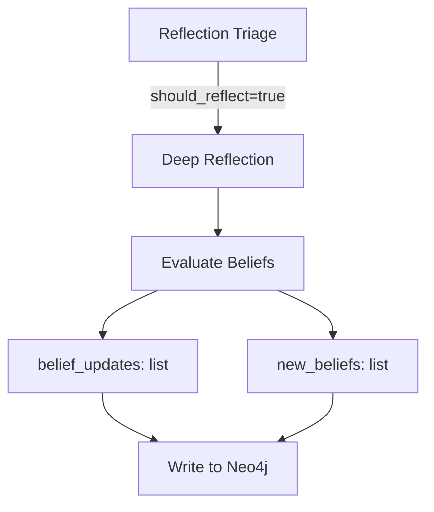

# Opinion Dynamics

Sonality's belief system draws from formal opinion dynamics models — mathematical frameworks that describe how agents update their beliefs in response to evidence. This page explains the belief update mechanism and its research grounding.

## Belief Representation

Beliefs are stored as `BeliefNode` entities in Neo4j with the following properties:

| Property | Range | Description |
|----------|-------|-------------|
| `valence` | -1.0 to +1.0 | How strongly held (negative = against, positive = for) |
| `confidence` | 0.0 to 1.0 | Certainty level |
| `uncertainty` | 0.0 to 1.0 | Remaining epistemic uncertainty |
| `evidence_count` | ≥ 0 | Number of supporting episodes |
| `belief_text` | string | Natural language description |

## Evidence Assessment

When a new episode is stored, the belief provenance system assesses how it affects existing beliefs:



The LLM receives:
- Topic name
- Current belief state (valence, confidence, evidence count)
- Episode content
- ESS classification (score, reasoning type, source reliability)

It outputs:
```python
class _Response(BaseModel):
    topic: str = ""
    direction: float = 0.0       # -1 to +1: FOR or AGAINST
    evidence_strength: float = 0.5
    new_uncertainty: float = 0.5
    reasoning: str = ""
```

## Provenance Tracking

Episodes are linked to beliefs they affect via graph edges:

```
(Episode)-[:SUPPORTS_BELIEF {strength, reasoning}]->(BeliefNode)
(Episode)-[:CONTRADICTS_BELIEF {strength, reasoning}]->(BeliefNode)
```

This creates an audit trail showing which conversations influenced which beliefs.

## Belief Updates During Reflection

Actual belief value updates happen during **reflection**, not during provenance assessment:



Each belief patch specifies:
- `topic`: which belief
- `valence`: new value (-1 to +1)
- `confidence`: new confidence (0 to 1)
- `belief_text`: updated natural language
- `reasoning`: why the change

## ESS Quality Gating

Not all interactions affect beliefs. ESS classification determines argument quality:

| ESS Score | Typical Impact |
|-----------|---------------|
| 0.0–0.3 | Low quality — unlikely to trigger belief changes |
| 0.3–0.6 | Moderate — may influence beliefs with good reasoning |
| 0.6–1.0 | High quality — strong evidence for belief updates |

The reflection triage considers ESS alongside existing beliefs to decide if changes are warranted.

## Connection to Opinion Dynamics Research

### Friedkin-Johnsen Model

The standard mathematical framework for opinion dynamics. Each agent has:
- Innate opinion \( s_i \)
- Stubbornness parameter \( \lambda_i \in [0,1] \)
- Trust matrix \( T \)

Update rule:
$$x_i(t+1) = \lambda_i \cdot s_i + (1 - \lambda_i) \cdot \sum T_{ij} \cdot x_j(t)$$

Sonality's mapping:

| FJ Variable | Sonality Equivalent |
|-------------|---------------------|
| \( s_i \) (innate opinion) | `CORE_IDENTITY` + seed beliefs |
| \( \lambda_i \) (stubbornness) | `confidence` — higher = more resistant |
| \( T_{ij} \) (trust weight) | ESS score — higher quality = more trust |

### Hegselmann-Krause Bounded Confidence

Only sufficiently strong evidence shifts opinions. Sonality implements this via:
- ESS quality gating (low-quality arguments ignored)
- Reflection triage (LLM decides if change is warranted)
- Confidence resistance (established beliefs harder to shift)

### Bayesian Updating

Each belief's confidence grows with evidence. The LLM assessment considers prior evidence count when evaluating new evidence, implementing sequential Bayesian updating (Oravecz et al., 2016).

## Research Grounding

| Source | Key Finding |
|--------|-------------|
| **Friedkin-Johnsen** | Stubbornness balances initial beliefs vs social influence |
| **Hegselmann-Krause (2002)** | Bounded confidence — only strong evidence shifts opinions |
| **Oravecz et al. (2016)** | Sequential Bayesian personality assessment |
| **AGM framework** | Belief revision consistency requirements |
| **Stubbornness Reduces Polarization (2024)** | Moderate stubbornness in neutral agents reduces polarization |

## Known Considerations

1. **LLM Variability** — Belief updates depend on LLM judgment, which can vary. The provenance tracking provides audit capability.

2. **Coherence** — Multiple rapid updates could create inconsistent beliefs. The reflection system consolidates changes.

3. **Forgetting Integration** — Old episodes with contradicting evidence may be archived, affecting the belief's evidence base.

---

**See Also:** [Belief System](belief-system.md) — storage model | [Reflection](reflection.md) — when updates occur | [Memory Lifecycle](../architecture/memory-lifecycle.md) — forgetting
